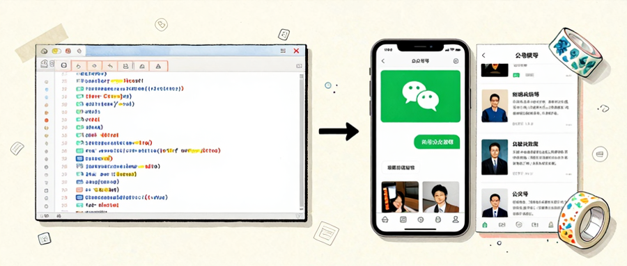

> 📎 来源: [明见如是](https://mp.weixin.qq.com/s?__biz=MzUxODUwMjc5NQ==&mid=2247485004&idx=1&sn=7493af758b8e86c8a7086d1423b8ee69&chksm=f86bef02296392d3a39128d84894e173798affe51413af3029fac0b30ebaf669b1691b8e12c3&mpshare=1&scene=1&srcid=0517qE26Y3b9XQpwRWctMeb3&sharer_shareinfo=73aba042548b07a8d067a7691c7abf6b&sharer_shareinfo_first=73aba042548b07a8d067a7691c7abf6b) | 时间: 2026-05-17 23:30

---

最近看到一个工具更新，让我停下来想了一会儿。

wx-cli v0.1.11，核心功能就一个：

```
wx biz-articles
```

——一行命令，把指定公众号的历史文章全部拉下来，全文，纯文本。

就这么简单。但它解决的那个问题，我忍了很久了。



---

## 01｜一个困扰了我两年的问题

我订阅了几十个公众号。每天早上刷一遍，有用的先「在看」，回头再翻。

然后呢？

然后就没有然后了。「在看」里堆了三百多篇，根本翻不到。微信那个历史文章界面，用过的人都懂——列表式加载、没搜索、加载慢、卡顿，每次进去都像在做耐力测试。

更难受的是，我是做内容创作的，经常需要研究某些公众号的写作风格、选题方向、或者某个垂直领域最近都在说什么。

以前只能一个个打开，截图，复制，整理。

这个过程，我忍了两年。

因为没有更好的解法吗？不是。是因为解法的门槛太高。要么学 Python 写爬虫，要么找人开发脚本，要么手动一篇篇复制。三种解法，没有一种轻松的。

直到我看到 wx-cli 这个更新。

---

## 02｜它做了什么？

wx-cli 是 OpenCLI 生态里的一个子模块，专门处理微信相关的命令行操作。

这次 v0.1.11 的核心功能是：

```
wx biz-articles --account"洛小山"--limit50
```

执行之后，这个公众号最近50篇文章的全文，以 Markdown 格式输出到终端或文件。

你不需要懂代码，不需要装 Python，不需要处理登录和反爬。你只需要确保本地微信是正常登录的就行——它复用的是你已有的登录态。

这就是它做的事：**把「微信公众号文章」这个本来很难获取的内容，变成了一个命令行工具能搞定的东西。**

听起来是小功能。但它的意义，不在于功能本身，在于它打通了一个我一直想打通但没打通的环节：

**让 AI 能看到微信内容。**

---

## 03｜这才是真正让我兴奋的地方

我研究 AI 知识管理很久了。Notion AI、Obsidian、Obsidian + MCP、RAG 系统……这些我都深度用过。

但有一个共同的盲区：**微信内容进不来**。

我用 AI 做知识管理、做研究分析，一个核心步骤是「把内容喂给 AI」。PDF 能导、网页能抓、印象笔记能同步，但微信公众号呢？

要么手动复制粘贴，要么放弃。

这个障碍看起来不大，但实际上它卡住了整整一个内容生态。微信公众号是中文互联网最重要的内容平台之一，有大量的高质量文章、深度分析、行业洞察。但它们被困在微信的封闭环境里，AI 看不到，用户拿不到，只能靠人手动一篇篇翻。

wx-cli 把这个障碍扫平了。

现在你可以：

```
# 拉取某公众号最近一周的文章wx biz-articles --account"36氪"--days7--format md# 输出结果直接喂给 AI 做摘要cat output.md | claude "请帮我总结这批文章的核心观点和行业趋势"
```

或者更进一步：

```
# 每天早上自动拉取关注的公众号前一天文章wx biz-articles --accounts follows.txt --since yesterday --format json# AI 自动生成摘要，推送到飞书ai summarize --source output.json --push-to feishu
```

这才是「Agent 不用靠你手动复制」的真正含义。不是 Agent 自己会去操作微信，是 Agent 能拿到微信里的数据了。

---

## 04｜我看到的三个更底层的东西

### 第一：信息获取的边界，正在被重新定义

过去我们说「信息获取」，默认说的是网页、文档、数据库这些东西。它们有一个共同特点：有一个 URL 或者文件路径，可以直接访问。

微信公众号不一样。它没有公开 API，没有稳定的抓取接口，内容都在微信的封闭环境里。想批量获取里面的内容，传统的解法要么是爬虫，要么是手动，要么是放弃。

wx-cli 的解法很聪明：**它不自己去获取登录态，它复用你本地微信的登录态**。你在浏览器里已经登录了微信，它直接用这个状态去调用接口，不需要你再做任何配置。

这个思路和 OpenCLI 整个生态的设计哲学一脉相承：**不要重新发明轮子，用已有的。**

你已经有了登录态，为什么要让 AI 自己模拟一个？你已经有了 Chrome，为什么要让 AI 去操控一个无头浏览器？

用已有的，让它变得更强——这是这一类工具最值钱的地方。

### 第二：「工作流自动化」的天花板，被打通了

我之前写过一篇文章聊「工具组合」和「固定工作流」的价值。那篇文章的核心观点是：真正的效率来自「为特定场景设计一条工具组合的工作流」，而不是「装了更多工具」。

但那篇文章有一个没解决的点：**工作流的起点，往往是「获取内容」。你得有内容，才能处理。**

wx-cli 解决的就是这个问题——它是工作流自动化的「原材料供给端」。

你做行业研究，需要批量获取公众号文章？wx-cli 可以。你做竞品监控，需要每天定时拉取几个公众号的新推送？wx-cli 可以。你做知识库建设，需要把优质内容归档到本地笔记系统？wx-cli 也可以。

它是那个「你原来想做但做不了」的事情的起点。

### 第三：CLI 工具的价值，正在被重新认识

很多非技术背景的人，听到「命令行工具」，第一反应是「这跟我有什么关系」「太复杂了」「我又不是程序员」。

我以前也是这么想的。但用了两年 CLI + AI 的工作流之后，我的认知变了。

CLI 工具的本质不是「复杂」，而是「精准」。

你在网页上点来点去做的事情，CLI 工具可以写成一条命令，然后让 AI 去调用。AI 调用的不是「图形界面」，是「命令」。命令可以被拼起来，变成工作流。工作流可以被自动化，变成每天定时执行。

这个链条打通了之后，CLI 工具不再是「程序员专属」，而是「自动化流水线上的标准接口」。

wx-cli 就是这个思路的一个例子：它不给你一个图形界面让你点，它给你一条命令让你调。命令可以写进脚本，脚本可以让 AI 执行。AI 执行完了，结果可以直接进你的知识管理系统。

这个链条，以前是断裂的，现在正在被接上。

---

## 05｜我没有想清楚的事

说完我觉得有意思的点，说一些我没想清楚的。

**第一件事**：版权和合规的问题。

wx-cli 能批量获取公众号文章，这意味着它本质上是一个「内容采集工具」。采集和抓取之间的边界，在法律上一直是模糊地带。

我不是说 wx-cli 本身是违规的——它复用的是你自己的微信登录态，访问的是你自己已经关注了的公众号，内容也是你自己在消费的内容。但「批量获取」和「用于商业目的」之间，需要有一条清晰的线。

目前法律对这块的定义还不够清晰。随着这类工具普及，平台方和政策制定者迟早要拿出更明确的规则。

**第二件事**：微信会怎么反应？

这是我一直关注的一个问题。微信对外部工具获取数据这件事，一直是「有态度」的——早年有很多第三方客户端和爬虫工具，都被微信用各种方式限制掉了。

wx-cli 这种工具，一旦用户量上来，会不会触发微信的风控机制？会不会被限流、被封号、被强制下线？

我不知道答案。但我猜，这个工具大概率会处于一个「灰色地带」——功能好用，但不稳定；能跑通，但不知道哪天会失效。

这是用这类工具需要付出的代价。

---

## 06｜手把手用一遍（15分钟）

下面是实操部分。

### 第一步：确认环境

wx-cli 依赖 Node.js 和 OpenCLI。

```
node-v# 需要 v18+npm-v# 通常随 Node 一起装好
```

如果没有，去 nodejs.org 下载最新版。

### 第二步：安装 OpenCLI

wx-cli 是 OpenCLI 生态的一部分，需要先装 OpenCLI：

```
npminstall-g @jackwener/opencli
```

### 第三步：安装 wx-cli

```
# 方式一：通过 npm 全局安装npminstall-g wx-cli# 方式二：通过 OpenClaw 的 Skill 安装clawhub install wx-cli
```

装完之后验证：

```
wx --version
```

### 第四步：确保微信已登录

wx-cli 复用的是你本地微信客户端的登录态。确保：

• 你在电脑上的微信客户端是正常登录状态

• 如果用的是网页版微信，确保浏览器里微信是已登录的

### 第五步：跑第一个命令

最基础的用法：

```
# 拉取某个公众号的最新文章列表（不需要全文）wx biz-articles --account"36氪"--limit10# 拉取文章全文（Markdown 格式）wx biz-articles --account"36氪"--limit10--format md --output ./articles/
```

输出结果会保存到指定目录，你可以打开文件查看，或者直接喂给 AI。

### 第六步：结合 AI 使用

这是最有价值的用法——把公众号内容喂给 AI 做分析：

```
# 拉取内容wx biz-articles --account"洛小山"--limit20--format md --output ./input/# 喂给 Claude 做摘要claude "请帮我分析这个目录下所有文章的核心观点，总结成一个结构化的报告"# 或者让 AI 生成每日摘要claude "请总结这批文章的核心信息和行业趋势，输出到 summary.md"
```

### 第七步：进阶——定时任务

如果你想每天早上自动拉取推送，可以用系统的定时任务：

```
# macOS/Linux：编辑 crontabcrontab-e# 每天早上8点自动执行08 * * * /usr/local/bin/wx biz-articles --account"36氪,虎嗅,钛媒体"--limit10--format md --output ~/articles/$(date +\%Y-\%m-\%d)/
```

> ⚠️ **注意**：定时任务需要你的电脑在那个时间点是开着的，或者你需要一台长期运行的服务器。

---

## 07｜我的判断：这个东西适合谁

**适合的场景**：

• 内容创作者：做行业研究、竞品分析、内容调研

• 知识管理爱好者：把优质公众号文章归档到自己的笔记系统

• AI 研究者：需要把微信内容纳入知识库，训练 RAG 系统

• 企业知识管理：把行业优质内容沉淀到内部知识库

**不适合的场景**：

• 需要稳定长期运营的内容采集（存在被风控的风险）

• 商业目的的大规模抓取（版权风险）

• 完全不懂命令行的纯小白（虽然工具已经简化很多了，但仍有学习成本）

---

## 最后

我最近一直在想一件事：**什么叫「信息获取」？**

以前我以为「信息获取」就是「找到内容」。现在我理解了，真正的「信息获取」是**「让内容出现在你需要的场景里」**。

公众号内容，以前只出现在微信里。你想把它用到别的地方，要么手动搬运，要么放弃。

wx-cli 让它出现了。它让微信公众号的文章，能进你的终端、能进你的脚本、能进你的 AI、能进你的知识库、能进你设计的任何工作流。

这才是它真正值钱的地方。

不是技术有多复杂，不是有多少行代码，而是：**它打通了原来不通的那个环节**。

---

**P.S.** 如果你对这个工具感兴趣，建议先从「拉取自己最想了解的那个公众号的最近10篇文章」开始，感受一下这个工作流的价值。跑通之后，你会发现公众号文章这个内容源，突然从「收藏夹吃灰」变成了「随时可用的原材料」。

有想法，评论区见。
