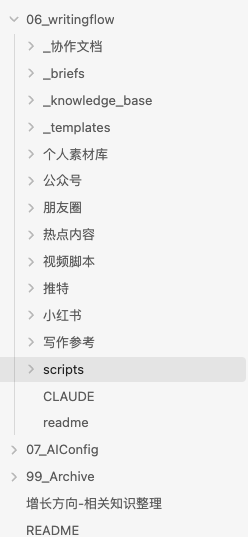
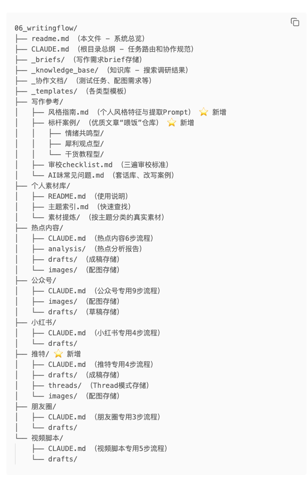
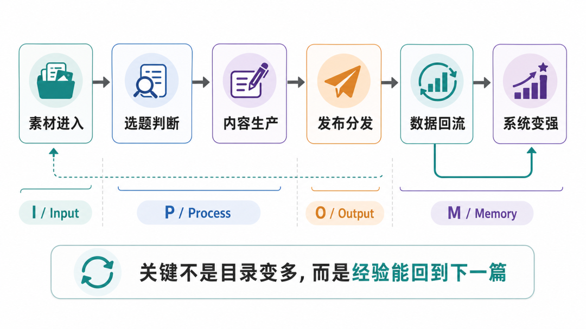
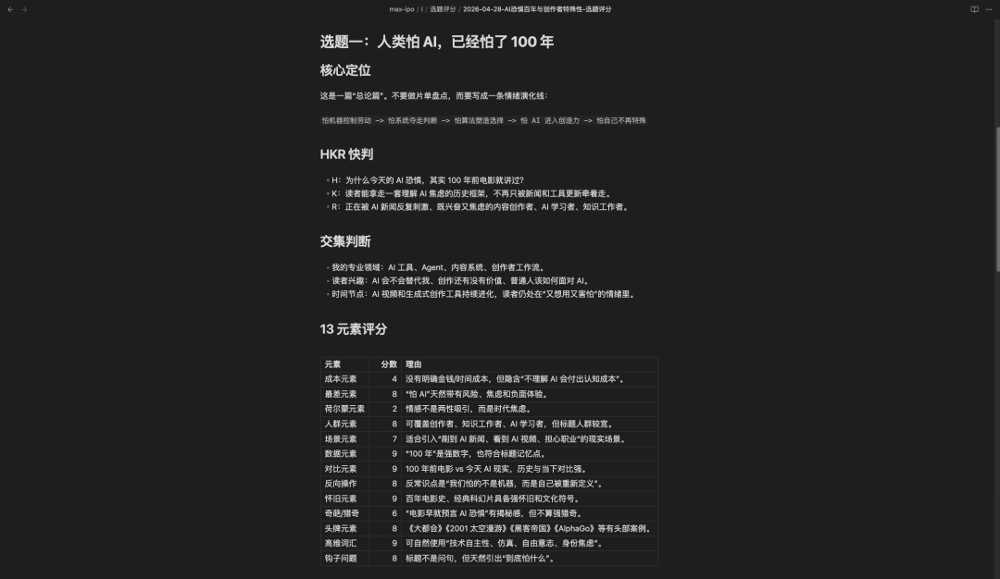
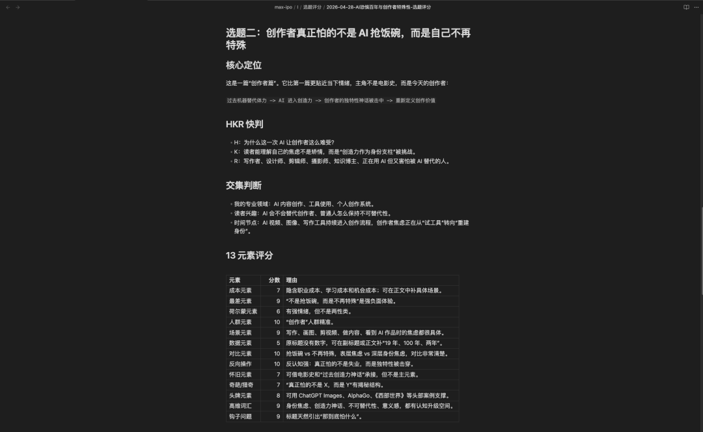
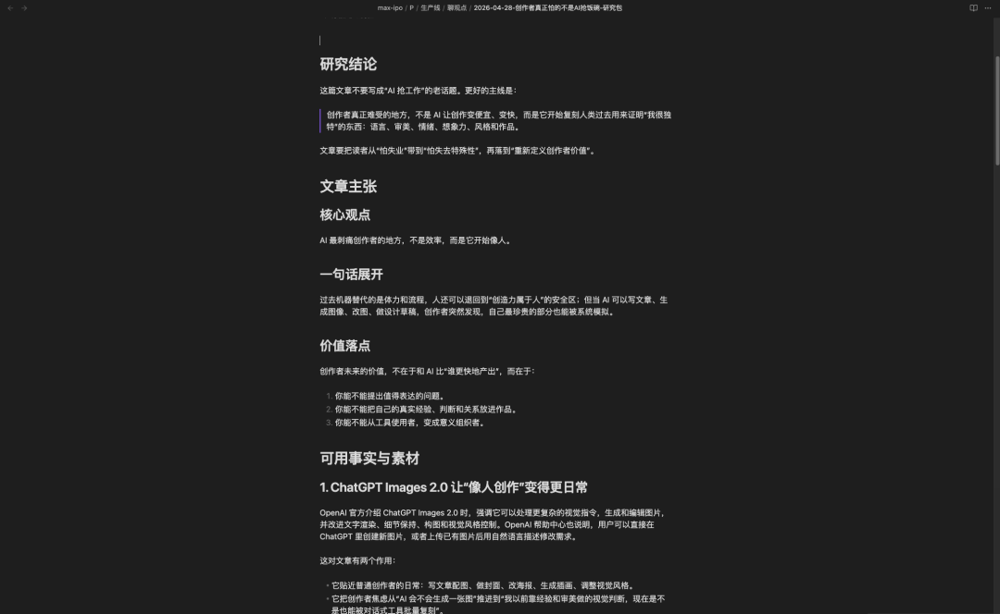
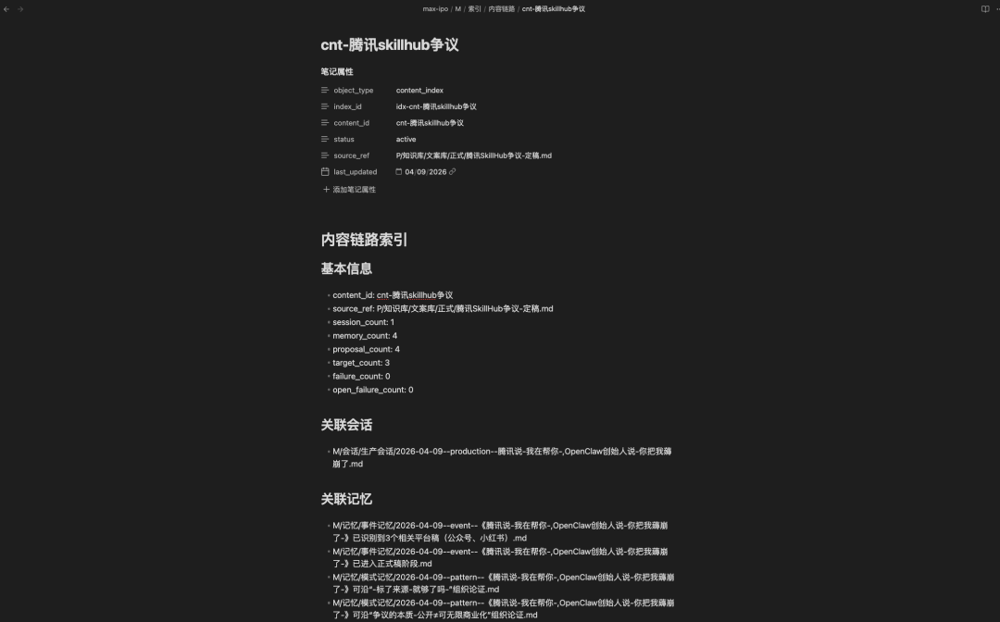

> 📎 来源: [大疯狂有话说](https://mp.weixin.qq.com/s?__biz=MzkzMzU5Mjk4Mg==&mid=2247485170&idx=1&sn=bdae12a9791ec3c1bc0a5cbc1f929a1b&chksm=c3fc6230fb01d21c79c2846c33d5d6809699b23e294eafeda62e0616745bdc9f2a30e45fcde9&mpshare=1&scene=1&srcid=0505tlz7WOjNa6xgWjRmjzzY&sharer_shareinfo=ddb95a0ddf2f66607b5c5f18d441fbe5&sharer_shareinfo_first=ddb95a0ddf2f66607b5c5f18d441fbe5) | 时间: 2026-05-05 10:13

---


以前我写公众号，最大的问题不是写不出来。

而是每一篇文章，都像重新从零开始。

选题靠临时想到。

素材散在微信、备忘录、Obsidian、聊天记录和各种网页里。

写到一半突然断掉，不知道下一段怎么接。

好不容易发出去，数据看一眼就过去了。

偶尔有一篇反馈不错，但下一次还是复制不了。

后来我意识到，我缺的不是更多灵感。

我缺的是一套能让内容持续流动、沉淀、复盘、回流的写作系统。

所以我给自己搭了一套 max-ipo 内容操作系统。

它不是一个文件夹整理术，也不是一个写作模板库。

它更像一条个人内容生产线：

素材从外部进入，先被收纳、判断、评分、排队；

值得做的选题进入生产层，经过研究、初稿、正式稿、质量门；

发布时再做平台适配、发布记录、数据监控；

最后把数据、反馈、经验和失败原因回流到系统里。

下一篇文章，不再从空白页开始。

我不是在管理文章。

我是在运营自己的内容资产。

所以这篇文章，我不想只讲一个方法论。

我想把我真实在用的 max-ipo 拆开给你看：

它为什么会出现，它解决了什么问题，以及普通创作者怎么借助 AI 搭一个自己的低配版。

## 这不是我第一次折腾 AI 写作系统

其实这不是我第一次搭 AI 写作系统。

之前我发过一篇文章，叫《花一天时间，我用 Claude Code 搭了个 AI 写作系统》。

🔗：[https://mp.weixin.qq.com/s/m7qQhYQD6sRvCSr6es\_VSA](https://mp.weixin.qq.com/s?__biz=MzkzMzU5Mjk4Mg==&mid=2247484963&idx=1&sn=488e6d673c61be0b94c5686e74ce6000&scene=21#wechat_redirect)

那时候我解决的问题很直接：

每次让 AI 写文章，我都要重新解释一遍平台、风格、结构、长度和审校标准。

所以我搭了第一版 writingflow。






那一版系统里，有工作区判断，有任务路由，有公众号、小红书、朋友圈、视频脚本的不同流程；

有选题讨论，有三遍审校，有事实核查；

甚至还有热点内容的 6 流程和 3 阶段瀑布流分析。

它让我从“每次重新教 AI 写作”，变成了“让 AI 按流程协作”。

AI 不再是一个盲目执行命令的工具，而是一个按照规范协作的助手。

这一步很重要，因为它解决了一个非常具体的问题：

**怎么把一篇文章稳定写出来。**

但用了一段时间后，我发现，写作流程顺了，不代表内容系统真的跑起来了。

writingflow 解决的是“怎么写完一篇文章”。

但创作者长期真正要解决的，从来不只是一篇文章。

还有这些问题：

选题从哪里持续来？

素材怎么沉淀成资产？

一篇文章写到一半断掉，怎么重新接回来？

发布之后的数据和反馈，怎么回流？

爆过的文章，为什么爆？能不能复制？

失败的选题，为什么失败？以后还要不要碰？

这些问题，已经不是一个写作流程能完全解决的了。

我需要的不是更聪明的 AI 写作提示词。

我需要的是一个内容操作系统。

这就是 max-ipo。

## 我后来把写作拆成了四层

max-ipo 的核心流程很简单：

```
素材进入 → 选题判断 → 内容生产 → 发布分发 → 数据回流 → 系统变强
```

我把它拆成四层：

```
I：Input，输入层P：Process，生产层O：Output，输出层M：Memory，记忆层
```

I / P / O 负责内容怎么从想法变成作品，M 负责把生产和复盘里的有效经验沉淀下来。



我一开始其实没有 M 层。

那时候我以为，只要把输入、生产、输出理顺，系统就差不多了。

后来写多了才发现，真正容易丢的不是文章，而是每次生产过程中那些小判断：

这个选题为什么被选中？

这个标题为什么最后没用？

这篇为什么适合做公众号，不适合先做小红书？

哪个表达是我的风格，哪个表达只是 AI 的顺手套话？

这些东西如果不记下来，下一篇还是会丢。

所以我才把 M 层加进来。

IPO 负责生产。

M 负责让系统长记性。

后来我越来越确定，这套系统最重要的不是目录，而是回流。

如果一篇文章写完就结束，它只是一个结果。

如果一篇文章写完之后，它的选题判断、素材来源、标题方案、发布数据、复盘结论，都能反过来影响下一篇，它才开始变成资产。

## 第一层：先判断值不值得写，而不是直接开写

以前我最容易犯的错，是一有想法就直接写。

结果经常写到一半才发现：

这个题不够尖。

目标读者不清楚。

第一屏没有钩子。

素材也撑不住。

所以在 max-ipo 里，我给 I 层定了一条纪律：

**不要还在 I 层的问题，硬推进到 P 层去写。**

I 层要做的不是创作，而是判断。

这里有热点雷达、素材收集箱、选题评分、待生产队列。

每天打开系统，我不是先问“今天写什么”，而是先看几个入口：

今日热点有没有新快报？

inbox 里有没有新增素材？

queue 里今天只推进哪一个？

我甚至给自己做了一个每日启动句：

```
先帮我看一下 max-ipo 当前状态：今天我应该从 Inbox、Queue、In Progress、Ready to Publish、Review Needed 里面哪一个开始？只给我一个建议动作和下一句对话。
```

这句话看起来很小，但对我帮助很大。

因为它把“今天到底该干什么”这个混乱问题，变成了一个系统判断。

不是同时开五个坑。

不是看到热点就冲。

不是心情来了就写。

而是先确认当前内容资产处在哪个阶段，然后只推进一个动作。

比如最近我从一条素材里拆出了两个选题：

一个叫《人类怕 AI，已经怕了 100 年》。

一个叫《创作者真正怕的不是 AI 抢饭碗，而是自己不再特殊》。

系统没有让我直接写。

它先做了选题评分。





最后判断：

前者是 A 级，适合做总论篇；

后者是 S 级，更贴近当下创作者痛点，适合优先推进。

这就是 I 层的价值：它不是让灵感消失，而是让灵感先接受判断。

## 第二层：写作不是从空白页开始，而是从研究包开始

选题通过以后，才进入 P 层。

P 层负责生产加工。

这里有知识库、我的上下文、生产线和质量门。

我把内容生产分成四种类型：

教知识，解决具体问题；

聊观点，给出立场判断；

讲故事，传递经历和共鸣；

晒过程，展示真实构建过程。

这篇文章本身，就是“晒过程 + 教知识”。

真正开始写之前，我现在会先让系统生成一个研究包。

比如《创作者真正怕的不是 AI 抢饭碗，而是自己不再特殊》这篇，
🔗：[https://mp.weixin.qq.com/s/aj9IiRh-5opRuY1iaiGSZw](https://mp.weixin.qq.com/s?__biz=MzkzMzU5Mjk4Mg==&mid=2247485137&idx=1&sn=6128d3481b9c43b7bc622c6fff286f6b&scene=21#wechat_redirect)

进入 P 层后先形成了一份研究包。

这个研究包不直接写正文，而是先整理：

核心观点是什么；

一句话怎么展开；

可用事实和素材有哪些；

哪些桥段可以放开头；

文章结构可以怎么走；

风险是什么；

还缺什么个人经验。



这一步解决了我以前最头疼的一个问题：写到一半突然断掉。

以前我写文章，经常是边写边找方向。

现在是先把方向、证据、结构和素材摆出来，再进入初稿。

初稿不再是凭空生成的，而是从 I 层评分、P 层研究包、个人上下文和知识库里长出来的。

## 中间还有一道质量门：不是写完就发，而是先过关

第一版 writingflow 里，我就已经做过三遍审校：

第一遍检查事实、逻辑、结构；

第二遍降 AI 味，删套话、改句式、补真实细节；

第三遍打磨节奏、标点和表达。

到 max-ipo 里，这件事被进一步系统化成了质量门。

质量门里有爆款评分、事实核查、降 AI 味审校、敏感词检测、审校报告。

我不想让内容只是“能发”。

我想让它在发布前至少回答几个问题：

事实有没有明显错误？

标题和开头有没有传播力？

有没有真实个人经验？

有没有过度解释、AI 腔、空话套话？

有没有平台风险词？

能不能让读者读完真的带走一个判断或动作？

这一步的意义不是追求完美，而是防止自己把“半成品”误当成“正式稿”。

## 第三层：公众号不是终点，发布之后才开始回流

很多创作者的问题，是文章发出去以后，流程就断了。

发完，看一眼数据。

好就开心一下。

不好就算了。

下一篇继续从零开始。

在 max-ipo 里，发布不是终点，而是 O 层的开始。

O 层包括平台适配、发布管理、数据监控、复盘迭代。

同一篇正式稿，进入 O 层以后，可以适配成公众号版、小红书版、视频号版、朋友圈版。

发布之后，会进入发布记录。

比如《人类怕 AI，已经怕了 100 年》这篇，发布记录里会记录：

发布时间；

平台；

发布链接；

内容类型；

选题评级；

源文件；

正式稿；

选题来源；

后续 24 小时、48 小时、7 天数据。

这件事看起来很笨，但它很关键。

只有记录下来，复盘才有对象。

只有复盘有对象，经验才可能回流。

## 第四层：让系统越写越会记

max-ipo 里，我后来又加了一层 M。

M 是 Memory，记忆层。

I / P / O 解决的是内容怎么生产出来。

M 解决的是系统怎么记住自己做过什么。

它不会直接替我写文章，更像一个后台记录员。

我在生产一篇内容时，它会记录这次生产会话；

我复盘一篇内容时，它会记录复盘会话；

一篇文章里出现了可复用的判断，它会沉淀成模式记忆；

某个流程跑失败了，它会进失败队列；

一篇内容从选题、初稿、正式稿、平台版到发布记录，它会形成内容链路索引。

说得简单一点：

以前我写完一篇文章，只剩下一篇文章。

现在我写完一篇文章，会留下它的完整链路。

比如一篇内容从正式稿，到公众号版、小红书版，再到复盘记忆、写回提案，最后会形成一张 content\_id 链路索引卡。



这张链路索引卡对我很重要，因为它让我知道：

这篇内容从哪里来；

经过了哪些会话；

产生了哪些记忆；

写回了哪些规则；

有没有失败记录；

以后还能不能复用。

这就是我说的“内容资产”。

不是文章存在文件夹里就叫资产。

能被追踪、复盘、调用、增强，才叫资产。

## 拿最近一篇文章跑一遍

拿最近一条链路举例。

我先在 I 层收到了一个关于“人类恐惧 AI”的素材。

系统没有直接写文章，而是先做选题拆分和评分。

最后从同一条素材里拆出两个方向：

```
总论篇：人类怕 AI，已经怕了 100 年创作者篇：创作者真正怕的不是 AI 抢饭碗，而是自己不再特殊
```

然后进入队列。

队列里会记录优先级、快筛、深评、评级、内容类型、目标平台、时效性、截止日期、状态、负责智能体和备注。

接着进入 P 层。

创作者篇先生成研究包，明确不要写成普通的“AI 抢工作”焦虑文，而是要写成创作者身份焦虑。

另一篇《人类怕 AI，已经怕了 100 年》
🔗：[https://mp.weixin.qq.com/s/QXCNoyZ\_DTtR9zKZeaxmhQ](https://mp.weixin.qq.com/s?__biz=MzkzMzU5Mjk4Mg==&mid=2247485157&idx=1&sn=497d790995c053a40f5cb895b2f72e4b&scene=21#wechat_redirect)

进入初稿、正式稿、公众号版、配图流程。

最后在 O 层生成发布记录。

这条链路跑完之后，我得到的不只是一篇公众号文章，还得到了一套可复用的经验：

同一条素材可以拆成总论篇和垂直人群篇；

总论篇适合建立认知框架；

创作者篇更容易打中当下情绪；

AI 选题不能只讲工具能力，要落到人的身份、关系和选择上；

发布之后的数据还要回到 O 层和 M 层继续复盘。

这就是系统和灵感最大的区别。

灵感负责点燃一篇文章。

系统负责让这篇文章的经验继续留下来。

## 如果你也想搭一个低配版

如果你也想搭自己的内容操作系统，不用一上来就做得像 max-ipo 这么复杂。

更好的做法，是先从最小版本开始。

这里最重要的不是照抄我的目录。

真正值得复刻的，是判断顺序。

先判断输入是什么。

再判断值不值得写。

再判断适合写成什么类型。

然后收住问题，拆开结构。

到这里之后，再让 AI 进入加工层，帮你整理、扩写、起草、优化标题、做平台适配。

最后把发布结果和复盘结论收回来。

如果这个顺序没立住，就算目录再漂亮，最后也只是换了一个地方堆素材。

只建四个地方就够了：

```
01_输入箱放灵感、选题、素材、案例、读者反馈。02_生产中放正在研究、正在写、写到一半、待审校的内容。03_已发布记录正式发布的文章、平台、链接和基础数据。04_复盘库记录为什么好、为什么差、下次怎么改。
```

你甚至可以直接把下面这段话丢给 AI，让它先帮你搭一个自己的最小版本：

```
我想搭一个个人内容操作系统，不要复杂，先做最小可用版。请你根据我的内容方向和平台，帮我设计 4 个文件夹：1. 输入箱：收纳灵感、素材、案例、读者问题；2. 生产中：管理正在研究、正在写、待审校的内容；3. 已发布：记录已发布文章、平台、链接和基础数据；4. 复盘库：记录成败原因、可复用经验和下次改进。然后请你帮我设计一条最小流程：输入进入后，先判断它是什么类型；再判断值不值得写；再判断适合写成什么内容类型；再进入初稿；初稿过审校后再发布；发布后必须写一条复盘。请不要一开始给我复杂系统，只给我今天就能开始用的版本。
```

这段提示词不一定完美，但它有一个好处：

它会逼你和 AI 先讨论“流程怎么跑”，而不是一上来就写正文。

然后给自己定三条纪律：

第一，没判断清楚的选题，不要急着写。

第二，没过审校的初稿，不要急着发。

第三，发完的内容，不要让它直接消失。

先让内容流动起来。

再慢慢加规则、模板、评分、质量门、平台适配和记忆层。

系统不是一开始就搭出来的。

系统是被真实问题逼出来的。

## 写在最后

以前我总觉得，写作能力来自灵感、表达力和状态。

写到现在，我越来越确定，真正长期拉开差距的，是系统。

一个没有系统的创作者，每篇文章都在重新开始。

一个有系统的创作者，每篇文章都会反过来喂养下一篇。

这就是我从 writingflow 走到 max-ipo 的原因。

writingflow 让我解决了“怎么写完一篇文章”。

但 max-ipo 要解决的是“怎么让每一篇文章都不白写”。

我不只是想让 AI 帮我写文章。

我想让每一次输入、每一次生产、每一次发布、每一次反馈，都变成我的内容资产。

靠灵感写作，写完一篇就结束。

靠系统写作，写完一篇会变成下一篇的燃料。

如果你也在搭自己的内容系统，或者正在被“选题乱、素材散、写完不复盘”这些问题卡住，可以在评论区留一个 

```
IPO
```

。

我也想看看，大家会怎么用 AI 搭自己的内容系统。

如果你想更具体地交流自己的搭建过程，也可以加我微信。


