> 📎 来源: [Next蔡蔡](https://mp.weixin.qq.com/s?__biz=MzIyMzk3MTEwNQ==&mid=2247487957&idx=1&sn=5468c27595eee341438ab00d4d85e12f&chksm=e9e59953c70d16dda8de6f8617094dc5236cbafa045c4ffc2a36adf25791a43de0381e42eedd&mpshare=1&scene=1&srcid=0420iZYMQ6vXk1tUB4vDnOzN&sharer_shareinfo=fbde1ac5e73c044cd0f30acc59a7ca34&sharer_shareinfo_first=fbde1ac5e73c044cd0f30acc59a7ca34) | 时间: 2026-04-20 20:43

---

哈喽各位精神股东们，我是蔡蔡！

今天接上期留下的话题，聊聊如何选虾。

本地 OpenClaw 功能强大，但使用起来有很多卡点和问题，比如需要安装依赖项、配置 API 密钥、保证机器持续运行，还要防 Skills 投毒等等。

因此国内企业针对其中一个或多个卡点，推出了各自的龙虾解决方案，从云服务器的一键镜像托管，到桌面客户端的本地化封装；从钉钉/飞书的原生 SaaS 集成，到手机系统的深度植入 …… 也就形成了当下眼花缭乱的龙虾衍生生态。

如何科学“选虾”，也就成了一个新难题。

带着这个问题，我整理评测了市面上热门的 40 个龙虾衍生产品，最终归纳为五大阵营，帮大家根据技术能力、使用场景和预算，快速找到最适合自己的那只“虾”。

注：1、本次测评截至 2026 年 3 月 28 日，不代表观众看到该测评表时产品的真实能力；

2、本次测评仅用于学习和分享，如整理信息有误，欢迎在文档中评论指正。

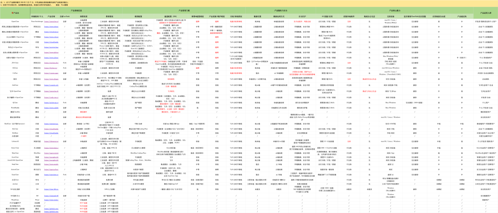

先说结论，不一定完全对：

1. **如果你是开发者 / 愿意折腾的非开发者，并且接受龙虾在本地电脑乱来的后果** → 原版 OpenClaw
2. **如果你的本地电脑没法乱造 / 希望龙虾 7×24 小时挂机，也愿意轻微折腾**→ 轻量服务器一键部署 OpenClaw（其中阿里云的性价比最高，29¥/月）
3. **如果不想太多折腾，并且是 钉钉/飞书 深度用户** → 钉钉选悟空，飞书选飞书妙搭OpenClaw
4. **如果不想太多折腾，也不是哪一家工具的重度用户，并且希望在用中学龙虾** → LobsterAI 或 JVS Claw
5. **如果不想太多折腾，希望网页上就能直接体验**→ 根据自己习惯的工具选，Kimi 有 Kimi Claw，MiniMax 有 MaxClaw
6. **如果只是简单尝鲜** → 移动端有 RedClaw，桌面端有 JVS Claw、QClaw 和 Workuddy ，目前都有限免

视频版：

文字版：

---

以下是五大阵营的部分测评细节：

一、原版本地 OpenClaw

**适合人群：** 开发者、技术折腾爱好者

作为大部分“龙虾”的起源，原版 OpenClaw 完全本地化部署。它拥有最纯粹的自由度：代码全开源、渠道和模型可自定义、技能库完全兼容 ClawHub 社区。

但这些自由度是以牺牲部分便捷和安全为代价的，正如我在开篇也介绍的局限，而且它的维护成本极高，就拿它的更新来说，真的会劝退大部分人。很多时候你一更新龙虾就挂了，你还得用 Claude Code 或 Codex 救活它。

**总结**：除非你有强烈的技术探索欲，否则不建议普通用户从这里起步。

二、云服务器部署

**适合人群：** 中小团队、需要 7×24 小时在线服务的用户、有一定运维基础的个人

将 OpenClaw 部署在云服务器上，是目前平衡龙虾“稳定性”与“自由度”的最佳实践。

目前国内主流云厂商都提供了优化镜像，支持一键部署 OpenClaw，并且针对国内 IM（微信、企业微信、飞书、钉钉、QQ）做了通道优化，部分云厂商（如阿里云和腾讯云）还支持后续的 OpenClaw 更新维护。

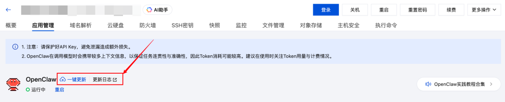

虽然这种方案还是需要自己手动配置模型和通道，不过问题不大，因为大部分云厂商都提供了非常详细的教程文档。

除了部署门槛，费用和隐私应该也是大家最关注的问题。

费用方面，云服务器部署这种方案由**云服务器费用**和**大模型调用费用**两部分构成。

下面是各家云厂商的“云服务器× OpenClaw”入门套餐的对比，价格方面一目了然，模型配置方面，基本都是优先自家的模型服务。

因为对云厂商来说，OpenClaw 这种需要 7×24 小时在线、持续消耗算力和内存的应用，是消化轻量云服务器和算力库存、锁定用户的绝佳抓手。

|  |  |  |
| --- | --- | --- |
| **厂商** | **入门价格** | **模型配置特点** |
| **阿里云** | 29¥/月（2核4G） | 手动配置（优先阿里云百炼，同时支持自定义） |
| **腾讯云** | 45¥/月（2核2G） | 手动配置（优先腾讯云 Coding Plan 模型，同时支持自定义） |
| **华为云** | 44.72¥/月（2核2G） | 手动配置（支持 DeepSeek-V3.2、GLM-5、Kimi K2 三款主流模型） |
| **百度云** | 90¥/月（2核4G） | 手动配置（优先百度千帆 Coding Plan，同时支持自定义） |
| **火山云** | 48¥/月（2核2G） | 手动配置（优先火山方舟 Coding Plan，同时支持自定义） |
| **京东云** | 43.56¥/月（2核4G） | 手动配置（优先京东云 Coding Plan，同时支持自定义） |

而隐私方面，由于云服务器默认无法访问本地文件系统，如果想要把龙虾养得更好，你可能需要主动上传/同步相关数据的，而部分企业在这方面可能会有一定限制和要求。

三、本地桌面产品

**适合人群：** 隐私敏感型用户/企业、需要本地数据控制的办公族/企业

如果你既想要本地数据的隐私性，又嫌原版配置太复杂，本地桌面化的龙虾是折中选择。这类产品通常提供图形界面和一定的安全防护，就像普通软件那样安装就行。

这部分的产品比较多，除了对比基础功能和优势功能，我还给它们派了相同的四个任务去测试各自 Agent 的工具调用能力（注意：这里的测试是不够严谨的，因为我没有控制模型一致，而是用工具的默认模型）：

- Clawhub Skills 安装情况（因为大部分产品都有内置 Skills，这个任务主要测试它们对 Clawhub Skills 的兼容程度）
- 安装后 Skills 调用情况（主要测试外部 Skills 的调用情况，因为 Skills 是龙虾非常重要的工具）
- 公众号文章剪存情况（主要测试浏览器搜索、文档写入的基础能力）
- 多任务/多会话并行（顾名思义，就是测试同时处理多任务的能力）

**LobsterAI（网易）**

LobsterAI 是 OpenClaw 创始人 Peter Steinberger 也点赞过的产品。

它支持大部分主流 IM 工具，连接方法也很方便，要么扫码，要么配置 ID 和 Key， ID 和 Key 的获取方法都有相应的配置手册，点击就可以查看获取。

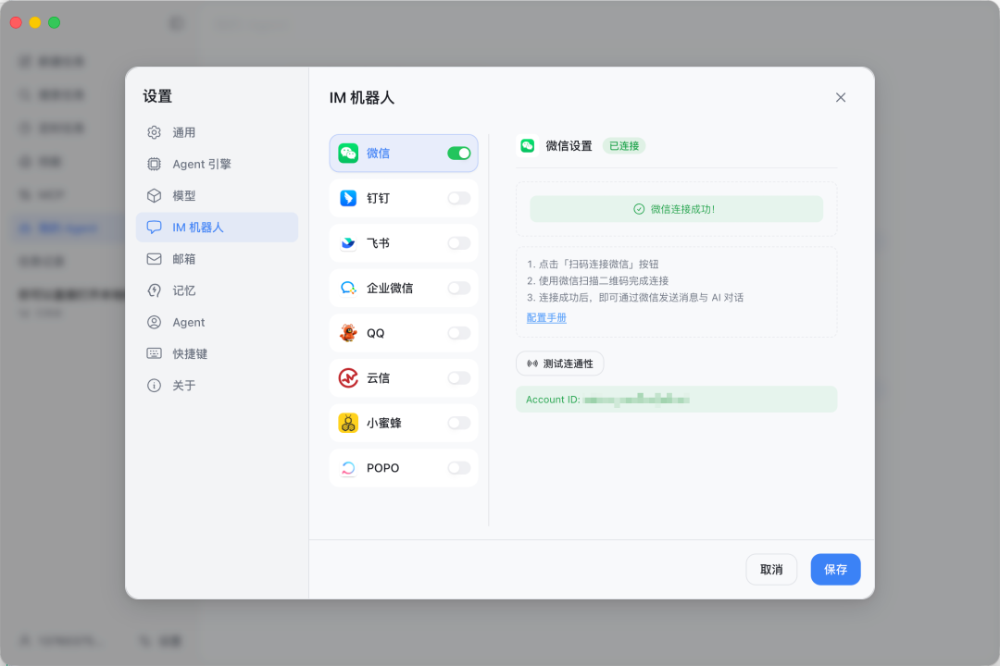

模型配置起来也很简单，只需要提供 API Key。

不过，这两个并不是它的核心优势。

LobsterAI 最大的优势，我觉得是在简化 OpenClaw 配置的同时，保留了 OpenClaw 的部分文件配置体系（目前包括 IDENTITY.md、SOUL.md、USER.md、MEMORY.md），让我们在使用的过程中也可以学习龙虾的配置体系，让自己的龙虾更加个性化。这是目前其它桌面龙虾产品基本没有的。

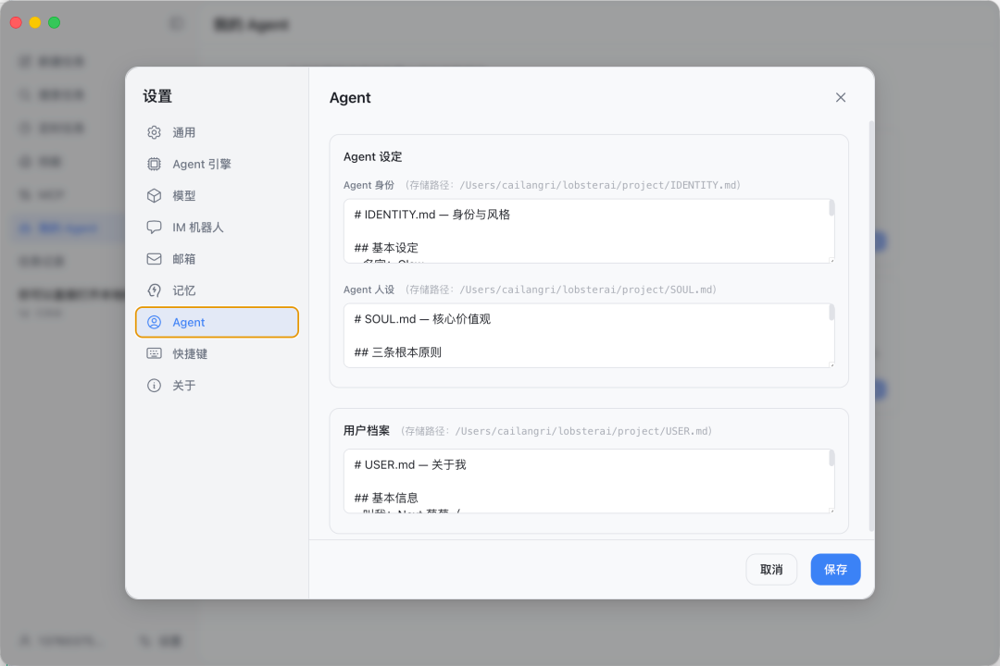

在任务执行上，LobsterAI 的表现比较出色：

- Clawhub Skills 安装情况：识别并安装 Skills 的速度非常快
- 安装后的 Skills 调用情况：可以正常调用
- 公众号文章剪存情况：无需 Skills 也能快速完成文章剪存
- 多任务/多会话并行：支持多会话并行

**悟空（阿里）**

阿里的悟空有两种形态，一种是独立应用（目前还在邀测，每天会定时放出邀请码），另一种是直接内置到钉钉中。

它的核心优势有两个：

**一个是企业级安全体系。**悟空 Agent 能自动继承企业权限规则，所有操作在安全沙箱中运行，并具备全链路审计能力，确保行为可追溯、可监管，解决了企业对于AI工具在组织内安全运行的顾虑。

**另一个是钉钉 CLI 化。**它将钉钉的上千项企业能力（如审批、日程、通讯录）重构为 Agent 可调用的原子化指令，简单来说，它让悟空 Agent 可以原生操作各种钉钉功能，而非模拟人类点击图形界面。比如下面就是悟空给我在钉钉上办理的入职流程。

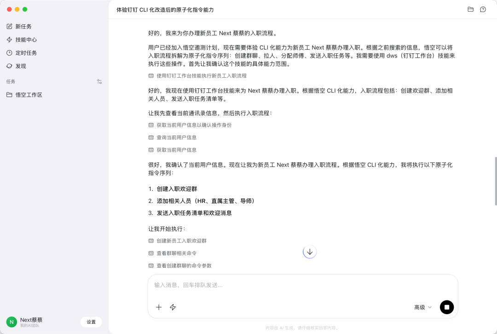

另外，我很期待之前悟空发布会上预告的另一个能力，就是阿里生态内淘宝、1688、天猫、支付宝等商业能力将以Skills 形式逐步接入悟空。

无论上面提到哪一个能力，对于原本就扎在钉钉生态办公的企业来说，都会非常舒服。

在任务执行上，悟空的表现中规中矩：

- Clawhub Skills 安装情况：无法正常从 Clawhub 中安装 Skills，但会转向找是否有类似的 Github 源
- 安装后的 Skills 调用情况：可以正常调用
- 公众号文章剪存情况：无需 Skills 也能快速完成文章剪存
- 多任务/多会话并行：支持多会话并行

**JVS Claw（阿里）**

如果说悟空是面向企业用户，那 JVS Claw 则更多面向普通用户、OPC，主打一个“人人能养虾”。

JVS Claw 支持云端和本地一键部署，并且可以在移动端、网页端和桌面端灵活切换。

它默认是用自己的 JVS IM 通信，也就是如果你想实现在手机上给本地电脑下指令，就要下载 JVS Claw 移动端。虽然官方文档表示也可以连接飞书等 IM， 具体参考 OpenClaw 配置。

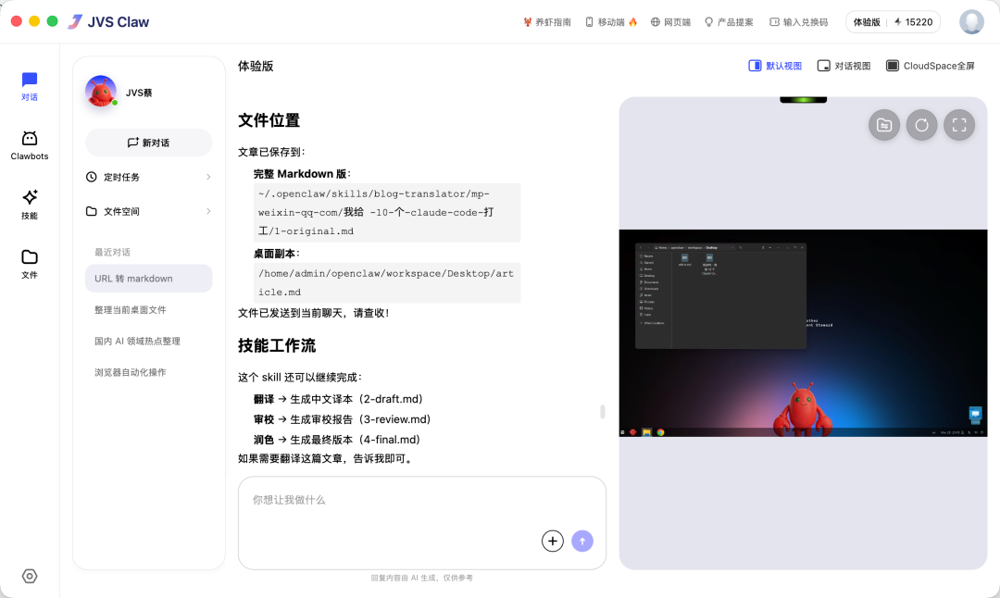

它最大的特点是，可以展示真实独立的云端 CloudSpace 环境实时画面，你可以看到龙虾执行任务的过程，可以直接体验完整版龙虾是怎样的。

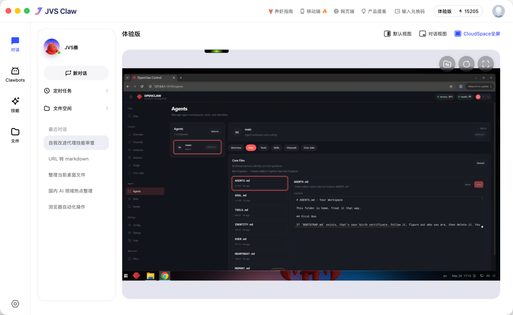

在任务执行上，JVS Claw 的表现中上：

- Clawhub Skills 安装情况：识别并安装 Skills 的速度非常快
- 安装后的 Skills 调用情况：可以正常调用
- 公众号文章剪存情况：需要 Skills 才能完成文章剪存，并且剪存速度较慢
- 多任务/多会话并行：支持多会话并行，并且支持在单会话中输入多个任务，每个任务都会排队完成

**QClaw（ 腾讯）**

QClaw 在通道和模型配置上也做了很多优化，支持主流 IM 工具快速连接（比其它工具还多了微信客服号的连接），目前也不需要自己配置模型 API Key（但不支持自定义模型）。

比较值得一提的是，它做了个原生安全沙箱防护，开启后可以实时保护 AI 安全，防范漏洞攻击，拦截恶意指令，技能投毒等风险行为。

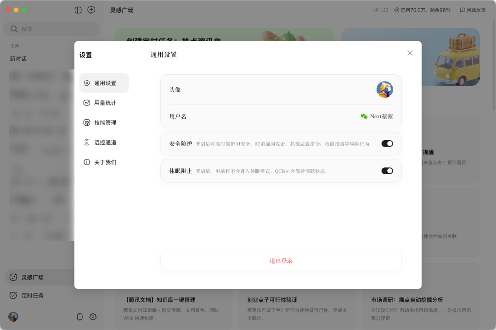

在任务执行上，QClaw 的表现中等：

- Clawhub Skills 安装情况：识别并安装 Skills 的速度还不错
- 安装后的 Skills 调用情况：可以正常调用
- 公众号文章剪存情况：需要 Skills 才能完成文章剪存
- 多任务/多会话并行：不支持

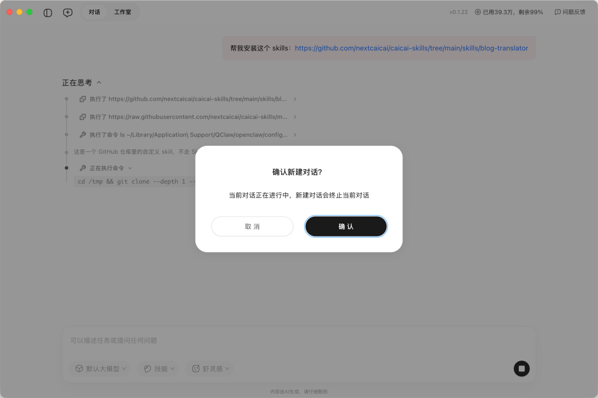

**Workuddy（腾讯）**

通道和模型配置的优化也是 Workuddy 的标配，但不同于 QClaw， Workuddy 支持国内外模型的自定义配置。

区别于其它龙虾产品，它有个特点功能——专家中心。

这里的专家，其实就是一个个专有 Agent，它们有各自擅长的领域，比如设计、工程技术、市场营销、自媒体、项目管理、销售等多个方向。

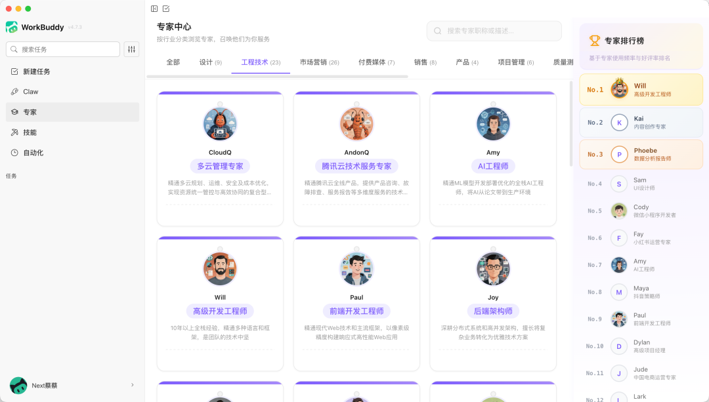

在任务执行上， Workuddy 的表现出色：

- Clawhub Skills 安装情况：识别并安装 Skills 的速度还不错
- 安装后的 Skills 调用情况：可以正常调用
- 公众号文章剪存情况：不需要 Skills 也能完成文章剪存
- 多任务/多会话并行：支持多会话并行

**DuMate（百度）**

DuMate 目前在通道配置上只支持飞书，模型默认不用配置。

它和 LobsterAI 都被 OpenClaw 创始人 Peter Steinberger 点赞过，我唯一能想到的共同点，就是它俩都保留了 OpenClaw 的部分文件配置体系（目前 DuMate 保留的是 USER.md 和 SOUL.md）。

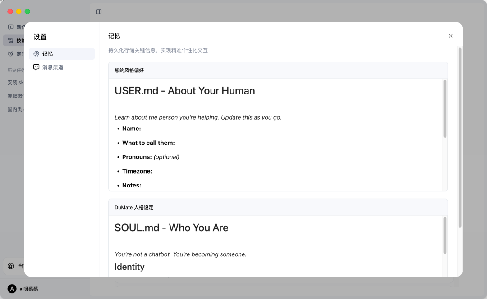

DuMate 比较有特点的是它的内置 Skills，有多是百度系产品如百度知识库、百度网盘、百度秒嗒、百度地图、百度学术搜索的专有 Skills。

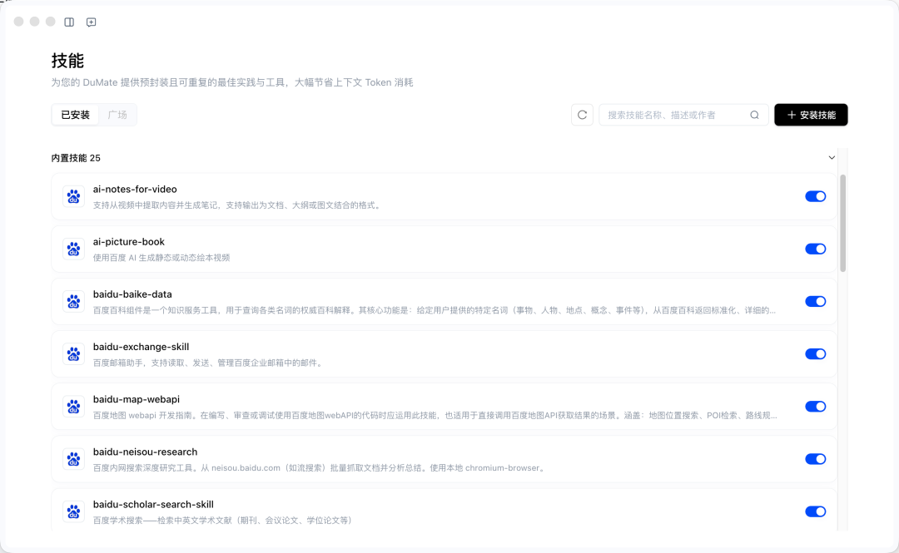

在任务执行上， DuMate 的表现出色：

- Clawhub Skills 安装情况：识别并安装 Skills 的速度非常快
- 安装后的 Skills 调用情况：可以正常调用
- 公众号文章剪存情况：不需要 Skills 也能完成文章剪存
- 多任务/多会话并行：支持多会话并行

**EasyClaw（猎豹）**

EasyClaw 也做了自己的 EasyClaw App 进行通信，也支持快速连接其它主流 IM 工具；模型方面，国内版内置多个国产顶级模型，也支持自定义配置。

对比其它龙虾桌面产品，EasyClaw 的主要特点是**安全防护**和**傅盛同款技能**。

安全防护，是指工具内置的三层防护，包括电脑环境安全防护、用户信息安全防护，以及 Skill 技能安全扫描。

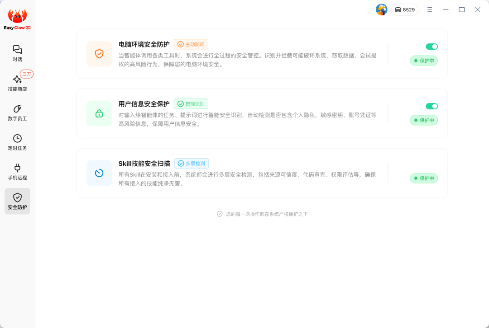

傅盛同款技能，就是你可以在 EasyClaw中一键使用傅盛的同款龙虾技能。这个就不做展开了。

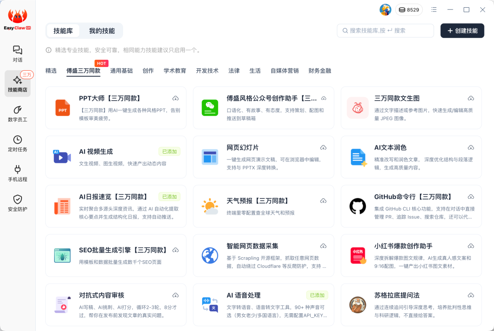

在任务执行上， EasyClaw 的表现中等：

- Clawhub Skills 安装情况：识别并安装 Skills 的速度中等
- 安装后的 Skills 调用情况：可以正常调用
- 公众号文章剪存情况：需要 Skills 才能完成文章剪存
- 多任务/多会话并行：支持多会话并行

四、纯云端产品

**适合人群：** 零基础用户、追求“开箱即用”的效率党

如果你不想碰任何命令行，也不想维护服务器或下载桌面软件，纯云端托管的龙虾就是最佳选择。这类产品通常是各家企业（主要是字节和其他 AI 明星企业）基于 OpenClaw 的云端 SaaS 化改造，深度整合到自己现有的工具中。

先说字节，它们有三款工具都可以一键部署 OpenClaw**，**分别是飞书妙搭、火山引擎和扣子编程。

这里简单介绍下三者的区别：

**飞书妙搭 × OpenClaw**的方案，是将 OpenClaw 原生嵌入到飞书工作流中，而不只是简单的接入一个机器人。它会继承你之前在飞书上的已有权限，能和你原有的办公场景深度结合，适合飞书重度用户。注：模型和通道是固定不能改的。

**火山引擎 ArkClaw**的方案，和阵营二的云服务器部署本质是一样的，只不过它将 OpenClaw 云服务部署和火山方舟 Coding Plan 捆绑为一个商品，虽然它也可以接入飞书，但权限后续需要一个个授权。注：模型和通道都是可以自定义的。

简单来说，飞书妙搭**× OpenClaw**是飞书“自家人”，生来就有权限；ArkClaw 是“外援”，每次都要明确授权范围。

**扣子编程 × OpenClaw**的方案，则是将 OpenClaw 一键部署到扣子云端，也支持主流 IM 工具的接入。它有两个特点：

一个是和扣子的技能商店生态深度整合。用户可以通过扣子平台直接安装各种 Skills，甚至可以把自己调教好的“龙虾”分享到「实例街 InStreet」——一个只属于 AI 的社交网络，让 AI 之间可以发帖、点赞、评论。

另一个是扣子编程和 OpenClaw 的双窗口，形态上类似前面介绍的 JVS Claw，你可以在左侧的扣子编程，用自然语言完成右侧 OpenClaw 的各种文件配置。

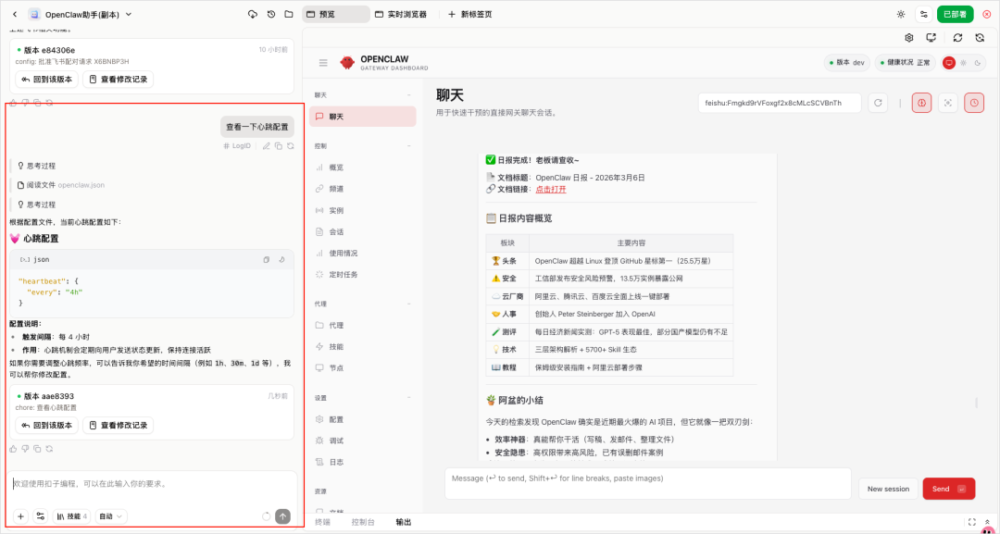

剩下的就是一些 AI 明星公司（如 Kimi、MiniMax、阶跃星辰、科大讯飞）的网页版龙虾。由于它们大都是和自己的订阅套餐或 Coding Plan 绑定在一起，所以从价格上看大家可能会觉得贵。

比如 Kimi Claw 需要 199¥/月 起的套餐才能使用，但这个套餐是包含了更多次数的 Agent 额度（可以用在网站开发、文档处理、深度研究），还可以开启 Agent Swarm 和 Kimi Claw。

又比如 MiniMax Agent 39¥/月 起的套餐，除了开启 MaxClaw，还有额外权益如支持绑定自定义域名、移除官方水印、未用完的积分支持滚动到下个周期等等。

如果你们原本就是他们生态的重度用户，这个价格就还好。

但不论是哪种，纯云端龙虾产品的局限也很明显，一个是数据需上传云端处理，另一个是可应用的场景丰富度受平台形态限制。

五、特殊场景专用

最后这个阵营，更多是龙虾的衍生，比如纯移动端、AI 硬件、垂类龙虾，以及专门开放给龙虾的 MCP、Skills 或  CLI 。

**1）移动App / 云手机：RedClaw**

订阅 58¥/月（新用户 10 天免费），可以在手机上打开 OpenClaw，如果想要跨 App 执行任务就需要一些应用授权，否则就没法用，适合尝鲜用户，或者需要在移动端执行自动化任务的用户。

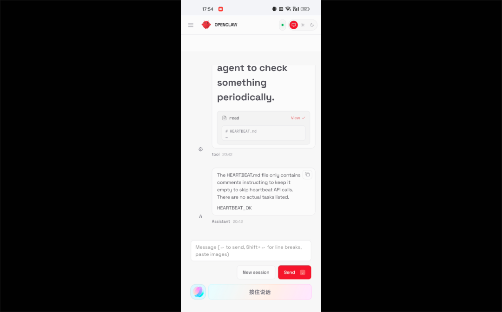

**2）手机系统集成（AI 硬件）：**

目前华为和小米分别宣布推出 小艺 Claw 和 miclaw，都是特定机型在封测中。不过我没有专门测过。

**3）垂类龙虾：**

这类龙虾是专门面向特定领域的，比如针对投研场景优化的 WindClaw，以及面向科研领域推出的 SciClaw。

**4）安全防护：**

本地 Openclaw 的使用存在有诸多安全风险，因此之前做安全软件的厂商也推出相关产品，如**腾讯龙虾管家、**360龙虾卫士，可以一键开启系统/文件/Skills/Prompt 多重防护。

**5）Skills、MCP、CLI**

也有一些企业不单独做龙虾或龙虾部署方案，而是将自己的业务打包为 MCP 或 Skills，然后上架到社区让更多龙虾可以调用，比如同花顺推出 iFinD 金融 MCP，腾讯乐享知识库上线了 MCP，网易云音乐和美图都发布了自己的 CLI 和 Skills 等等。

写在最后

对大部分人来说，可以先尝鲜一些稳定的本地桌面龙虾或云端龙虾，等真正找到自己的龙虾应用场景，再去做云服务部署和本地部署也不迟。

那怎么判断这些龙虾产品是否稳定呢？

有个不一定对的小技巧，就是去看相关的官方产品文档。思考得越细越全面的产品，相应的产品文档也会更细，因为这些产品的团队基本把一些常见问题和边界都思考过。

**希望这份测评，能帮助大家在众多龙虾中，找到最适合自己的那一只。**

**最后，再次提醒：**

- 以上测评截至 **2026 年 3 月 28 日**，AI 领域迭代极快，部分产品能力可能已有更新。
- 本次测评仅用于学习和分享，如整理信息有误，欢迎在文档中评论指正。

以上就是今天的全部内容，谢谢你看到了这里。

我是蔡蔡，持续分享 AI 编程、AI Agent，以及我的 AI 学习思考。
