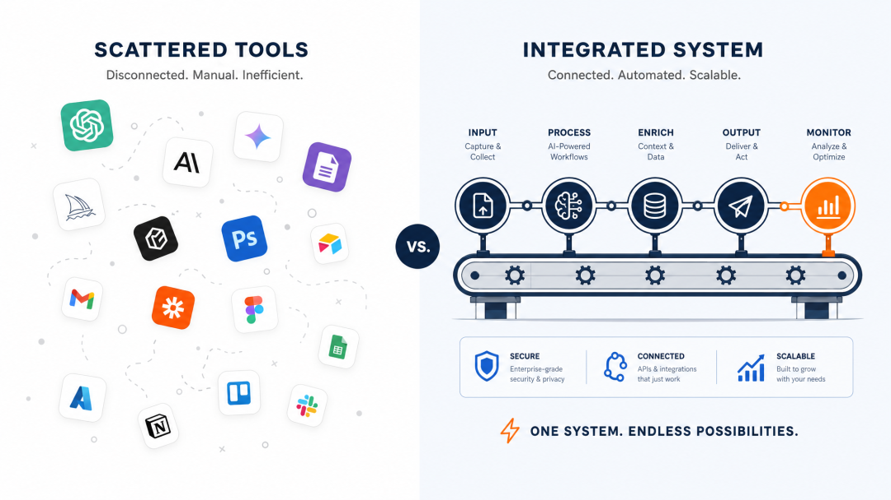
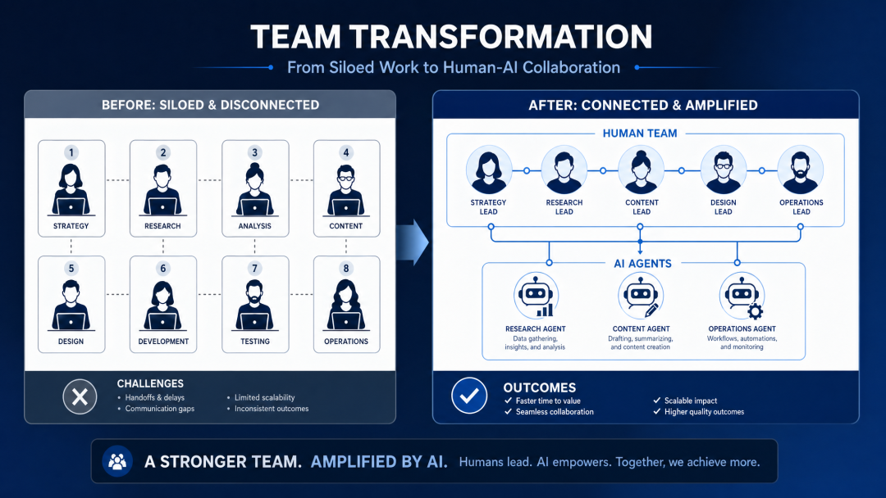
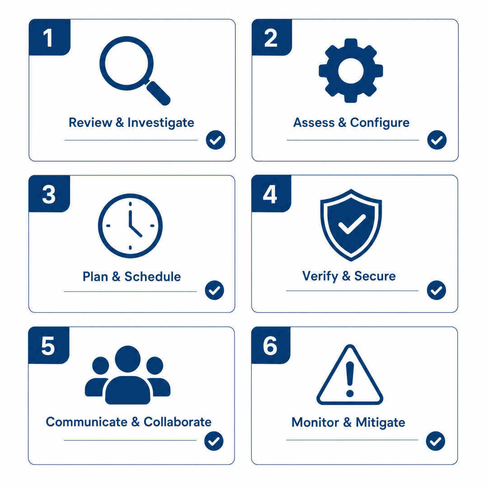
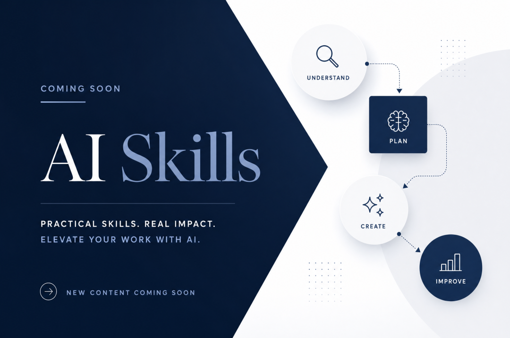

> 📎 来源: [hueshadow](https://mp.weixin.qq.com/s?__biz=MzA3MTA3ODI3Nw==&mid=2650156191&idx=1&sn=5460911639526f0e473aa0715630229e&chksm=866d3741b63e33e4e05ba8c0ab7b2612f6084fad034294cee571b602a489b062cc32a10b5aaf&mpshare=1&scene=1&srcid=0430wtrceAWnoXAnX6WaUcHf&sharer_shareinfo=94b184a40abb2d0da35fdb9bd2b1b410&sharer_shareinfo_first=94b184a40abb2d0da35fdb9bd2b1b410) | 时间: 2026-04-30 22:27

---

一杯凉掉的咖啡，和写满划掉工具名字的笔记本

AI生成

---

## 一、那杯凉掉的咖啡

上周三下午三点，和老周在国贸喝咖啡。

老周是一家 SaaS 公司的 CTO，认识快十年。我们聊到一半他放下杯子问我，能不能帮他看看团队是不是哪里出了问题。

我说你说。

他从 Cursor 讲到 Claude Code，从 ChatGPT Team 讲到 v0、Devin、Lovable，每一个产品都说得很顺，参数、上下文窗口、插件生态都能背出来。八个工程师轮班测，每月在 AI 工具上花了两万多，已经烧了五个月。

我问他：**「所以效率呢？」**

他停了一下。

「就……每个人都说挺好用。」

「我是说生产力。代码量、bug 率、上线节奏，有没有变？」

他又停了一下，端起咖啡喝了一口，发现已经凉了。然后他说了一句让我印象很深的话：

> 「我也说不上来。感觉好像快了一点。但拉数据看，没什么变化。」

那杯凉咖啡我后来想了好几天。

左边：零散的工具；右边：连贯的系统。差的是这一步。

AI生成

## 二、买工具，和搭系统，是两件事

老周不是外行。他自己写 React，调过 K8s，做过中等规模的架构迁移。他团队那八个人也都不差。

那为什么砸了十万块，效率纹丝不动？

我后来想清楚了：他们买的是工具，缺的是系统。

这不是抠字眼。

打个比方。一个家具工厂，老板给每个工人都配了一台德国进口的电锯。锯是好锯，每一台都比原来的快三倍。但下料的人没换、进料的节奏没换、出货的检验没换、堆料的仓库还是那个老仓库。

结果是什么？

> 每个工人切板子的速度变快了，但板子切完堆在过道里没人收，仓库里料没补上来，下一道工序的工人在等。整条线的产能没动，单个工序快了反而把瓶颈暴露得更清楚。

AI 工具进企业，现在大部分长这个样子。

每个人都拿到了一把更快的锯。但锯之间没有对话，工作流没有重排，输出没有沉淀。每个人在自己的工位上爽——这是真的爽，Cursor 写代码确实手感好——但整条线没动。

老周问我："那我应该怎么办？"

我说："**你需要的不是再买第十一个工具。你需要的是开始把这些工具串起来。串起来的那个东西，我管它叫操作系统。**"

## 三、什么叫"AI 操作系统"，说人话

这个词可能听起来玄。我尽量说人话。

Windows 是个操作系统，它干三件事：管硬件、跑软件、给你一个统一的界面。

AI 操作系统在企业里干的事情类似——管模型、跑 Agent、给员工一个统一的工作入口。

具体到老周的公司，可能是这样的：

一个新员工入职，HR 把账号一开，他的 IDE 自动加载团队的 code style，提交代码时自动跑团队约定的 review checklist；他要写一份竞品调研，敲一句"分析这家公司"，背后自动调起爬虫、Deep Research、Notion 写入；他要发周报，AI 从 Git、Linear、Slack 里抓数据，按团队模板生成草稿等他改。

这里的关键词不是"AI 多智能"，而是"自动加载"和"统一入口"。

——员工不需要知道背后用了哪个模型、调了哪些工具、查了多少接口。他只是在做事。

这就是操作系统该有的样子：**底层复杂，上层简单。**

而老周公司现在的状态，是反过来的。底层一堆工具各自为战，员工每个人都得当半个运维，记着哪个工具适合什么场景、上下文该怎么喂、prompt 要怎么写。

不是 AI 不行，是 AI 还没被装上去。

改造前后对比：从8人分散作战，到5人+AI Agent协作（第9个月的结果）

AI生成

## 四、一个真实数字：省下三个 HC，但花了九个月

老周后来还真做了改造。我把过程简单说一下。

他没去买新工具。第一步反而是减——把团队当时在用的 AI 工具清了一遍，留下三个：Cursor、Claude Code、一个内部封装的 Agent 网关。

第二步是写规则。他让两个资深的人停了两周业务，专门做一件事：**把团队过去半年所有重复的事拎出来，写成 Skill。**

什么是 Skill？你可以理解成"团队约定的标准动作说明书"，但是给 AI 看的。

举个具体的：他们团队每次新功能上线，要写一份 release note，一份 changelog，发一条 Slack，更新一下 Notion 文档。这事每周发生两到三次，每次平均花一个工程师 40 分钟。

写成 Skill 之后，工程师在 Cursor 里输一句"上线 v2.3.1"，剩下的事是 AI 自己跑完的。release note 按团队的 voice 写，changelog 按团队的格式排，Slack 通知按团队的模板发，Notion 文档对应位置自动更新。

**40 分钟变成 5 分钟。**

类似的 Skill，他们前后写了 30 多个。

九个月以后，团队结构是这样的：业务开发从 5 人变成 5 人（没动），文档测试从 1 人减到 0（合并到业务线），基础架构从 2 人减到 1 人（另一个去做新产品了）。

省了 2 个 HC，业务节奏快了大概 30%。

老周说，最大的变化不是节省了多少钱，而是**他终于不再需要每个月开 AI 工具复盘会**——以前每个月要花两个小时讨论"我们到底怎么用 Cursor 才合理"，现在不需要了，因为团队约定写在 Skill 里，新人看 Skill 就懂。

知识沉淀这件事，是他没想到的额外好处。

## 五、Skills，是把人留下来的东西

我多说一句 Skills，因为这是大部分人没看明白的地方。

很多公司讲 AI 落地，讲的是"用了什么模型""集成了什么工具"。这些都是冰山上面那一块。

冰山下面那块是**Skills**——团队怎么干活的具体规则。

一个老员工 Y 是怎么写 release note 的？他怎么排版？哪些信息一定要写、哪些不能写？他怎么挑哪些 commit 要被高亮、哪些可以省略？

过去这些东西在 Y 的脑子里。Y 离职，知识就走了。新人要重新学半年。

写成 Skill 之后，这套东西留在了仓库里。Y 走了之后，新人接手第一天，AI 还按 Y 的方式干活。

这不是夸张。我自己团队就经历过一次这个过程。当时那个负责微信公众号排版的同事走了，我以为接下来三个月得重新培训新人。但因为之前他写过一个排版 Skill，新人来了直接用，发出去的文章读者完全看不出换了人。

> Skill 的本质，是把人脑子里的隐性知识，固化成 AI 可执行的显性知识。

这件事的长期价值远远超过省两个 HC。它意味着**团队的能力不再 100% 绑定在具体的人身上**。

——这一点对中小团队来说尤其关键，因为中小团队最怕的就是核心人员一走，半个项目跟着塌。

六个自我检测问题，帮你判断团队的 AI 系统化程度

AI生成

## 六、六个问题，自己测一下

不写 36 项清单了，那种东西你看完就忘。

我给你六个问题，你拿去问自己的团队，每一个都需要给出具体答案，不能糊弄。

**第一个**

你团队过去三个月最常重复的五件事，分别是什么？每件事每周发生几次？
如果答不上来，你的 AI 化连切入点都没找到。

**第二个**

这五件事里，有哪些已经被 AI 跑通了？跑通的那些，是固化在 Skill 里、其他人也能复用，还是停留在某个人的浏览器收藏夹里？
如果是后者，恭喜，那不叫 AI 落地，那叫"某个员工自己玩得挺嗨"。

**第三个**

当一个新人入职，他需要花多久才能用上团队的 AI 工作流？是入职第一天打开 IDE 就能用，还是需要找老员工口口相传两周？
新人上手时间，是检验"系统化程度"最直接的指标。

**第四个**

你的 AI 输出，谁负责审？审的标准是什么？错了之后怎么追溯？
没有这一层，AI 用得越多，风险敞口越大。

**第五个**

过去六个月，你团队有多少个员工在用 AI 干活？这些人产出的最佳实践，有没有被沉淀成可分享的 Skill？
如果没有，相当于每个人在重新发明轮子。

**第六个**

如果你团队里写 AI 工作流写得最好的那个人明天离职，你会损失什么？你能找到接班人吗？
这个问题不用回答我，回答你自己。

## 七、最后

回到开头那杯凉咖啡。

老周后来给我发过一条微信，说他想清楚自己当初错在哪了——**他一直在问"这个工具好不好用"，但他从来没问过"这套工具组合起来能不能成为我们团队的工作方式"**。

前者是消费者视角，后者是 CTO 视角。他付的是 CTO 的工资，但脑子里装的是消费者的问题。

我把这条微信截图存下来了。每次有人问我"AI 怎么落地"的时候，我都会想起来这句话。

工具是单点的，系统是连续的。你买十个工具不会自动变成一个系统，就像你买十块木板不会自动变成一张桌子。

中间那一层——把它们装起来的螺丝、合页、胶水——才是真正难做的，也是真正值钱的。

这一层，我们叫它操作系统也好，叫它 Skills 体系也好，叫它工作流也好，名字不重要。

重要的是有没有人在做这件事。

**如果今天没人做，从今天开始做。**

\* \* \*

下期预告：Skill 怎么写得好，或具体场景拆解

AI生成

**下期预告**

下周想接着写 Skill 怎么写得好，还是想先看具体场景的拆解（比如客服、市场、研发）？评论区告诉我，我从素材库里挑一个写。

来自翡冷翠

© 2026 Lumiscale | 企业AI能力建设
