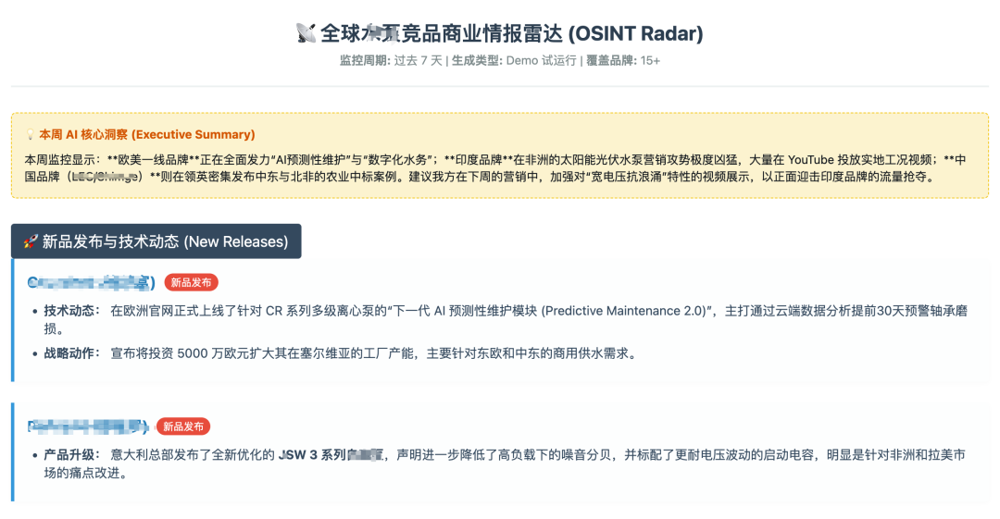

> 📎 来源: [外贸AI实战录](https://mp.weixin.qq.com/s?__biz=MzYzMTc3ODE1MA==&mid=2247483694&idx=1&sn=12ad4ecc1712249b7715f1eccfb878f4&chksm=f13e6457ba2890733c78831e4f756179e427fb07ee897c661909fef87fb12a5c2b13a565e5e4&mpshare=1&scene=1&srcid=0511rU9opV2cUJYB31ktAiTo&sharer_shareinfo=1fc21d40531b6498d600335052627d72&sharer_shareinfo_first=1fc21d40531b6498d600335052627d72) | 时间: 2026-05-11 15:41

---

# AI时代，每个外贸老板都可以是自己的首席CIO

---

📌 **阅读提示**：本文约3000字，阅读时间7分钟。如果你是外贸老板或出海负责人，建议认真看完。

---

## 一、先说说我的「至暗时刻」

做外贸十几年，我经历过太多「迷茫时刻」：

**场景一：展会归来**

花了几十万去迪拜参展，收了40张名片。回来一整理，30张是中间商，10张是小买家。那些真正掌握当地渠道的大代理商？连面都没见到。

为什么？因为我根本不知道本地畅销什么品牌、什么型号、这些品牌的经销渠道在哪里。

**场景二：平台困局**

每年砸30万投阿里国际站和谷歌竞价。询盘倒是不少，但来的全是比价的小散单。今天这个客户问完价格没影了，明天那个客户要免费样品。

陷入无休止的价格战，利润越压越薄。

**场景三：地推尬聊**

去德国拜访客户，拿着Google搜来的公司名单，一家一家敲门。前台问："您有预约吗？"我说："没有，但我想见你们采购负责人。"

结果可想而知。

**这些，都是我曾经的日常。**

---

## 二、转机：遇见龙虾

今年春节，我开始折腾OpenClaw（龙虾）。

说实话，一开始只是好奇。但当我真正深入进去，配置各种skills、整合搜索API、调试爬虫资源时——

**我发现，这可能是我外贸生涯的转折点。**

过去一个月，每天晚上挑灯夜战。从V1到V8，迭代了8个版本。

当我看到第一封「全球战报」出现在邮箱里时，那种肾上腺素飙升的感觉，我至今记得。

**那个我曾经想开发、投入过、却始终差强人意的「商业信息情报系统」，在AI时代，终于完美呈现了。**

---

## 三、这套系统能做什么？

我把它总结为「四大情报引擎」：

---

### 🔍 引擎一：选品「透视镜」

**核心问题：卖什么最赚钱？**

传统做法是拍脑袋、凭经验。我的系统是：**用真实数据指导选品**。

**具体怎么做？**

- 扫描目标国家（拉美、非洲、中东等）的畅销大盘
- 深度爬取当地终端用户的真实反馈与高频故障记录
- 找出竞品设备中最容易坏、最急需替换的核心配件

**结果是什么？**

从「卖整机」的红海，切入「卖大牌平卖耗材」的暴利蓝海。

---

### 🎯 引擎二：渠道「扒皮」系统

**核心问题：你的大客户在哪里？**

答案是：**就是竞品正在合作的代理商。**

**具体怎么做？**

- 穿透多语种本地网络，分析各类本地批发市场，过滤各种混乱黄页信息
- 将全球一线大牌在各个国家的真实第三方核心代理商、独家经销商、大型连锁超市网络全部挖掘
- 过滤掉竞品的官方的各种本地分公司

**结果是什么？**

把真正掌握当地终端命脉的「地头蛇」企业名单，整整齐齐摆在桌面上。

---

### 🎣 引擎三：决策人「捕捞网」

**核心问题：如何一击必中？**

知道公司名字只是第一步。我的系统是：**直接把联系方式送到你手里**。

**具体怎么做？**

- 全自动深网抓取分销巨头的业务邮箱（Purchasing/Sales VP）
- 提取带区号的专线电话及高管姓名
- 一键导出CRM格式，立刻开启精准开发

**更狠的一招：**

「行业老兵」猎投——定向挖掘竞品体系内刚刚退休的区域总监、前首席工程师或独立顾问。招募他们作为当地顾问，直接带资、带人脉进场，瞬间击穿信任壁垒。

---

### 📡 引擎四：竞品「雷达」

**核心问题：如何永远快人一步？**

**具体怎么做？**

- 配置后台自动化脚本，每周定向巡航全球核心竞品
- 实时捕捉对手的YouTube新品视频、领英中标案例
- 同步监控跨境电商平台（Amazon、阿里等）畅销榜单飙升异动

**结果是什么？**

每周五下班前，一份经过AI降噪提炼、附带原网页溯源链接的《竞品商业情报周报》自动发送至CEO邮箱。

**商战没有暂停键，但你可以永远比对手早一步。**

---

## 四、实战成果：这不是概念，是战报

为了验证这套系统，我跑了几个核心市场：

**🇪🇸 西班牙站**：遍历26个国际品牌，洗出247家极优质代理商
**🇩🇪 德国站**：运用德语词簇，直达378家独立水泵实体
**🇪🇬 埃及站**：精准提纯Calxx，Pedxxx等大牌的本地实力商贸实体

每一封战报，都包含：

- 双语公司名（英文+本地语）
- WhatsApp直达、本地电话、采购邮箱
- LinkedIn主页、Facebook主页
- 一键触达

**从找到对的客户为起点，进一步基于上面的信息去分析客户。**

---

## 五、为什么你需要立刻行动？

这不仅仅是一套IT工具，它是已经被实战验证的、可复制的「外贸数字化出海SOP」。

**当同行还在展会上发传单时，你已经通过这套系统：**

👉 省下了百万级的试错与地推成本
👉 直接拿到了一线大牌在目标国家的核心经销商通讯录
👉 甚至已经通过高薪聘请竞品的退休老兵，拿下了当地最大的采购合同

**出海抢单，快鱼吃慢鱼。**

**信息差就是能力差，情报的差距就是时间成本的差距，就是利润的差距。**

---

## 六、写在最后

AI时代，给每个外贸老板一个可能性——

**你可以是自己的首席CIO。**

不需要懂代码，不需要养技术团队。你只需要：

- 明确你的业务目标
- 设计你的情报需求
- 让AI帮你搞定剩下的

过往「等客上门」和「盲人摸象」的时代，真的结束了。

**你准备好被AI重塑了吗？**

---

💬 **互动话题**：

你现在的外贸获客方式是什么？展会？B2B平台？还是已经开始尝试AI了？欢迎在评论区聊聊你的经验和困惑。

---

👍 **如果这篇文章对你有启发，欢迎：**

- 点赞、在看，让更多外贸人看到
- 转发给正在探索AI获客的伙伴
- 收藏起来，实操时拿出来对照

---

*本文作者：【理工男外面的思维杂货铺】*

*【*理工男外面的思维杂货铺*】—— 专注AI时代的外贸生产力升级*

*写于又一个收到全球战报的周五傍晚*
