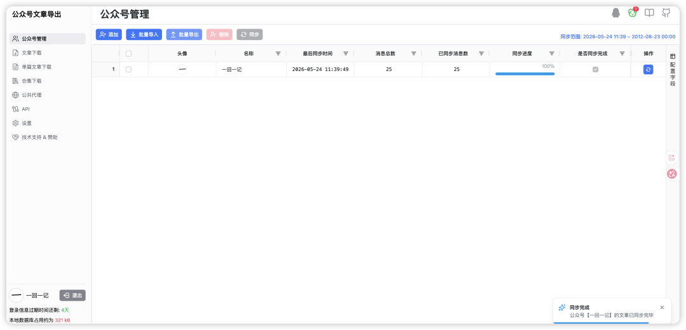
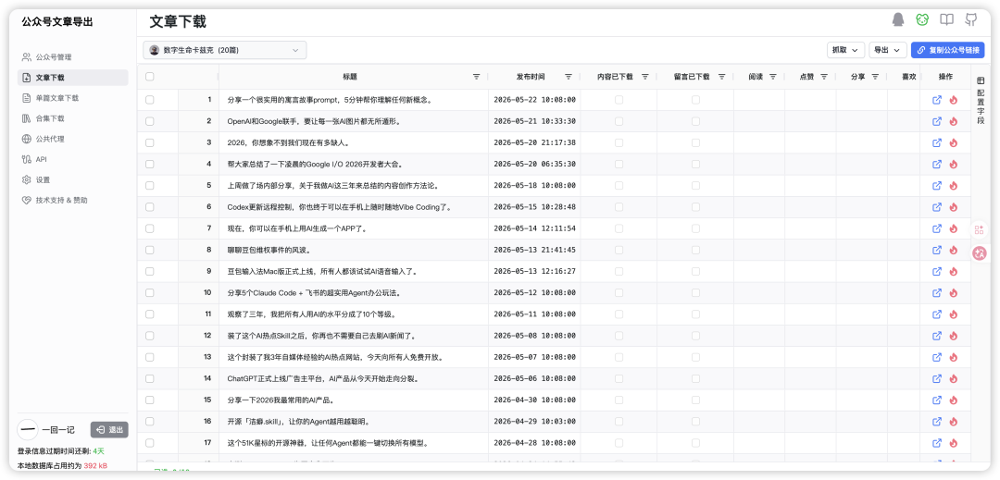
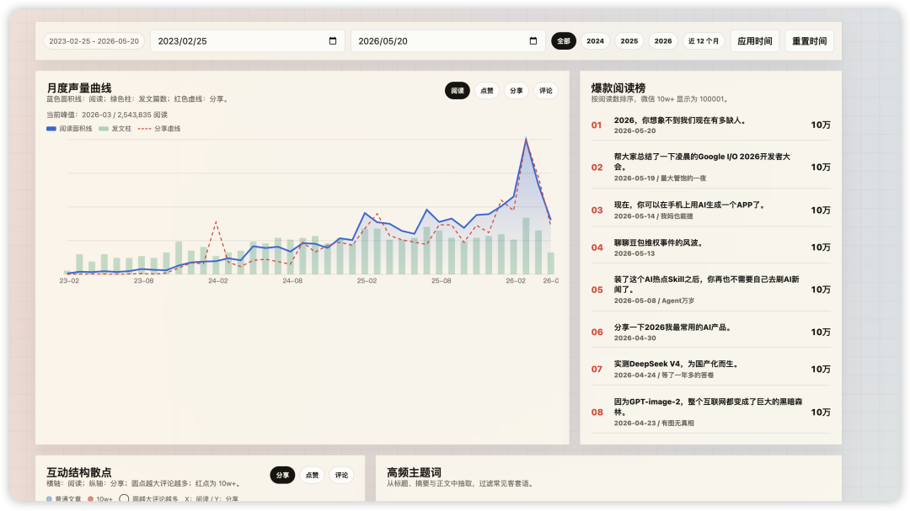
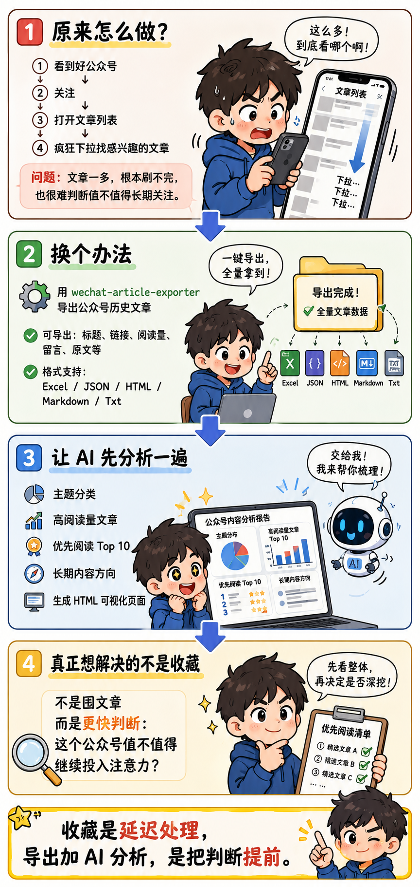

> 📎 来源: [一回一记](https://mp.weixin.qq.com/s?__biz=MzkzNzMwNTkzMA==&mid=2247483897&idx=1&sn=d571e714f2ceaf7d22255161bb9b708c&chksm=c3dd36f5aab69b623dc9634282cdba39135b67b4a9a3bde0e6e304be18b2774eb9f73d03113c&mpshare=1&scene=1&srcid=0526nutfc80oOAWCtZZ24M1u&sharer_shareinfo=0400d4a065ced384219d170b0fc275bb&sharer_shareinfo_first=0400d4a065ced384219d170b0fc275bb) | 时间: 2026-05-26 11:57

---

## 写在前面

阅读本文大约需要 3-5 分钟。

这篇文章主要想聊：当我发现一个不错的公众号时，怎么用 5 分钟把它过往文章先导出来，再让 AI 帮我筛出最值得读的内容。

如果你现在时间不多，可以先拉到文末看「写在最后」。那里会有一张图形化总结，我会把本文的核心观点、关键流程和主要判断压缩进去，方便你先快速了解这篇文章到底在讲什么。

## 原来是怎么做的

之前我看到一个不错的公众号，通常会做三件事情：

1. 先关注点一波
2. 然后查看公众号的文章列表
3. 开始疯狂下拉寻找自己感兴趣的文章

这样虽然也可以满足我的需求，但是其实要花费我大量的时间。因为如果某个账号有几百篇文章呢？我大概率是刷不完的。

这个时候我就在想，是不是有什么办法可以让我对这个公众号发布过的文章有个大概的了解呢？

## 最关键的时候，它出现了

因为一直没有什么很好的办法，我自己平时也懒得专门去想。

这一点现在想想也要提出批评。AI 时代遇到问题，真的应该先看看有没有现成方案。如果没有，也可以让 AI 帮忙想一个方案，然后再去实践。

好在，我的运气不错。在某一天网上冲浪的时候发现了一个开源工具 

```
wechat-article-exporter
```

。使用它，我们可以快速地把某一个公众号的文章导出来。

如此一来，手里有了公众号的全部文章，还怕没有办法快速筛选出来自己感兴趣的文章吗？

直接把导出来的文件贴给 AI，让它先分类、分析一波，再根据分析结果，挑选自己喜欢的去原文阅读不就行了。

## 说做就做，先部署个站点

其实这个开源的工具是提供在线免费的网站的。但是因为我不想占用公共资源，所以就按照官方文档自己搭建了一个自己使用的站点。



比如，以我自己的账号为例：一下子就能够知道我总共发布了 25 篇文章。

额，文章太少，好像没啥参考价值，换一个。

所以后面我换成了《数字生命卡兹克》这个公众号来做例子。这个账号文章更多，主题也更丰富，用来分析会更有说明性。

## 抓取数据，把文章都导出

这个工具最贴心的地方，是提供了各种导出方式。可以选择我们关注的信息导出，比如：

- 是否需要原文
- 是否需要阅读量
- 是否需要留言信息

导出的格式也非常多：

- Excel
- JSON
- HTML
- Markdown
- Txt



## 分析数据，扔给 AI 来处理

有了数据，其他的就简单了。

直接让 AI 去读取导出的数据文件，然后让它做一轮归类和分析。我现在越来越习惯让 AI 做一个简单的 HTML 页面，帮助我查看和理解这些信息。

我大概会给它这样的要求：

```
请根据我导出的公众号文章数据，帮我完成这几件事：
```

这样一来，我就不用在几百篇文章里一篇篇翻了。

我可以先看 AI 帮我整理出来的主题分布，再看哪些文章阅读量高，哪些文章和我自己的兴趣更接近。最后再回到公众号原文，挑出真正值得精读的文章。

这件事对我来说最有价值的地方，不是“我拥有了这个公众号的所有文章”，而是我终于可以更快判断：

这个公众号，到底值不值得我继续投入注意力。



## 写在最后

这次让我觉得有意思的，不是我终于能把一个公众号的文章都导出来，而是我多了一个判断内容源的方式。

以前我判断一个公众号值不值得关注，靠的是最近几篇文章、标题感觉和一点直觉。现在我可以先把它的历史文章拉出来，让 AI 帮我看主题、频率、代表文章和阅读优先级。

收藏是一种延迟处理。

导出加分析，则是把判断提前。

当然，这里也有一个边界：这些内容只是作为个人学习、索引和阅读判断使用，不做批量转载，也不把别人的文章直接搬成自己的内容。

如果你最近也遇到一个不错的公众号，不妨试试这个流程：


