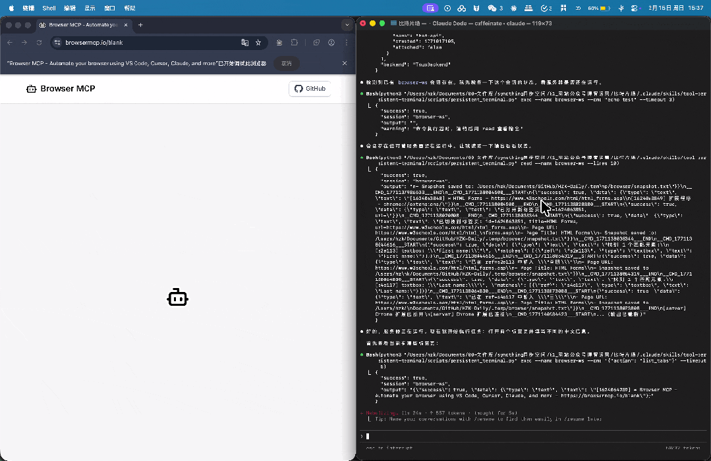
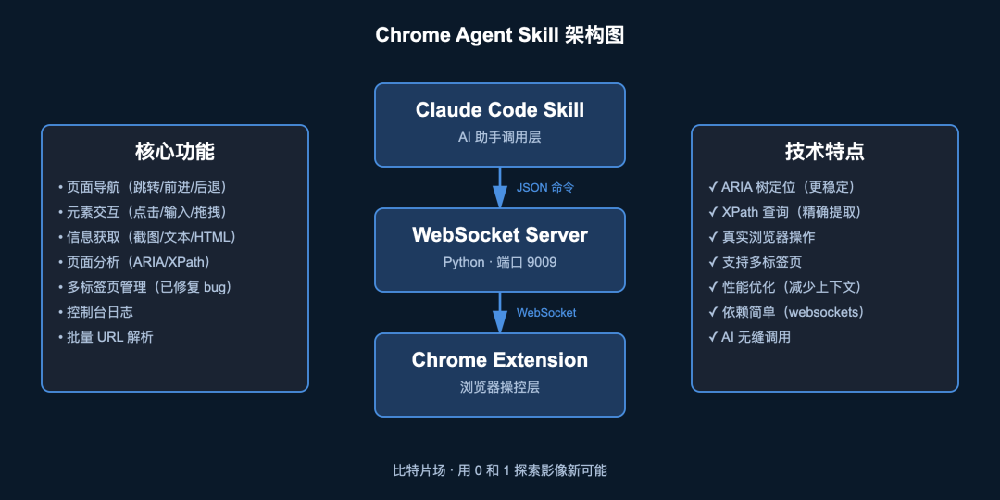
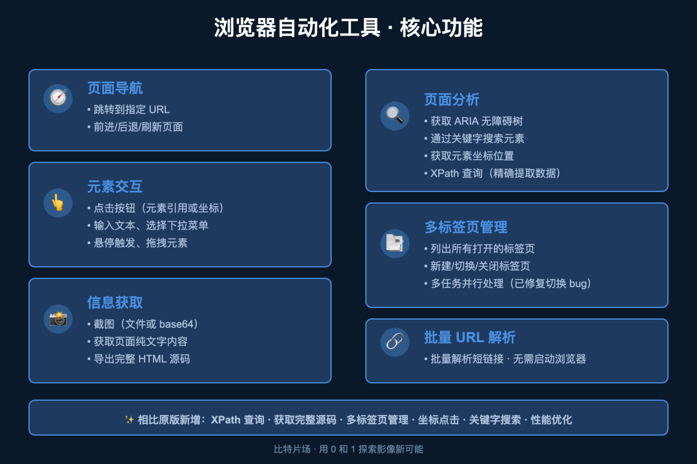
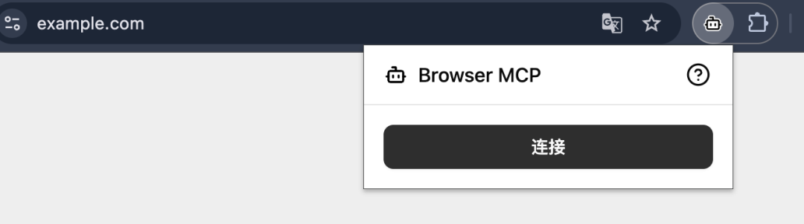
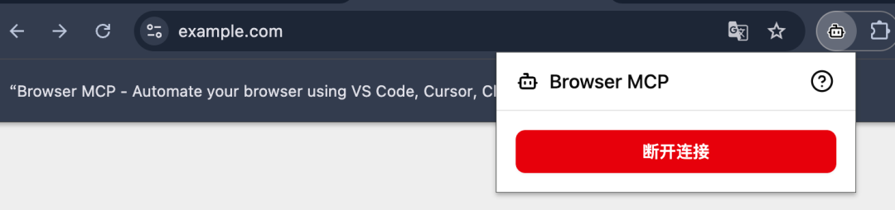

> 📎 来源: [比特片场](https://mp.weixin.qq.com/s?__biz=MzAwMTIwNzE1Mw==&mid=2247485702&idx=1&sn=f128f7506abb12897be7fd28908ffa88&chksm=9b3b73ef923805ca4a52e62ed99e6a41d4859b63f5bca7485715a3971a5166ffc076eceb40c4&mpshare=1&scene=1&srcid=0415jPf8FCZytLB8aokNOvct&sharer_shareinfo=64707912352ffe0733d9eb4be6fd01b3&sharer_shareinfo_first=64707912352ffe0733d9eb4be6fd01b3) | 时间: 2026-04-15 22:20

---


本期分享内容：**【浏览器自动化技能】**【原创】


> 这里是比特片场，用 0 和 1 探索影像新可能。我是坤少。

上一期聊了持久化终端技能，解决了 Claude Code 终端会话不持久的问题。这期要聊的浏览器自动化工具，正是基于此持久化终端才能跑起来的——因为 WebSocket 服务器需要一直运行。

## 现有方案的问题

想让 AI 帮你操作浏览器？现在有几个选择，但都不太理想：

**Claude Code 官方的浏览器功能**

- 需要订阅才能用（付费门槛）
- 使用很麻烦：必须先建立专门的标签页组
- 限制多：只能操作特定标签页组内的页面，不能随意切换

**传统自动化工具（Selenium/Playwright）**

- 需要启动一个独立的浏览器实例
- 无法操控你正在使用的浏览器
- 需要重新登录账号、配置环境
- 调试不方便，看不到实时操作过程

我想要的很简单：**免费、简单、能直接操控我正在用的 Chrome**。



## 解决方案：chrome-agent-skill

后来发现了 Browser MCP 这个项目，它通过 Chrome 插件 + WebSocket 的方式实现了这个想法：

- ✅ 完全免费开源
- ✅ 直接操控当前浏览器
- ✅ 不需要标签页组限制
- ✅ 保持登录状态，不需要重新配置

但它是用 TypeScript/Node.js 写的，跟我的 Python 工作流不太搭。而且功能也不够完善，缺少一些关键能力。

于是我用 Python 重写了它，并大幅增强了功能，改造成了 Claude Code Skill。



## 核心优势

### 对比 Claude Code 官方功能

| 特性 | chrome-agent-skill | Claude Code 官方 |
| --- | --- | --- |
| 费用 | 完全免费 | 需要订阅 |
| 使用方式 | 直接操作任意标签页 | 必须建立标签页组 |
| 操作范围 | 无限制 | 仅限标签页组内 |
| 标签页管理 | 自由切换、新建、关闭 | 受限于标签页组 |

### 对比传统自动化工具

| 特性 | chrome-agent-skill | Selenium/Playwright |
| --- | --- | --- |
| 浏览器实例 | 操控真实浏览器 | 启动独立实例 |
| 登录状态 | 保持现有登录 | 需要重新登录 |
| 实时可见 | 可以看到操作过程 | 后台运行 |
| 调试体验 | 直观方便 | 需要额外配置 |

### 功能增强（相对原版 Browser MCP）

我在原版基础上新增了很多实用功能：

- ✅ **XPath 查询**：用 XPath 表达式精确提取页面数据，比如抓取所有商品价格、提取表格内容
- ✅ **直接获取网页完整源码**：一键导出 HTML，方便分析页面结构
- ✅ **多标签页管理**：列出、新建、切换、关闭标签页，多任务并行处理（已修复切换 bug）
- ✅ **坐标点击**：不依赖元素定位，直接点击指定坐标
- ✅ **关键字搜索元素**：通过文本内容快速定位页面元素
- ✅ **获取页面纯文字**：提取页面文本内容，去除 HTML 标签
- ✅ **性能优化**：默认不输出冗长的快照，减少上下文占用，需要时再保存到文件

## 实际使用场景

### 场景一：资料调研

做项目前需要调研大量资料，手动打开网页、复制粘贴、整理文档，效率很低。

现在可以告诉 AI： - “帮我打开这 10 个网页，提取每个页面的核心观点” - “把这些技术文档的代码示例整理成 Markdown” - “对比这几个竞品的功能列表，做成表格”

AI 会自动打开多个标签页，提取信息，整理成你要的格式。

### 场景二：自动化填表

重复性的表单填写是最浪费时间的工作：报名表、问卷调查、数据录入…

用这个工具可以： - 批量填写相同信息到不同网站 - 自动选择下拉选项、勾选复选框 - 填完自动提交，记录结果

比如报名多个活动，只需要告诉 AI 你的基本信息，它会自动填写所有表单。

### 场景三：网页监控

想知道某个商品什么时候降价？某篇文章有没有更新？

设置一个定时任务： - 每小时检查一次商品价格 - 发现降价立即通知 - 自动截图保存价格变化

或者监控竞品网站更新、关注的博主发文，第一时间获取信息。

### 场景四：批量操作

需要同时处理多个任务时，多标签页管理就派上用场了： - 同时登录多个账号，批量发布内容 - 在不同网站下载文件，自动重命名保存 - 多个页面同时截图，整理成参考素材库

比如我做影像项目时，需要从多个素材网站下载参考图片，用这个工具可以并行处理，效率提升好几倍。

### 场景五：测试验证

开发网站或 Web 应用时，需要测试各种交互逻辑： - 点击按钮是否跳转正确 - 表单提交后是否显示成功提示 - 不同浏览器状态下的表现

让 AI 自动执行测试流程，记录每一步的结果，发现问题立即反馈。

## 核心功能



### 页面导航

- 跳转到指定 URL
- 前进/后退
- 刷新页面

### 元素交互

- 点击按钮（支持元素引用或坐标）
- 输入文本
- 选择下拉菜单
- 悬停触发效果
- 拖拽元素

### 信息获取

- 截图（保存文件或返回 base64）
- 获取页面纯文字内容
- 导出完整 HTML 源码
- 获取浏览器控制台日志

### 页面分析

- 获取 ARIA 无障碍树（结构化的页面快照）
- 通过关键字搜索元素
- 获取元素坐标位置
- **XPath 查询**

  ：用 XPath 表达式精确提取数据（如 `//div[@class="price"]` 提取所有价格）

### 多标签页管理

- 列出所有打开的标签页
- 新建/切换/关闭标签页
- 多任务并行处理

### 批量 URL 解析

- 通过 HTTP 请求批量解析短链接
- 不需要启动浏览器
- 快速获取真实地址

## 技术实现

整个架构分三层：

**1. Chrome 扩展（前端）**

基于 Browser MCP 的扩展修改而来，负责接收命令、操控浏览器、返回结果。扩展通过 WebSocket 与服务器通信。

**2. WebSocket 服务器（中间层）**

用 Python 写的服务器，监听 9009 端口。接收 JSON 格式的命令，转发给 Chrome 扩展，再把结果返回。

**3. Claude Code Skill（调用层）**

封装成 Skill 后，AI 助手可以直接调用。比如发送 `{"action": "navigate", "params": {"url": "https://example.com"}}`，浏览器就会跳转到指定页面。

命令格式很简单，都是 JSON：

```
{"action":"navigate","params":{"url":"https://example.com"}}{"action":"screenshot","params":{"savePath":"./screenshot.png"}}{"action":"click","params":{"ref":"s1e5"}}{"action":"switch_tab","params":{"tabId":123456}}{"action":"get_html","params":{"savePath":"./page.html"}}{"action":"xpath_query","params":{"xpath":"//div[@class='price']"}}
```

## 安装和使用

整个流程很简单：

**1. 克隆仓库**

```
git clone https://github.com/Tonyhzk/chrome-agent-skill.git
```

**2. 安装 Chrome 扩展** - 打开 `chrome://extensions/` - 开启开发者模式 - 加载 `src/browser-chrome-agent/assets/` 中的扩展包

**3. 安装 Python 依赖**

```
pip3 install websockets
```

**4. 启动服务器（需要持久化终端）**

这里就用到了上一期的持久化终端技能。因为 WebSocket 服务器需要一直运行，用普通的 Bash 工具执行完就关了。

创建一个持久终端会话，在里面启动服务器：

```
# 创建持久会话/persistent-terminal create my-browser-server# 在会话中启动服务器/persistent-terminal exec my-browser-server "python3 src/browser-chrome-agent/scripts/server.py --port 9009"
```

服务器会持续运行，随时可以接收命令。

如果你还没看过上一期的持久化终端技能，建议先去了解一下，会让这个工具的使用体验好很多。

**5. 连接扩展**

点击 Chrome 中的 Browser MCP 扩展图标，点击 Connect。

之后就可以在 Claude Code 中直接调用 Skill，或者通过 stdin 发送 JSON 命令。





## 一些技术细节

**关于元素定位**

传统的 Selenium 用 CSS 选择器或 XPath 定位元素，但网页结构一变就失效。这个工具用 ARIA 无障碍树，是浏览器原生提供的语义化结构，更稳定。而且 AI 助手可以直接理解 ARIA 树的层级关系，不需要写复杂的选择器。

**关于截图**

支持两种模式：保存到文件，或返回 base64 编码。后者可以直接传给 AI 做图像分析，不需要中间文件。

**关于多标签页**

每个标签页有独立的 ID，可以在多个页面间切换操作。比如在 A 页面提取信息，切换到 B 页面填写表单，再回到 A 页面继续。

**关于获取源码**

这是我新增的功能，可以直接导出页面完整 HTML。对于需要分析页面结构、提取特定内容的场景特别有用。

**关于坐标点击**

有些元素很难定位，或者页面结构复杂，这时候可以直接用坐标点击。先截图看一下元素位置，然后告诉 AI “点击坐标 (500, 300)”。

**关于 XPath 查询**

这是最近新增的功能，可以用 XPath 表达式精确提取页面数据。比如你想抓取电商网站的所有商品价格，用 `//span[@class="price"]` 就能一次性提取出来，不需要手动复制粘贴。对于结构化数据提取特别有用。

**关于性能优化**

最新版本优化了默认行为：操作不再输出冗长的 ARIA 快照，只返回 URL 和标题，大幅减少上下文占用。需要详细快照时，可以指定保存到文件。这让 AI 助手能处理更多任务，不会因为上下文太长而卡住。

**关于多标签页稳定性**

修复了一个重要 bug：之前切换标签页后，有时候键盘和鼠标事件会发送到错误的标签页。现在切换后会自动确认 debugger 正确附加，保证操作发送到正确的页面。

## 写在最后

这个工具的核心价值，是让 AI 助手能直接操控你的浏览器，而不是启动一个独立的、需要重新配置的浏览器实例。

相比 Claude Code 官方的浏览器功能，它完全免费、使用简单、没有标签页组的限制。相比传统自动化工具，它能操控真实浏览器、保持登录状态、实时可见操作过程。

而且我在原版基础上增强了很多功能：XPath 查询、获取源码、多标签页管理、坐标点击、关键字搜索…这些都是实际使用中非常需要的能力。最近还修复了多标签页切换的 bug，优化了性能，让工具更稳定好用。

用技术解决重复性工作，把时间花在更有价值的事情上。

## 项目地址

GitHub 搜索 **Tonyhzk/chrome-agent-skill** 即可找到，点击原文地址可跳转链接，或在公众号后台回复「浏览器自动化」获取直达链接。

项目完全开源，Apache 2.0 协议，欢迎 Star 和 PR。

如果你也在用 Claude Code，欢迎试试这个技能。有问题随时在后台回复我，或者直接在 GitHub 上提 Issue。

---

如果觉得有用，欢迎关注公众号「比特片场」，有问题可以随时在后台回复我。

---

###### **影视制作 × AIGC | 用 0 和 1 探索影像新可能**
