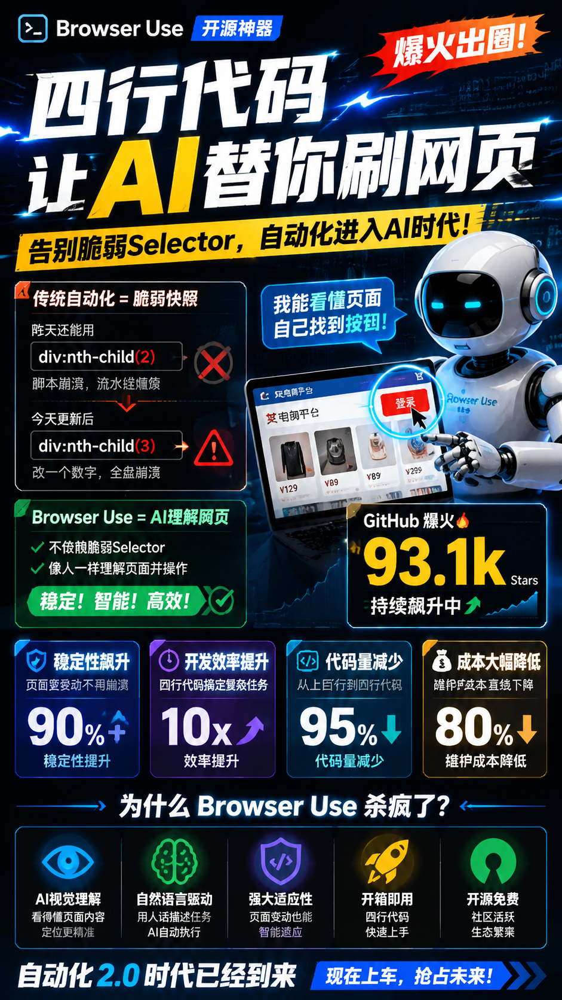

> 📎 来源: [无梦想不青春AGI](https://mp.weixin.qq.com/s?__biz=MjM5NjI1NTUxMw==&mid=2454634612&idx=1&sn=e86321811dd9960630db4e0ae18ac008&chksm=b0c85e691dfb3faf71522213cfd946ebc9d06be4c17dd8499712e677905be5340390e81b02ac&mpshare=1&scene=1&srcid=0511FmCSDrn3rQwlvyNbwIgO&sharer_shareinfo=8bb4415eb24c6f6f7b6703de106e5f13&sharer_shareinfo_first=8bb4415eb24c6f6f7b6703de106e5f13) | 时间: 2026-05-11 02:54

---

# 四行代码让 AI 替你刷网页，Browser Use 凭啥杀疯了？



故事是这样的。

凌晨两点，我对着屏幕上那串 selector 发呆。

```
#app > div:nth-child(2) > div > div > div:nth-child(1) > div > div:nth-child(3) > button:nth-child(2)
```

这是某电商平台登录按钮的完整路径。它昨天还能跑通，今天平台更新了一个组件，整个脚本就崩了。我重新打开开发者工具，发现那个 

```
div:nth-child(2)
```

 变成了 

```
div:nth-child(3)
```

。就改了一个数字，一条自动化流水线瘫痪了。

这种崩溃，做网页自动化的朋友应该都懂。你写的不是代码，是网页结构的「快照」。网页一变，你的代码就是废纸。

所以当我第一次跑通 Browser Use 的时候，那种感觉太爽了。

我不是说「这个工具还不错」的那种爽。是那种「为什么没有人早点想到这个」的爽。

Browser Use 是一个开源项目，GitHub 上现在 93.1k stars，10.5k forks，YC W25 出身，MIT 协议。它的核心就干一件事，让 AI 像人一样看网页、点按钮、填表单、做任务。听起来简单对吧？但这哥们最近搞了个大动作，直接把 Playwright 从核心里踢出去了。

这事值得好好聊聊。

先说说它到底有多离谱。官方给的最小示例，四行 Python 代码，一个能自己搜网页、自己点链接、自己截图的 Agent 就跑起来了。在 WebVoyager 这个包含 586 个真实网页任务的基准测试里，它的成功率是 89.1%。这是目前开源浏览器 Agent 里公开成绩最高的那个。

### 官方给出的小示例：

```
from browser_use import Agent, Browser, ChatBrowserUseagent = Agent(    task="去 GitHub 搜 browser-use 并截图首页",    llm=ChatBrowserUse(),    browser=Browser(),)agent.run()
```

WebVoyager 不是那种「打开百度搜一下标题」的玩具测试。它测的是 Amazon 下单流程、GitHub 搜 PR、Google Flights 查机票这种带状态、带多步骤、带表单的真实任务。89.1% 的意思是，100 个真实任务里能跑通 89 个。这个数字放在一年前，整个行业还在 60% 左右挣扎。

更离谱的是 2026 年 3 月发布的 0.12.3 版本。官方 release notes 写得明明白白，基于 CDP 持久后台 daemon，不再走 Playwright。

很多人听到这里可能会问，Playwright 不是挺好的吗？微软出品，跨浏览器，社区成熟，文档齐全。为什么要换？

坦率的讲，这个问题问到根子上了。Playwright 确实好，但它的设计假设是「你有一段脚本，要跑一遍」。每次调用要起 context、跑完、关闭、再重启。这对一个常驻 Agent 来说，额外开销太重了。

你想象一下这个场景。你的 Agent 今天要处理 100 个连续任务，每个任务 10 步操作。用 Playwright 的话，每一步都要序列化页面状态、传给 LLM、拿到动作指令、反序列化、执行、再序列化新状态。而且 Playwright 是一个独立进程，和浏览器之间还有 IPC 开销。这一套走下来，每一步几百毫秒是常态。

CDP 是什么？Chrome DevTools Protocol，Chrome 开发者工具的底层通信协议。你按 F12 打开的那个面板，Elements、Console、Network，本质上都是通过 CDP 跟浏览器对话的。

Browser Use 现在直接对 Chrome 发指令，省掉了 Playwright 这层翻译。这就像你以前要跟外国人交流，必须带一个翻译。现在你自己会外语了，效率当然高得多。

具体数字是，命令延迟从原来的 100 多毫秒降到了 50 毫秒左右，快了两倍。token 用量直接减半。

token 减半这个事，值得拆开说说。

Playwright 路径下，每一步 Agent 都要把当前页面的 DOM、actions API 文档、错误回执一股脑塞给 LLM。一个复杂电商页面，DOM 可能有几万行，全部塞过去就是好几千 token。CDP daemon 模式下，浏览器状态由 CDP 直接维护，LLM 只需要看到页面摘要和动作结果，上下文可以做更激进的裁剪。

我给你算一笔具体的账。Playwright 老方案下一步可能要 10000 多个 token，CDP 新方案下 2000 多个 token 就能搞定。差了将近 5 倍。官方说的 50% 是平均水平，但也足够吓人了。假设你的 Agent 每天跑 1000 步，每步省 1000 tokens，用 GPT-4o 就是每天省 10 美元，一个月 300 美元。

但这还不是最狠的。最狠的是视觉识别。

做过自动化的都知道 CSS selector 有多脆弱。React 组件每次构建 className 都变，Shadow DOM 根本选不中，跨域 iframe 要 switch\_to.frame，反爬虫网站故意把 selector 写得乱七八糟。你维护 selector 的时间，可能比写自动化逻辑的时间还长。

Browser Use 0.12 版本的真正王炸，是它适配了 Gemini 3 的多模态视觉能力。不再依赖 CSS selector，而是直接在截图上识别「这是用户名输入框」「这是上传按钮」。只要肉眼能看见，模型就能定位。

Stripe 的支付表单、Auth0 的登录组件、Salesforce 的嵌入式 widget，过去都需要单独维护 selector 兜底逻辑。视觉路径下，这部分代码可以直接删掉。

一个朋友跟我讲了他公司的真实案例。他们做金融开户流程自动化，之前用 Playwright 写了 800 行代码，维护了 30 多个 selector，每周因为 UI 更新要改一次，成功率只有 60%，遇到跨域 iframe 就崩。换到 Browser Use 的视觉模式后，代码从 800 行降到了 50 行，不需要维护任何 selector，成功率提升到 95%，跨域 iframe 也能正常处理。

这种变化不是「更好用一点」的区别，是「能做」和「不能做」的区别。

当然，天下没有免费的午餐。视觉识别的代价是延迟和 token 成本。每一步都要截图、上传、推理，一次完整的表单填写从 5 秒变到 15 到 20 秒是常态。所以 0.12.6 里专门加了一个 heavy page DOM cap，页面特别大的时候自动切回 DOM 模式，在速度和准确率之间找平衡。

简单任务、对速度要求高的，用 DOM 模式。复杂表单、跨域 iframe、selector 难维护的，用视觉模式。这个设计思路很聪明，不是非此即彼，是让系统在两种模式之间动态切换。

说到这，可能有人会问，云浏览器是怎么回事？

Browser Use 提供了云浏览器服务，文档里直接写了，Using this settings can bypass any captcha protection on any website。用这些设置可以绕过任何网站的验证码保护。

你想想看这意味着什么。以前做自动化，验证码是噩梦。你要么买第三方识别服务，一次几分钱积少成多。要么自己训练识别模型，费时费力。要么手动处理，打断整个自动化流程。现在云浏览器帮你把这事干了，还自带全球代理，美国、欧洲、日本、澳大利亚都能选。

某跨境电商公司需要监控 10 个国家的竞品价格，每个国家的网站有不同的验证码，还要用当地 IP 访问。用 Browser Use 云浏览器后，一个 Agent 脚本配不同的代理国家码就搞定了。这事放在两年前，可能需要一个小团队才能维护。

但Browser Use最让我震撼的，不是这些具体的功能。是它背后那个更大的趋势。

我们过去做自动化，本质上是让机器「背」下网页的结构。selector 是什么？是网页结构的坐标。你的代码不是在看网页，是在按图索骥。网页变一点，图就废了，你的代码也就废了。

Browser Use 做的事情，是让机器像人一样「看」网页。不是背坐标，是真的用视觉去理解「这个框框是搜索框」「那个按钮是提交」。这是从「结构驱动」到「感知驱动」的范式转移。

聊到这，我突然想起一个类比。自动驾驶刚出来的时候，很多方案是在路上埋传感器、画磁导线，让车跟着磁信号走。后来大家发现这条路走不通，因为现实世界太复杂了，你永远埋不完所有传感器。真正的解法是让车自己去「看」路，用摄像头、激光雷达去理解环境。

浏览器自动化也是一样。CSS selector 就是那条磁导线，它假设网页结构是固定的、可预测的。但真实世界的网页每天都在变。视觉识别不是优化，是换了一条路。它不再依赖网页背后的结构假设，而是直接去感知网页呈现出来的样子。

这也是为什么我说 Browser Use 不只是「一个更好用的 Playwright 封装」。它是一个新范式的开始。

再往回看一点，你会发现这个趋势早有预兆。OpenAI 的 Operator、Google 的 Computer Use、Anthropic 的 Computer Use，所有大厂都在做同一件事，让 AI 能够直接操作计算机界面。Browser Use 是开源社区里走得最快、最扎实的那个。93k stars 不是运气，是很多人在这个项目上看到了同样的未来。

我有时候觉得，AI 时代有个特别有意思的规律。每过一段时间，就会有一个工具出来，把上一代的「最佳实践」全部推翻。Prompt Engineering 刚火的时候，大家拼命研究怎么写 prompt。后来有了思维链、有了工具调用，写 prompt 的重要性下降了。RAG 刚出来的时候，大家拼命优化向量检索。后来有了长上下文，很多事情直接塞全文就解决了。

Browser Use 做的事也一样。它不是在 Playwright 的基础上做加法，而是直接告诉你，别背 selector 了，让 AI 自己看。

可能有些做传统自动化的朋友会不高兴。我花了三年时间学 Playwright、学 XPath、学各种 selector 技巧，你现在跟我说这些都没用了？

我非常理解这种感觉。不是说这些技能完全没价值，而是说底层的游戏规则变了。以前你值钱是因为你能写出稳定的 selector，现在值钱的可能是你能描述清楚「让 AI 去干什么」，然后让它自己想办法完成。

说到这个，我又想起一个细节。Browser Use 支持很多大模型，GPT-4o、Claude、Gemini，还有它们自己训的 bu-30b-a3b-preview。这是一个 30B 的 MoE 模型，专门针对浏览器任务做了强化学习。换模型就是换一行参数，不用重写 prompt。

有人在硅基流动上测了各种国产模型，Qwen2.5-32B 的效果还能凑合用，7B 的直接就崩了。DeepSeek-R1 推理太慢，像个知识渊博但动作迟缓的老教授，不适合这种需要快速反馈的场景。GPT-4o 效果最好但最贵，几天就能把 5 美元额度烧完。

这些测试反馈特别真实。不是那种「我们选用了最先进的模型」的官话，是「这个太慢了」「那个太笨了」「这个钱烧不起」的大实话。这种真实感，恰恰是判断一个技术是否到了可用阶段的关键信号。大家已经在讨论「哪个模型性价比最高」了，说明工具本身已经过关，进入了选配的成熟阶段。

还有一个有意思的事。Browser Use 的代码是开源的，MIT 协议，你可以随便改。有团队直接二开加了鼠标悬停方法、改了 GIF 保存逻辑、处理了中文乱码。这种「拿过来就能改」的开放度，也是它能快速获得社区支持的原因之一。

YC W25 出身这个背景也值得提一嘴。YC 的筛选标准里有一条，解决创始人自己遇到的问题。Browser Use 的创始人 Magmueller，估计自己也被网页自动化折磨过。最痛的需求，往往催生最好的产品。

回到那个凌晨两点的我。如果当时有 Browser Use，我可能不需要对着 selector 发呆。我只需要写一句，「帮我把这 50 个竞品平台的价格抓下来，整理成表格」。剩下的，AI 自己想办法。

这不是科幻，是现在就能跑通的代码。

当然，Browser Use 也不是万能的。视觉模式慢、复杂任务还是可能出错、有些极端场景成功率不够高。但这些是「已经能跑但需要优化」的问题，不是「理论上可行实际上做不到」的问题。两者的区别很大。

大时代啊，朋友们。浏览器是互联网的入口，而 AI 正在学会自己推开这扇门。

---

以上就是今天想聊的。如果你也在做网页自动化、智能客服、数据抓取之类的事情，强烈建议去试试这个项目。GitHub 搜 browser-use/browser-use 就能找到。

最后想问你一个问题。你有没有被 CSS selector 折磨过的经历？或者你觉得 AI 接管浏览器这件事，最大的机会在哪里？欢迎在评论区聊聊，我每一条都会看。


既然看到这里了，如果觉得不错，随手点个赞、在看、转发三连吧，如果想第一时间收到推送，也可以给我个星标⭐～

谢谢你看我的文章，我们，下次再见。

> / 作者：mojianpo
> / 投稿或爆料，请联系邮箱：406223802@qq.com
