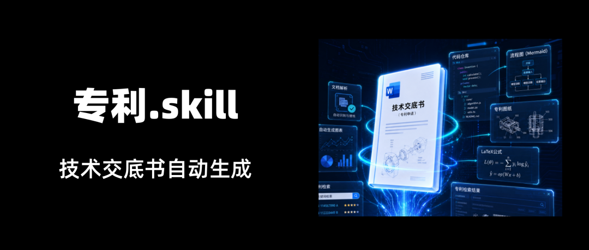
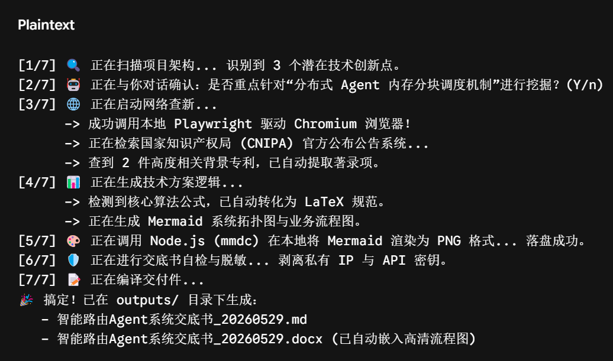
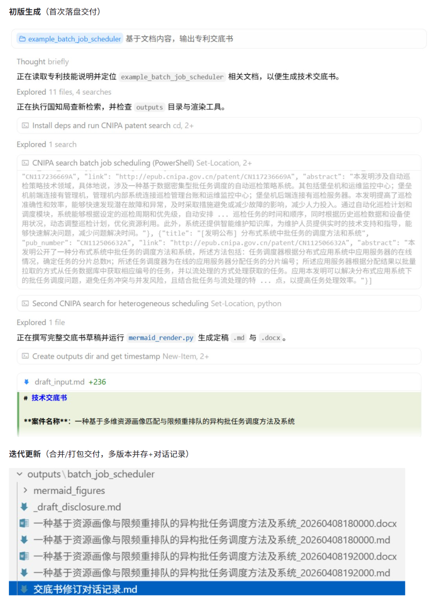
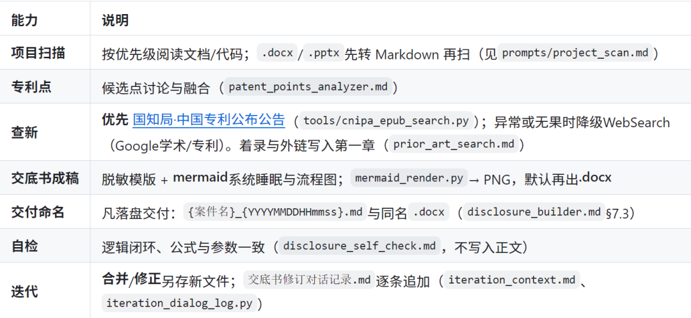

> 📎 来源: [开源AI项目落地](https://mp.weixin.qq.com/s?__biz=MzkyMTYwNjgwNA==&mid=2247495705&idx=1&sn=a3dc93b56fbae4c92c026bf6c195c5ad&chksm=c0a3153a033a371888d3e07adce36715deea6ee770cb51e3b2b0e4bc87aa8909333f695844fe&mpshare=1&scene=1&srcid=0530GFFHLoHqezob0dF0a92n&sharer_shareinfo=e2719760651add9368bd2ab8aead3342&sharer_shareinfo_first=e2719760651add9368bd2ab8aead3342) | 时间: 2026-05-30 01:55

---



前几天我跟大家分享过一个软著材料自动生成Skill。

软著流程里的设计说明书这种苦力活，AI 已经可以做到一键自动化了。

软著搞定了，那含金量更高、写起来更让人掉头发的专利呢？

专利可不像软著，真的太太太麻烦。

尤其是那个技术交底书，即使是找代办，可能也得自己去写。你要用极其晦涩、客观的法言法语去写，你用了什么技术、解决了什么痛点、架构图怎么画、流程图怎么走。

这不，又有人才出手了，既然软著能自动化，专利交底书为什么不行？

今天给大家介绍一个专利.skill，解决这个问题！

专利代办未来也会变成白菜价了。

**项目简介**

patent-disclosure-skill是一个专利技术交底书自动生成技能包。

把研发配合写专利的时间，从3天缩短到30分钟。

它能直接扫描你的本地代码仓库或设计文档，通过一套高度工程化的Python脚本和工业级Prompt矩阵，自动挖掘专利点，并最终吐出一份符合国知局标准、带高清图表、代办拿过去就能直接改的word版技术交底书。

**DEMO**

直接把链接丢Agent里运行就行了。





**功能特点**



- **原材料自动清洗：**研发手里的资料可能是一份随便写的.docx 或者汇报用的.pptx。这个Skill内置了 文件转换脚本，Agent会先在本地把它们安全地打散成 Markdown纯文本再喂给AI，从根本上避免了大模型直接读取二进制Office文件造成的解析混乱。
- **硬核查新：**写交底书必须要写背景技术和现有缺陷。利用Playwright，直接去爬国知局官方的专利公布公告网站。如果被封锁或查不到，还能自动降级去检索Google Patents。用官方的数据做查新对比，靠谱。
- **图示自动化渲染：**专利必须有图，这个Skill让大模型负责输出Mermaid代码，然后自动调用本地的Node.js渲染引擎把它编译成真实的PNG 图片，直接物理嵌入到最终的Word文档里。
- **LaTeX公式、一致性闭环自检：**扫描 LaTeX 公式在Word里的兼容性，死磕逻辑一致性，检查前面提到的技术参数跟后面实施例里的是否对得上，严防死守逻辑漏洞。
- **多轮修订和审计追踪：**如果你对初稿不满意，对 AI 说把第三章的公式改一下，它不会搞乱原文件。它会做增量合并，并在本地维护一个交底书修订对话记录，追溯每一轮修改的来龙去脉。

**项目链接**

```
https://github.com/handsomestWei/patent-disclosure-skill
```

**扫码加入AI交流群**

**获得更多技术支持和交流**

**（请注明自己的职业）**


关注「**开源AI项目落地**」公众号

与AI时代更靠近一点
