> 📎 来源: [Panda不是猫](https://mp.weixin.qq.com/s?__biz=MzkzMDM3OTkxOQ==&mid=2247509989&idx=1&sn=f1bc646ebc0c69b2e1821fe81acacf15&chksm=c37b570aabe7aacbb00ad22a0de729cada9f41327286a51c9e3a785660b2957939d20a592939&mpshare=1&scene=1&srcid=0529cc92yiahy8aZvoTFRMDR&sharer_shareinfo=6bb2468146af30cc844d48a7a0638fe7&sharer_shareinfo_first=6bb2468146af30cc844d48a7a0638fe7) | 时间: 2026-05-29 12:38

---

前两天熊猫整理了一下本地的所有文档，目前为止本地的所有文档字数已经达到了接近300万字，同时文档数量也来到了接近1000篇，如何优雅有序的管理这些文档，在这种情况下就非常重要了，毕竟庞大的数据两下想要靠人手动去整理是不太现实了。

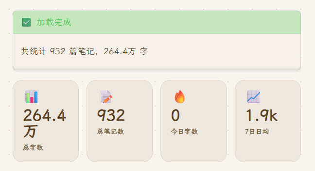

文档

为了更方便处理庞大的文档素材，于是我借助各种Obsidian插件以及AI写了一个知识库的模版，可以理解为给现在的Obsidian添加一个自动化的首页仪表盘，用来监控当前整个文库下的所有笔记信息，再通过解析去匹配内容。

# 效果展示

首先给大家看看效果，当打开仪表盘时模版会自动进行所有笔记的批量扫描，为了避免UI的加载阻塞这里熊猫设置了30篇的扫描速度，如果你的文档非常之多，觉得这个速度太慢了，也可以调整。

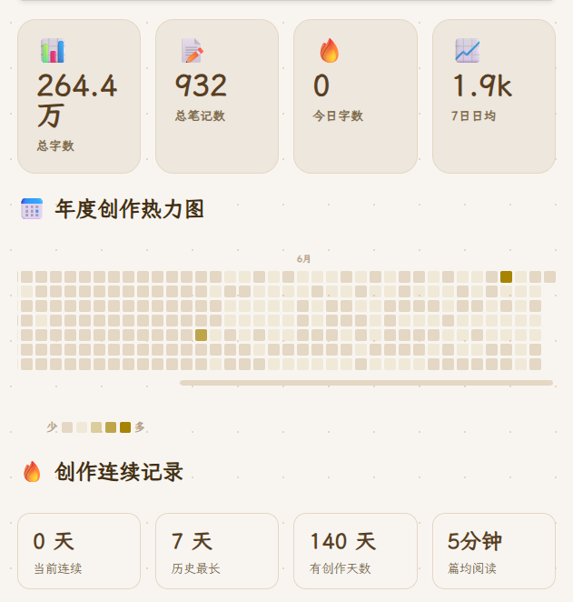

仪表盘区域

当扫描完成之后下方就会显示很多个模块组件，其中总字数、文档统计、今日字数以及7日平均会作为收个展示板块让你能了解一个总览，再往下则是年度的热力图和连续创作记录，这些信息都是动态的，当鼠标悬停在热力图方块上也会显示当天的字数。

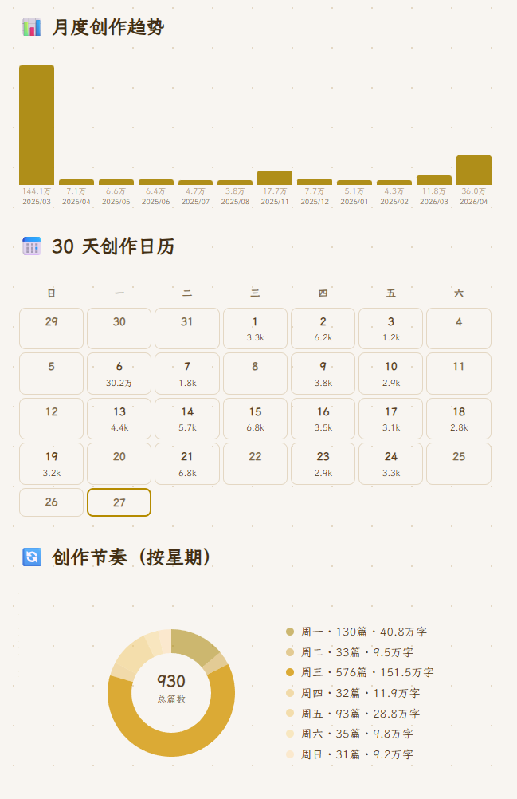

创作趋势

为了更好的了解自己的创作趋势和习惯，我设计了阅读创作趋势榜，会基于创作时间统计近一个月每天的创作字数情况。同时也设计了更直观的日历图以及周期更短的周数图。

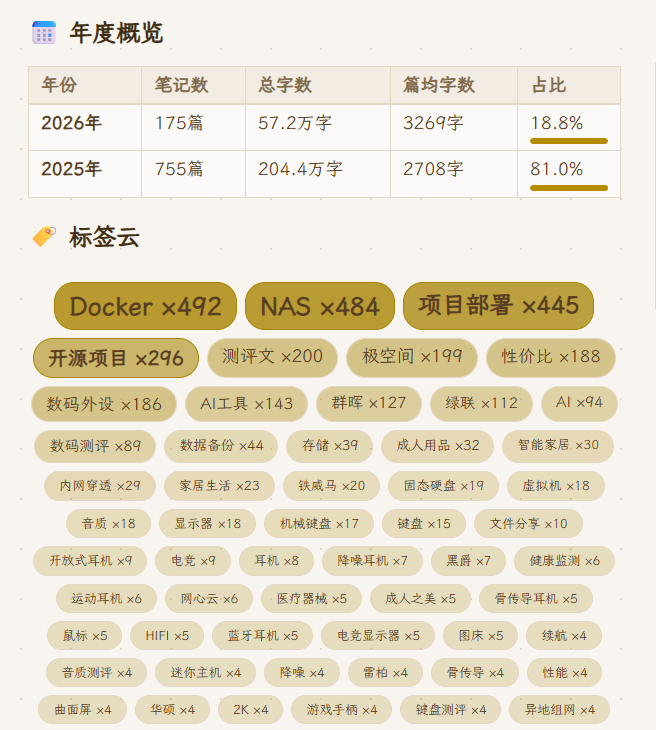

统计

年度概览这里能看到每年的创作笔记数量、总字数以及篇均字数，也能基于当前看到占比，再往下就是标签云了，看得出来关于NAS和Docker方面的还是非常多。

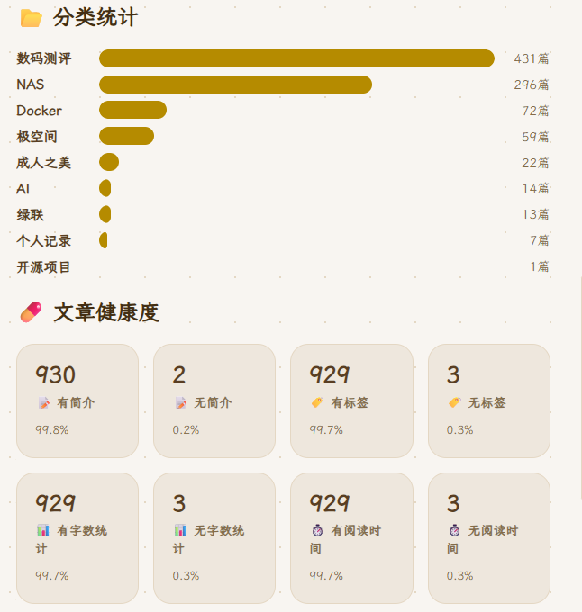

统计和检查

因为所有的统计信息来源都是基于Obsidian的笔记属性，所以这里我就设计了一个文章健康度检查的板块，他能检测到当前笔记库有多少缺乏属性的笔记，例如图中现在就是除了现在这篇正在编辑、数据库文档以及仪表盘本身，其他笔记都有了自己的属性。

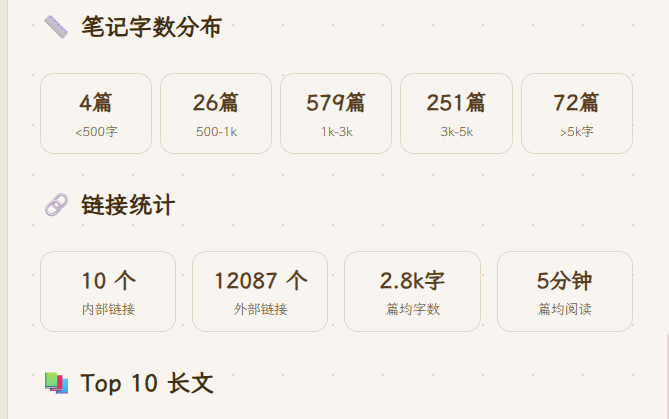

细分信息

再往下就是一些细化的信息了，例如统计字数区间文档数量、文档中的链接数、篇均字数、篇均阅读时长等等，同时下方的TOP字数长文、最近更新以及最近创建也能直接点击文档跳转方便调整。

# 如何使用

这套Obsidian模版目前熊猫已经开源放在了github上，搜索Panda-995 obsidian-dashboard就能看到了。

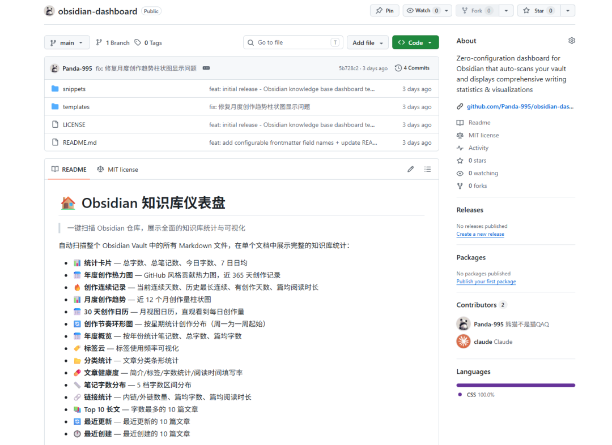

开源地址

要想使用其实也很简单，我们需要准备两个必须得插件，一个是Dataview，下载插件之后需要到插件设置中去开启 Enable JavaScript Queries。

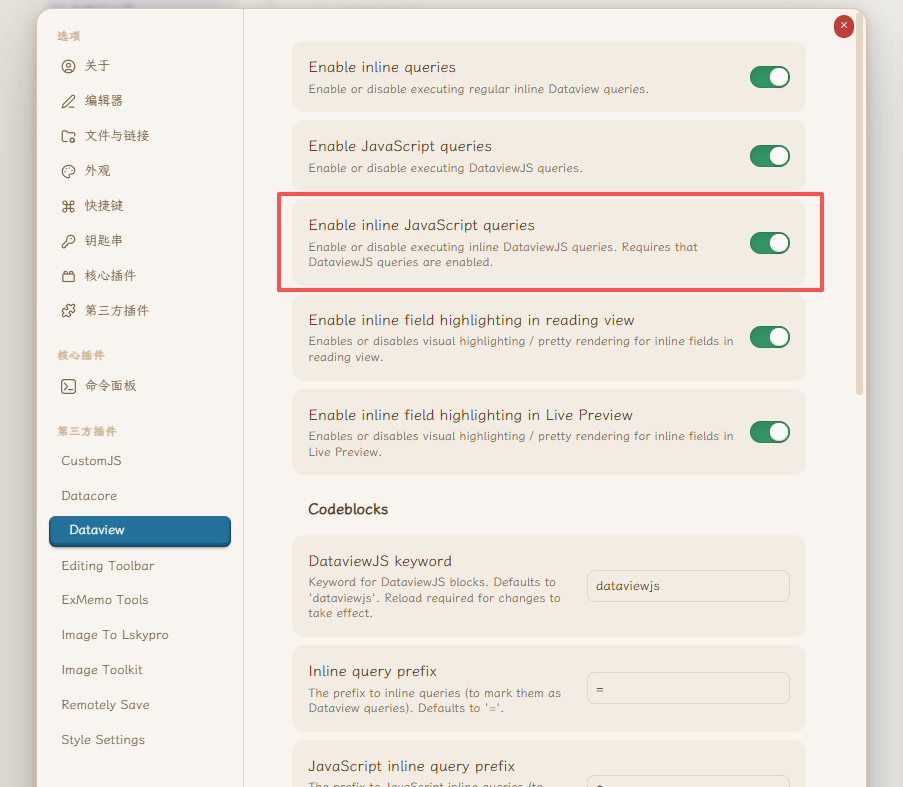

插件准备

同时我们还需要安装ExMemo Tools插件，主要是为了让所有笔记通过AI自动提取笔记属性，这样才方便我们获取信息。

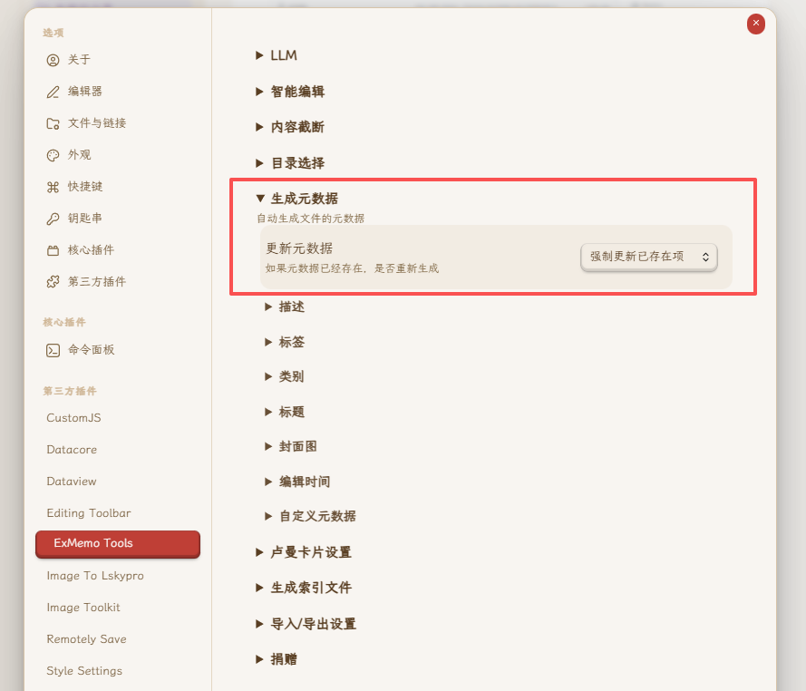

笔记属性获取

插件都准备好之后下载项目中的css样式，随后复制到Obsidian Vault目录下的.obsidian/snippets/文件夹，最后在设置-外观中打开刚刚的css样式。

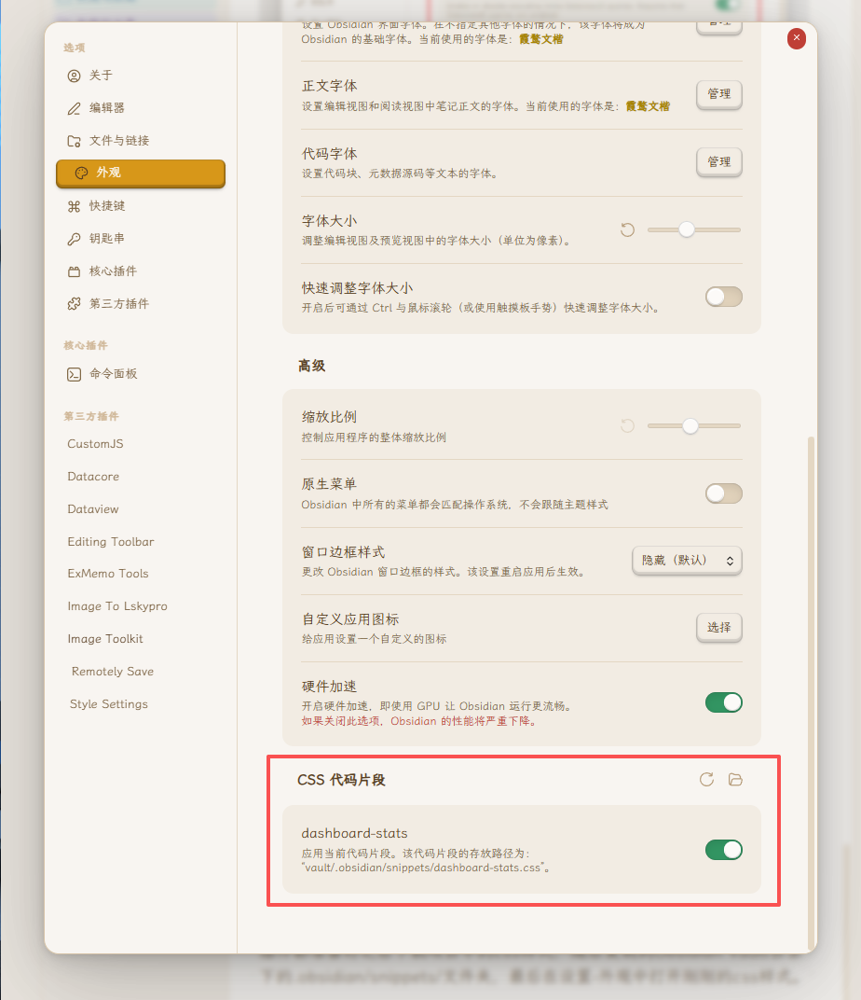

样式

接这我们创建新笔记，笔记名称就叫仪表盘，将项目中的模版复制过去，这时候你打开笔记之后DataviewJS代码块将自动执行，扫描全库并展示统计数据。

模版提供了可修改项， 毕竟我们的属性名称可能存在不一样，所以你需要根据自己本地知识库的特性来编辑，这里就要说说ExMemo Tools插件了。

在插件中我们可以配置LLM大模型，同时元数据需要生成那些都可以自行编辑，例如熊猫这里的笔记属性生成是这样的。

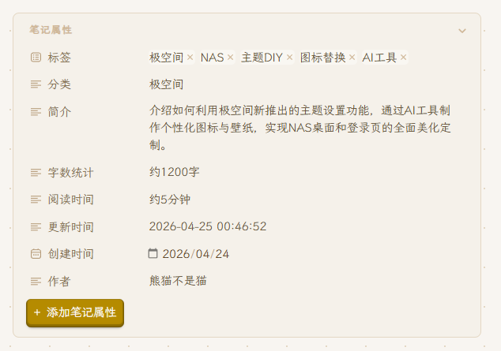

笔记属性

支持目录下的批量属性生成以及单笔记生成，当你批量生成元数据之后仪表盘就会获得你所有笔记的元数据，随后根据这些来可视化形成仪表盘的样式。

# 写在最后

模版目前阶段就这么些功能，如果有什么需求或者建议欢迎去项目地址提点意见。

熊猫个人是非常喜欢用Obsidian的，同时也非常提倡大家用Markdown语法，不过Obsidian因为其复杂的上手门槛，导致很多人劝退，不过该说不说，用习惯了以及形成了自己的知识库体系之后，它是真的香！

以上便是本期的全部内容了，如果你觉得还算有趣或者对你有所帮助，不妨**点赞、收藏**，最后也希望能得到你的**关注**，咱们下期见！

尾图
