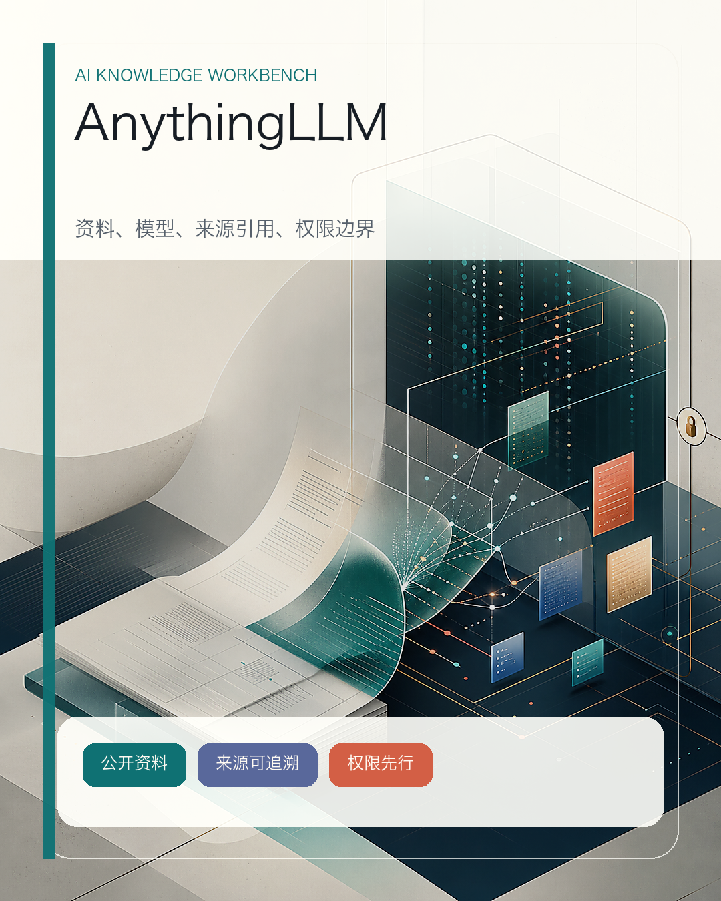
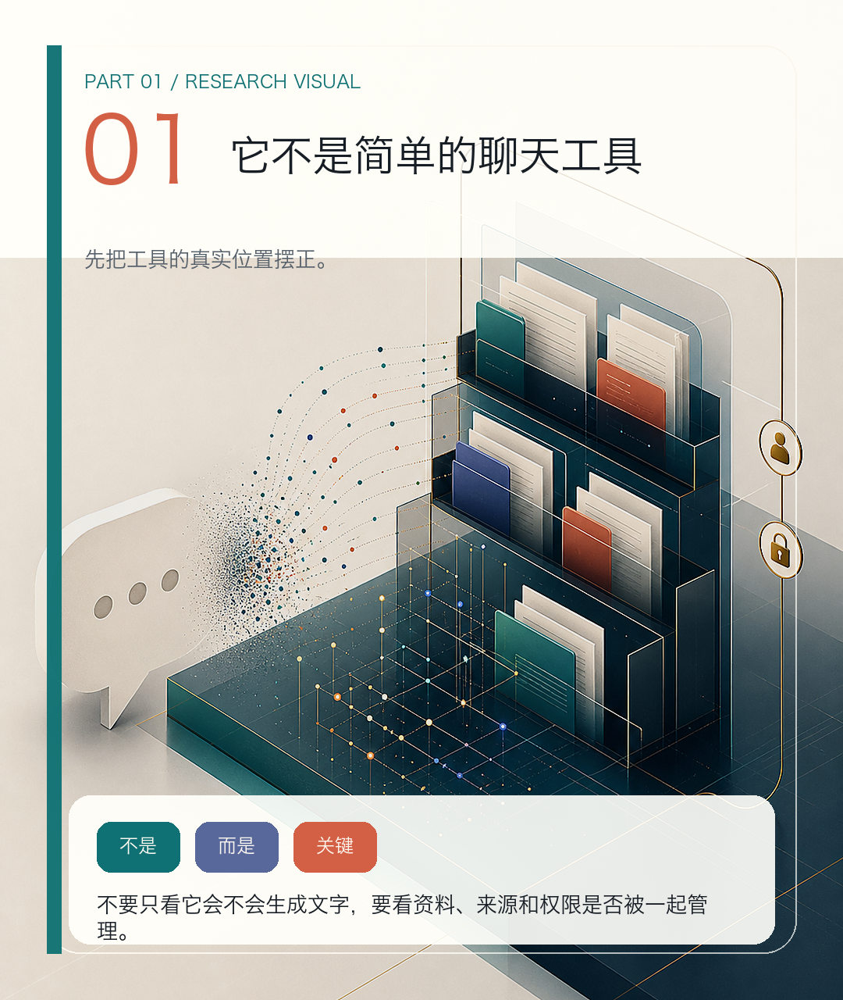
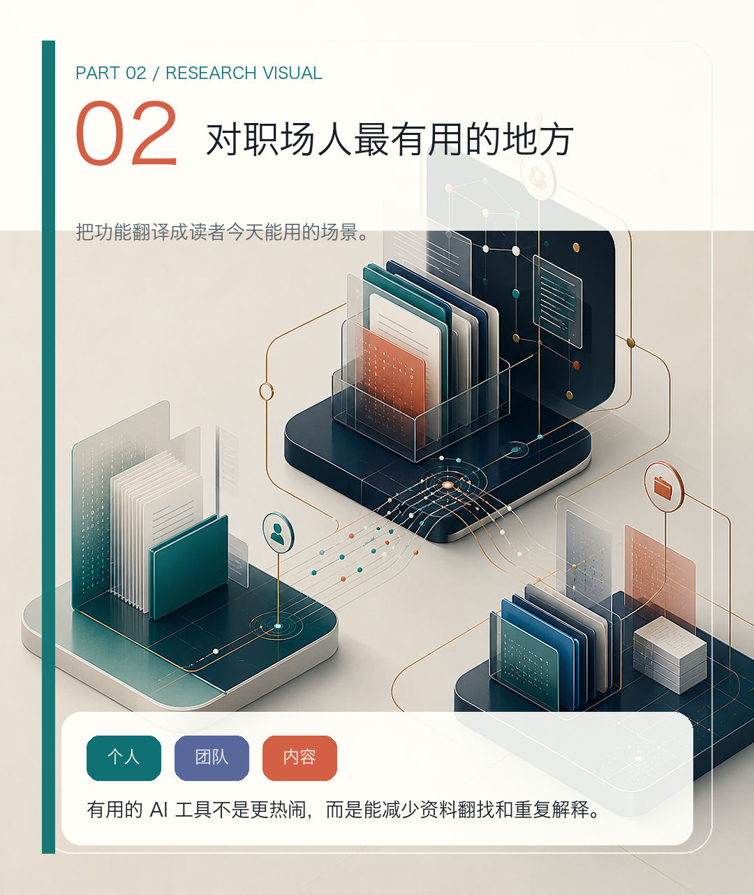
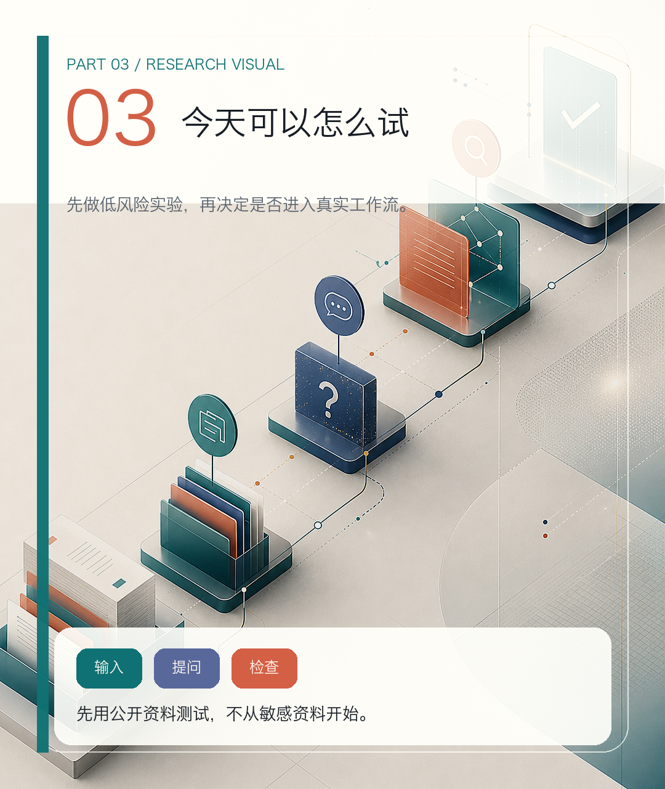
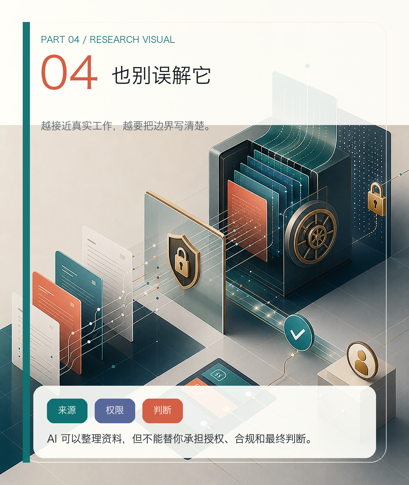

> 📎 来源: [AI开源学习基地](https://mp.weixin.qq.com/s?__biz=MzI5NTc3MjQ2MA==&mid=2247483839&idx=1&sn=7fb5b4551dca1fd07e61880be5e97933&chksm=edbb5283e5a2069c9b7ff41eb274360892913d3a0942740a310056f250bf2c48b8f91944d855&mpshare=1&scene=1&srcid=0523ouxGFogkjBrScrsdewdh&sharer_shareinfo=e360bed00a82ba20b9e9d8120f180d52&sharer_shareinfo_first=e360bed00a82ba20b9e9d8120f180d52) | 时间: 2026-05-23 23:47

---

AI 普惠日更 / Research Note

# 想让 AI 读懂你的资料？这个开源工具值得看

AnythingLLM 真正值得看的地方，不是它又提供了一个 AI 聊天界面，而是它把“资料进入 AI、模型处理资料、结果回到来源、团队控制权限”这几件事放进了同一个工作台。

很多人第一次使用 AI，都会从聊天开始。

问一个问题，让它回答。

写一封邮件，让它润色。

丢一段材料，让它总结。

这些用法当然有价值，但一旦进入真实工作，很快会遇到一个更基础的问题：

**AI 到底要读什么资料？**

如果每次都靠复制粘贴，AI 只能处理你眼前这点内容。

如果资料散在 PDF、Word、网页、会议记录和团队文档里，AI 就很难形成稳定的上下文。

如果回答不能回到来源，看起来再流畅，也很难直接用于严肃工作。

所以，职场人使用 AI 的下一步，不只是学提示词，而是学会搭一个可靠的资料入口。

今天这个 GitHub 项目，解决的就是这个问题。

它叫 AnythingLLM。

GitHub 地址：

https://github.com/Mintplex-Labs/anything-llm

截至 2026 年 5 月 23 日，它在 GitHub 上约有 6 万 Star，采用 MIT License。项目自己的定位是一个 all-in-one AI application：可以连接本地或云端模型、导入文档；README/官网提到的能力还包括 Agent、向量数据库，以及在团队版、自部署或托管等场景中的多用户与权限管理。具体可用范围要以选择的部署形态和版本为准。

这句话听起来有点技术。

换成职场语言，它更像是：

> 一个把资料、模型、问答、Agent 和团队权限放在一起的 AI 工作台。



主图：把资料、模型、来源引用和权限边界放进同一个可检查工作台。

## 它不是简单的聊天工具



章节图：这一节先把工具定位说清楚，避免把它误解成普通聊天框。

如果只是聊天，我们已经有很多选择。

常见聊天工具都可以完成大量文本任务。

但工作里的知识问答不是“凭空聊天”。

你真正需要的是：

- 让 AI 读取指定资料。

- 让它基于资料回答，而不是自由发挥。

- 让它尽量给出来源。

- 让团队多人使用时有权限边界。

- 让不同模型服务于不同任务。

AnythingLLM 的价值，正是在这些中间层。

它支持把文档导入 workspace，也支持连接多种模型和向量数据库。README 里提到的能力包括文档问答、source citations、multi-user、agent、memories、scheduled tasks、MCP compatibility、no-code Agent builder 等；其中多人协作和权限能力要结合具体部署形态与版本理解。

这些功能堆在一起，真正指向的是一个趋势：

AI 工具正在从“一个聊天框”，变成“围绕资料工作的系统”。

## 对职场人最有用的地方



章节图：这一节把功能翻译成真实工作里的三个使用场景。

我觉得它最适合三个场景。

第一，个人资料库问答。

比如你有一堆行业报告、课程资料、项目复盘、竞品文档。过去你只能靠文件夹和搜索。现在可以把它们放进一个 workspace，让 AI 基于这些资料回答问题。

第二，团队知识库。

很多团队并不是没有资料，而是资料太分散。新人不知道去哪找，老人靠记忆回答，重复问题不断出现。AnythingLLM 这类工具的价值，是把资料变成一个可以追问的入口。

第三，内容生产。

如果你做公众号、研究、咨询或产品分析，它可以作为素材池的一部分。你可以把公开资料、历史文章、产品文档导入，然后让 AI 帮你整理主题、提取结构、生成问题清单。

但这里有一个关键前提：

不要把它当成“自动生成结论”的机器。

更稳妥的做法是，把它当成资料整理和初步问答工具。真正的判断，还是要人来做。

## 今天可以怎么试



章节图：这一节给出低风险试用路径，先用公开资料验证效果。

如果你想测试 AnythingLLM，不建议一开始就导入公司内部资料。

可以先用公开材料做一个低风险实验。

比如：

1. 找 5 篇公开行业文章。
2. 找 2 份公开产品文档。
3. 建一个 workspace。
4. 上传资料。
5. 问它三个问题：

```
这批资料主要讨论了哪三个问题？ 哪些结论有来源支持？ 哪些地方需要进一步核验？
```

然后重点看两件事：

第一，它是否能把回答回到资料来源。

第二，它是否会把资料没有说的东西写得很确定。

如果它能帮你减少资料翻找时间，同时让来源保持可追溯，这个工具就有实际价值。

如果它只是生成一段看起来顺的总结，但来源不清楚，那就只能作为初稿辅助，不能作为决策依据。

## 也别误解它



章节图：这一节把来源、权限、敏感资料和人工判断边界单独拎出来。

AnythingLLM 不是万能知识库。

导入资料，不等于 AI 就真正理解了你的业务。

支持 Agent，不等于可以自动处理所有工作。

支持本地和多用户，也不等于天然满足公司合规要求。

尤其涉及客户资料、合同、财务、人事、源码、未公开战略时，必须先看公司政策和部署方式。

对普通职场人来说，更合适的理解是：

> AnythingLLM 这类工具提醒我们，AI 进入工作以后，真正重要的不只是模型，而是资料入口、权限边界、来源追踪和工作流设计。

今天可以记住一句话：

AI 不是只需要一个聊天框。想让它真正服务工作，先要让资料以可控、可追溯的方式进入 AI。

来源

GitHub：Mintplex-Labs/anything-llm
https://github.com/Mintplex-Labs/anything-llm

Project Homepage：AnythingLLM：把公司资料变成可对话知识库
https://anythingllm.com
