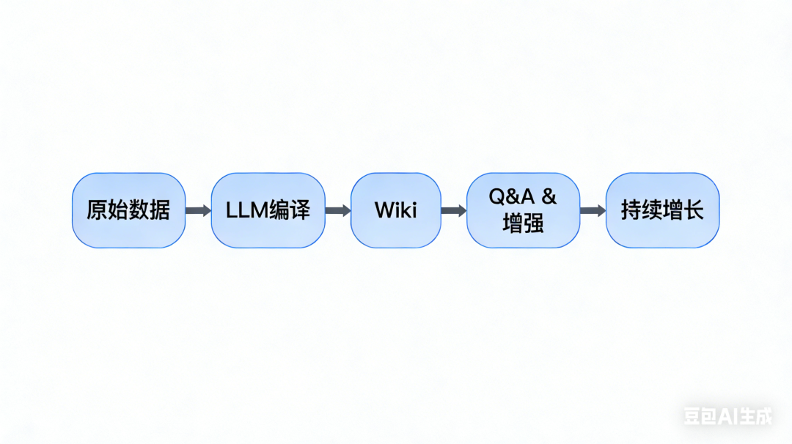
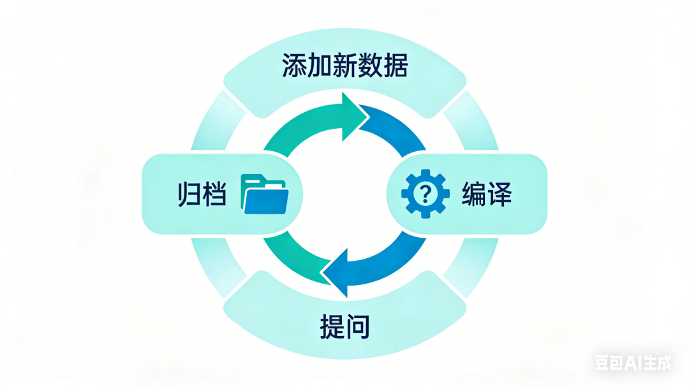

> 📎 来源: [胖小天](https://mp.weixin.qq.com/s?__biz=MzA4OTI0MDM2Mg==&mid=2247484044&idx=1&sn=f771c1a617d31273b7683d0e6d597ecc&chksm=91e270d3c11659e98ecec7a665853b1540d5b66f6f915712002a98c23761bed231479e69e833&mpshare=1&scene=1&srcid=0528ZbAoQdtbbujAeWI06H3j&sharer_shareinfo=22e9183367b191d4b4e5c62eacdfd265&sharer_shareinfo_first=22e9183367b191d4b4e5c62eacdfd265) | 时间: 2026-05-28 13:01

---

一、Token 的去向变了

你用 LLM 写代码。

Karpathy 用 LLM **编译知识**。

这不是比喻。

在他的最新推文里，Andrej Karpathy 披露了一个完整的工作流——用 LLM 搭建了 **100 篇文章、40 万词** 的个人知识库。

> "A large fraction of my recent token throughput is going less into manipulating code, and more into manipulating knowledge."

Token 的去向变了。

他几乎不手动编辑 wiki。

这是 **LLM 的领域**。

---

## 二、工作流全景图

一张图看懂整个架构：



`
`

**五层结构**：

| 层级 | 内容 | 工具 |
| --- | --- | --- |
| **输入层** | raw/ 目录 | Obsidian Web Clipper |
| **编译层** | Wiki 生成 | LLM CLI |
| **存储层** | .md 文件 | Obsidian |
| **查询层** | Q&A 系统 | 自建搜索 CLI |
| **输出层** | Markdown/Marp/Matplotlib | 多格式渲染 |

**核心理念**：

- 你不编辑 wiki，**LLM 编辑**
- 每次查询都"**增加**"而非"消耗"
- 知识是**活的数据**，不是死的文档

这不是传统的笔记管理。

这是 **知识编译系统**。

---

## 三、数据摄入：raw/ 目录的构建

**第一步：收集原始数据**

Karpathy 的 raw/ 目录包含：

```
raw/├── articles/      # 文章├── papers/        # 论文├── repos/         # 代码仓库├── datasets/      # 数据集└── images/        # 图片
```

**工具链**：

- **Obsidian Web Clipper**

  ：网页 → .md 文件
- **热键批量下载图片**

  ：方便 LLM 引用

**关键操作**：

当你找到一篇好文章，用 Web Clipper 一键保存。

它会：

- 提取正文
- 保存为 .md 格式
- 保留元数据（来源、日期、作者）

**为什么要下载图片？**

LLM 能"看"图片。

如果你把图片留在网页上，LLM 无法引用。

本地化之后，LLM 可以：

- 分析架构图
- 提取关键信息
- 在 wiki 中引用

---

## 四、LLM 编译：自动生成 Wiki

**这是核心环节**

LLM 做六件事：

### 1. 读取 raw/ 目录

扫描所有原始数据。

### 2. 生成摘要

每篇文章的核心观点。

### 3. 分类整理

按概念归类。

比如：

- AI Agent
- LLM 框架
- 知识管理
- 工作流设计

### 4. 生成文章

每个概念写一篇专题文章。

### 5. 创建索引

自动维护索引文件。

### 6. 添加反向链接

文章间的关联关系。

**Wiki 目录结构**：

```
wiki/├── index.md          # 总索引（LLM 维护）├── concepts/│   ├── ai-agent.md   # 概念文章（LLM 生成）│   ├── llm-framework.md│   └── knowledge-management.md├── summaries/│   ├── anthropic-guide-summary.md│   └── langchain-architecture-summary.md└── connections.md    # 反向链接（LLM 维护）
```

---

### 不需要 RAG

**这是 Karpathy 的意外发现**

> "I thought I had to reach for fancy RAG, but the LLM has been pretty good about auto-maintaining index files."

不需要向量数据库。

不需要复杂的检索 pipeline。

在 ~40 万词的规模下，LLM 自动维护的索引表现良好。

**为什么？**

因为 LLM 能"**理解**"知识结构。

它不是机械检索关键词。

它在理解概念之间的关系。

**当你问**："AI Agent 的最新架构趋势是什么？"

LLM 会：

1. 读取 index.md（快速定位）
2. 找到 ai-agent.md 概念文章
3. 深入相关摘要和原文
4. 理解内容之间的关系
5. 生成结构化答案

这不是检索。

这是 **理解 + 综合**。

---

## 五、Q&A 系统：针对 Wiki 提问

**使用场景**：

你可以问：

- "AI Agent 的最新架构趋势是什么？"
- "LangChain 和 LangGraph 的关系是什么？"
- "我的知识库缺少哪些关键内容？"

LLM 会：

- 研究你的 wiki
- 找到相关文档
- 生成答案

**Karpathy 的自建工具**：

他 vibe coded 一个小型搜索引擎。

用途：

- 自己用（Web UI）
- 给 LLM 用（CLI 工具）

```
# 示例命令wiki-search --query "AI Agent 架构" --wiki ./wiki
```

这不是为了替代 LLM。

这是为了给 LLM 一个**专用工具**。

---

## 六、输出归档：让知识"沉淀"

**输出不只在终端**

Karpathy 让 LLM 输出三种格式：

| 格式 | 用途 | 工具 |
| --- | --- | --- |
| **Markdown 文件** | 文档归档 | LLM 直接生成 |
| **Marp 幻灯片** | 演示汇报 | Obsidian + Marp |
| **Matplotlib 图像** | 可视化 | LLM 调用 Python |

**关键机制**：

输出结果**归档回 wiki**。

每次查询都"增加"知识库。

> "So my own explorations and queries always 'add up' in the knowledge base."

知识是**累积的**，不是消耗的。

七、Linting：知识库健康检查

**LLM 定期执行**：

- 发现不一致数据
- 补充缺失数据（带 web search）
- 发现潜在连接
- 建议新文章主题

**示例**：

LLM 发现两篇文章对同一个概念的定义不一致。

它会：

- 标记问题
- 建议修复方案
- 或者直接修复（需要你确认）

**另一个用途**：

LLM 发现你的 wiki 缺少某个关键概念的文章。

它会建议："你应该写一篇关于 ACI (Agent-Computer Interface) 的文章。"

---

## 八、实战：搭建你的最小知识库

**工具准备**：

- **Obsidian**

  （免费）
- **Obsidian Web Clipper**

  （插件）
- **LLM CLI**

  （任意 provider）

**启动步骤**：

```
# 创建目录mkdir raw wiki# 收集第一篇文章# 用 Web Clipper 保存# 编译llm compile --input raw/ --output wiki/# 提问llm ask --wiki wiki/ "这篇文章的核心观点是什么？"
```

**增长循环**：



**最小可行规模**：

从 10 篇文章开始。

Karpathy 说 ~40 万词规模下不需要 RAG。

但你的知识库可能不需要那么大。

20-50 篇文章就足够支撑日常查询。

---

## 九、总结：产品化的机会

**Karpathy 的洞察**

> "There is room here for an incredible new product instead of a hacky collection of scripts."

当前方案的局限：

- 需要自己写脚本
- 工具链分散
- LLM 配置复杂

**理想产品的特征**：

- **一键启动**

  ：无需配置
- **自动编译**

  ：实时更新 wiki
- **自然语言查询**

  ：不需要写 CLI 命令
- **多格式输出**

  ：Markdown、幻灯片、图像一键生成
- **持续增长**

  ：每次查询都沉淀知识

**你能做什么**：

从最小方案开始。

先积累，再优化。

观察市场。

等待产品。

或者——

你自己做这个产品。

---

## 附录：Karpathy 工作流速查表

**数据摄入**：

- Obsidian Web Clipper → 网页转 .md
- 图片本地化 → 方便 LLM 引用

**编译流程**：

1. 读取 raw/
2. 生成摘要
3. 分类整理
4. 生成概念文章
5. 创建索引
6. 添加反向链接

**核心发现**：

- ~40 万词规模不需要 RAG
- LLM 自动维护索引表现良好
- 理解 > 检索

**输出格式**：

- Markdown → 文档归档
- Marp → 幻灯片
- Matplotlib → 可视化

**增长机制**：

- 输出归档回 wiki
- 每次查询都增加知识
- Linting 保持健康

---

## 尾声

Karpathy 的工作流不是终极答案。

但它揭示了一个方向：

**LLM 不只写代码，还能编译知识**

你的 token，可以沉淀。

你的探索，可以累积。

知识库，可以是活的。

> "There is room here for an incredible new product."

也许你就是做这个产品的人。

— 完 —
