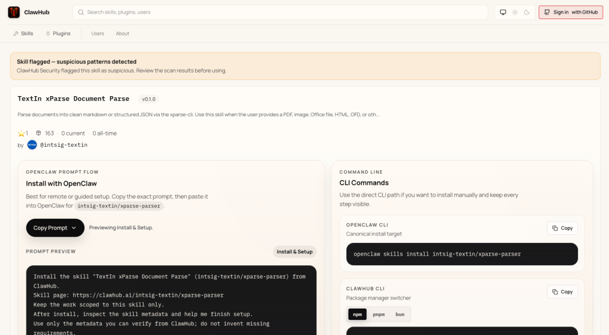
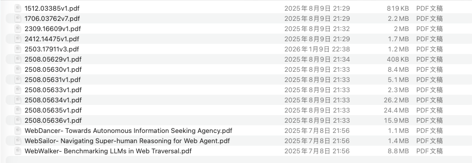
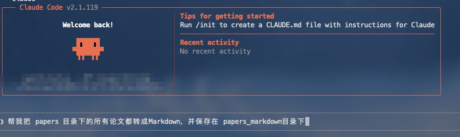
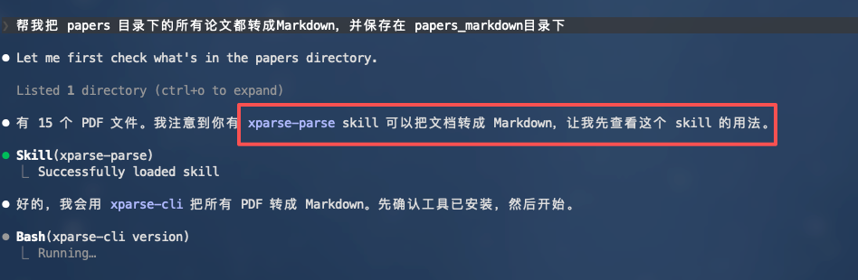
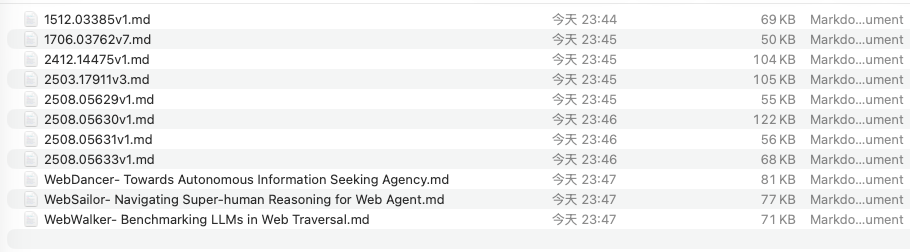
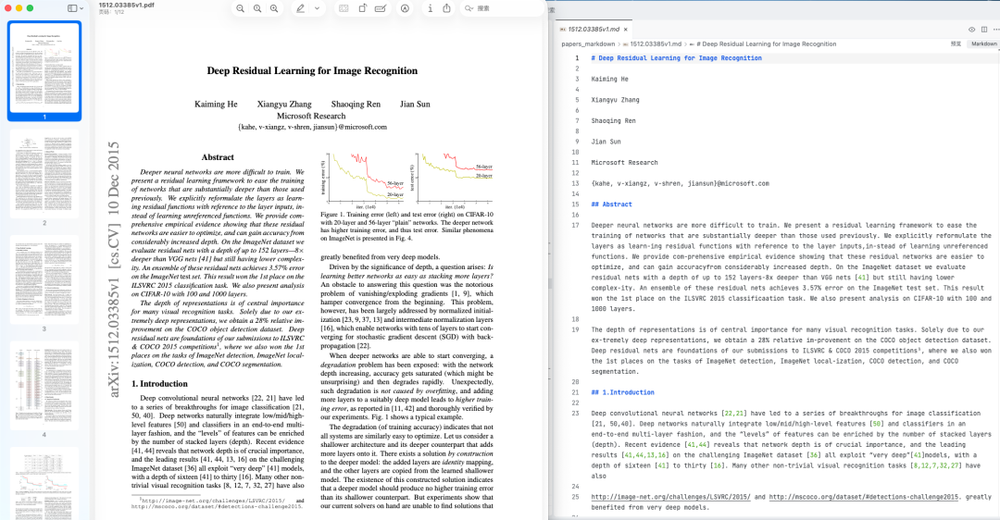

> 📎 来源: [Jack Bytes](https://mp.weixin.qq.com/s?__biz=Mzg4NTIyNTU0NQ==&mid=2247496872&idx=1&sn=67b1682fb0b125cbc84db04724d4a608&chksm=ce8a747f13df946357f12c77614445990961143457d2fc1be2a60deefccfb379d3eaeb84fdaa&mpshare=1&scene=1&srcid=0507UWLU7E7PsXCpb10gpDaa&sharer_shareinfo=216675e9bb3d1cf00ff03f7bb5429f20&sharer_shareinfo_first=216675e9bb3d1cf00ff03f7bb5429f20) | 时间: 2026-05-07 04:49

---

> 大家好，我是Jack Bytes，一个专注于将人工智能应用于日常生活的程序猿，平时主要分享AI、NAS、开源项目等。

兄弟们，相信大家都尝试过各种各样的 **Claw** 了吧，**OpenClaw**、**QClaw** 等等，这些Agent 确实掀起了一股全民 AI 的热潮。

**然而，我一直在思考一个问题，既然大模型精通世界上所有的知识，那么，我们人类最大的优势是什么呢？**

在**信息碎片化**日益严重的今天，这些超级智能体虽然能帮助我们完成各种任务，比如定时整理最新资讯、自动处理邮件、智能家居等等，但却**无法帮助我们构建自己的知识体系**。

**这个知识体系，恰恰是人类最大的竞争力**。

通过**碎片化信息**构建知识体系最大的难点是如何精准的将不同类型的资源，如PDF、Word、PPT、Excel 等等转换为干净的文档。普通的解决方案很难干净的处理。

就在不久，我发现了一个 skill，借助这个 skill，和 Agent 说一句话，就能**把各种真实场景下复杂的文档变成干净的 Markdown**。

随后，我用这个 skill，把资料转成了结构化的 Markdown 数据，并通过大模型构建了属于自己的知识图谱。


下面我们一起来看下吧！

## 一、什么是TextIn xParse Skill



**TextIn xParse Skill** 是**合合信息**（旗下产品有扫描全能王）出品的一个专业的文档解析 skill，具备如下特点：

- **多种版面元素高精度解析，提升大模型表现**：精准识别标题、公式、图表、手写体、页眉页脚、跨页段落，精准还原坐标。
- **行业领先的表格识别能力**：一键解决合并单元格、跨页表格、无线表格、密集表格等识别难题。
- **阅读顺序还原准**：理解、还原文档结构和元素排列，确保阅读顺序的准确性，支持多栏布局的论文、年报、业务报告等。
- **支持多种扫描内容**：能良好处理各类图片与扫描文档，包括手机图片、截屏等内容。
- **强大的图像处理功能**：文件带水印、图片有弯曲，都能一键解决，排除图像质量干扰。

最重要的是：每日 1000 页额度，零门槛上手。对于个人开发者来说根本用不完！

**Textin xParse** 更是具备商业生产级精度，尤其在企业文档解析方面（金融、法律、医疗行业），表格还原和阅读顺序超开源方案。

## 二、安装

**TextIn xParse Skill** 有下面几种安装方式：

1. 通过Agent 或者Claw 安装

在Agent 对话框中直接说：

```
帮我从 技能市场 安装 intsig-textin/xparse-parser如果技能市场里没有，则通过npx安装：npx skills add intsig-textin/xparse-skills --yes如果npx也没有，则可以从以下仓库里任选一个手动安装：https://github.com/intsig-textin/xparse-skills；https://gitee.com/intsig-textin/xparse-skills
```

2. 手动安装

可以通过下面的地址安装，并放在对应的 skills 文件下下面：

```
# Githubhttps://github.com/intsig-textin/xparse-skills# Giteehttps://gitee.com/intsig-textin/xparse-skills# ClawHubhttps://clawhub.ai/intsig-textin/xparse-parser
```

## 三、构建知识图谱

这里，我把**TextIn xParse Skill**安装到了**Claude Code**中，并用这个 skill 来帮我把目录下的所有文件都转为 Markdown 格式，通过大模型构建知识图谱。下面分步骤进行介绍。

### 3.1 安装skill

通过上面的方式安装完**TextIn xParse Skill**之后，便可以在 skills 目录下看到对应的 skill：


### 3.2 使用 skill

在开始之前，我先把一些论文放在特定的目录下面：



然后在 **Claude Code**中，告诉 Agent：帮我把 papers 目录下的所有论文都转成Markdown，并保存在 papers\_markdown目录下。



接下来可以看到 Agent 自动识别到了**xParse Skill**：



处理完成之后，转换后的 Markdown 都保存在了另一个目录下：



可以看到识别的还是很精准的：



### 3.3 构建知识图谱

接下来，告诉 Agent，根据这些 Markdown 文件构建知识图谱，并通过前端可视化展现出来。


构建完成之后的效果如下：


可以看到效果还是不错的，可以通过搜索实体概念来筛选出知识图谱中关联的子图：


### 3.4 扩展

除了上述用法之外，**TextIn xParse Skill**还能帮助构建格式统一、结构稳定、字段规范的上下文，让大模型更加容易理解我们的需求，帮助我们更好的解决任务。

## 四、总结

**TextIn xParse Skill** 精准解决了多格式文档向结构化文本转换的核心痛点，大幅降低了文档结构化处理的技术门槛。

用户通过极简的自然语言交互，即可完成从零散文档到结构化 Markdown的全流程操作，**真正帮助用户在 AI 时代沉淀专属知识资产**。

**同时合合信息作为上市公司，核心业务包含金融级文档处理，合规是生命线，因此也不用担心数据安全的风险。**

大家感兴趣的话快去试试吧！
