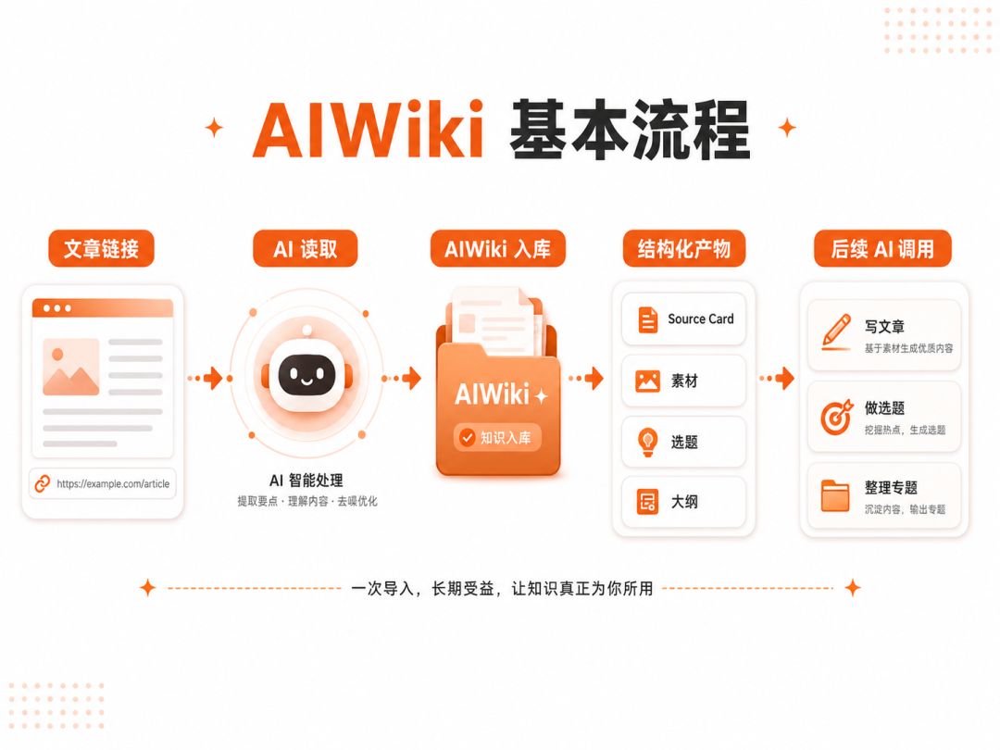
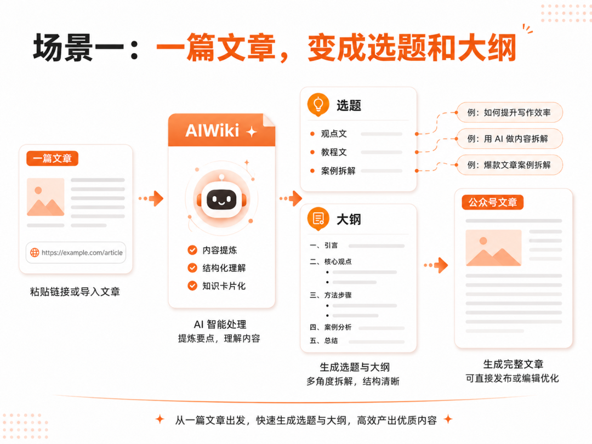
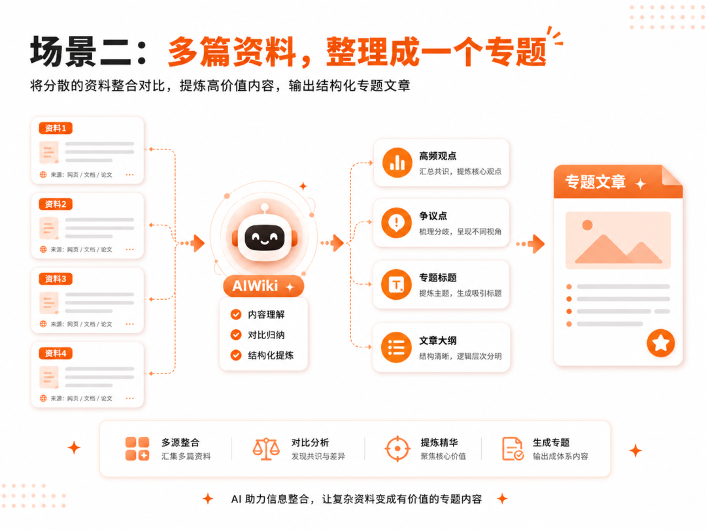
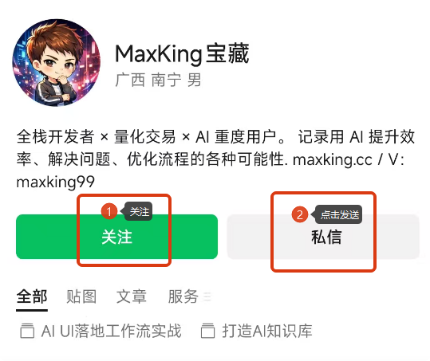

> 📎 来源: [MaxKing宝藏](https://mp.weixin.qq.com/s?__biz=MzkwNzU5OTI0OA==&mid=2247484146&idx=1&sn=e503fcd9c51c3c5edb2e3fdd5c562704&chksm=c1985e70e9759881207530ad0c68d3d590c52a129a0914f8cd098c7e0a12252d9d247455ffaa&mpshare=1&scene=1&srcid=0515yR1WSDZbTGGwUkJk8FeZ&sharer_shareinfo=ad43bad8fda3d3ee01f947d28c2cea9b&sharer_shareinfo_first=ad43bad8fda3d3ee01f947d28c2cea9b) | 时间: 2026-05-15 03:47

---

哈喽，大家好，我是 Max King。

上一篇我讲了为什么要做 AIWiki ，并开源了AIWiki 【[别再把资料丢进收藏夹了，我开源了知识库工具AIWiki，一键拥有Karpathy的LLM Wiki和Dan Koe的内容积木思路的AI知识库](https://mp.weixin.qq.com/s?__biz=MzkwNzU5OTI0OA==&mid=2247484138&idx=1&sn=fc0a00de73a3559da3340d268b19d918&scene=21#wechat_redirect)】。

简单说，就是我不想再把资料一篇篇丢进收藏夹，然后过几天就忘了。

很多朋友看完后，最关心的其实不是理念，而是：

这个东西到底怎么用？

所以这篇不继续绕概念。

我们就讲一个更实际的问题：

**怎么用 AIWiki，把一篇文章链接变成后面还能继续被 AI 使用的知识库内容。**

01

-MaxKing.cc-

## 手动整理文章，最麻烦的不是复制粘贴

很多人看到一篇好文章，第一反应就是收藏。

公众号收藏一下。
浏览器收藏一下。
微信里转发给自己。
有时候再复制到 Obsidian 或 Notion。

看起来资料是保存下来了。

但问题是，保存完之后呢？

等你真正要用的时候，还是要重新打开链接，重新看一遍，重新总结，重新提炼观点，重新想：

这篇文章能不能变成选题？
里面有没有值得复用的案例？
能不能写成一篇公众号文章？
能不能和其他资料组成一个专题？

手动整理文章最烦的，其实不是复制粘贴，而是每次都要重新读、重新拆、重新组织。

最后就变成：**收藏了很多，但真正用起来的很少。**

02

-MaxKing.cc-

## AIWiki 不是帮你存链接

AIWiki 不是想帮你多存几个链接。

如果只是保存链接，浏览器收藏夹、微信收藏、Notion、Obsidian 都能做。

AIWiki 真正想解决的是后面这一步：

从“收藏链接”到“AI 可继续使用”

**普通收藏夹**
我把链接存起来，以后自己慢慢找。

**AIWiki**
我先把资料整理进库，以后继续让 AI 基于这些资料做事。

**核心区别**
AIWiki 不是让你多一个资料夹，而是让资料后面还能被 AI 调用起来。

03

-MaxKing.cc-

## 怎么安装？让 AI 帮你装

AIWiki 本身就是 Agent-first 的工具。

所以安装和配置，也没必要一开始就让你自己研究一堆命令。

如果你是开发者，当然可以直接看 GitHub 和 npm 文档。

但如果你只是想先跑通效果，更简单的方式是：

**直接把安装任务交给 Codex、Claude Code、QClaw、OpenClaw 这类能操作本地环境的 AI Agent。**

可以直接发给 AI 的安装提示词

请帮我安装 AIWiki，并新建一个测试 Obsidian 知识库目录。安装完成后，帮我跑通一篇文章链接入库流程。不要修改我原来的 Obsidian 主库。

第一次我建议一定新建测试目录，不要一上来就动自己的正式 Obsidian 主库。先跑通流程，再考虑后面怎么接入正式库。

04

-MaxKing.cc-

## 立即看下效果：先跑一篇文章

第一次测试 AIWiki，不要想着一下子整理几十篇文章。

先选一篇就够了。

这篇文章最好能正常打开，内容不要太短，也确实和你的写作、研究、项目方向有关。

然后把这段话发给 AI：

第一篇文章入库提示词

请读取这篇文章，并使用 AIWiki 入库：

文章链接：这里粘贴你的链接

入库完成后，请告诉我：是否成功入库、生成了哪些内容、内容保存在哪里，以及后续可以如何继续使用。

这样 AI 不只是帮你执行入库，还会顺手告诉你结果在哪里、生成了什么、下一步可以怎么用。

05

-MaxKing.cc-

## 入库后，会生成什么？

一篇文章入库后，AIWiki 不只是生成一段摘要。

它会把资料拆成几类后面能继续用的内容。

AIWiki 的主要产物

**raw**：原始资料记录，方便以后追溯。

**Source Card**：资料卡，让 AI 快速理解来源、主题和核心信息。

**Claim 建议**：可以沉淀成观点、判断和证据线索。

**创意素材**：从文章里拆出的案例、表达、角度和可复用内容。

**选题候选**：这篇资料可能发展出的文章方向。

**草稿大纲**：可以继续扩写的初始文章结构。

**processing-summary**：这次处理过程的摘要记录。

你不需要每次都手动点开这些文件一个个看。更好的用法是：继续让 AI 基于这些入库结果做下一步。

06

-MaxKing.cc-

## 场景一：把一篇文章变成选题和大纲

比如你刚刚用 AIWiki 入库了一篇文章。

接下来，你可以继续对 AI 说：

选题和大纲提示词

请基于刚刚入库到 AIWiki 的这篇资料，帮我做公众号文章选题。

请输出：3 个选题、目标读者、推荐优先写哪个、5 个标题、文章摘要、完整大纲，以及开头 300 字。

这个场景非常适合内容创作者。

很多时候，我们不是没有资料，而是不知道这篇资料到底能怎么变成自己的内容。

以前你收藏了一篇文章，后面还要自己重新读、重新拆、重新想标题。

现在你可以继续问 AI：

这篇文章能写什么？
适合谁看？
能不能写成观点文？
能不能写成教程文？
能不能做成案例拆解？

AIWiki 不是把文章存起来就结束，而是让这篇文章变成下一篇内容的原料。

07

-MaxKing.cc-

## 场景二：把多篇资料整理成专题

一篇文章可以生成选题。

多篇文章就可以整理成专题。

比如你这几天连续入库了几篇关于 AI Agent、AI 知识库、Obsidian、LLM Wiki 的资料。

这时候你可以继续问 AI：

专题整理提示词

请基于 AIWiki 中最近入库的同主题资料，帮我整理一个专题文章方向。

请输出：共同讨论的核心问题、5 个高频观点、3 个争议点或差异点、专题标题、摘要、完整大纲，以及每个章节可以参考哪些资料。

这个场景比单篇总结更有价值。

因为你不再只是围绕一篇文章做摘要，而是开始让 AI 跨资料整理主题。

几篇文章都在讲 AI Agent，但角度可能完全不同：有的强调模型能力，有的强调工具调用，有的强调工作流，有的强调状态管理。

如果这些资料都已经进入 AIWiki，后面就可以继续让 AI 帮你做共性整理、观点对比、争议提炼、专题大纲和系列文章规划。

08

-MaxKing.cc-

## 第一批反馈：大家卡住的地方很具体

最近我也让一小批用户先试了一下 AIWiki。

收到的反馈挺真实。

目前集中在这几类反馈

1. 不知道第一步该怎么开始。

2. 担心会不会弄乱自己的 Obsidian 主库。

3. 入库成功了，但不知道下一步怎么继续用。

4. 最关心生成结果能不能帮自己写文章、做选题。

这些反馈对我很有帮助。

因为它提醒我：AIWiki 不能只强调“能入库”。

更要讲清楚：**入库之后，AI 怎么继续基于这些资料帮你做事。**

安装

↓

入库一篇文章

↓

生成结构化产物

↓

继续让 AI 生成选题和大纲

09

-MaxKing.cc-

## 这一轮共创，我更想看用起来之后有没有价值

这一轮 AIWiki 共创测试，我不只想知道你有没有安装成功。

安装成功当然重要。

但更重要的是：入库之后，你有没有继续用起来？

比如：

AI 生成的选题有没有启发？
草稿大纲能不能继续写？
创意素材有没有帮你找到新的表达角度？
多篇资料能不能整理成一个专题？
整个流程是否比手动整理文章更省事？

AIWiki 的目标不是做一个看起来复杂的工具，而是把文章、链接、资料，变成后续 AI 可以继续使用的知识资产。

AIWiki 共创测试

目前 AIWiki 已经开源，也发布到了 npm。我现在正在做第一轮共创测试。

如果你对这个方向感兴趣，可以私信发送：**AIWiki**，查看项目地址、AI 安装提示词和共创反馈表。

下一篇预告

下一篇我会继续拆：第一批用户测试 AIWiki 时，最容易卡在哪一步，以及这些反馈应该怎么反过来优化产品和教程。

- END -
