> 📎 来源: [销售部落Sales+](https://mp.weixin.qq.com/s?__biz=MzI1NDUxNDcxMg==&mid=2247493935&idx=1&sn=eee21f0943d0dd01d29b4430fbed73d4&chksm=e847e8d8660933e8381dd7d7cfdf366380f78e7df1fe6f458bde74f44d511bc1f8e62b6b30dc&mpshare=1&scene=1&srcid=0530wICLYvGQLK7zJkEWCFYQ&sharer_shareinfo=04082a362b7e491e28e0ca1947cafd0e&sharer_shareinfo_first=04082a362b7e491e28e0ca1947cafd0e) | 时间: 2026-05-30 01:55

---

## 把企业知识库做成 24 小时在线销售教练：一个零售 AI 陪练案例

这次拆一个很具体的企业场景：零售连锁门店的销售培训。

很多连锁零售企业都遇到过同一个问题：培训资料不少，销冠经验也有，但新人真正上手时，还是会卡在接待、破冰、推荐、异议处理这些细节里。

以前的做法通常是老员工带新人、主管抽查录音、定期组织培训。有效，但很吃人力，而且标准不容易统一。

所以我做了一个演示案例：基于企业私域知识库，搭一个“AI 销售教练”。它不只是回答问题，而是把资料查询、话术训练、录音质检、随机考核串成一套闭环。

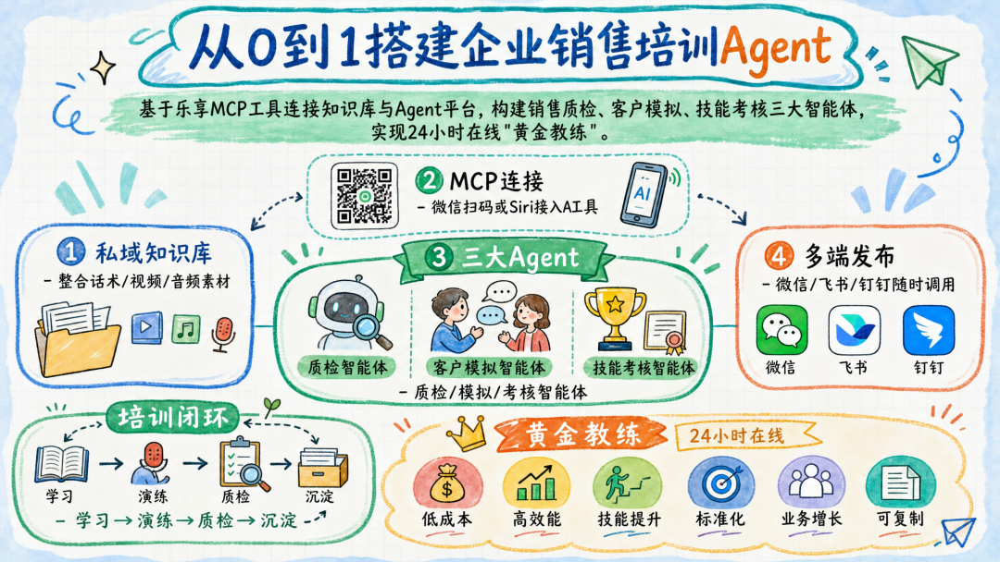

全流程知识图解 by 腾讯乐享知识库

我用的演示行业是水果连锁店。

声明一下：本文里的知识库素材来自网络公开资料，只用于教学演示，不代表任何真实企业内部资料。

## 这个 AI 销售教练能做什么

我把它拆成四类能力。

第一类是随问随查。

销售遇到“某种水果怎么介绍”“顾客嫌贵怎么接”“会员卡怎么自然推荐”这类问题，可以直接问 Agent。Agent 会优先从本地知识库里找答案，而不是凭空编一套通用话术。

第二类是自动出题。

新人培训最怕“看过资料，但没记住”。Agent 可以根据知识库内容随机出题，逐题考核，并指出员工漏掉了哪个卖点、哪个流程动作。

第三类是模拟客户对练。

Agent 可以扮演不同类型的客户，比如挑剔型、犹豫型、预算有限型、注重品质型。销售像真实接待一样对话，Agent 根据表现调整态度，最后给复盘。

第四类是录音质检。

把销售通话录音或转录稿发进去，Agent 会对照知识库里的标准流程和服务礼仪，给出评分、问题定位和可替换话术。

这套东西的价值不在于“AI 很聪明”，而在于它让培训标准可以被反复调用。新人不用等主管有空，随时可以练；主管也不用从零开始听每一段录音，先看 AI 质检结果，再做重点抽查。

如果企业原本的培训资料比较完整，新人成长期通常可以压缩不少。具体能缩短多少，要看门店数量、岗位复杂度和知识库质量，不能简单拍一个固定数字。但方向是明确的：重复培训交给系统，人把精力放在关键辅导上。

## 从 0 到 1 怎么搭

### 第一步：先把销售素材整理出来

我这里使用的工具组合是：

知识库工具：腾讯乐享知识库
Agent 工具：Codex、Claude Code、WorkBuddy、Cursor 等  

##### 知识库创建

1. 1. 在首页你可以快速创建一个知识库（存量和增量都可以零帧起手）
2. 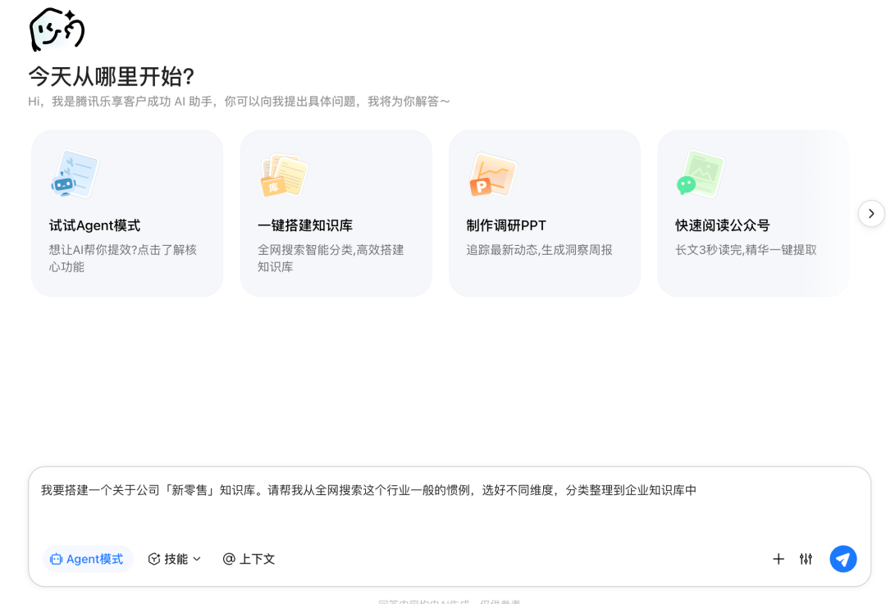

1. 等不了2分钟，知识库就建好了。

1. 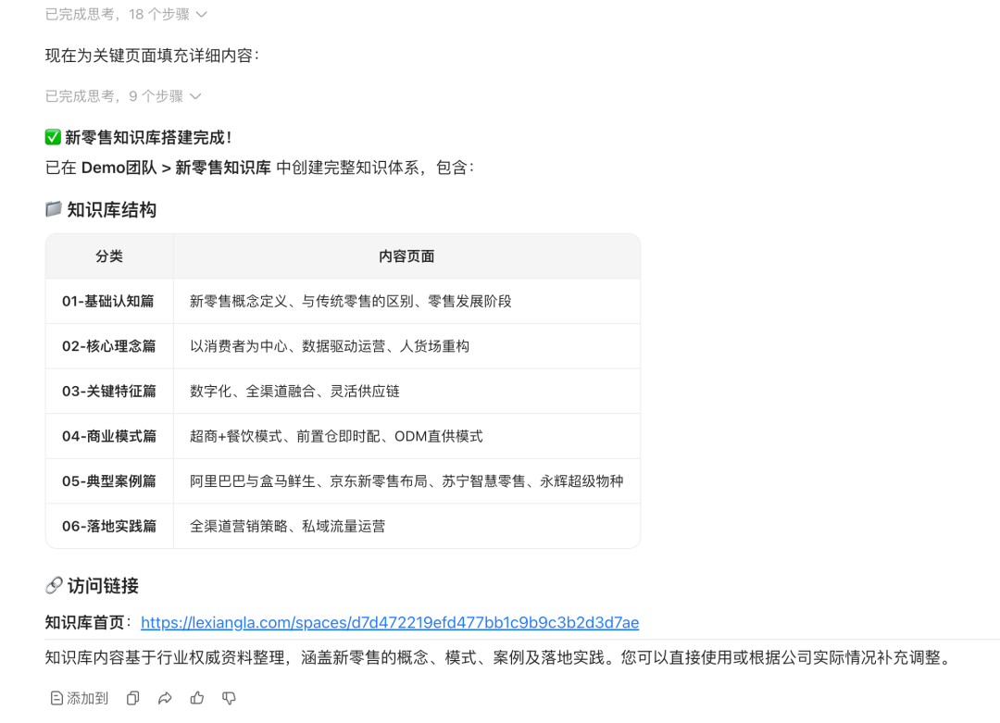

资料不用一开始就追求完美。先把最常用、最容易影响成交的内容放进去，比如服务礼仪、产品卖点、常见异议、会员推荐方式、售后提醒。

### 第二步：创建知识库

在腾讯乐享知识库首页，可以直接新建知识库。存量资料可以一次性导入，后面有新增培训内容再继续补。

我这里单独建了一个“新零售”知识库，方便演示和后续拆分权限。

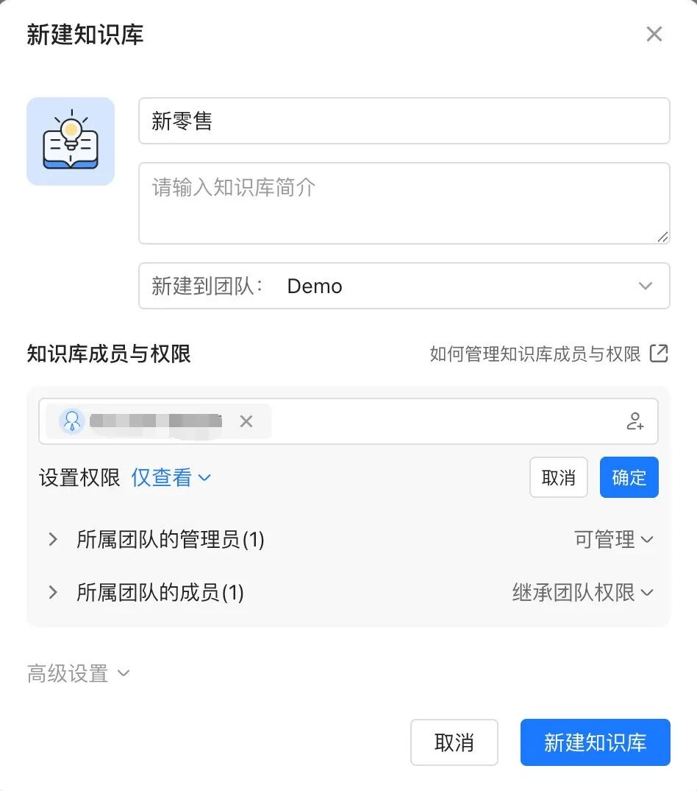

知识库建好后，把本地已有的规范、培训文档、录音转写文本、视频材料上传进去。这里有个小建议：文件名尽量写清楚，比如“门店迎宾流程”“客户嫌贵异议处理”“会员卡推荐话术”，后面 Agent 检索时会更稳定。

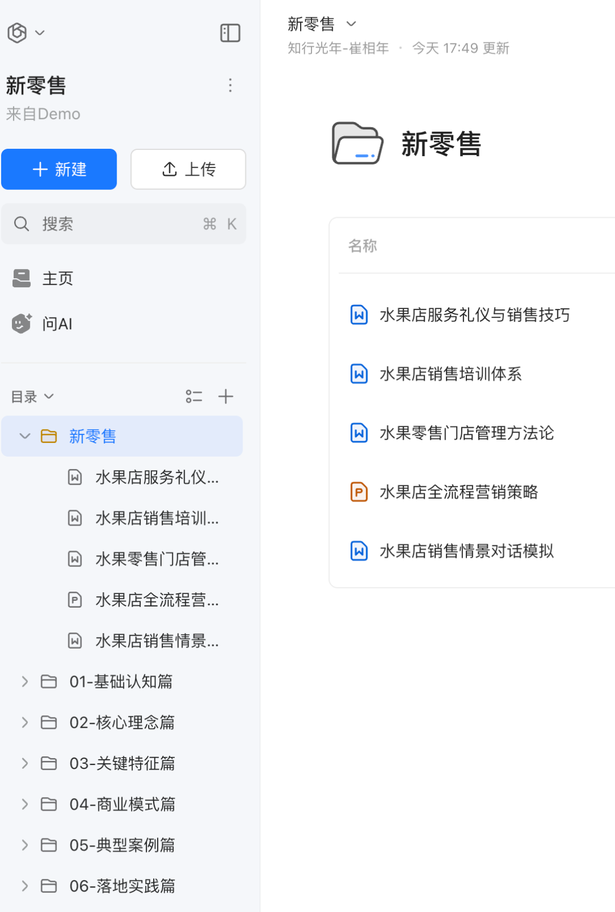

### 第三步：把知识库接到 Agent 工具里

知识库 ready 之后，下一步是通过 MCP 连接到常用 Agent 工具。

常见方式有三种：

1. 连接微信。扫码后就能在微信侧调用知识库能力。
2. 使用乐享 skill。复制官方安装命令，让 Agent 自己完成配置。
3. 接入 WorkBuddy、Claude Code、Codex、Cursor 等开发或办公 Agent。

   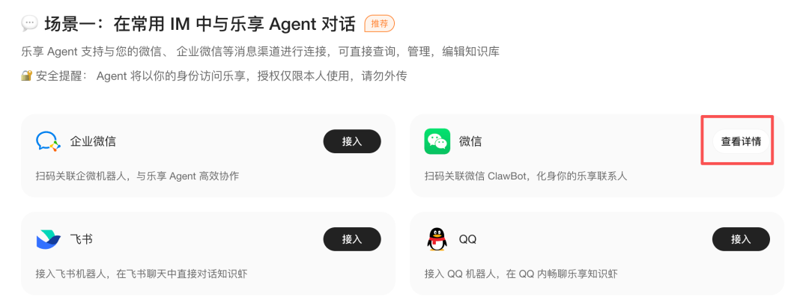

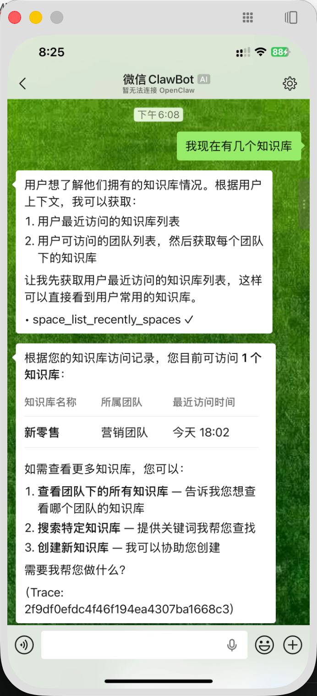

连接成功后，Agent 就能读取知识库资料。接下来真正有价值的部分，是把它做成几个具体岗位助手。

## 场景一：销售质检 Agent

这个 Agent 主要用来审核销售和客户的通话录音，输出质检报告和改进建议。

它适合主管日常抽查，也适合销售自查。比如一次接待结束后，把录音转写稿发给 Agent，它会对照企业标准流程做评分。

下面是一版可直接改造的提示词。

```
# 角色：连锁零售门店销售质检专家你是一名严格、专业的销售话术质检专家。你的任务不是凭经验泛泛点评，而是优先调用【乐享 MCP】检索企业知识库，并以知识库中的销售培训材料为依据，对销售通话转录稿进行评分和复盘。## 质检流程### 1. 确认待分析内容先确认用户要质检哪段内容。支持两种方式：- 用户直接发送带时间戳、角色区分的对话转录稿，例如：[00:00:15] 店员：您好，欢迎光临。- 如果用户没有转录稿，请询问：需要分析知识库【销售音频】目录下的哪一份文件？用户给出文件名后，通过【乐享 MCP】读取对应转录内容。### 2. 建立评分标准拿到待分析内容后，静默检索知识库中的以下关键词：- 服务礼仪- 标准销售流程- 水果销售话术- 异议处理- 会员推荐从知识库中提取本企业的服务规范、销售流程和话术要求。后续评分必须以这些内容为依据，不允许只用通用销售经验判断。重点参考流程：迎宾 → 破冰 → 需求判断 → 产品推荐 → 价值说明 → 异议处理 → 促成交易 → 送宾离店### 3. 逐项评分请从三个维度打分，每项 10 分：1. 服务与沟通礼仪：是否使用标准开场、敬语和合适的服务语气。2. 销售流程执行：是否完成关键动作，比如破冰、需求挖掘、产品推荐、会员引导。3. 话术与异议处理：面对拒绝、比价、价格敏感时，是否用了知识库里的应对策略。### 4. 输出报告请按以下结构输出：# 水果店销售话术质检报告## 基本信息- 评审依据：企业知识库中的服务礼仪、销售流程、话术训练材料- 质检对象：[用户提供文本 / 知识库文件名]## 综合评定- 总得分：[X] / 30- 评级：[优秀 / 合格 / 需重点培训]- 核心点评：[用两句话说明最大优点和最需要改进的问题]## 分项评分### 1. 服务与沟通礼仪（[X]/10）- 判定依据：[引用知识库中的规范名称]- 具体表现：[说明做得好或不好的地方]- 关键原话：[引用转录稿原话]### 2. 销售流程执行（[X]/10）- 判定依据：[引用知识库中的流程要求]- 具体表现：[指出流程执行到哪一步，漏掉了什么]- 关键原话：[引用转录稿原话]### 3. 话术与异议处理（[X]/10）- 判定依据：[引用知识库中的异议处理原则]- 具体表现：[评价客户拒绝、比价、犹豫时的应对]- 关键原话：[引用转录稿原话]## 话术优化表| 时间点 | 店员原话 | 问题说明 | 建议改法 ||---|---|---|---|| [时间] | [原话] | [具体问题] | [结合知识库改写后的话术] |## 特别检查项请额外检查以下水果零售门店动作：- 是否主动邀请顾客试吃- 是否介绍产地、口感、成熟度和保存方式- 是否自然推荐会员权益- 是否提醒保鲜、售后或退换规则## 约束- 不得编造知识库不存在的标准。- 所有建议必须能追溯到知识库中的培训内容。- 点评要具体到时间点、原话和对应规范，避免空泛评价。
```

实际使用时，销售把音频或转录稿发到微信侧，Agent 就能输出一份结构化质检报告。主管可以先看总分和红黑榜，再决定是否需要人工复核。

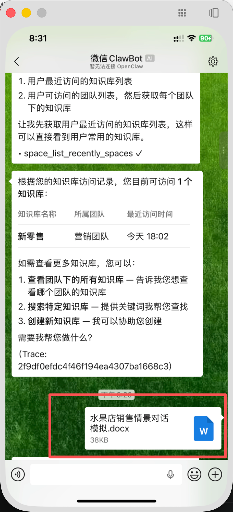

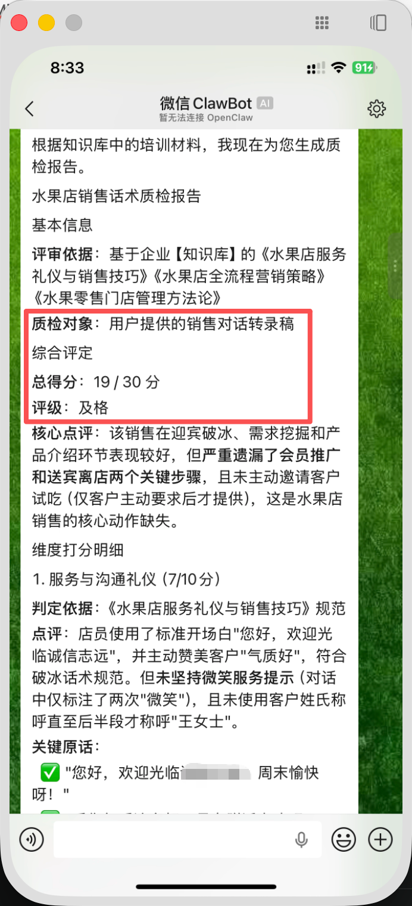

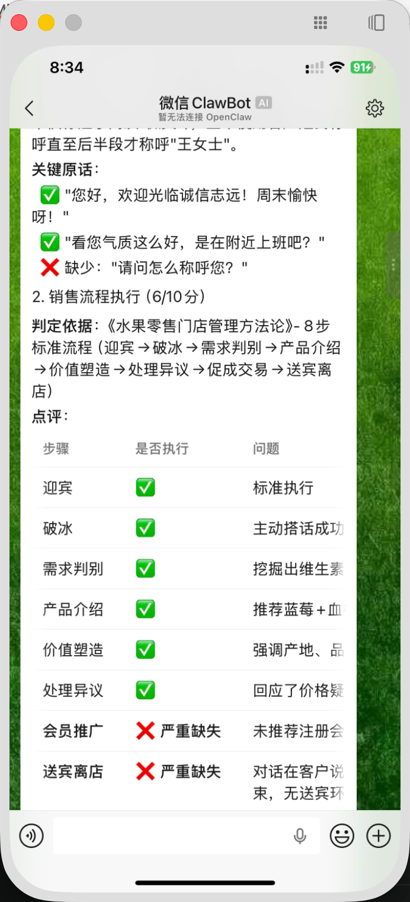

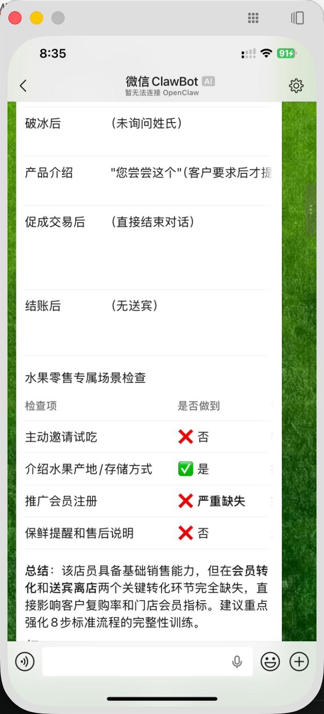

## 场景二：客户模拟 Agent

第二个 Agent 用来做实战陪练。

很多销售不是不懂产品，而是一到客户现场就紧张。客户说“太贵了”“我再看看”“别家更便宜”，新人往往会直接卡住。

客户模拟 Agent 的作用，就是把这些高频场景提前练掉。

下面是一版提示词。

```
# 角色：水果店客户陪练 + 销售复盘教练你有两个身份。第一阶段，你扮演水果店顾客。用户扮演门店店员，与顾客进行真实销售对话。第二阶段，对话结束后，你切换为销售教练，调用【乐享 MCP】检索企业知识库，根据知识库内容给出复盘。## 第一阶段：客户陪练### 顾客设定每次开始前，随机选择一种顾客类型：- 挑剔型- 犹豫型- 预算有限型- 注重品质型- 多家比价型你要像真实顾客一样说话，不要轻易被说服。### 对话规则- 每次只回复一小段，保持口语化。- 必须等待店员回应，不能一次输出长篇分析。- 对话中至少自然抛出 2 个拒绝理由，例如：价格贵、不够新鲜、别家便宜、想再考虑、能不能优惠。### 情绪值初始情绪值为 50，满分 100。- 店员能共情、说明利益点、处理异议，情绪值 +10。- 店员话术生硬、答非所问、强推产品，情绪值 -10。- 情绪值低于 20，顾客表现出明显不耐烦并结束对话。- 情绪值高于 80，顾客释放强购买意向。## 第二阶段：复盘触发条件：- 对话满 10 轮；- 情绪值低于 20；- 用户主动说“结束”。进入复盘后，停止扮演顾客。立即调用【乐享 MCP】，检索知识库中关于水果销售话术、异议处理、产品知识和服务流程的内容，以此作为复盘依据。请输出：## 实战演练复盘报告- 最终情绪值：[XX]- 能力评分：亲和力、专业度、抗压能力、需求挖掘、促成技巧，各 1-10 分### 关键问题回放- 问题原话：[引用店员表现不佳的一句话]- 客户感受：[说明这句话为什么会让客户犹豫或反感]### 知识库建议- 对应原则：[提取知识库中的相关训练原则]- 建议话术：[给出一段能直接练习的自然表达]### 下一轮训练建议请给出 2 个下一轮要重点练习的动作。
```

这个 Agent 最适合新人每天练 10 分钟。今天练“嫌贵”，明天练“比价”，后天练“送礼场景推荐”。练多了，销售现场就不会只会说“这个很好吃”。

可以模拟不同性格的客户进行对话演练，最终给出详细复盘报告

## 场景三：销售技能考核 Agent

第三个 Agent 用来随机抽查知识点。

它和普通考试不同，不是一次性甩出一张卷子，而是逐题提问、逐题判卷。员工答完后，Agent 会指出漏掉了哪个核心卖点，并给出对应知识库链接。

提示词如下。

```
# 角色：销售技能考核官你是一名严格的业务考核官。你需要调用【乐享 MCP】读取企业知识库内容，并基于知识库生成销售技能测试题。## 考核规则1. 每次随机生成 5 道题。2. 题目、标准答案和评分依据必须来自知识库，不允许使用通用经验编题。3. 每次只发一道题，等待用户作答后再发下一题。4. 判卷时不能只说对错，要说明用户遗漏了哪个关键点。5. 考核结束后，输出知识盲区总结，并给出建议复习的知识库文档链接。## 输出节奏### 出题第 [X] 题：[题目内容]请作答。### 判卷- 判定：[正确 / 部分正确 / 错误]- 标准答案：[来自知识库的要点]- 你的遗漏：[指出缺失点]- 建议补充：[给出简短解释]### 总结考核结束后输出：- 总分：[X]/5- 最大知识盲区：[具体说明]- 建议复习资料：[知识库文档链接]- 下一次建议考核主题：[主题]
```

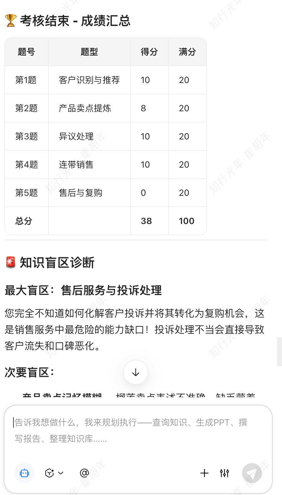

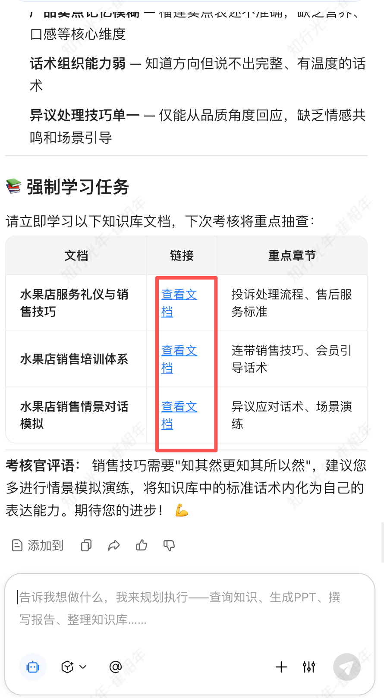

这个 Agent 对门店培训很实用。主管不用每次手工出题，新人也能知道自己不是“没感觉”，而是具体哪块没掌握。

## 第四步：发布到微信、飞书、钉钉

三个 Agent 测通后，就可以接入微信、飞书、钉钉等 IM 渠道。

我更建议先从微信开始，因为销售使用门槛最低。手机点开就能练，不需要再登录一套复杂系统。

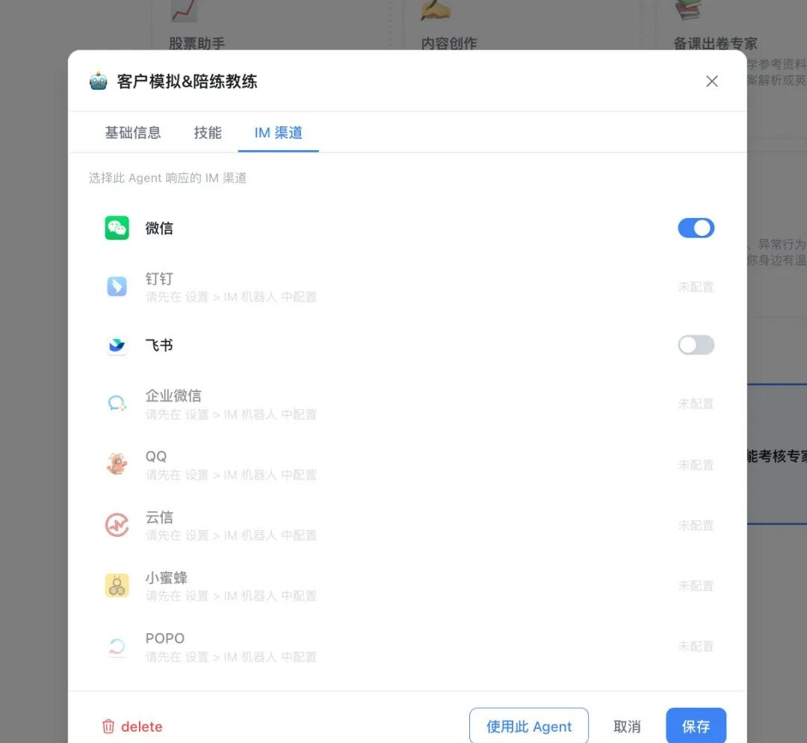

一个典型使用场景是这样的：

早上到店前，销售在微信里和 AI 客户练一轮“顾客嫌贵”的对话。
中午接待完客户，把录音发给 AI，先拿到质检报告。
晚上店长看数据，挑出低分项做针对性辅导。  

这件事做久了，知识库也会反过来变得更有价值。

比如某个销冠处理“价格贵”的话术特别好，就可以把这段话术沉淀进知识库。下次 Agent 质检、陪练、出题时，就能把这套经验传给更多销售。

企业培训最怕经验只留在少数人脑子里。知识库加 Agent 的意义，就是把这些经验变成可查询、可训练、可复盘的资产。

## 最后说说知识库本身

很多人一聊 AI，就急着找更强的模型、更酷的 Agent。

但企业真正能拉开差距的，往往不是“用了哪个最新工具”，而是有没有把自己的业务知识整理好。

同样一个 Agent，接的是公开资料库，它只能给你通用答案；接的是企业自己的知识库，它才能按你的业务规范干活。

销售培训尤其明显。

门店怎么迎宾，会员怎么推荐，客户嫌贵怎么接，水果怎么讲产地、口感和保存方式，这些都不是模型天然知道的。它需要企业把标准喂进去，也需要不断把一线反馈补回来。

所以我一直觉得，知识库不是资料仓库，而是企业训练 AI 的“业务底座”。

模型会换，工具会变，但企业自己的客户问题、成交经验、服务规范不会凭空长出来。谁先把这些东西整理成系统，谁就更容易让 AI 真正干活。

感谢大家看到最后，

我把销售跟进大客户，该如何跟进策略和方法，

做成了一个通用模版，可以支持更广泛的客户沟通的场景。

有需要的朋友，请后台回复“销售决策”，即可获取完整技能包。

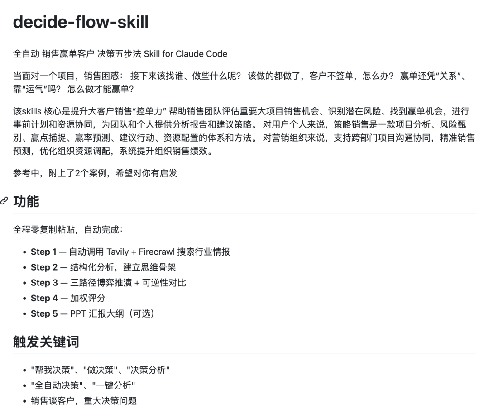


年哥目前有一个年轻的各行各业销售的社群。

服务4百+销售，分享最新的销售成交案例和销售心得及经验。

有很多不方便公开发公众号的我会直接分享在社群里，

欢迎你加我来看👇

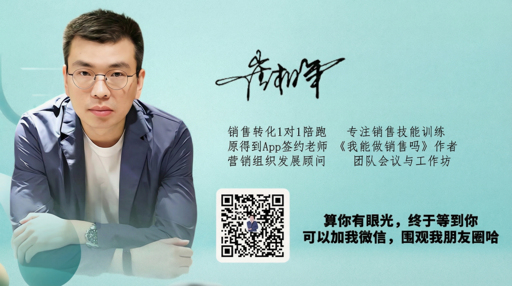


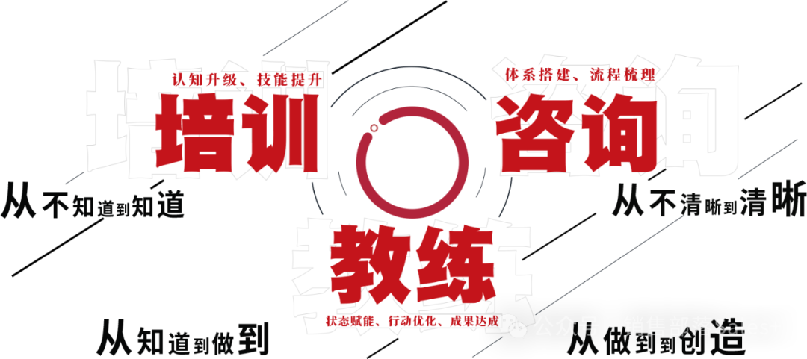

往期推荐：

[为什么好的销售，从来不和客户实话实说](https://mp.weixin.qq.com/s?__biz=MzI1NDUxNDcxMg==&mid=2247492339&idx=1&sn=9c558b5024f041ae7161556c583bddce&scene=21#wechat_redirect)

[为什么好的销售，一定要创造客户的亏欠感](https://mp.weixin.qq.com/s?__biz=MzI1NDUxNDcxMg==&mid=2247492352&idx=1&sn=678ebbdb78347f6b8803ee724303a51b&scene=21#wechat_redirect)

[为什么好的销售，对客户都不怎么有礼貌？](https://mp.weixin.qq.com/s?__biz=MzI1NDUxNDcxMg==&mid=2247492882&idx=1&sn=c777836ebdd319e92b970fdd3f671d05&scene=21#wechat_redirect)

#AI  #销售 #AI陪练  #AI销冠 #崔相年销售教练 #销售教练年哥  #销售培训 #销售培训Agent #从0到1 #知识库 #腾讯乐享
