> 📎 来源: [极空间私有云](https://mp.weixin.qq.com/s?__biz=MjM5OTM5NTEzNw==&mid=2247571338&idx=1&sn=1f3f519cfd42a7c6fcbd6ad3a176c2bb&chksm=a61118e46807f69bec82765af827ecbce69a0a0bc244d3c59551862c4c9877462908057d5c01&mpshare=1&scene=1&srcid=0427oD3FP5lCorAMIi73VRIQ&sharer_shareinfo=7234066d42618a8f0d7523031887da86&sharer_shareinfo_first=7234066d42618a8f0d7523031887da86) | 时间: 2026-04-27 21:12

---

各位极友，我是小极君 📝

又到周一啦～

你试过用NAS做笔记吗？

极空间自带的记事本虽然好用，但如果你想要一个**真正能陪你“养老”的知识库**——支持 Web、电脑、手机三端同步，自带 AI 助手、RAG 知识库、待办清单、思维导图，甚至还能批处理整理海量笔记……今天这个开源项目，可能就是你的终极答案。

它就是 **Nowen‑Note**。

不仅能当你一个人的树洞，还能通过完整 API 接入你的“龙虾”或“爱马仕”，直接让 AI 帮你管理知识库。

跟着@熊猫不是猫 一起部署简单，功能全面，堪称 NAS 用户的“笔记养老神器”。👇

**/****/ 风险****提示**

**///**

1. 极空间仅提供支持创建Docker镜像的环境，软件功能与注意事项详见该软件内具体使用规则。
2. 本文仅代表作者观点，使用第三方解决方案，均非官方正式方案，可能会产生相关风险，请自行斟酌。

介绍之前先说结论，这可能是熊猫发现最适合NAS用户“养老”的自托管笔记项目。

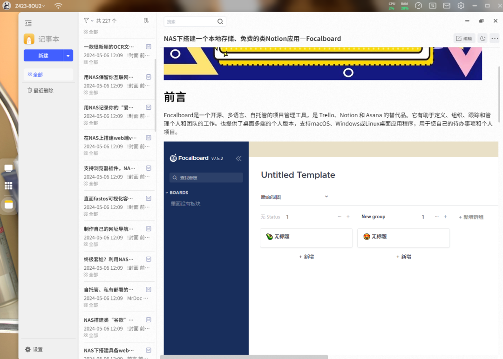

记事本

不过作为一款笔记软件，我需要的是它能随时打开记录，所以多端的需求其实非常重要。今天要介绍的nowen-note不仅拥有web端，还有对应的桌面端和移动端，同时它还集成了待办、AI助手、RAG知识库以及思维导图和类微博的动态功能，甚至还提供了批处理功能。

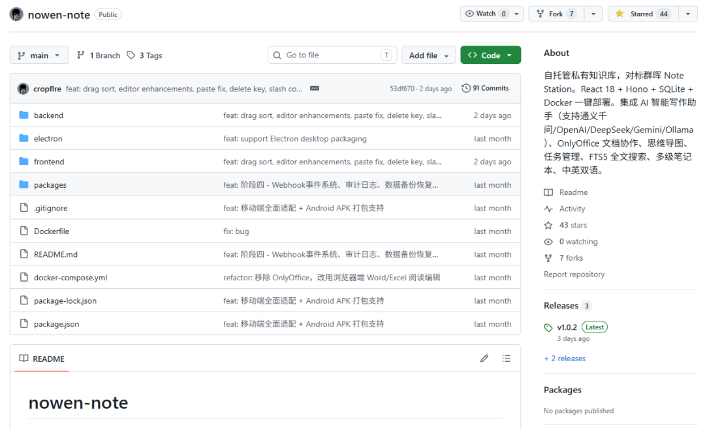

项目截图

# **项目体验**

项目的界面我挺喜欢的，采用三栏设计分工明确。最左侧是功能区，能看到笔记、说说、待办、导图以及AI等功能，中间则是文件列表，最右侧就是笔记内容或者其他功能内容。

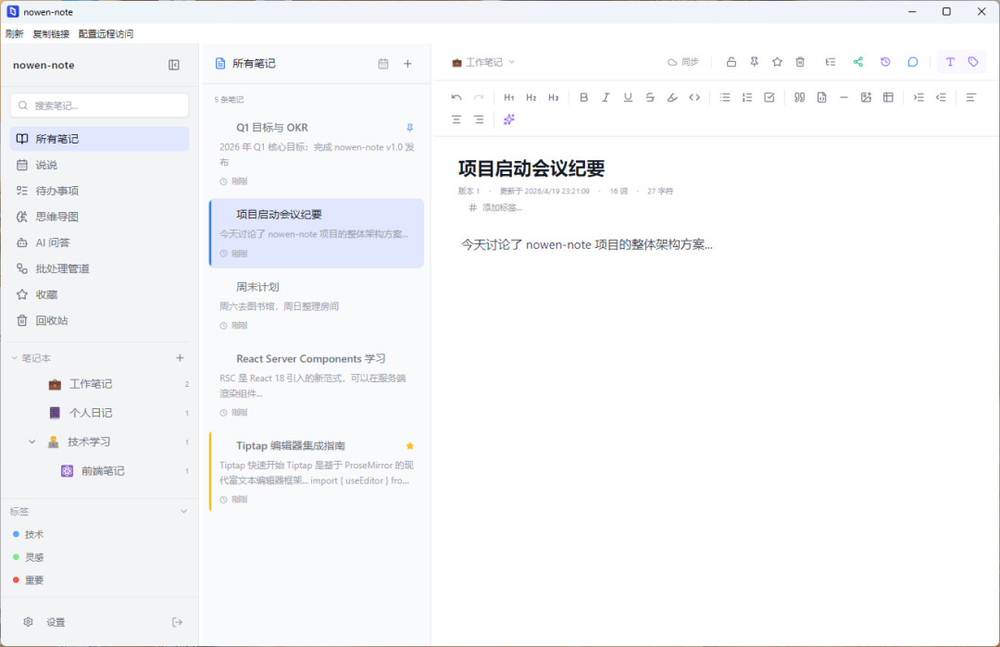

项目界面

使用前记得先配置好AI，点击左下角的设置在AI助手中就可以配置了。目前支持千问、OpenAi、Gemini、DeepSeek、豆包以及本地Ollama大模型，其中OpenAI支持兼容接口的第三方站点。

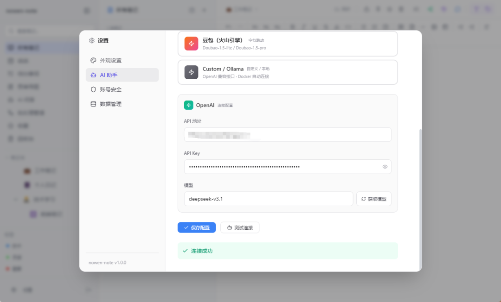

模型设置

设置中除了模型设置，这里也支持编辑器字体导入，甚至支持小米云服务导入以及OPPO和苹果的便签与IPhone的备忘录导入，这一点非常不错。（不过可惜的是采用的是解析，并不是接口自动化）

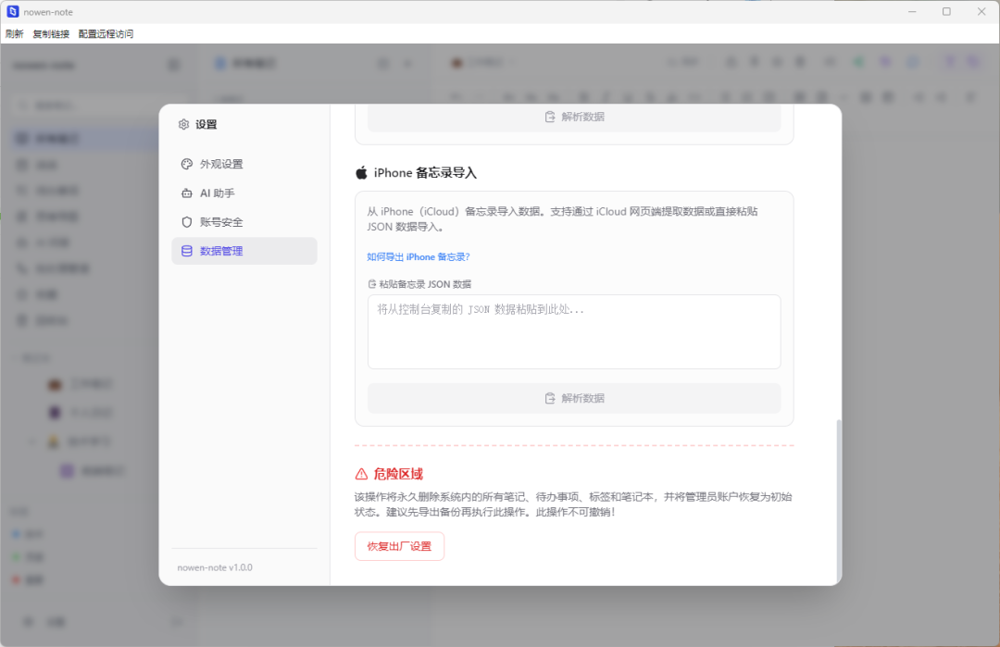

解析导入

回过头来看看编辑器，编辑器用的是富文本，不过测试了一下支持部分的Markdown语法，编辑器的功能也是非常齐全，表格、图片、代码块等等常用的都支持，同时也支持AI写作。

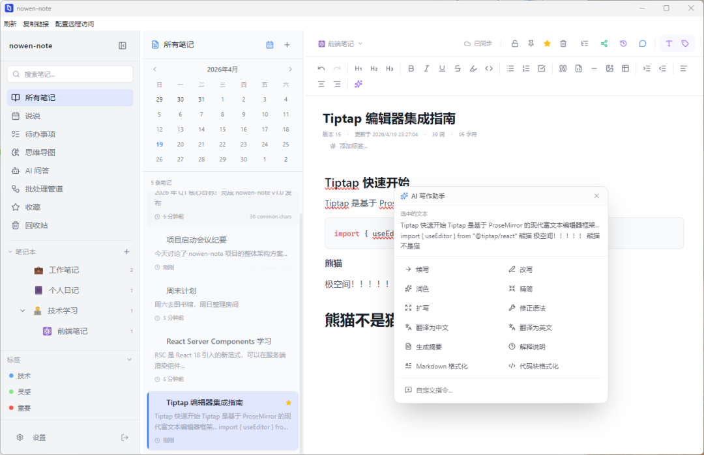

编辑器

说说界面其实就是类似微博的瀑布流信息，这里可以发一些自己的碎片心情或者语录之类的，当成一个自己不对外公开的树洞蛮不错的。

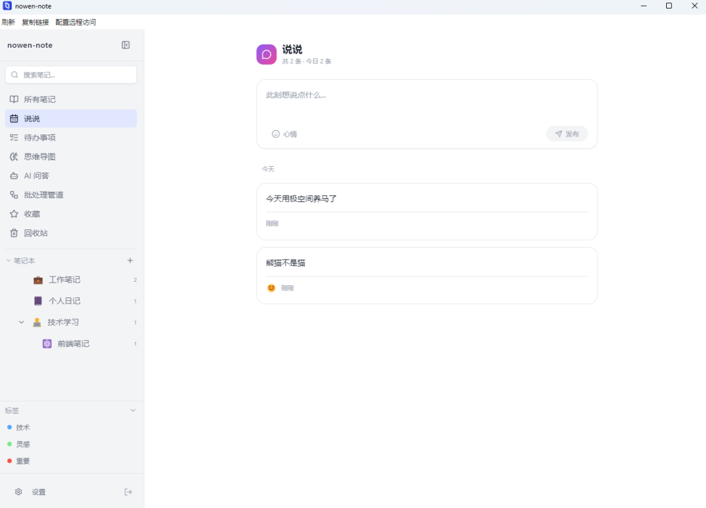

说说

待办事项支持优先级设置、截止日期设置。整个交互非常不错，加上手机端的适配，比专门下载To Do软件方便很多。

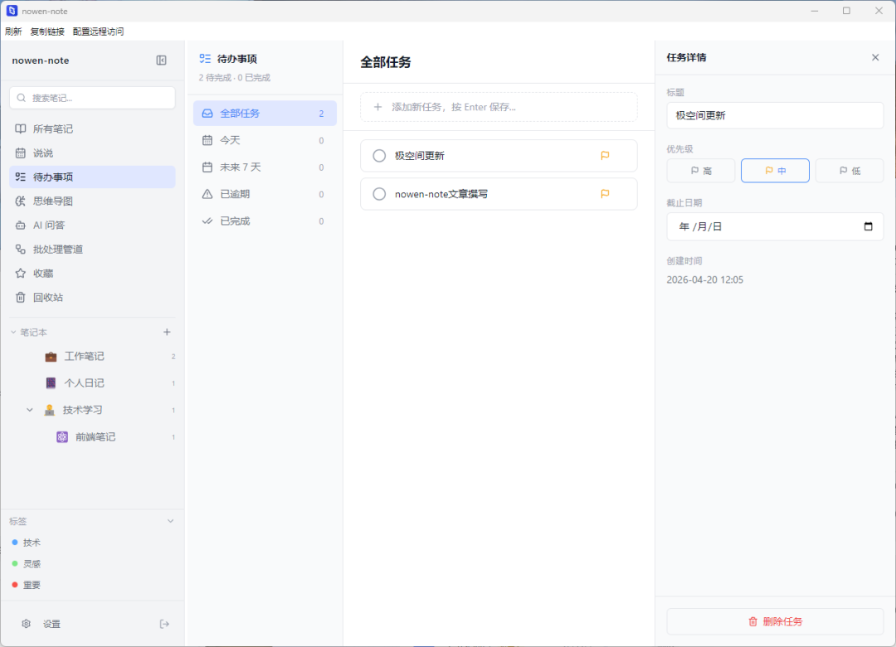

待办

思维导图的功能有点少，目前不能自己编辑节点的链接指向，不过如果只是作为临时使用，或者建一个拓扑什么的，也勉强够用。

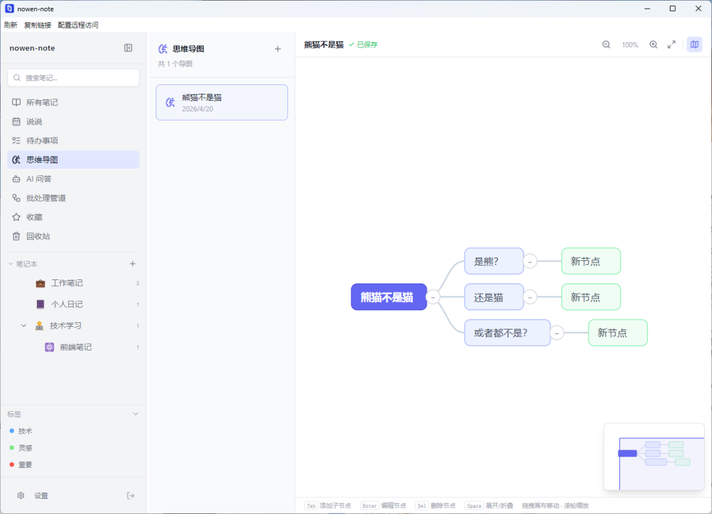

image.png

项目最强大的地方来了，RAG知识库。当你的笔记越来越多之后，AI会自动进行索引，这时候你有任何的问题都可以在AI问答这里提出，他会检索当前你的所有笔记，随后根据内容进行问答。

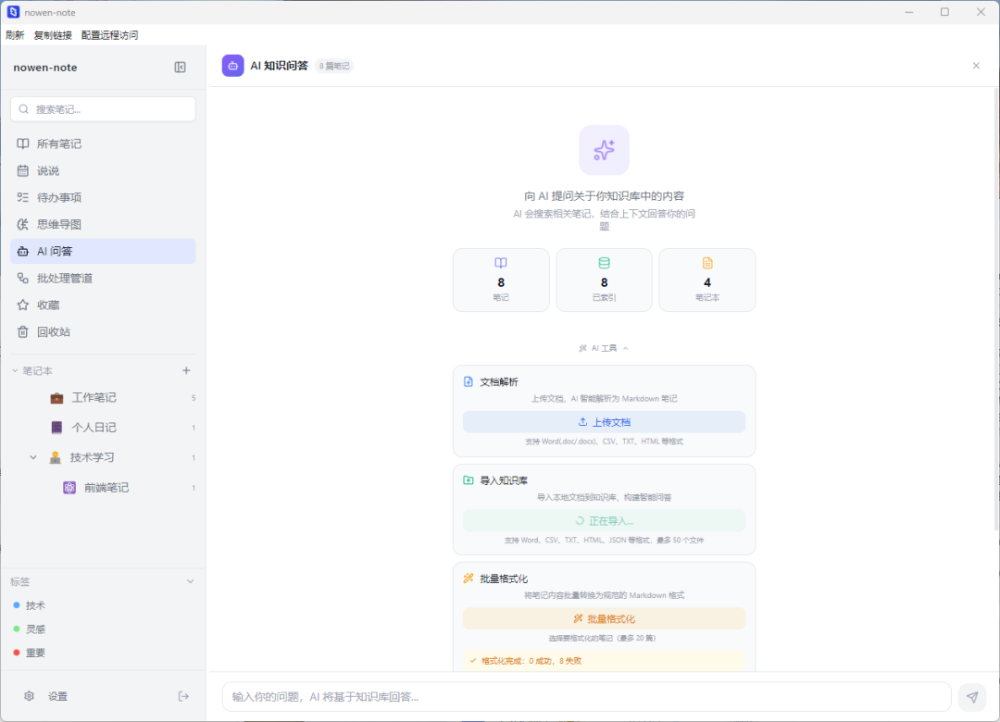

知识库

除了基于当前的笔记，也可以手动上传文件以及批量处理当前的笔记将其统一成Markdown格式，方便AI进行内容解析。

输入内容AI就会给出对应的检索答案，同时在下方也会列出对应的参考笔记，所有内容都是基于你本地的知识库。

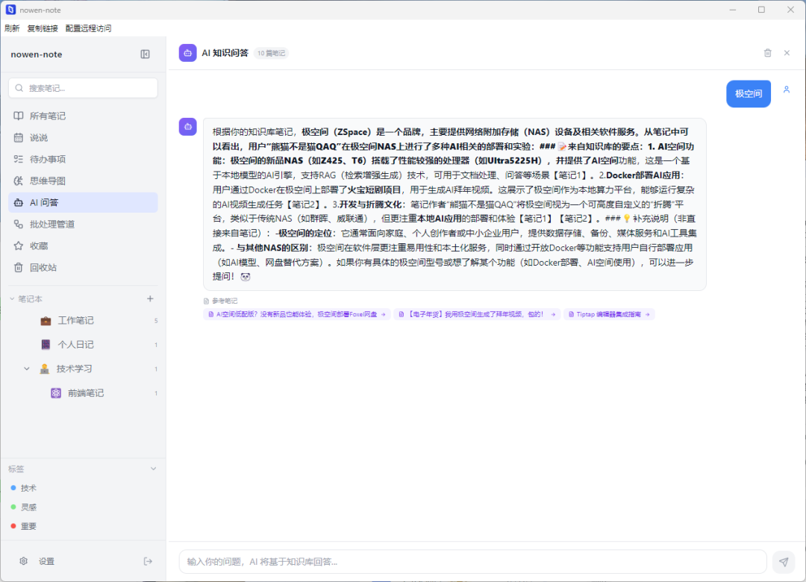

AI问答

最后还有个重点功能，批处理管道。能把这个设计出来并直接集成在项目中说明作者非常细心了。批处理管道目前支持批量化执行Markdown规范化、AI润色+格式化、笔记摘要生成、翻译以及智能整理。

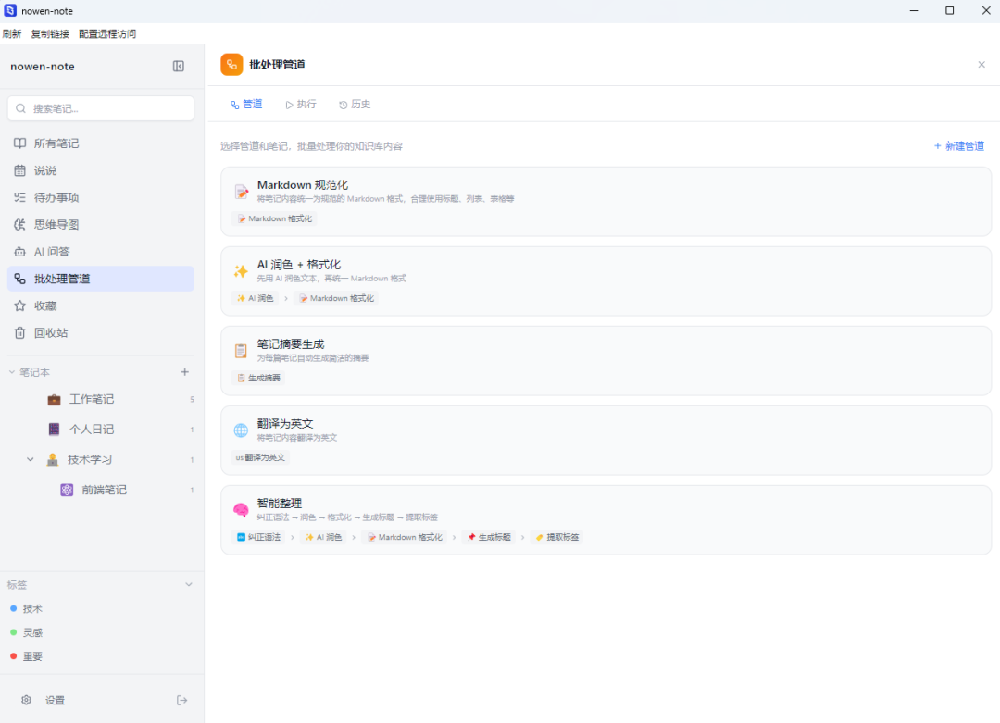

批处理

当笔记足够多之后，可以通过批处理来批量处理内容，就不需要在手动去设置AI来生成，同时这里也支持新建管道，可以定制你想要的自动化程序。

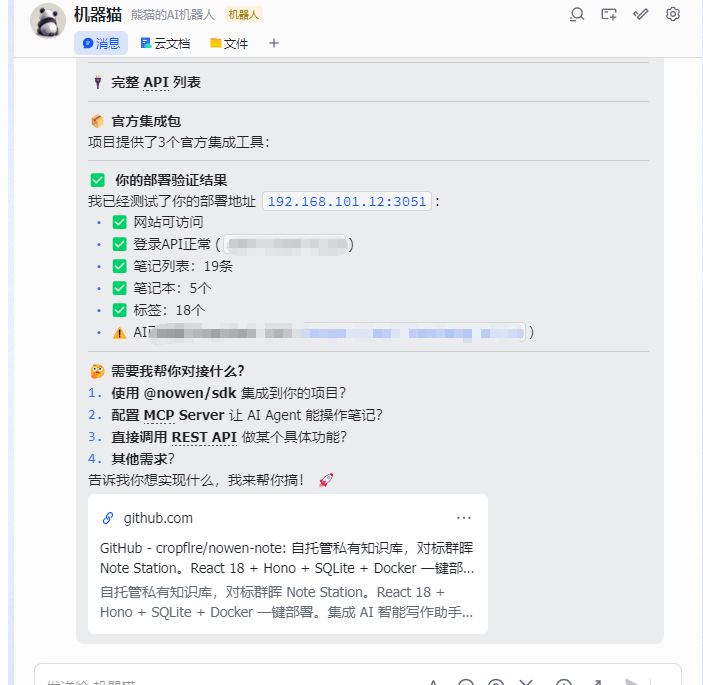

接入agent

除此之外，作者提供了完整的API文档，你可以通过龙虾、爱马仕以及其他agent直接接入它，方便直接通过飞书、微信等渠道进行操作沟通。

# **项目部署**

nowen-note的部署并不难，打开极空间的Docker，来到Compose新建项目，随后输入以下代码：

```
services:  nowen-note:    image: cropflre/nowen-note:latest    container_name: nowen-note    restart: unless-stopped    ports:      - "3051:3001"    volumes:      - ./nowen-note-data:/app/data    environment:      - NODE_ENV=production      - DB_PATH=/app/data/nowen-note.db      - PORT=3001      # Ollama 地址，如需使用请自行部署 Ollama 并填写正确地址      # - OLLAMA_URL=http://host.docker.internal:11434
```

端口如果有冲突记得更改，如果你有用极空间部署ollama本地部署，想要用本地模型来跑AI服务，也可以取消掉环境变量中Ollama的地址，项目会自动识别到。

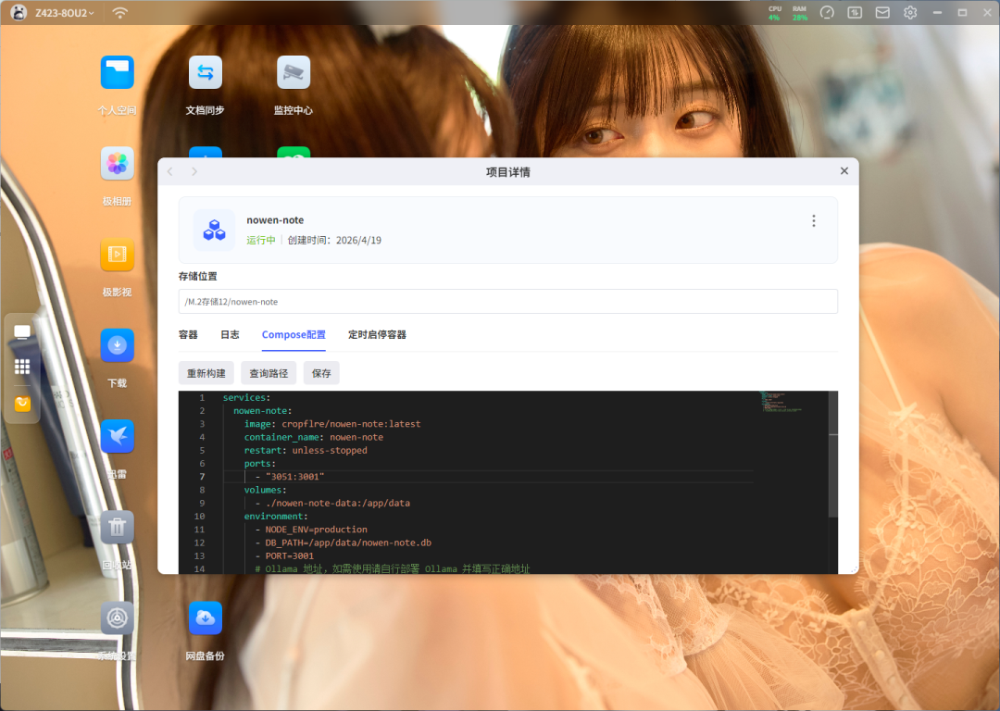

项目部署

最后运行之后通过极空间的远程访问就可以打开登录界面了，默认的账号为admin，密码为admin123，登录之后记得修改。

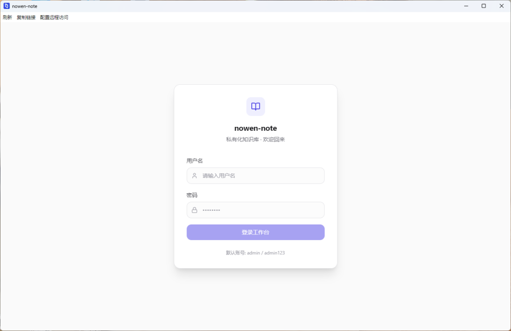

登录界面

# **写在最后**

nowen-note算是熊猫折腾 Docker 这三年来，发现的最适合 NAS 用户"养老"的笔记软件了。

具备三端互通、拥有AI助手、批自动处理功能以及完整的API文档。加上本身的部署也并不复杂，非常适合有笔记需求的用户。


