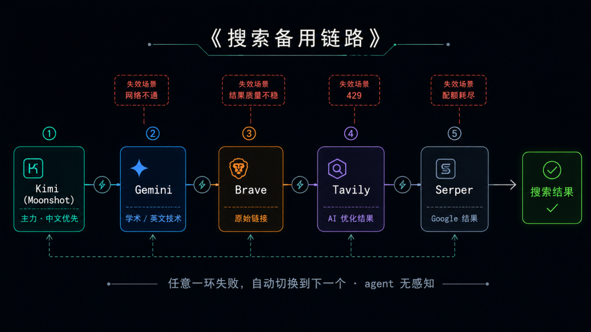
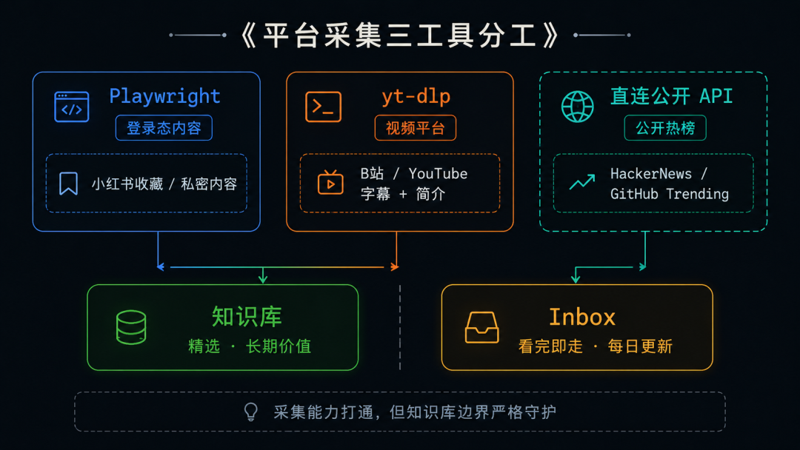
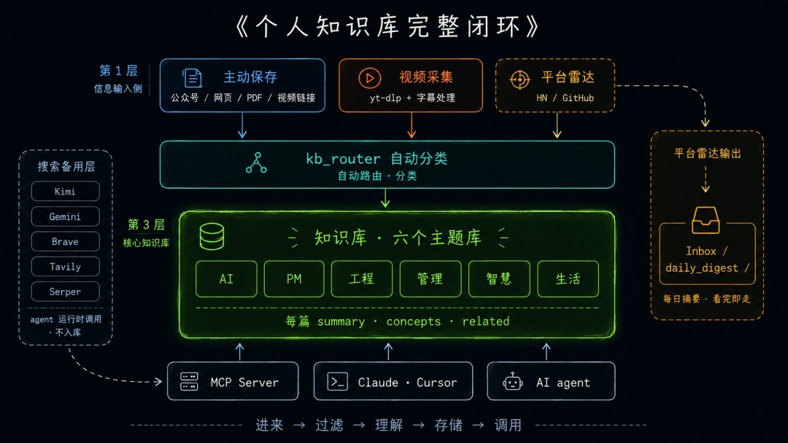
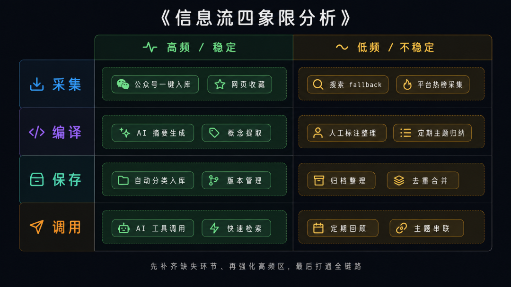

> 📎 来源: [智码探路](https://mp.weixin.qq.com/s?__biz=MzU2NDIyOTUxMw==&mid=2247483812&idx=1&sn=ebe6144320627949b604efaf8627613f&chksm=fd09cf8a73210612f084d2ea56815b1c31bd013b03a7d5754e0eb169e16649e3a8872a8f43fc&mpshare=1&scene=1&srcid=0510vRrBmpkmQQdtLEIWnXh5&sharer_shareinfo=ca4b16b97881f14c65387a0106678748&sharer_shareinfo_first=ca4b16b97881f14c65387a0106678748) | 时间: 2026-05-10 15:58

---

某天让 AI agent 跑一个主题信息收集任务，搜索 API 返回了 429——触发限流，任务中断。

agent 不知道可以换 provider 继续，也不知道还有别的来源。

从技术层面看，知识库系统已经相当完备：公众号文章、全网网页、视频字幕、本地 PDF，全都能存进去，MCP Server 也接好了，Claude 和 Cursor 都能调用。

**但有一层一直没想明白：信息怎么稳定地「流进来」？**

不只是手动保存时能进来，AI agent 自主运行时、没时间一篇篇找时，它也能正常工作。这篇要分享的，就是给这个问题补上的两条管道——以及整个系统串联起来后，它长什么样。

---

## 01 已经解决了什么

先快速过一遍已有的基础，方便新读者接上背景。

| 已解决的问题 | 工具 |
| --- | --- |
| 公众号文章一键入库 | wechat-to-kb（公众号链接 → 本地 .md） |
| 任意网页入库 | web\_collector（通用正文提取） |
| 视频字幕入库 | video\_collector（yt-dlp + 字幕处理） |
| 小红书收藏批量入库 | xhs\_collector（Playwright session 复用） |
| 旧云笔记 / 本地 PDF | 有道迁移 + PDF 价值评估入库 |
| AI 工具统一调用知识库 | MCP Server，一次接入，到处能用 |

这些都是手动触发的场景。还有两个问题悬而未决：一是搜索单点故障——一个 provider 429，任务就卡死；二是定期感知——想追踪热点，但不想每天手动去扒。

---

## 02 搜索备用链路：不是为了搜更多，是为了不中断

五个 provider 各有死穴：

- Kimi 高频调用时容易触发 RPM 限流
- Gemini 中文支持不稳定，某些网络环境下请求不通
- Brave 返回原始链接，不做 AI 处理，内容质量参差不齐
- Tavily 在财经类查询上有优势，通用场景覆盖不足
- Serper 本质是 Google 搜索，配额用完就停

单独用任何一个，一旦遇上它的死穴，任务就卡住了。

**解决方案其实很简单，但要工程化地实现它**：按优先级排一个 fallback 链，当前 provider 失败，自动切换到下一个，直到有一个成功返回。

```
搜索请求进来  → 先试 Kimi，成功就返回  → Kimi 挂了（429/网络不通），自动切 Gemini  → Gemini 也挂了，切 Brave → Tavily → Serper  → 全挂了？抛一个明确的错误，任务不沉默卡死
```

关键在于：**切换对 agent 透明**。agent 只知道调用了「搜索」功能，不知道底层换了哪个 provider，不需要改任何 prompt 或任务逻辑。这是基础设施该干的事。

同时写了 

```
验证脚本工具
```

，一条命令跑通所有 provider，打印哪些能用、哪些 429——30 秒内掌握搜索层状态。

> **单一搜索 provider 是 AI agent 任务的单点故障。多 provider fallback 不是锦上添花，而是基础设施。**



---

## 03 平台自动采集：打通即止，克制才是设计

还有另一类需求：定期感知平台内容，让系统帮我盯着。

项目里**已有两套采集方案**，只是没当成「平台自动采集」来用：

**Playwright（已有）**：小红书收藏，session 复用，稳定可靠。

**yt-dlp（已有）**：视频字幕，不需要 API Key。

```
platform_collector
```

 直连公开 API：HackerNews 走 Firebase 接口、GitHub 走 Search API，不需要 API Key。实测：HN 和 GitHub Trending 各 20 条，30-60 秒完成。

知乎因为官方 API 加了鉴权，暂无可用方案。

#### 这层数据去哪？是这个设计里最重要的判断

我最开始的想法是直接入库。每天抓一次热榜，存进 

```
AI_KnowBase/_stage/
```

，定期整理。

**后来否掉了这个方案。**

知识库的核心价值，在于它是精选的。存进去的文章，是读完觉得值得留下来的内容——有完整的 summary、concepts、关联文章，是经过「编译」（提取、结构化、关联）的。如果把每天 40 条热榜快照都塞进去，一个月后知识库里多了 1200 条没有经过筛选的条目，检索质量会急剧下降。

**热榜的正确定位是「信息雷达」，不是知识库内容。**

如果你需要的是**自动化情报收集**——热榜→AI处理→自动入库——这套基础设施完全支撑。我只是选择了**克制**：看完总结就走，不自动入库。**系统能做全自动，但我选择半自动**——这是主动选择，不是技术限制。

所以改成了这个设计：每天跑一次采集，调用 DeepSeek API 做聚合摘要，生成一份「今日技术动态」，放进 

```
Inbox/daily_digest/
```

 目录：

```
# 技术动态摘要 · 2026-05-06## 今日主题今日热榜围绕三个方向：AI 代理的成本权衡、Chrome 静默安装 AI 模型的隐私争议、开源工具的 USB-C 检测。## 值得关注的亮点- Computer Use 比结构化 API 贵 45 倍——如果你在考虑用 AI 代理自动化任务，  这篇是必读的成本基准- Google Chrome 静默安装 4GB AI 模型——今日 HN 最热，924 条评论……## 如果只有 10 分钟优先看这两篇……（附原文链接）
```

扫一眼，5 分钟内看完今天值得关注的技术动态。看到感兴趣的，点进原文；真正值得留下的，再手动入库。**Inbox 看完即走，知识库保持干净。**



> **不是因为做不了自动入库，而是自动入库会破坏知识库的精选定位。打通了能力，克制地用，才是对的设计。**

---

## 04 把所有东西串起来：完整闭环

做完这些之后，我把整个系统画了一张图，第一次看清楚了它的全貌：



**四层各干各的事：**

**主动保存层**：你看到了、决定存，手动触发，进知识库对应分类。这是主线，质量最高。

**搜索备用层**：agent 自己跑任务时用，5 个 provider 自动切换，agent 感知不到切换，它只管拿到结果。这层不写入知识库，只是 agent 的实时信息来源。

**视频采集层**：视频链接进来，yt-dlp 抽取字幕和简介，结构化后入库。这条线和主动保存层合并，走同一个路由。

**平台雷达层**：定时运行，感知技术动态，AI 摘要后进 Inbox，不入知识库。是「过滤器」，不是「仓库」。

每一层的边界都很清晰，互不干扰。最重要的边界是：**搜索层和雷达层的内容，不直接进知识库**。知识库里的内容，每一篇都是你主动决定留下来的。

画出来之后才意识到，这已经是一套完整的个人信息处理系统：**进来 → 过滤 → 理解 → 存储 → 调用**，每步都有对应工具和清晰边界。

> **知识库的价值上限，不只由「存进去的内容质量」决定，也由「噪音有没有被拦住」决定。**

---

## 05 给你的三步参考

**第一步：排查搜索单点，配置 fallback 链**

如果你在用 AI agent，先问自己：它的搜索是靠一个 provider 支撑的吗？遇到 429 或网络问题会怎样？

按优先级配一条 fallback 链，当前 provider 失败自动切下一个，直到有结果返回。关键是**切换对 agent 透明**——它只管调「搜索」，不感知 provider 变化。

**第二步：想清楚「自动采集」的边界**

你是真的需要大量内容自动入库，还是其实只需要一个「信息雷达」——定期扫一眼热榜，按需人工筛选？后者往往够用，而且保持了知识库的信噪比。**把「打通能力」和「大量使用」分开想**，是这类工具最容易踩的坑。

这个判断决定了两件事：一是技术实现路径（直连 API vs 浏览器自动化），二是数据流向（直接入库 vs Inbox 暂存）。想清楚了再写代码，比写完代码再回头改架构容易十倍。

**第三步：用「信息流四象限」发现缺失环节**

单纯梳理工具还不够，先把知识库信息流拆成四个核心环节，把现有工具填进去，看哪一环是空的：

| 环节 | 做什么 | 示例工具 |
| --- | --- | --- |
| **采集** | 信息从哪来 | 公众号、网页、视频、搜索、热榜 |
| **编译** | 怎么处理 | 摘要提取、概念提取、分类标记 |
| **保存** | 存在哪 | 知识库分类、Inbox 暂存、归档 |
| **调用** | 怎么用 | AI 调用、人工检索、定期回顾 |



这个分析会告诉你三件事：

1. **缺哪块**

   ：某个环节完全没有工具（比如「编译」层只有手动处理），就是能力缺口
2. **弱哪块**

   ：某个环节集中在「低频/不稳定」区（比如采集层依赖多个不稳定来源），就是系统风险
3. **强哪块**

   ：高频稳定区的工具是核心资产，值得重点维护和自动化

发现缺口后，按优先级补全：先补齐缺失环节，再强化高频区，最后打通全链路。

这才是真正的系统思维：看整个信息流是否完整、健壮、高效。

---

**搭工具是容易的，想清楚每层该干什么、不该干什么，是难的。**

---

欢迎关注 **「智码探路」**，持续聚焦 AI 工程与提效工具的一线实践。
