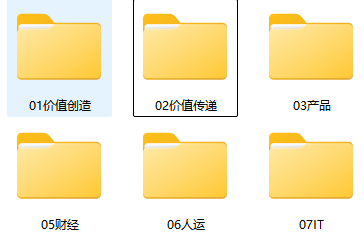
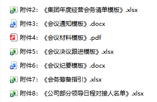
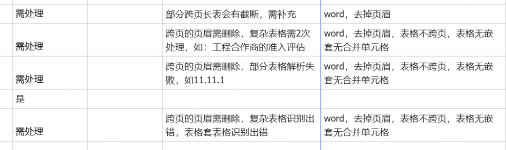

> 📎 来源: [互联网悦读笔记](https://mp.weixin.qq.com/s?__biz=MzA3ODU4MDUyMw==&mid=2451195631&idx=1&sn=6e736c43196f27891776cba5d0c7152d&chksm=89fee6e3d155bd99762568396bd2ea12411bc2c5fc71d2db3d8d5a83eec5ab712a1d1ecdd243&mpshare=1&scene=1&srcid=0420lbatrYxnj2THKfoJFIgo&sharer_shareinfo=1ee141705d65e3e3246734bb93cfc647&sharer_shareinfo_first=1ee141705d65e3e3246734bb93cfc647) | 时间: 2026-04-20 15:47

---

# 去年开始，我就在给几家知名上市公司做AI项目，其中客户需求量最大、要求最高的，当属企业知识库项目。

#

下面我要讲的，就是给一家企业做知识库项目的真实案例。

最开始，客户还是很积极配合的。在我进场调研之前，还提前发来了一套知识文档，说是他们团队已经整理好了，让我先看看。

我当时还挺开心，觉得这客户配合度不错，省了不少沟通成本。

结果打开一看，笑容逐渐消失

……

一共194个文档、45个文件夹，一个一个看完后发现，问题不是一两个，是成片成片的……

**先说分类**。有的文件夹是按"目的"建的，比如"价值创造类"、"价值传递类"；有的又是按业务类型分的，比如"产品"、"财经"。两套逻辑混在同一层目录里，你根本搞不清一份制度文件到底该归在哪。有些文档两边都能放，结果就是放了这边丢了那边，怎么都不对。

**再说格式**。Word、PDF、PPT、Excel、图片、视频，什么都有，简直像开了个文件格式博览会。最离谱的是，有些培训文档就是纯图片——不是在Word里插了张图，是整份内容就拍了几张照片存着。还有高管在行业峰会上的报道文章，也是图片形式的PDF。这些东西如果想让AI能理解能引用，全得先转成文字版才可以。光是想想这个工作量我就头大。

**然后是应用场景**。有的文档确实是拿来做问答的FAQ，有的是参考性的知识文档，但还有一大堆纯附件——《会议通知模板》.docx、《会议材料模板》.pdf、《会议决议跟进模板》.xlsx，格式多样不说，这些东西本质上就不是"知识"，是业务工具。但客户觉得这些也应该放进知识库里。你跟他解释这些不太适合直接给AI做问答，对方会很困惑："那这些放哪？"

**最后是版本**。同一个文档名出现了三个版本：一个写着"对外版"，一个标了"24年版"，还有一个是"25年最新版"。我问业务方哪个算正式口径，对方想了想说："AI自己不会判断么？我们的政策都是每年更新的，但新政策是在老政策上做的补充，所以新的老的都需要"。但问题是，"24年版"和"25年最新版"在好几个关键条款上的表述完全不同。要是AI引了旧版本的内容去回答员工或客户，那就不是准不准的问题了，而是会直接让公司崩掉。

我花了3个大夜，逐一看完了这194份文档，写了一份完整的整改意见，把每一份文档的问题类型、处理建议、优先级，都标了出来。

写完之后我自己都觉得有点崩溃。不是因为工作量——是因为我知道这才刚刚开始

。

果然，进场第一天就确认了一个让人窒息的事实：之前客户发来的那194份文档，只是他们全部项目资料的十分之一

。

那一刻我意识到，这个项目真正花时间的地方，不是搭一个问答智能体、也不是调一套RAG工作流，而是把企业所谓的“知识资料”变成AI能用的东西。

说实话，上面这段经历，并不是个例。

过去一年多，我服务了不同客户，发现几乎每一家说要做知识库的企业，最初的想法都差不多：

"我们有很多文档和资料，你帮我们放进去，让AI能搜能答就行。"

逻辑上听起来没什么毛病。但从实际项目经验来看，这里面藏着一个特别危险的假设——文档就是知识，上传就等于治理。

而现实是什么样呢？

一份过期制度放进去，AI会当成最新规则来引用。员工拿着这个答案去操作，出了问题才发现规则早就改了。

一份口径不统一的材料放进去，销售和财务的人问同一个问题，可能会得到两个互相矛盾的答案，谁也不知道以哪个为准。

一份格式混乱的PDF放进去，文档解析根本看不懂里面的表格、截图和扫描件。结果就是分片混乱、检索错误，模型只能编一个看起来挺像回事、但实际完全不对的答案。

这些问题不是模型推理效果差，也不是检索算法的问题。是喂给它的原料本身就没整理好。

想想看，假设你给一个刚入职的新员工扔一堆没分类、没目录、没版本标记、格式五花八门的资料，然后告诉他"你看完就能上岗了"。就算这人再聪明，他也一脸懵。

是他能力不行么？肯定不是，而是你给他的东西本身就是乱的。AI也一样。

所以我做每个知识库项目的时候，第一件事就是先跟客户讲清楚：

我们现在要做的第一件事，不是搭智能体，而是"做知识治理"。

搭智能体是个技术动作——选平台、传文档、配检索，快的话几天就能完成。

做知识治理是个管理动作——定义什么算知识、盘清知识在哪、搭好分类结构、建好标签体系、设好准入标准、定好谁来负责持续更新。这些事情，往往需要几周甚至几个月。

但如果你跳过后者直接做前者，结果大概率就是：系统搭好了，员工问了一次发现不靠谱，然后就再也不会打开了。

> 企业不是缺知识，而是缺一套让知识变得可用的秩序。

#

# 知识治理到底要治什么

"知识治理"这四个字，客户第一次听到的时候通常会愣一下：治什么？怎么治？我们的知识不就在那吗？

确实在那。但"在那"和"能用"之间，可差了十万八千里。

做了这么多个项目下来，我对这项“脏活累活”也有了些心得。

总的来说，做知识治理，就是要回答六个问题。这六个问题如果你在项目前没想清楚，不管用多好的模型、多好的平台，效果都起不来。

**第一个问题：什么算知识？**

别觉得这问题简单，真到了企业里面，这件事比想象的乱得多。

有人觉得公司制度文件是知识，有人觉得FAQ才算，有人觉得产品参数、历史案例、术语解释也应该包含进来，还有人会把附件模板、培训视频、甚至高管在年会上的讲话稿统统丢进来说"这些也要放进知识库"。

每个人说的都有道理，但如果不先统一口径，后面就会变成什么都往里塞，塞完之后系统臃肿不堪，检索出来的东西驴唇不对马嘴。

所以在每个项目启动后，我都要先和客户一起去定义知识的边界，明确知识的具体类型。

比如把知识按：制度规范类、业务流程类、产品服务类、术语口径类、问答经验类、案例与模板类去归类，而不同类型的知识，后面的处理方式、入库标准、调用场景全都不一样。

这一步看起来就像就是列了个清单，但它的价值在于，让所有人有了共同语言。不然你说的知识和我说的知识根本不是一回事，后面所有讨论都是空谈。

而且你在做这一步的时候，往往还会帮客户发现一个事实：他们以为放进来的都是知识，实际上有相当一部分只是附件和工具，根本不适合让AI直接引用。把这些东西提前剥离出去，后面会省很多不必要的麻烦。

**第二个问题：知识在哪？**

企业最不缺的就是文档。但你真要去找某一份具体的知识，经常会发现找不到、找不全、或者找到了好几个版本不知道用哪个。

为什么？因为知识散在各处。

有的在公司OA系统里，有的在某个部门的共享盘里，有的在某个同事的个人电脑里，有的在某个微信群的聊天记录里，还有的根本就不在任何文档里——它在某个干了十几年的老员工脑子里，他走了这个知识就没了。

更头疼的是，同一个问题不同部门的说法还不一样。你去问销售部这个产品的价格体系是什么，和去问财务部，可能会得到两个不同版本。谁的是正式口径？问到最后经常是谁也说不清楚。

所以我在项目前期要下场做的一件非常“重”的工作，就是帮企业做一次彻底的知识盘点。要帮他们搞清楚：现在到底有哪些知识资产？分别在哪？属于哪个部门的哪个条线？谁在负责维护？哪些是正式口径、哪些只是经验材料？哪些可以直接入库、哪些必须先清洗改写？

这件事特别耗时间，而且做的时候你会不断发现新问题——原来这份制度已经废止了、原来那份流程图是三年前的版本、原来这个口径总部和分公司理解完全不一样。

但不做这个盘点，后面做的所有目录、标签、权限、更新机制，全都是空谈。你连知识在哪都没搞清楚，谈什么知识管理？

**第三个问题：怎么放？**

很多企业做知识库，就是在平台里建几个文件夹，然后把文档往里面拖。跟你在自己电脑上管文件夹的方式差不多。

这样做的结果就是：刚开始还行，放了几十个文档觉得挺整齐的；等到文档数量过了几百上千，整个结构就彻底乱了。你根本不知道一份新文档该往哪放，搜索出来的结果也越来越偏。

面对这类问题，我给企业的方案是：在项目一开始就要搭一套结构化的知识目录树。这套目录结构不是简单建几个文件夹，而是要同时考虑如下三个维度：

- 组织维度——总部的知识、分公司的知识、不同部门的知识，要有清晰的归属。
- 业务维度——产品、销售、运营、风控、合规、客服、人资，不同业务线的知识天然就不该混在一起。
- 功能维度——这份东西是制度？是流程？是模板？是FAQ？是案例？是术语解释？不同功能类型的知识，后面的调用方式完全不一样。

你把这三个维度交叉起来，知识该放哪里就非常清楚了。

这样的设计还有一个好处：后面不管是做权限管控、做场景化检索、还是给不同的智能体分配不同的知识域，都有了清晰的基础。不然越堆越乱，到最后谁都不敢动，一动就怕把什么东西弄丢了。

**第四个问题：怎么找？**

光有目录树是不够的。目录解决的是"大结构"，但用户真正用的时候，靠的不是一层一层翻目录，而是搜索。

搜索准不准，很大程度上取决于你的标签体系设计得好不好。

很多人一听"标签"，觉得就是从文档里抽几个关键词嘛，能有多复杂？这事儿让AI自动做行。

实际上复杂得很。真实项目里设计的标签体系，绝不只是业务主题这一个维度，而是会包含：业务条线标签、部门标签、场景标签、文档类型标签、适用对象标签、权限标签、时效标签、版本状态标签，有时候还要加上地域标签和渠道标签。

为什么要搞这么多维度？因为标签不是给人看的，它是给AI系统用的筛选器和路由器。

比如你有一个只服务销售部门的智能体，它就只需要调用带"销售"标签的知识，而不是把人资部门的制度也扔给它。

比如一个制度文档已经过期了，通过时效标签就可以自动把它从检索范围里排除掉，不用等到有人发现"AI又引用了一份旧制度"再手动去处理。

再比如同一个知识，面向内部员工和面向外部客户的口径可能不一样，通过渠道标签就可以控制不同场景下AI调用的是哪一份内容。

标签这件事说起来不难，但设计起来特别考验你对业务的理解深度。而且很多时候，你还得把平台本身的检索能力限制也考虑进去——并不是你想设什么标签平台就能支持什么过滤规则。这里面的匹配和妥协，也是一个很耗精力的过程。这件事如果你有兴趣听，我后面再单开文章讲讲。

**第五个问题：什么能进？**

很多供应商给企业做知识库都有个默认心态：客户给什么就放什么，先放进去再说，后面慢慢优化。

我的做法则正好相反。我会先设一道准入标准，不是所有文档都有资格进入知识库的。

每份材料我都会先抽检一遍：这个东西是不是正式有效的？是不是最新版本？口径是不是和其他材料统一？内容是不是适合被模型直接引用？有没有歧义、缺页、扫描质量太差看不清的？有没有内容冲突——同一个问题这份文档说的和那份文档说的不一样？是不是需要先改写成标准FAQ或者结构化的条目？

这件事说白了，就是在帮企业做知识资产的筛选和质检。

我接触过的大多数企业觉得AI项目效果差，并不在模型选型、RAG参数设置和提示词逻辑，大部分问题都出在输入端。你喂给模型的东西本身就有毛病，它怎么可能给你正确答案？

**第六个问题：谁来管？**

这是个最容易被忽略、但却决定了知识库能不能长期活下去的问题。

我见过太多知识库项目，建的时候热热闹闹，上线发布会都开了，领导也很支持。结果过了两三个月，没人维护、没人更新、没人处理员工反馈的“点踩”。制度改了知识库里还是旧的，业务流程调了知识库里还是原来的，新产品上线了知识库里根本没有。

员工用了一次发现不靠谱，就再也不会打开了。然后项目就悄无声息地搁浅了。

所以我在做方案的时候，"知识运营体系"永远会是单独的一个大章节。里面要完整回答这些问题：

谁负责新增知识？谁负责审核？谁负责发布上线和下线旧版本？多长时间复盘一次？员工反馈说"这个问题答得不对"的时候，这个反馈怎么回流到知识维护流程里？哪些问题命中率低说明知识库里缺了这块内容？哪些问题反复答错说明口径需要修订？

这些东西本质上是在做运营规划，但它实际上决定了你的知识库到底是活水系统，还是个上线就开始老化的静态文件仓库。

坦率说，知识库从上线那天起，真正的工作才刚刚开始。前面的建设只是打地基，后面的运营才是决定这个项目到底能不能长期活下来的关键。

# 为什么知识治理是最典型的脏活累活

#

看到这里你可能已经发现了，上面说的那六件事，没有一件是多高深的技术活。

它们全都是沟通、协调、整理、推动、确认、纠偏。

而且在真实项目里，这些工作的推进阻力，远比你想象的大。

业务部门不愿意配合交材料。他们自己的KPI已经够重了，还要抽时间整理文档、确认口径、补充缺失内容。很多人心里想的是"这不是AI项目的事吗，跟我有什么关系"，嘴上不说，但配合度你能感受到。催了三遍材料还没给的情况，我遇到过不止一次。

材料好不容易交上来了，格式五花八门。有Word的、有PDF的、有PPT的、有Excel的，还有拍照截图的。有些关键信息藏在一张图里，有些规则写在一个Excel表格的某一列。想让AI能读懂这些，全都要先一个一个做格式转换和内容提取，纯体力活。

同一个知识，不同部门说法不一致。你问这边是这个规则，问那边又变了。到底以谁的为准？问到最后经常是一群人坐在会议室里讨论半天，才确认下来一个正式口径。一个知识点就能耗掉一个下午，而这样的知识点可能有几百个。

最头疼的还不是这些。是没人愿意负责持续维护。建的时候还挺积极，大家配合度也还行。但一旦上线了，这件事在很多人心里就"结束了"。至于后面谁来更新、谁来审核、过期内容谁来下线——没人主动认领。

我在项目中遇到过最典型的一句话，是一个业务同事非常直接地说：

> "为什么一定要我们改文档格式？要是我们改好了，还要AI干什么？"

这句话乍一听可能觉得有点好笑，但它背后反映的是很多企业对知识库项目的一个根本误解：

他们以为AI可以直接消化任何形态的原始资料，就像一个什么都能看懂的超级员工，你把东西扔给它就行了。

但实际上肯定不是这样。AI不是人，但现在的很多文档是写给人看的，不是给AI准备的。AI需要标准化输入、才能给出稳定输出的系统。你不把原料准备好，它做不出好菜。

还有一个让我印象深刻的场景。我给客户写完那份知识整改意见后，对方的反应不是感激，反而觉得压力很大。他们觉得我给他们增加了很多额外的工作量。尤其是当我提出需要他们配合提供评测集——也就是一组用来验证AI回答准确率的标准问答——的时候，对方明显不太想配合了。

在他们看来，"我们花钱请你来做AI项目，结果你让我们自己先干一堆活"，这跟他们最初的预期完全不同。

但事实就是这样。知识治理不是AI供应商或者咨询顾问一个人能完成的事情，它本质上需要企业内部真正参与进来。因为那些知识在你们的系统里、在你们的人脑子里、在你们各个部门的默契和习惯里，外部的人只能帮你搭框架、建方法、推流程，但具体内容的确认和维护，最终只能是你们自己来做。

> 很多企业以为自己在买一个智能问答系统，实际上是在被迫补一堂迟到了很久的知识管理课。

这句话可能不太好听，但做过几个项目之后，我几乎可以确认这就是现实。

# 我的几个核心经验判断

#

做了这么多知识库项目，很多感受是被我反复被验证过的，简单总结如下：

**第一，知识库项目里，最难的是解决知识混乱问题。**

客户表面上是想"做个问答智能体"，实际上要解决的往往是资料散、版本乱、口径冲突、权限复杂、更新没人管等问题。真正的工作重心是整理和治理，而不是那个问答对话框本身。

**第二，知识治理不先做，后面的问答准确率很难靠模型来补。**

模型可以帮你润色表达、优化措辞，但它没办法替你判断这份资料是不是最新的、口径是不是统一的、权限是不是正确的、哪份文档该优先生效。这些问题不解决，你后面只能不停地调Prompt、改检索策略，但根因不在那。你在下游怎么折腾都没用，因为上游的水就是脏的。

**第三，标签体系比很多人想的更重要。**

目录树解决的是知识的大结构，但标签体系决定的是检索精度、权限路由、场景过滤和渠道适配。在这件事要上花的时间，通常不比搭目录树少，因为它直接决定搜索的精准度和权限的可控性。

**第四，知识库必须有运营机制，否则一上线就等于失效了。**

这一点前面已经说过了，但我还想再强调一次。因为我见过太多项目，建设阶段做得非常认真，上线的时候效果也不错，结果三个月之后整个系统就废了。因为没有人对准确性负责。知识在变，世界在变，你的知识库不变，它就不可能一直准。

**第五，知识治理的难度，远大于搭一个问答界面。**

知识库项目的核心工作并不只是搭系统、选平台、调模型，那些东西可能一两周就搞定了，真正消耗三个月、半年甚至更久的，全是治理层面的事——盘知识、搭结构、做标签、定标准、推运营、协调各个部门。这些工作脏、碎、累，在演示里也看不出来，但它们恰恰决定了项目最终能不能真正用起来。

最后说一条，也是我做这么多项目下来感触最深的：

**知识治理本质上不是AI问题，是企业内部管理问题。**

很多客户一开始以为自己在做一个AI项目，做着做着才发现，原来自己要面对的是知识管理、流程标准化、责任分工、版本管理这些基础课。这些事情过去十几年一直没人认真做，因为靠经验、靠人情、靠老员工的默契，也能凑合着运转。但现在你要把知识交给AI来用，AI不会脑补、不会揣摩、不会理解潜规则，它只认标准化的输入。

所以AI做的，是把原来藏着的问题暴露出来了。

# 写在最后

#

回头来看，我做知识库项目花时间最多的地方，就是帮企业把那些散在各处、格式混杂、口径不一、版本混乱、没人维护的东西，一点一点理出来，变成一个有结构、有标准、有人管、能持续运转的体系。这些工作在PPT里体现不出来，在演示的时候也展示不了，客户汇报的时候更不会拿这些去讲。但恰恰是这些不起眼的基础工作，决定了一个知识库项目到底是"上线即巅峰"，还是真正能长期为业务创造价值。

这可能是今天企业做AI项目最普遍的一个现实：

表面上你买的是一个AI能力，但真正要做的，是检查你的知识资产有没有被认真整理过，你的流程有没有被清晰定义过，你的信息管理有没有人真正在负责。

这些问题不前置解决，后面不管换什么模型、什么平台，都很难真正看到效果。

如果你也正在推进知识库项目，不妨先问问自己：

你们的知识，真的准备好被AI使用了吗？

如果这个问题你现在还不清楚，也许可以先把现状拿出来和我聊聊，有时候一个外部顾问视角的判断，能帮你少走不少弯路。

我是申悦，一名企业AI咨询顾问。长期在一线为企业提供AI产品咨询与培训服务，专注企业AI能力导入、流程再造和数字化转型。欢迎加我好友，聊聊你的AI困惑。

关注公众号后，回复“目录”，获取全部历史文章；

回复“微信”，加我个人微信

**往期推荐**

[研究完OpenClaw源码后，我的10条使用原则](https://mp.weixin.qq.com/s?__biz=MzA3ODU4MDUyMw==&mid=2451195595&idx=1&sn=42542dde1fc3b4abd5bf9e4cbde3341f&scene=21#wechat_redirect)

[十大步骤、四个反共识：万字拆解 OpenClaw 源码](https://mp.weixin.qq.com/s?__biz=MzA3ODU4MDUyMw==&mid=2451195587&idx=1&sn=2b742fd552a600d07f45be0ba266af10&scene=21#wechat_redirect)

[OpenClaw火了，但现在还不是企业All In的时候](https://mp.weixin.qq.com/s?__biz=MzA3ODU4MDUyMw==&mid=2451195569&idx=1&sn=69bdbb103e0326b63dfb9690bfdf3104&scene=21#wechat_redirect)

[Skills爆火，但企业为什么不敢用？](https://mp.weixin.qq.com/s?__biz=MzA3ODU4MDUyMw==&mid=2451195562&idx=1&sn=a7fddf9ae05c8fb00159b77ef5f240bd&scene=21#wechat_redirect)

[当做AI成为KPI：一位AI产品经理的真实困境](https://mp.weixin.qq.com/s?__biz=MzA3ODU4MDUyMw==&mid=2451195537&idx=1&sn=3d0721a561f941d0a1ef2b1658797292&scene=21#wechat_redirect)

[一次饭局讨论，让我重新理解了对客智能体](https://mp.weixin.qq.com/s?__biz=MzA3ODU4MDUyMw==&mid=2451195465&idx=1&sn=e59e537a7efa5878d2dc9d5d6c1f88be&scene=21#wechat_redirect)

[3个实战案例，拆解企业做销售智能体的常见误区](https://mp.weixin.qq.com/s?__biz=MzA3ODU4MDUyMw==&mid=2451195465&idx=1&sn=e59e537a7efa5878d2dc9d5d6c1f88be&scene=21#wechat_redirect)

[AI项目能跑起来的前提，是先把AI降级](https://mp.weixin.qq.com/s?__biz=MzA3ODU4MDUyMw==&mid=2451195455&idx=1&sn=fd92fa4b83cb736cb357287156543f4e&scene=21#wechat_redirect)

[为什么不少AI问答助手，员工问过一次就不再用了？](https://mp.weixin.qq.com/s?__biz=MzA3ODU4MDUyMw==&mid=2451195450&idx=1&sn=d0326a4fbe0c80c76d7e800599bdcb2d&scene=21#wechat_redirect)

[从智谱|Minimax上市说起：企业做AI，最容易出问题的反而不是技术](https://mp.weixin.qq.com/s?__biz=MzA3ODU4MDUyMw==&mid=2451195445&idx=1&sn=a7681296cda5a3e1436544a10a9dcd34&scene=21#wechat_redirect)

[2025年的回顾：把AI拉回到地面](https://mp.weixin.qq.com/s?__biz=MzA3ODU4MDUyMw==&mid=2451195440&idx=1&sn=92d2391a2503741bb5f2630ebd148d5e&scene=21#wechat_redirect)
