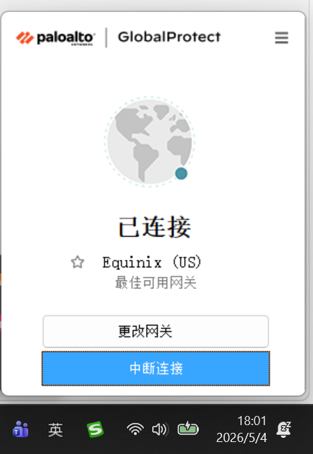
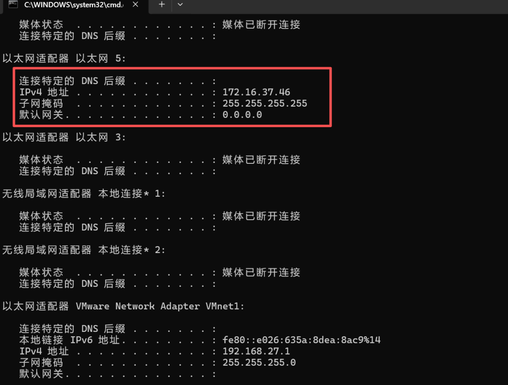
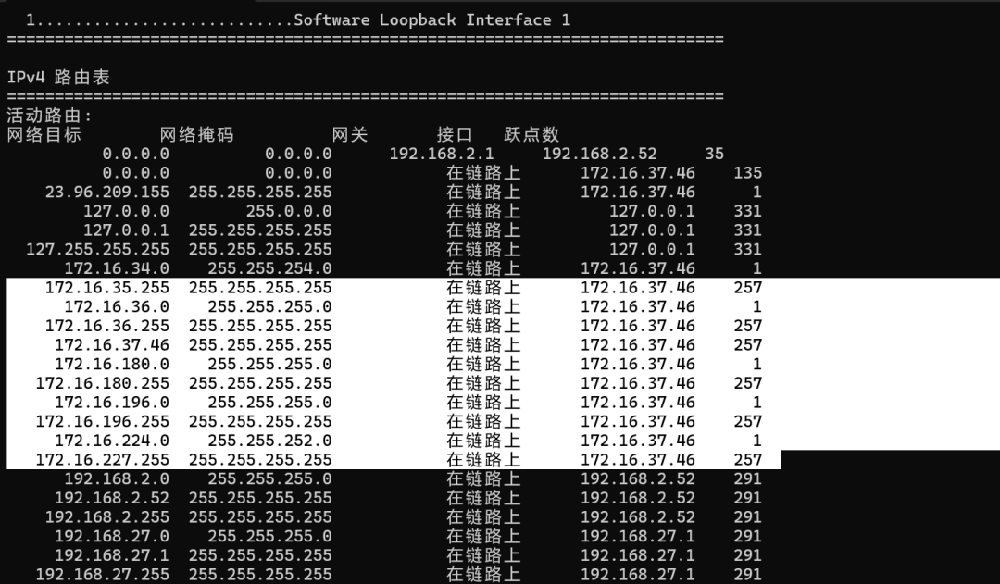
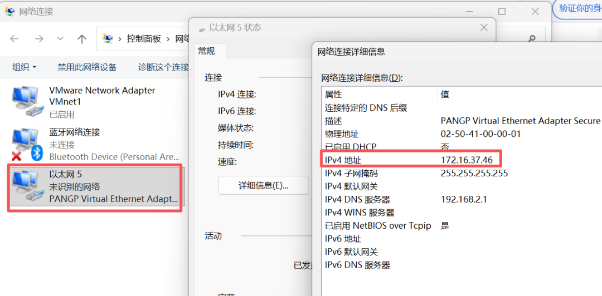
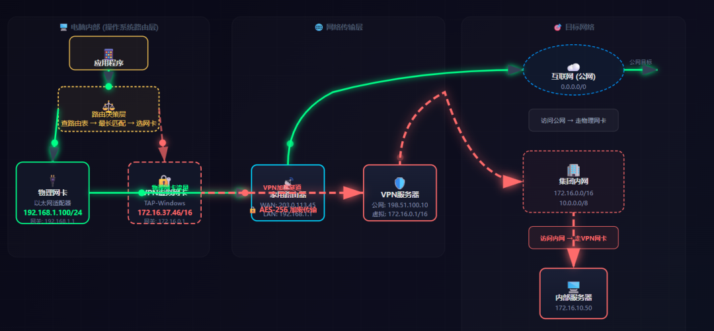
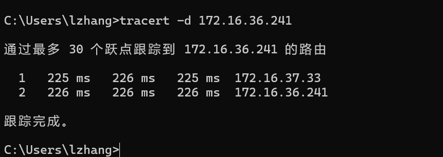
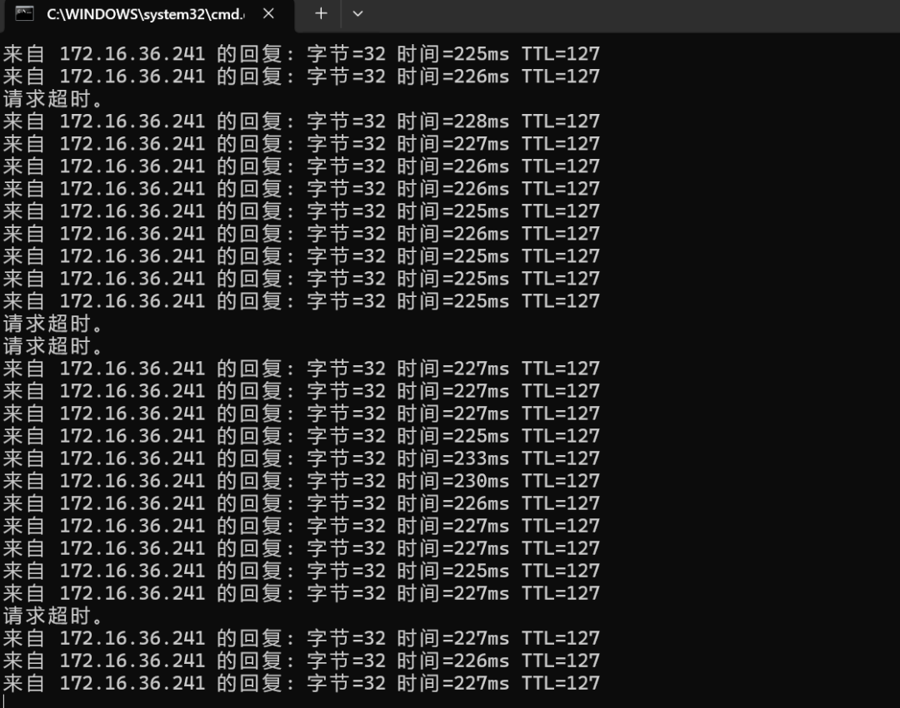
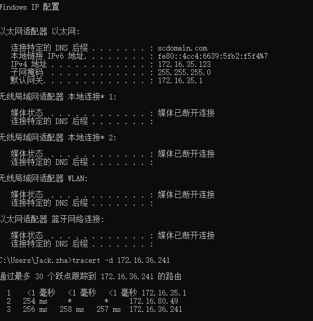
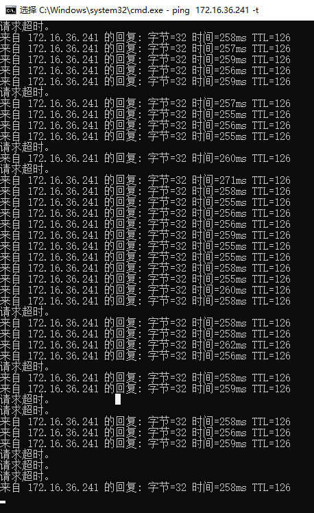
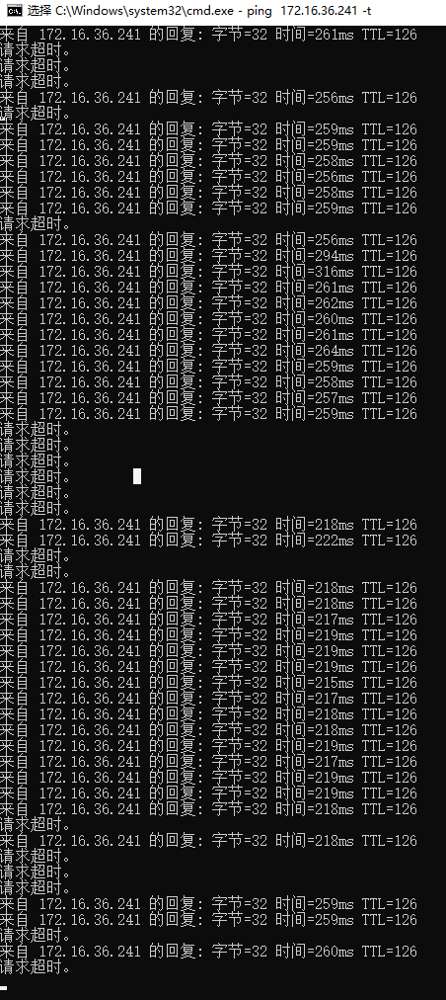

> 📎 来源: [即到哥](https://mp.weixin.qq.com/s?__biz=MzA5NTE0MzA3NA==&mid=2455389930&idx=1&sn=3a050cd7817adf26b74ceedbfd463fab&chksm=86b85d7b9e1fb660ef7777f55da59a872ed7d4aef786bc2e187f3b566e92e2e888e94d85d4c5&mpshare=1&scene=1&srcid=0510W8ks7v7SJuHMSsl4yfEV&sharer_shareinfo=9d5fff4f908df85985da26de2ecc2111&sharer_shareinfo_first=9d5fff4f908df85985da26de2ecc2111) | 时间: 2026-05-10 15:50

---

**点击关注即到哥，带你看更深一层的IT知识！**

************需求描述****

兄弟们，现在有个客户global vpn连接之后，访问公司服务器老是丢包，到底是运营商的问题，还是客户自己搭建的vpn有问题呢？客户的这台服务器在国外，我们来看一下，这个问题，到底有没有解决办法。

********************解决过程********

首先我们使用global vpn连接到公司内部。

正常连接到公司内部。

使用ipconfig查看ip地址，可以看到，vpn获取的ip地址是172.16.37.46。

使用netstat -r打印路由表，可以看到，现在去往集团网段的流量都是走172.16.37.46这个网卡走的。默认路由走192.168.2.252网卡走的。

可以看到vpn网卡的ip地址就是172.16.37.46。

为了更好的让兄弟们理解一下，电脑连接vpn之后这流量到底怎么走的，我做了一个视频。

视频中的vpn服务器，很多都是在网关上的，我这里为了更好的区别，我把它分开了。

当电脑成功连接vpn之后，电脑里面就会有多条网段的路由表，去往集团的流量，电脑怎么知道就要走这个vpn网卡的呢?

我们再看一下，这个电脑中的路由表，可以看到，去往集团的网段，都是走172.16.37.46走的，这个是明细路由表，默认路由表0.0.0.0是走192.168.2.52这个网卡走的。明细路由表的优先级是大于默认路由的。可以看到跃点数，172.16.36.0,172.16.180.0,172.16.196.0等去往集团网段的，跃点数都是1，跃点数越小，流量优先级越高。

那这时有人问了，访问百度为什么不走这优先级高的虚拟vpn网卡走，因为访问百度的ip地址网段，不在这个vpn网卡的这个网段里面。

我们再测试一下，访问集团的服务器，可以看到，直接2跳就到集团的服务器了。没有公网地址，说明流量的确是走vpn走的。

ping集团的服务器，可以看到，现在还算稳定。这个访问集团服务器，是在家里或者手机热点访问的现象。

如果客户在分公司，可以看到ip地址是172.16.35.123，这时电脑就不需要拨vpn，因为分公司和国外集团中间搭建了ipsec vpn。走公司的ipsec vpn，可以看到走的路径和使用global vpn的路径不同。因为global vpn选择节点的时候，有可能不在国内。

当在公司的网络，用ipsec 访问国外的服务器，发现丢包就比较严重，但是延迟基本上都是在200毫秒。

但是在公司访问国外的集团服务器就丢包非常严重。

也测试过了，如果连接分公司内网，然后使用global vpn连接到集团，发现还是丢包严重。

兄弟们，你们说，到底是防火墙的原因，还是ISP的原因？

之前是一直怀疑 ipsec vpn的问题，也测试过了，把分公司的ipsec vpn断开后，使用分公司内网拨global vpn，发现延迟还是210左右，丢包也严重。

这个问题还真不好解决。

相关文章：

- [ssl vpn 公司是移动的网，家里是电信的网，结果连接公司ssl vpn丢包严重，但换成移动的就没有问题！](https://mp.weixin.qq.com/s?__biz=MzA5NTE0MzA3NA==&mid=2455389551&idx=1&sn=3ca167c04946546c282266afd101bf59&scene=21#wechat_redirect)
- [客户的深信服的ssl vpn登录不了，这个问题居然和时间有关系？](https://mp.weixin.qq.com/s?__biz=MzA5NTE0MzA3NA==&mid=2455389280&idx=1&sn=0f132f226be40b17beef869fe19fcae2&scene=21#wechat_redirect)
- [《异地组网方案》万万没想到，现在蒲公英异地组网，已经慢慢的蚕食ipsec等传统的vpn架构？](https://mp.weixin.qq.com/s?__biz=MzA5NTE0MzA3NA==&mid=2455389121&idx=1&sn=f1f053863c9c7f6514bf4571d7c9cca8&scene=21#wechat_redirect)
- [ssl vpn登录后，windows系统可以访问内部资源，但是苹果系统无法访问？](https://mp.weixin.qq.com/s?__biz=MzA5NTE0MzA3NA==&mid=2455387190&idx=1&sn=69d647f5615fee0d984383498f68695a&scene=21#wechat_redirect)
- [客户公司使用的是深信服VPN设备，现在客户的ssl vpn帐号被锁了，如何解锁？](https://mp.weixin.qq.com/s?__biz=MzA5NTE0MzA3NA==&mid=2455386426&idx=1&sn=c371b98fb1160e3635153d1e8d8794c0&scene=21#wechat_redirect)
- [公司什么时候需要用IPsec VPN？什么时候用SSL VPN？今天客户问我，关于两种方案的区别，简单通俗易懂!](https://mp.weixin.qq.com/s?__biz=MzA5NTE0MzA3NA==&mid=2455366433&idx=1&sn=cd8a58d5c565c95892b2139fd209f575&scene=21#wechat_redirect)
- [去年发了一篇PPTP VPN都被老铁觉得太low了，今天发一篇ssl vpn，这个应该不算low了吧？](https://mp.weixin.qq.com/s?__biz=MzA5NTE0MzA3NA==&mid=2455352761&idx=1&sn=a43313ade8c65ae7fc8def2998d9dcae&scene=21#wechat_redirect)
- [TL-WVR308 搭建PPTP客户端到服务器VPN](https://mp.weixin.qq.com/s?__biz=MzA5NTE0MzA3NA==&mid=2455332125&idx=1&sn=770e514acc36bc14435fe375dfb04c13&scene=21#wechat_redirect)
- [老铁，后台留言：想看ipsec配置。对于宠粉这件事情，我必须拿捏到位！一定要收藏，绝对详细！](https://mp.weixin.qq.com/s?__biz=MzA5NTE0MzA3NA==&mid=2455353125&idx=1&sn=75a3db6a574805f05d755be23fd9b66f&scene=21#wechat_redirect)
