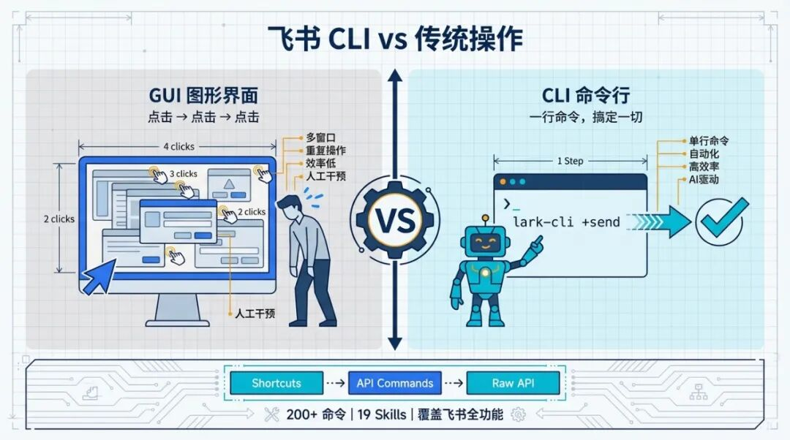

> 📎 来源: [极拓工坊](https://mp.weixin.qq.com/s/F2wT_IPUvHs42aze0--GZQ) | 时间: 2026-04-13 16:15

---

这是极拓工坊的第 31 篇原创！

每天打开飞书，你要做多少次重复操作？

建个文档，点4下。发条消息，点3下。查个日历，再点3下。创建一个多维表格？那得点到手抽筋。

你一天在飞书里点击鼠标的次数，可能比你写代码的次数还多。

但，现在不用了。

2026年3月28日，飞书官方开源了一个叫 **Lark CLI** 的命令行工具。

一句话总结：**你的 AI，现在可以直接操控你的飞书了。**

就很爽。


## 先搞懂一件事：CLI是啥？

如果你是开发者，可以直接跳过这段。

**GUI**（图形界面）就是你现在看到的一切——飞书的窗口、按钮、菜单，你用鼠标点来点去的那些东西。它是为人类设计的，因为人类是视觉动物。

**CLI**（命令行）就是那个黑乎乎的屏幕，你敲一行字，电脑给你吐一行结果。

以前，CLI 是程序员的专属。

但现在，大人，时代变了。

**AI 天生就是用文字交流的。** 它不需要看到按钮，不需要花里胡哨的动画。它需要的是——你给我一个接口，告诉我能做什么，我来调用。

一行命令，一个功能。

所以飞书做了一件很聪明的事：把整个产品**压缩成了一套命令行工具**，让 AI 可以像操作你的电脑一样，操作你的飞书。

## 飞书 CLI 到底能干啥？

先看数字：**200+ 条命令，19 个 AI Agent Skills，覆盖飞书几乎所有核心功能。**

具体来说：

| 能力 | 你能让 AI 做什么 |
| --- | --- |
| 📨 消息 | 发消息、转发、回复、Pin、表情回复 |
| 📄 文档 | 创建、导入导出、Markdown 转飞书文档 |
| 📊 多维表格 | 创建、编辑、数据分析、生成仪表盘 |
| 📅 日历 | 查看日程、创建日程、查忙闲、智能排期 |
| 📧 邮箱 | 读邮件、发邮件、搜索邮件 |
| ✅ 任务 | 创建任务、设提醒、管理子任务 |
| 👥 群聊 | 建群、拉人、管理群设置 |
| 📁 云空间 | 上传下载文件、权限管理 |
| 🔍 搜索 | 搜消息、搜文档、搜应用 |

太牛逼了。

而且它还有一个非常硬核的**三层命令架构**：

- **快捷命令（Shortcuts）**：用 

  ```
  +
  ```

   前缀，人和 AI 都友好，带智能默认值。比如 

  ```
  lark-cli calendar +agenda
  ```

   直接看今天日程
- **API 命令**：100+ 条，跟飞书开放平台 1:1 映射
- **Raw API**：直接调用飞书 2500+ 条 OpenAPI，想用啥用啥

从「帮我看看今天有啥会」到「调用飞书某个底层 API 批量处理数据」，一套 CLI 全覆盖。

## 保姆级安装教程：3 分钟搞定

别怕，真的只需要 3 分钟。

### 前置条件

你需要有一个能跑命令行的 AI 工具。推荐以下任一：

- **Claude Code**（推荐，本文用它演示）
- Codex
- OpenCode
- OpenClaw

同时确保你电脑上装了 **Node.js**（去 nodejs.org 下载安装即可）。

### 第一步：安装飞书 CLI + Skills

打开你的 AI 工具（比如 Claude Code），直接把下面这段话**复制粘贴**发给它：

code

```
帮我装一下所有的东西：https://github.com/larksuite/cli/blob/main/README.zh.md
```

就这一句话，AI 就会自动帮你：

1. 1. 安装飞书 CLI（

   ```
   npm install -g @larksuite/cli
   ```

   ）
2. 2. 安装 19 个 Skills（

   ```
   npx skills add larksuite/cli --all -y -g
   ```

   ）

> ⚠️ **注意**：不要只说"装飞书CLI"，这样可能漏装 Skills。用上面的 Prompt 最稳。

如果 Skills 没装全，手动补一下：

bash

```
npx skills add larksuite/cli --all -y -g
```

### 第二步：创建应用 & 授权

安装完成后，AI 会给你一个**配置链接**，复制到浏览器打开。

这一步你需要手动操作，但非常简单：

1. 1. 打开链接，选一个头像和名字
2. 2. 点击「创建」
3. 3. 完成

没有复杂的后台权限配置，没有开发者文档要翻，**一个按钮就搞定授权**。

### 第三步：登录授权

创建完应用后，AI 会继续跑登录流程，再给你一个授权链接。

复制到浏览器，点击授权，搞定。

**全程不超过 3 分钟。**

### 最后一步（很重要！）

⚠️ **一定要重启你的 AI 工具！**

Claude Code、Codex、OpenCode 都一样——安装完 Skills 后必须重启才能生效。这不是热重载，记得重启。

## 实战：让 AI 帮你操控飞书

装好之后，你就可以开始爽了。

### 场景一：一句话发消息

> "帮我给张三发条飞书消息，告诉他明天下午3点开会，带上项目进度表。"

AI 就会自动调用飞书 CLI，找到张三，把消息发出去。10 秒搞定。

### 场景二：智能排期

> "帮我创建一个明天的会议，邀请产品组的所有人，找一个大家都有空的时间段。"

AI 会自动查每个人的日历，找到空闲时间，创建日程。

以前你得一个一个看别人的日历，现在一句话搞定。

### 场景三：Markdown 转飞书文档

> "把我本地的 README.md 创建成飞书文档，美化一下格式。"

飞书 CLI 会把 Markdown **无损转换**成飞书文档格式，排版都给你搞好。

这个功能真的是刚需，写完文档直接一键同步到飞书，不用再手动复制粘贴了。

### 场景四：多维表格数据分析

> "帮我分析一下飞书多维表格里上个月的销售数据，生成一个可视化看板。"

AI 直接读取多维表格数据，分析完还能帮你建仪表盘。

这个能力以前得开发才能搞，现在一句话就行。

### 场景五：批量群发消息

> "帮我给通讯录里的所有同事发一条消息，通知明天团建地址改了。"

AI 自动遍历通讯录，逐一发送消息。25 个人，1 分钟搞定。



## 为什么飞书这一步走得漂亮？

很多传统产品看的是 DAU、停留时长——你得打开我的 App 才算数。

但飞书反过来了：**把 CLI 开源，让 AI 直接调用，用户可能都不用打开飞书了。**

传统口径上的日活可能会掉，但用户的真正价值反而上升了。

这说明飞书从上到下想得很清楚：**一个效率工具，就应该为用户的效率服务。**

而且飞书 CLI 有个小细节设计得特别好——

一般 API 报错就是 404、502 之类的天书。但飞书 CLI 返回的是：**哪个参数出了问题、具体错在哪里、下一步应该执行什么命令来修复。**

AI 拿到这些信息可以自主重试和修正，不用人工介入。

这才是真正为 Agent 时代设计的产品。

## 写在最后

以前，软件的演化路径是 CLI → GUI。

命令行太难用了，所以有了图形界面，普通人才开始用电脑。

现在，路径反过来了，GUI → CLI。

不是因为我们要回到过去。

而是因为，那个新的「用户」来了。

**这个新用户，叫 Agent。**

飞书 CLI 开源地址：https://github.com/larksuite/cli

去试试吧，3 分钟装好，你会发现一个全新的飞书使用方式。

用 AI 帮你干活的感觉，真的会上瘾。
