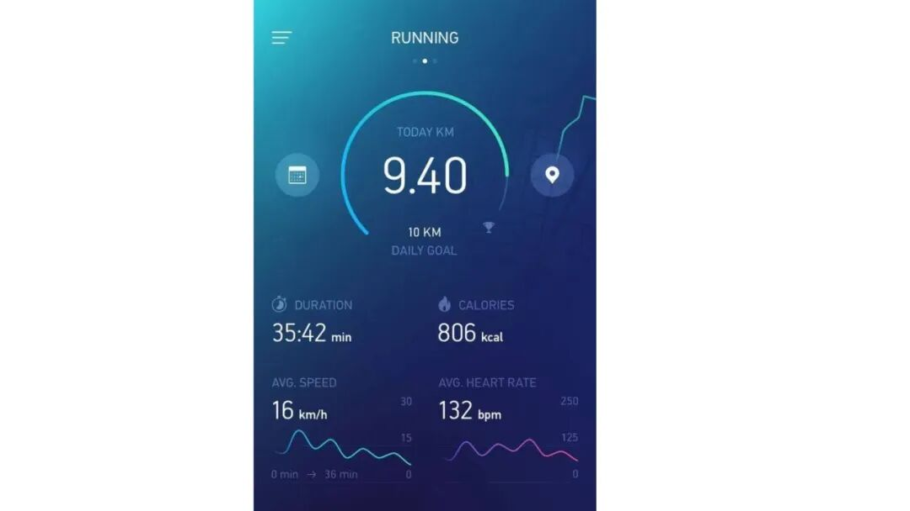
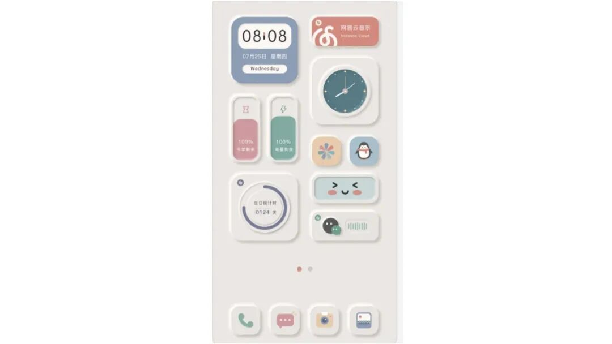
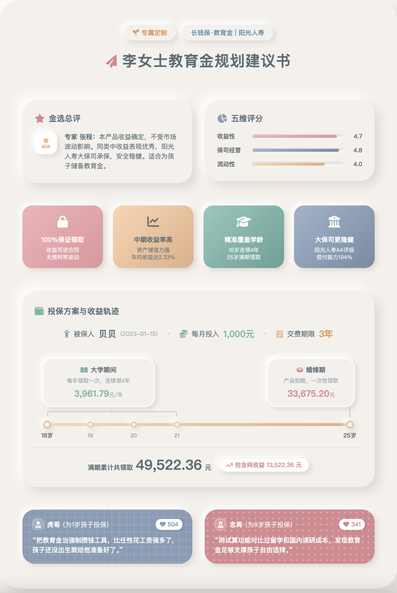
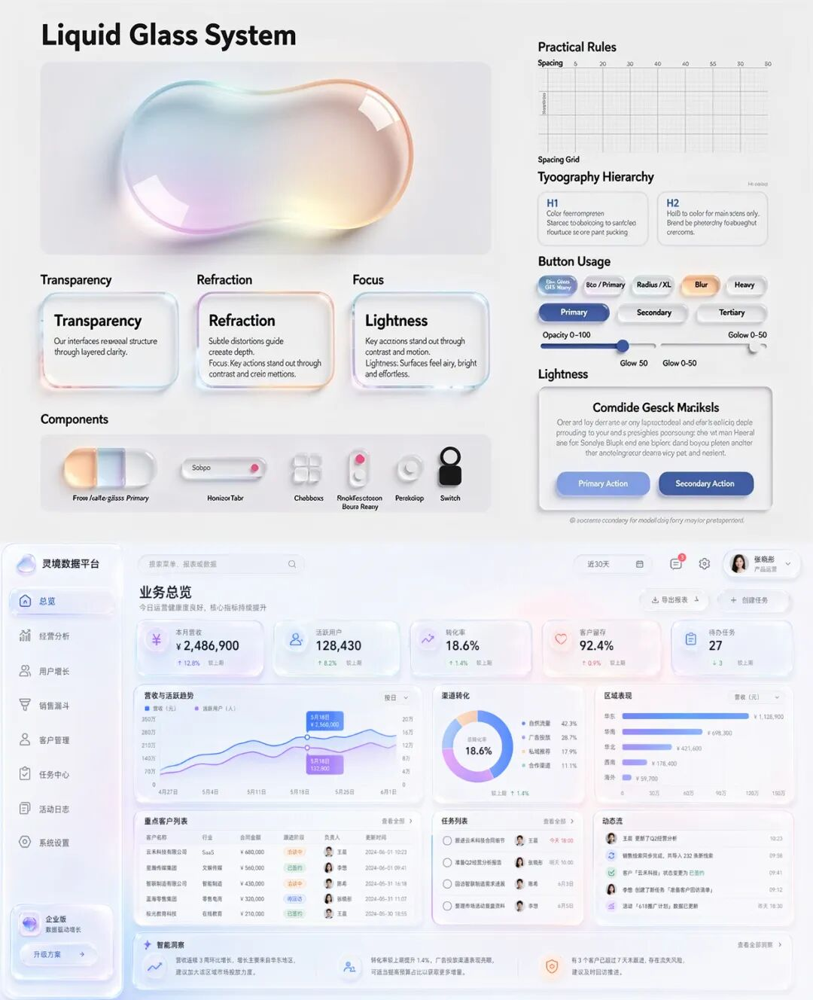
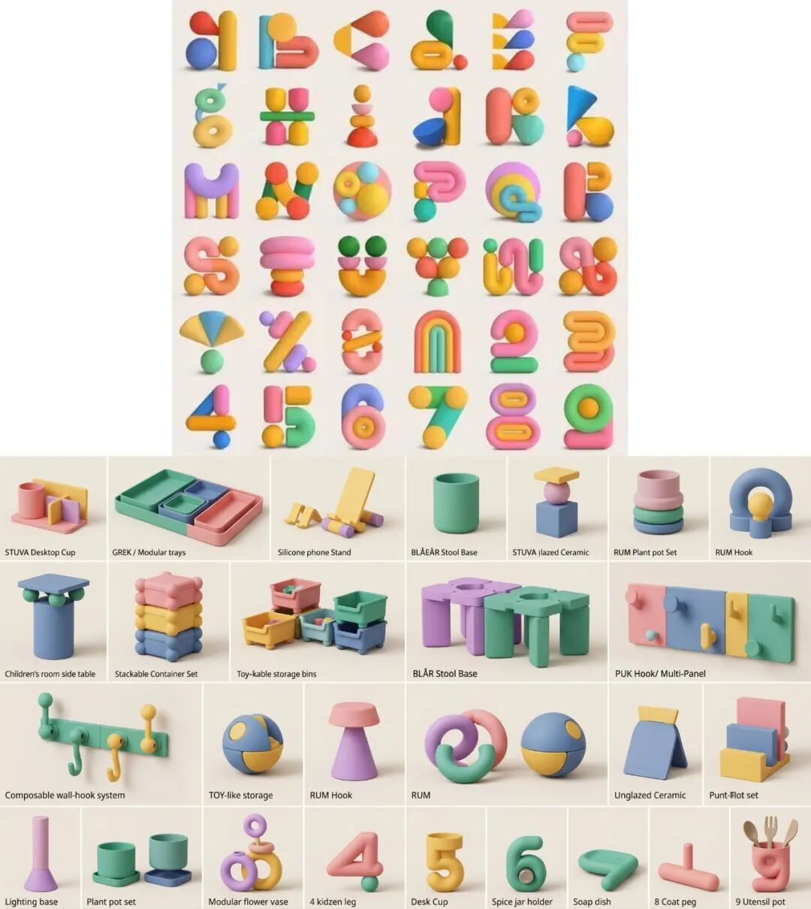
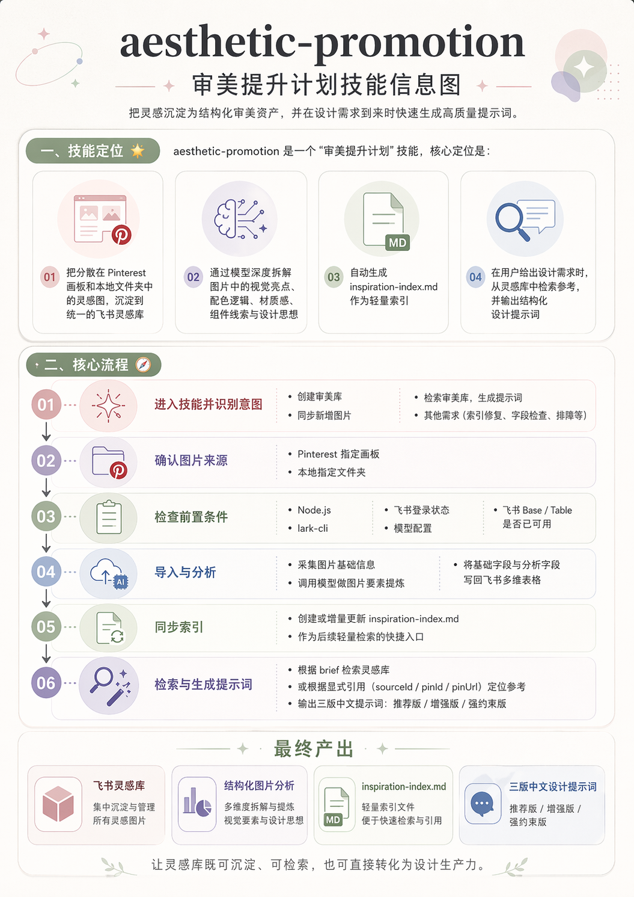

> 📎 来源: [AIGC好语知时节](https://mp.weixin.qq.com/s?__biz=MzkyMTYyOTI0NQ==&mid=2247485306&idx=1&sn=b9b26ede33e1da7325766bd315990426&chksm=c0aad37ebb6dd1f78cd585e1f5c506a02f9f65b0ca7d0e11e0e09756f29f3547d6d2c99792a2&mpshare=1&scene=1&srcid=0427BjDShcrRTinAhdBbq8uv&sharer_shareinfo=e3d25575bd3afe0feeae15d8f0d4785b&sharer_shareinfo_first=e3d25575bd3afe0feeae15d8f0d4785b) | 时间: 2026-04-27 16:17

---

我们每个人都有一个正在吃灰的收藏夹。

里面躺着很多好看的网页、海报、App、产品图、空间设计。收藏的时候觉得“这个质感真好”“这个配色真绝”“以后一定用得上”。

但真正要做东西的时候，问题来了：你说不清它到底好在哪里，也不知道怎么把这种感觉迁移到自己的任务里。最后写提示词的时候，还是只能说：高级一点、干净一点、有质感一点。

这两个月我一直在研究怎么用 Remotion 做出好看又实用的视频，也顺手磕出了一个[视频即代码](https://mp.weixin.qq.com/s?__biz=MzkyMTYyOTI0NQ==&mid=2247485254&idx=1&sn=b4c2b4fcf76bc8cbc3e6b16bbce7b92b&scene=21#wechat_redirect)系列。越做越明显地感受到一件事：

AI 已经极大降低了创作门槛，但它没有降低审美的天花板。模型可以帮你生成网页、图片、视频、报告，但你能不能激活出模型的美商，前提仍然是：你自己能不能识别美、描述美、迁移美。

未来，审美会成为表达力的一部分。

真正强的表达，不只是把事情说清楚，而是让对方感受到质感、专业、用心和可信赖。AI 越来越值钱的用法，也不是单纯帮你生成内容，而是帮你生成更有质感的表达。

所以我做了一个审美提升skill：aesthetic-promotion

aesthetic-promotion skill会将用户指定的本地文件夹或Pinterest画板中的图片自动同步到飞书多维表格，创建灵感库，并通过模型拆解出配色、材质、组件、设计思想、适用场景等关键信息，同时可以基于灵感库进行检索、润色，生成指定任务的提示词。

技能地址🔗：

https://github.com/SiyuanJia/aesthetic-promotion

**简单说，它做的不是“存图”。而是把你日常收藏的美图，从收藏夹里捞出来，变成一个可以被检索、被迁移、被调用的灵感库。**

**接下来，我用三个方向的案例来测试它的迁移能力：App 界面、保险规划建议书、实物产品图。我想让大家看到的是：**

灵感库不只是图库，它能跨场景迁移风格；提示词也不只是文字，它可以成为你调用审美的一种方式。

aesthetic-promotion skill 案例

先建立自己的飞书灵感库：

- 案例1：参考pin-866591153351530960，做一个沉浸式冥想App前端设计



(参考图pin-866591153351530960）

**aesthetic-promotion skill拆解的审美线索:**

采用暗黑霓虹风格与深空渐变背景的沉浸式运动数据仪表盘设计/#0D183B 午夜深蓝, #1397AB 荧光青色/环形进度条, 迷你折线图, 卡片导航, 数据大字, 浮动悬浮层，沉浸式空间感 等

```
迁移后的App设计提示词:
```

我们统一用Gemini 3.1 Pro跑提示词结果：

(基于参考图润色后的提示词，再用模型跑出来的App效果）

- 案例2：参考pin-866591153351531019，做一款教育金规划建议书（HTML）



(参考图pin-866591153351531019）

****aesthetic-promotion **skill拆解的审美线索:******

基于新拟态光影与马卡龙低饱和配色的治愈系拟物化小组件界面设计/#F0ECE6 奶油米色, #8A9BB3 灰蓝, #CD8C91 玫瑰粉/新拟态, 亚光硅胶, 白瓷浮雕, 软UI/情感化设计,  拟物回潮, 柔性科技等

```
迁移后的教育金建议书提示词:
```

用Gemini 3.1 Pro跑提示词结果：



(基于参考图润色后的提示词，再用模型跑出来的保险建议书，是html文件不是文生图）

- 案例3：参考指定图片的配色、材质、风格等，生成类似感觉的产品图

- 液态玻璃感SaaS面板`
`

```
迁移后提示词：请设计一个 16:9 的高品质**中文** SaaS 数据面板界面。整体视觉采用Liquid Glass System 风格，参考附件图片。核心气质是**极致通透、轻盈悬浮、层级清晰、内容丰富但杂而不乱**。背景采用 浅灰白基底（接近#F2F4F7），底层铺设柔和的冰川蓝、梦幻紫、珊瑚粉 全息弥散光斑。界面主体由多层 半透明液态玻璃卡片组成，卡片边缘保留 1px 白色高光内描边，并通过背景模糊与彩色折射形成真实的光学通透感。布局上使用严格的网格系统，将导航、概览指标、趋势图表、数据表格、任务列表、活动流等内容清晰分区，保证信息丰富但秩序明确。文字与图标必须保持克制、极简和高可读性，避免视觉噪音。
```



（上：参考图｜下：基于参考图润色后的提示词生图，GPT-image-2）

- 3D几何积木感家居设计

```
迁移后提示词：请基于宜家的品牌气质，设计一套具有商业量产潜力的创意家居产品系列图。参考图的重点不是字体造型本身，而是其背后的模块化构建逻辑、低反光哑光材质、硅胶、陶土般的温润触感，以及粉、黄、绿、蓝构成的低饱和马卡龙系统配色。产品系列可覆盖：桌面收纳盒、儿童房边几、可拼接矮凳、墙面模块挂钩、玩具式储物组件、小型照明底座、可组合花器等。造型方法上，所有产品应基于 基础几何体拼装：例如圆柱与方块组合成主体结构，球体作为连接节点，圆台作为支撑底座，形成“像积木一样可以理解和组合”的产品家族感。                                          材质策略上，必须采用 极致哑光的硅胶 / 陶土 /注塑塑料表面，强调低反光、软触感、儿童友好和日常家居适配性。色彩系统必须围绕：- #FF8B9E 柔和粉、- #FFC947 鹅黄、- #36B39C 薄荷绿、- #5A80B4 雾霾蓝、- #C084DF 紫罗兰
```



（上：参考图｜下：基于参考图润色后的提示词生图，NanoBanana 2）

产品图是NanoBanana2做的，用GPT-image-2也做了，画面更干净，但是Nano Banana 2这张出来的那一刻，被创意惊艳到了，你看最下边一排：花瓶、5号杯子、6号罐子架、肥皂托、9号筷笼...这创意，如果真是Nano Banana凭空创作的，那这设计感与实用感的结合效果，简直是神作。

审美不是天赋，是可以被沉淀的资产

其实我一直有在 Pinterest 收藏美图的习惯。

但收藏久了会发现一个问题：收藏夹越来越满，真正要做东西的时候，脑子还是空的。

看到一张图，会觉得“真好看”“很高级”“这个质感绝了”，但轮到自己写提示词、做网页、做报告、做图片时，又很难说清楚它到底好在哪里。

是配色？材质？光影？版式？组件？还是某种情绪氛围？

这也是我越来越强烈的一个感受：审美能力不只是“看得多”，而是你能不能把模糊的感受，拆成清晰的线索，再迁移到自己的表达任务里。

以前大家常常甩一张截图给模型复刻。但复刻只能解决“照着做”的问题，解决不了“迁移”的问题。

我想要的不是复制一张图，而是把这张图背后的审美线索提取出来：它为什么舒服，为什么高级，为什么有亲和力，为什么让人觉得可信赖。然后，当我下次要做一个 App、一个建议书、一份资产报告、一张产品图时，可以把这些线索重新调用出来。

飞书 CLI 出来之后，这件事突然变得很顺。

以前调用飞书 API 创建表格和文档很麻烦，密钥、接口、文档都要折腾半天。飞书 CLI 相当于把这条路铺平了，创建表格、写入字段、同步素材、沉淀数据，一下变成了模型可以直接操作的工作流。

所以我第一个想做的，就是把美图收藏夹变成一个真正的审美灵感库。

不是一般意义上的图库，而是一个可以被检索、被拆解、被迁移、被调用的审美资产库。

用aesthetic-promotion skill把这一套工作流沉淀下来：

> 图片收藏夹 -> 飞书 CLI -> 图片拆解 -> 多维表格沉淀 -> 灵感检索 -> 提示词生成

从此，审美不再只是停留在“好看”两个字里。

你口中的“真绝”，可以被拆成液态玻璃、新拟态、低饱和马卡龙、霓虹粉与电光青；你说不清的“高级感”，可以被拆成留白、材质、光影、层级、组件语言和使用场景。

更重要的是，收藏过的图片不再只是躺在收藏夹里吃灰。

它们会变成你的提示词弹药，变成你的表达素材，变成你下一次做网页、建议书、PPT、信息图、产品图时可以直接调用的灵感来源。

这就是我做 aesthetic-promotion的初衷：

把收藏夹训练成表达力。

销售不是信息传递，是感受设计

回到这个账号一直关心的主线：销售与表达增强。

很多时候，我们以为销售材料的核心问题是“信息不够完整”。

但真实情况可能恰恰相反：很多材料不是信息太少，而是信息太重。

一份建议书、一份资产报告、一份产品说明，如果只是把条款、数据、逻辑、收益、风险全部堆上去，客户当然能看，但不一定愿意看；即使看完，也不一定真正进入那个场景。

因为客户不是先理解你，再信任你。

很多时候，客户是先感受到你的专业、用心和秩序感，才愿意继续理解你。

审美在这里就不是装饰品了。

它不是为了把材料“做漂亮”，而是为了降低理解阻力，提升信任感，把复杂信息转化成一种更容易被接受的感受。

客户看到一份材料的前几秒，其实已经开始判断：这个人是否专业？这件事是否重要？这份方案是否值得我继续看下去？

封面、排版、配色、图表、留白、标题层级，这些看似是设计细节，本质上都是信任线索。

> 上面教育金规划建议书的案例，就是一个很典型的场景。

> 年金保险本来就是看不见、摸不着、很难立刻感知价值的产品。它卖的不是一张纸，也不是一串数字，而是一个未来愿景：孩子的教育节奏、家庭的安全感、父母对未来的安排，以及某种“我已经提前准备好了”的踏实。

如果材料只有信息，客户看到的是产品。

但如果材料有好的视觉组织、有亲和的设计语言、有清晰的图表和温暖的场景感，客户更容易看到那个未来。

这就是销售表达里很重要的一点：

你不是只把信息交给客户，而是给客户带入一个值得相信的愿景。

我觉得，AI已经走过三年有余，它不只是帮我们写话术、做总结、生成海报。

更重要的是，它开始帮我们把抽象价值变成可感知的画面，把复杂信息变成有秩序的表达，把“我想说清楚”升级成“我想让对方感受到”。

而灵感库的意义，也正在这里。

它不是一个玩图工具，而是一个表达基础设施。

当你的灵感、风格、配色、材质、版式都可以被沉淀和调用，你就不只是拥有了一个提示词生成器，而是拥有了一套让表达更有质感、更有信任感、更容易被看见的工作流。

**附：技能使用贴士**

如果你也想搭一个自己的审美库，欢迎下载技能，使用流程我们也派GPT-image-2画了个流程图：



前置需要提供的物料有这么几个：

- Pinterest画板地址或本地文件夹地址
- 安装飞书CLI并登录
- 图片分析需自行提供模型接口地址、模型名称和密钥
- 如果最后需要指定图片生成提示词，那么要提供图片的id（`sourceId` / `pinId` / `pinUrl`），也可以不指定图片，从全库搜索灵感。生成提示词时默认使用的还是图片分析时配的模型

技能使用时，这些步骤模型也会一点点引导你去做的。

最后，再安利下我们的审美提升技能🔗：

https://github.com/SiyuanJia/aesthetic-promotion

---

这是低产博主的第13篇**AI+销售表达系列思考产出**，希望大家能喜欢，如果能对你有所启发那就太棒了，欢迎给我提出你在销售赋能上的创意和想法，我们一起来实现！

[一个 Skill，一套流程：把年报变成真正有人愿意看的视频，重新定义专业内容表达｜视频即代码3](https://mp.weixin.qq.com/s?__biz=MzkyMTYyOTI0NQ==&mid=2247485254&idx=1&sn=b4c2b4fcf76bc8cbc3e6b16bbce7b92b&scene=21#wechat_redirect)

[视频即代码2：我用Remotion做了10个不同类型的数据可视化视频（附提示词）](https://mp.weixin.qq.com/s?__biz=MzkyMTYyOTI0NQ==&mid=2247485182&idx=1&sn=31e988f76ab98d49e5451588d13a64e5&scene=21#wechat_redirect)

[视频即代码：我用Remotion Skill搓了个客户年度持仓回顾视频，附实用教程](https://mp.weixin.qq.com/s?__biz=MzkyMTYyOTI0NQ==&mid=2247485125&idx=1&sn=7b536097ab92f35e287770d928cbf899&scene=21#wechat_redirect)
