> 📎 来源: [AI编程瓜哥](https://mp.weixin.qq.com/s?__biz=Mzk5MDcyODQ2Mw==&mid=2247493435&idx=1&sn=59458b13858bbd6897c9f7f5b294e735&chksm=c404781b72495f21b1a3f0dd6d809ea1683850040143fcb478e0c71821d47e084cca59d77ab7&mpshare=1&scene=1&srcid=0413MwIFvbTkOPDxA5omNmuw&sharer_shareinfo=b7f33991892d380aadbf9b308cfbc9d6&sharer_shareinfo_first=b7f33991892d380aadbf9b308cfbc9d6) | 时间: 2026-04-13 15:34

---

> 大家好！我是瓜哥。前互联网技术副总裁，现在带队死磕 AI 编程。

这是我最近被问到最多的问题。

**既然飞书有 2500 多个 API，直接让 AI 写个 Python 脚本去调不就行了，为什么要用这个 CLI？**

确实，传统的飞书 API 很全，但那是给人类看的。对于 Agent 来说，直接调 OpenAPI 的体验非常差。

你要传海量的文档上下文给它，它还经常把 

```
chat_id
```

 和 

```
open_id
```

 搞混，甚至在分页处理时逻辑直接断掉。

```
lark-cli
```

 的出现，它把飞书全家桶封装成了 19 个的 Skill。

本质上是在做 **Agent-Native** 的基础设施。

它的核心逻辑不是 '**能不能做**'，而是 **在多低成本下，能做到什么程度 ？**

## 01 / 核心差异对比

| 维度 | 传统 OpenAPI 调用 | lark-cli AI Skills |
| --- | --- | --- |
| **集成成本** | 需要 AI 理解数千行文档，写请求代码 | 一条结构化指令（如 `+agenda`）直接交付结果 |
| **Token 消耗** | 极高，需要携带大量 API 定义和 Schema | **极低** ，压缩后的 Skill 定义，仅保留核心参数 |
| **执行成功率** | 中等，AI 容易产生参数幻觉或类型错误 | **极高** ，经过预校验的原子命令，参数零歧义 |
| **逻辑复杂度** | AI 需要处理鉴权、分页、重试 | CLI 内部自动闭环，AI 只负责下达业务指令 |
| **身份切换** | 需手动管理 User/Bot Token | 原生支持 `--as user` 或 `--as bot` 一键切换 |

打个比方：传统的 API 像是一堆散落在地上的零件，AI 得边看说明书边组装。

而

```
lark-cli
```

 则是已经组装好的 **Skill**。

你只需要通过你的 Agent 告诉它：把这个 Markdown 方案存进飞书云文档，并同步到项目群。

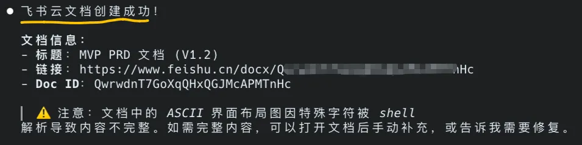

## 02 / 官方原生的 Skill 案例

在 

```
larksuite/cli
```

 的官方生态中，每一项 Skill 都经过了 Agent 视角的适配。下面这三个场景的值得你了解：

### ① 跨产品编排：全自动站会(Workflow Skill)

这是官方预置的 

```
lark-workflow-standup-report
```

。

它通过 

```
SKILL.md
```

 强制约束了 Agent 的行为：先调 

```
calendar
```

 获取日程，再调 

```
task
```

 获取待办。

最终你只需要在手机飞书上发一句：“今天的站会报告”，它就能给出一份结构化清晰的总结。

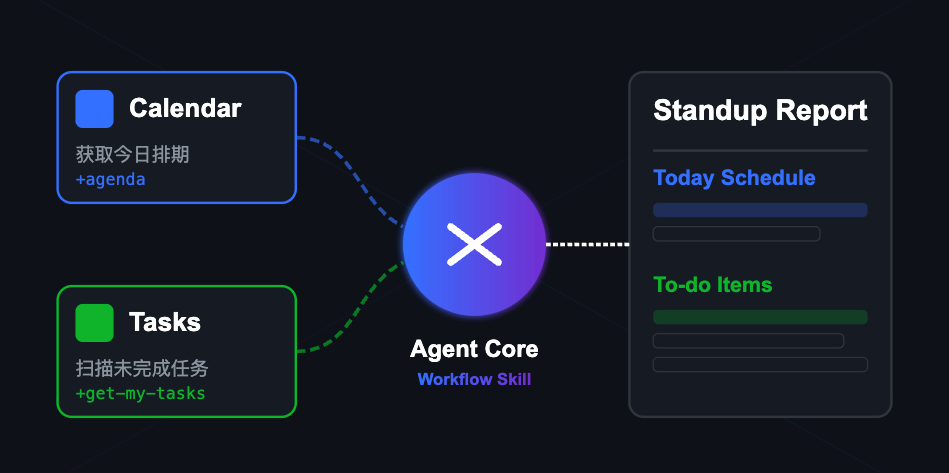

### ② 结构化数据自愈：Bitable 自动化记录

```
lark-base
```

 Skill 提供了 **```
+record
```** 快捷指令。

AI 在写入前会先调用 

```
field list
```

 搞清楚 Schema。

**这种 自愈 能力确保了 AI 能够像操作数据库一样精准操作飞书。**

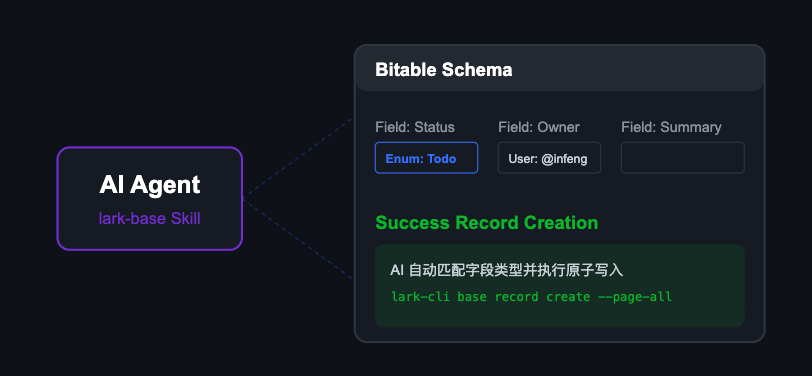

### ③ 智能摘要聚合：会议纪要整理

这是官方 **```
lark-workflow-meeting-summary
```** 的核心。

它能让 AI 批量检索 

```
vc
```

 记录，并循环调用 

```
minutes
```

 接口提取 AI 摘要。

想知道上周开了哪些会？AI 只需一条命令就能完成聚合。

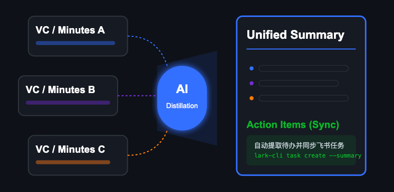

### ④ 它其实是在帮你运营工作区

用了一周之后，我最大的感受是：

```
lark-cli
```

 不是在帮你发消息，它在帮你运营整个飞书工作区。

传统的 AI 编程工具，解决的是 '代码生产效率'。

但当你写完了代码，后续的同步、文档归档、进度分发、团队协作，才是最耗费精力的琐事。

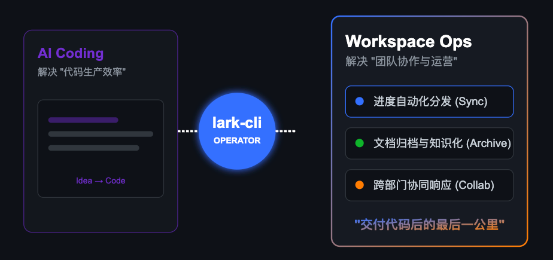

##

## 03 / 如何快速开始？

> 保姆级《飞书 CLI 快速安装配置手册》已打包，点关注，私信【飞书】，免费获取！

如果你已经习惯了在终端和 AI 配合，这就是你开启 '**Agent 自动化**' 的第一步：

### ① 安装 Node

开始之前，请确保你安装了：Node.js

用 

```
node -v
```

 命令检查，如显示版本号就代表已安装。

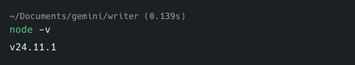

如还没安装，请前往 Node 官网 (https://nodejs.org/en) ，根据操作系统下载安装就好。

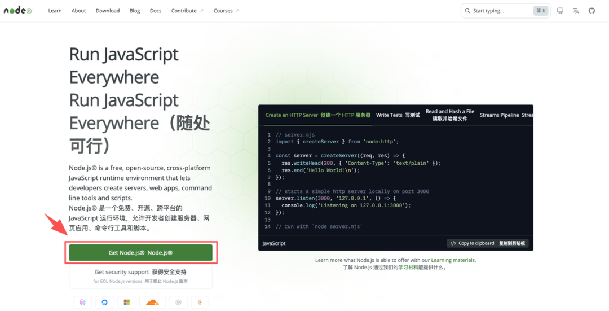

### ② 安装飞书CLI

复制并到你的终端里执行下面的命令

```
# 安装飞书CLInpm install -g @larksuite/cli
```

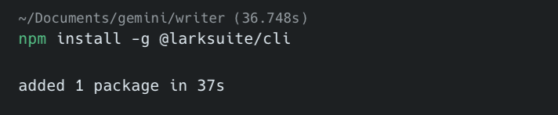

### ③ 安装飞书CLI Skill

```
# 一键注入 19 个专家级 Skillsnpx skills add larksuite/cli -y -g
```

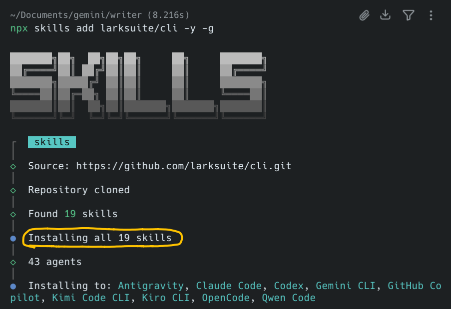

### ④ 配置应用凭证

运行此命令，命令会输出一个授权链接。

```
lark-cli config init --new
```

扫码或复制该链接在浏览器打开

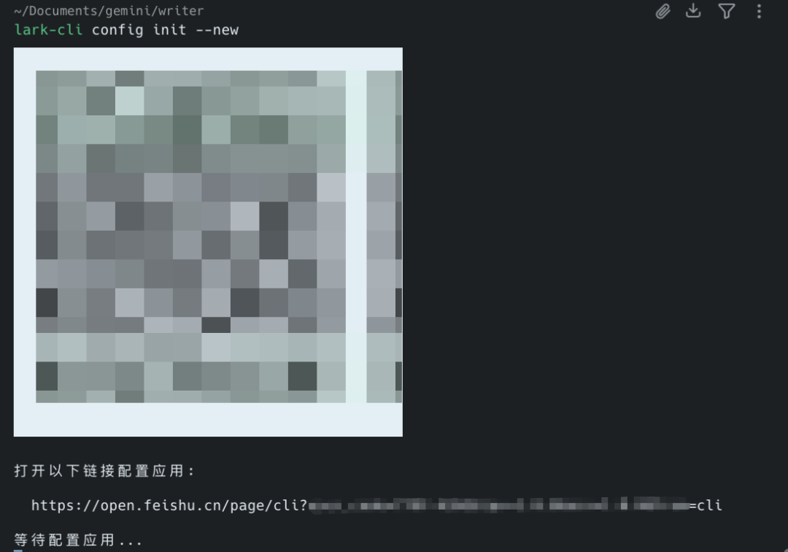

创建应用成功，返回 appID、appSecret、brand信息

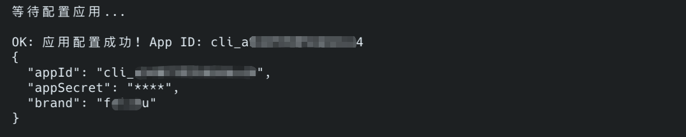

### ⑤ 登录授权

复制并在终端运行命令，完成 User OAuth 授权。

```
lark-cli auth login --recommend
```

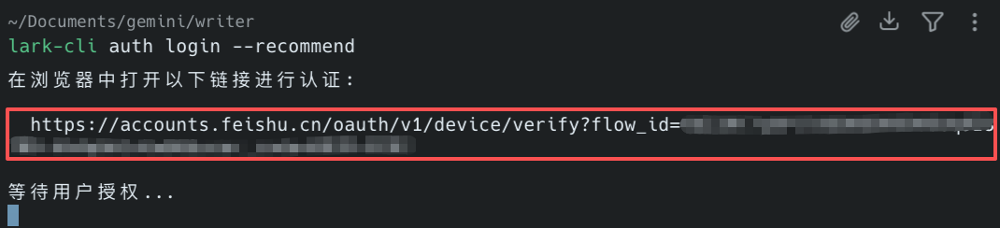

### ⑥ 验证安装成功

复制并在终端运行命令

```
lark-cli auth status
```

看到黄线成功标注，就代表成功了

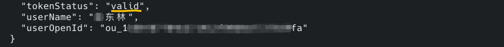

以Gemini CLI为例（claude code/codex 基本一样），重启 Agent，就能看到这 19 个 Skill 已经就绪。

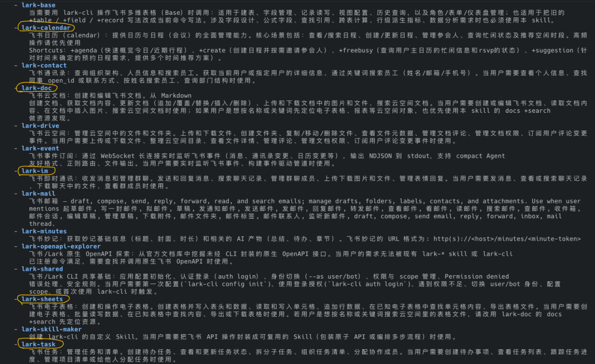

到这，咱们就完成的飞书 CLI 和 19个 飞书 Skill 的安装与配置。

## 04 / 写在最后

在 AI 编程的场景里，代码写完只是开始，协作闭环才是关键。

飞书这 19 个 Skill 解决的不是如何写代码，而是帮你把写完代码后的繁琐环节全部接管，进化成对接飞书工作流、云文档、多维表的一个办公协作助手。

接下来，从写文档、做表格这些琐事中解放出来，更专注于产品的打磨和价值的创造吧。

附：飞书CLI Skill 全量清单

别再去折腾那 2500 个复杂的 API 接口了。

这 19 个官方整理好的 Skill，丢给 Agent 就能直接上手干活。这些现成的技能，直接对应解决你实际的办公需求。

| Skill 名称 | 核心能力边界 |
| --- | --- |
| **lark-shared** | **核心基石：处理基础配置、OAuth 登录、身份切换、错误治理。** |
| **lark-im** | **通讯终端：消息收发、群聊管理、历史记录搜索、文件上下传。** |
| **lark-doc** | **内容仓库：飞书文档创建、读取、Markdown 转换、块操作。** |
| **lark-base** | **数据建模：多维表格快捷记录 (`+record`)、字段/视图管理。** |
| **lark-calendar** | **日程管理：日历管理、忙闲查询、智能推荐时间 (`+suggestion`)。** |
| **lark-task** | **任务清单：任务清单、子任务拆解、负责人设置、任务评论。** |
| **lark-drive** | **文件管理：文件元数据、权限配置、文档评论、文件上下传。** |
| **lark-wiki** | **知识治理：知识库空间管理、文档树节点维护、移动/复制节点。** |
| **lark-mail** | **邮件自动化：飞书邮箱收发、草稿管理、标签过滤、未读提醒。** |
| **lark-minutes** | **会议遗产：妙记内容提取、AI 摘要、行动项提取、逐字稿检索。** |
| **lark-vc** | **会议分析：视频会议历史查询、会议纪要汇总、参会人分析。** |
| **lark-approval** | **流程推进：审批任务查询、同意/拒绝/转交、实例管理。** |
| **lark-contact** | **身份检索：通讯录员工搜索、部门结构查询、Profile 获取。** |
| **lark-event** | **实时触发：Websocket 实时事件订阅、消息路由触发。** |
| **lark-whiteboard** | **视觉交付：画板渲染、架构图/流程图 DSL 生成与插入。** |
| **lark-openapi-explorer** | **自我进化：Agent 自动探索官方文档找接口。** |
| **lark-skill-maker** | **元能力：根据需求自动编写并生成新的飞书 Skill。** |
| **lark-workflow-standup-report** | **工作流：横向编排日历与任务，生成一键日报。** |
| **lark-workflow-meeting-summary** | **工作流：批量汇总指定主题的会议纪要报告。** |

---

能看到这里的，都是对效率有极致追求的硬核玩家。不妨点个 **'关注'** 和 **'在看'** ，给我继续更新一点支持！

## 🎁 福利领取

送你一份价值 **399元** 的《AI 编程实战工具包》。点个 **‘关注’**，私信回复**「工具包」**，即可免费获取！

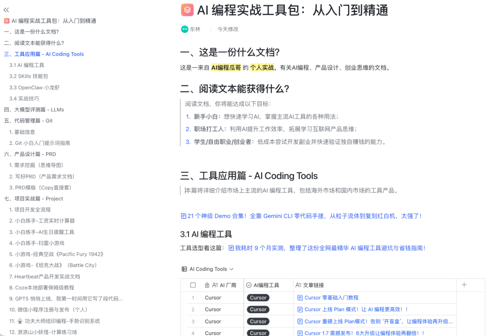

## 🚀 加入 AI 探索者社区

别再一个人摸索了，技术迭代这么快，圈子很重要。

扫码进核心交流群。与 **300+** AI 编程高手/爱好者一起，把 '**会用 AI**' 变成真正的竞争力！


## 📚 阅读更多

[真超级省钱！把 Jina 注入 OpenCode ，Token 消耗暴跌 196 倍，抓网页成本几乎为 0！](https://mp.weixin.qq.com/s?__biz=Mzk5MDcyODQ2Mw==&mid=2247493137&idx=1&sn=f41fab608a6a591b7c1c34306ea283ca&scene=21#wechat_redirect)

[受够了 AI 幻觉！抄完谷歌顶级设计，这个手搓生图 Skill，秒出 5 场景锐利 SVG 图！](https://mp.weixin.qq.com/s?__biz=Mzk5MDcyODQ2Mw==&mid=2247493136&idx=1&sn=97e7b3f77e8415882f00438c226e1208&scene=21#wechat_redirect)

[Gemini CLI v0.32 再进化：深度实测后，这 5 个新功能，值得你马上上手！（含实战案例）](https://mp.weixin.qq.com/s?__biz=Mzk5MDcyODQ2Mw==&mid=2247492709&idx=1&sn=d552aa4376e11384088e798b4c1b5f29&scene=21#wechat_redirect)
