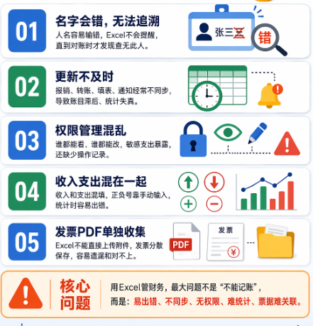
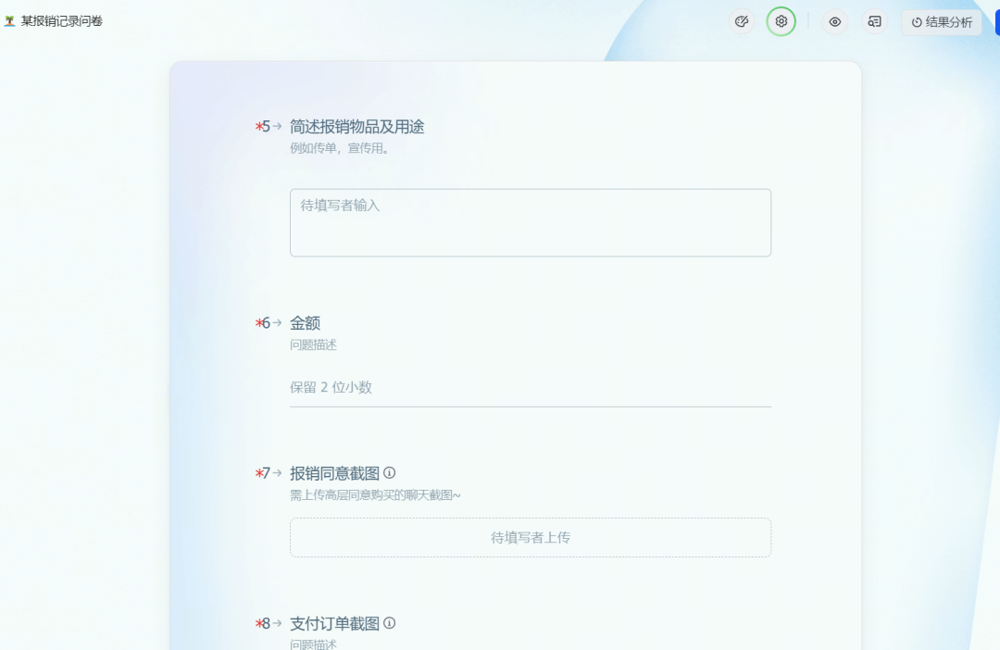
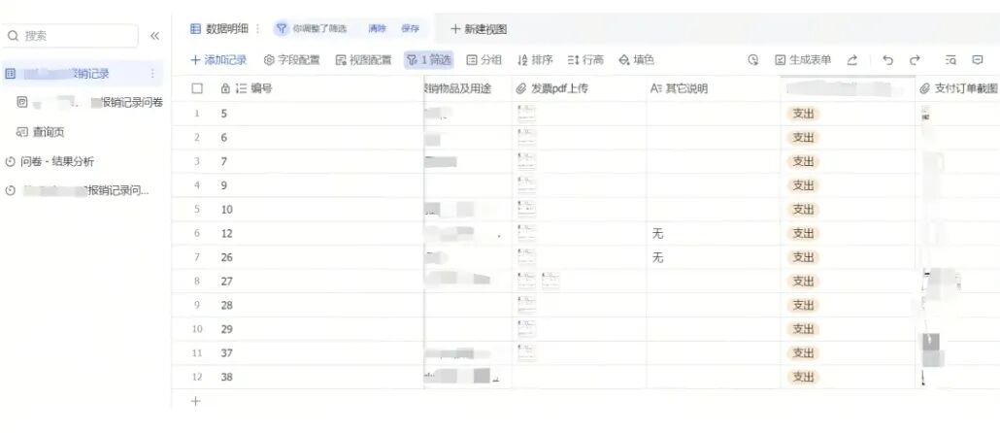
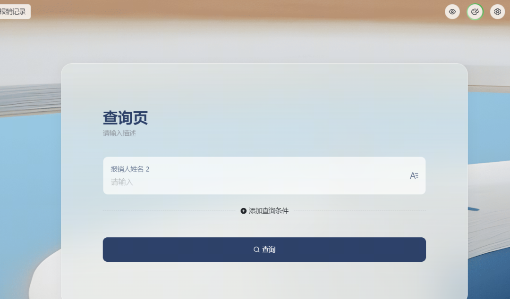
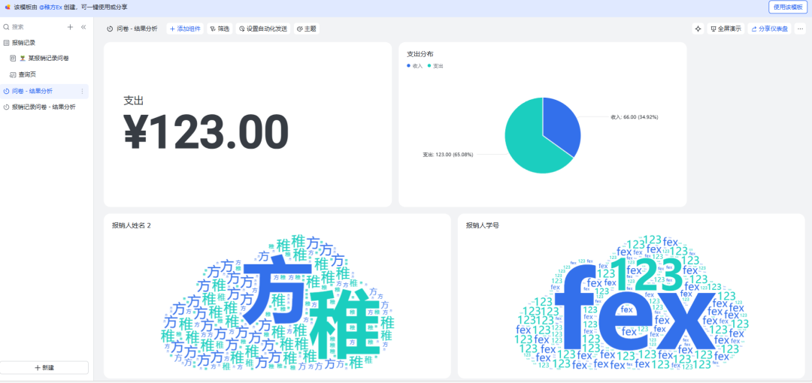
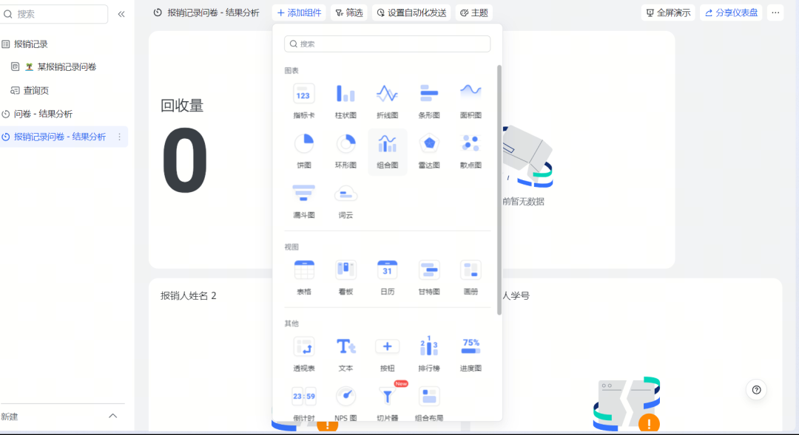

> 📎 来源: [稚方Ex](https://mp.weixin.qq.com/s?__biz=MzkwMzYyOTczOQ==&mid=2247484732&idx=1&sn=6d252b22056d007f19233606b54ed4af&chksm=c1ffa538224b08336eb10014f2b23aaec03a38661391c15dc985c2280428fa73740342b59a05&mpshare=1&scene=1&srcid=0427284BkdUv1e3c7Tkl54rL&sharer_shareinfo=c98b695b33185d43ce79b398dce3f919&sharer_shareinfo_first=c98b695b33185d43ce79b398dce3f919) | 时间: 2026-04-27 16:17

---

**No.1**

**我又发现了一个需求**

大家好，我是稚方Ex。

上次聊了AI时代的护城河，说工具不是壁垒，发现需求的能力才是。

有人问我："你说得对，但具体怎么发现需求？"

我想了想，与其讲方法论，不如分享一个我经历过的真实案例。

**这次是信息收集和数据管理。**

那天，稚方拿到部门财务交接，盯着Excel表格看了很久。

"李晓明"这个名字，我记得应该是"李小明"。

往上翻，发现还有"李晓铭"。

**三个版本，拼音输入法的锅。**

更离谱的是，有几笔款项根本没被记录。

高层问我："现在还有多少钱？"

我打开表格，收入支出混在一起，密密麻麻。

"等我算一下..."

半小时后，我给出了一个不太确定的数字。

那一刻我在想，**这事儿不应该这么复杂。**

**No.2**

**当时用Excel**

**财务管理的5个坑**

当时报销方案是告诉财务报销金额和用途，并且填写一个共享的Excel表。

我没有马上去找工具。

而是先在脑子里想清楚：**到底哪里出了问题？**

**第一个坑：名字会错，无法追溯**

拼音输入法会把"李小明"打成"李晓明"。

Excel不会提醒你，你也不会发现。

直到财务对账的时候，发现这个人"不存在"。

**第二个坑：更新不及时**

有人报销了，但财务转完账，可能忘了填表。

有人填了表，忘了通知财务。

财务以为没人报销，高层以为经费还很多。

直到定期一统计，发现账对不上。

**第三个坑：权限管理混乱**

Excel表格共享给所有人。

所有数据一览无余，谁都能看，谁都能改。

有些支出只有管理层需要知道，但普通成员也能看到。

有人不小心改了别人的数据，也不知道是谁改的。

没有权限控制，没有操作记录。

**第四个坑：收入支出混在一起**

有些行是收入，有些行是支出。
输入需要手动添加正负号，多一个步骤。
有时候忘记打上

每次统计，都是一次折磨。

**第五个坑：发票PDF单独收集**

报销需要发票。

但Excel表格不能上传附件。

只能让大家把发票发给财务。

然后财务一个个保存，一个个对应。
有可能会遗漏，容易对不上，经常找不到。

**5个问题，本质上是一个问题：信息收集和数据管理的流程有问题。**

需求想清楚了，解决方案就很明确了。

**No3**

**一个问卷，5个问题全解决**

我用飞书多维表格做了一个长期问卷。

**核心思路很简单：让填写者填一次问卷，所有信息自动收集到表格里。**

设置了10个字段：

- 报销时间（日历自动填写）
- 学号（唯一识别ID）
- 姓名
- 收入/支出（单选）
- 物品及用途（仅支出需填）
- 金额
- 报销同意截图（仅支出需填）
- 支付订单截图（仅支出需填）
- 发票PDF（仅支出需填）
- 其它说明

如果选择"收入"，后面的截图和发票就不用填。

如果选择"支出"，全部都要填。

这样填写者不会被无关字段干扰。

关键是，这是一个长期问卷。

设置一次，一直能用。

所有数据自动汇总到飞书多维表格。

问卷填写局部界面

用了之后，5个问题全解决了：

✅ 名字不会错了

因为有学号作为唯一ID，即使名字打错了，也能通过学号找到人。

而且飞书问卷会记录填写者的飞书账号，双重保障。

✅ 材料一次性收集完

报销同意截图、支付订单截图、发票PDF，全部在问卷里上传。

不用再去微信群里翻聊天记录。

不用再问"你的发票呢？"

填完问卷，材料就齐了。

后台字段数据

✅ 权限管理更清晰

飞书多维表格支持权限设置。

开放支持姓名查询条件，填写者只能根据姓名查找自己提交的记录。用化名也行，毕竟学号才是唯一ID。

管理人员可以看到所有数据。

谁修改了什么，都有操作记录。

✅ 财务和填写者都减负

填写者：填一次问卷，5分钟搞定。

财务：不用手动整理材料，不用手动填表。

管理人员：不用催人填表，不用对账。

✅ 高层实时掌握经费

后台的几个管理人员可以实时看到数据。

收入多少，支出多少，还剩多少。

不用等财务统计，不用等月底对账。

打开手机，一目了然。

✅ 可视化图表自动生成

飞书多维表格支持数据可视化。

收入支出趋势图、分类统计图，自动生成，实时更新。不用手动做图表，不用手动分析。

可视化显示

还可以修改图表

**No.4**

**你的需求，藏在你的日常里**

很多人问我："怎么发现需求？"

我的答案是：需求是感受出来的。

**它藏在你的日常里，藏在你每次觉得"这事儿怎么这么麻烦"的时刻。**

财务交接那天，我看到名字错了，看到款项没记录，看到高层问我经费我答不上来。

这些都是需求。

你不需要去刻意寻找需求，你只需要对自己的日常保持敏感。

**当你觉得"这事儿不应该这么复杂"的时候，需求就在那里。**

**看到哪里不舒服，就去优化它。**

如果你也在做信息收集和数据管理，可以试试这个问卷方法。

**我把问卷模板分享出来了，你可以直接复制修改。**

问卷模板链接：

https://my.feishu.cn/wiki/UmRnw3xi0iF7dSknTtfcWHg0njc?from=from\_copylink

创建模板后，根据你的实际场景调整字段就可以用了。

**我的场景是财务记录，你的场景可能是**：

- 活动报名：姓名、联系方式、报名项目、特殊需求
- 客户反馈：客户名称、问题类型、问题描述、截图
- 项目进度：项目名称、负责人、完成度、遇到的问题

数据自动汇总到表格。从混乱到清晰，只需要一个问卷。

如果你有收获的话，欢迎关注、点赞、评论~
