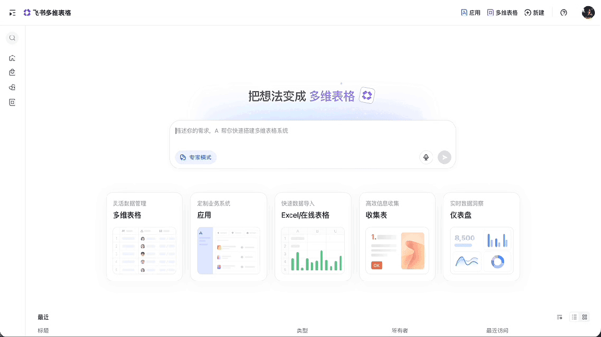

> 📎 来源: [扩展和ta的朋友们](https://mp.weixin.qq.com/s?__biz=MzcwMjA3MTMyNw==&mid=2247484054&idx=1&sn=5cb993a4a3f3f7f320d6bdc2d568ed8e&chksm=f58bc7cdf71c1b276d2eb6ac7940e4c2a193ea528fe52b7b6991067d34173265d46b173c563f&mpshare=1&scene=1&srcid=0429OqUag2Vu9ED9cZ4zL92X&sharer_shareinfo=31186126a984db7ed99acc69dc26ce8a&sharer_shareinfo_first=31186126a984db7ed99acc69dc26ce8a) | 时间: 2026-04-29 11:57

---

上周有个客户跟我吐槽，说他们公司想搭个客户管理系统，IT评估完说至少要两个月、排期排到明年。他问我："有没有那种不用开发、拖拖拽拽就能搭起来的？"

说实话，这种需求我听得太多了。中小企业想数字化，业务部门提需求，IT说排不上，设计说人手不够，最后要么搁置、要么凑合用Excel。

但就在最近，飞书多维表格的一波更新彻底刷新了他们的认知——

原来"一句话搭系统"这件事，真的不是吹的。

从"能不能帮我搭个系统"说起

先说说我们服务商日常遇到的典型场景：

> 客户："我们想用飞书管项目进度，能不能搭个看板？"

> 我们："可以，用多维表格的看板视图就能实现。"

> 客户："那能把客户信息也汇总进来吗？销售跟进的节点要能看到。"

> 我们："加个关联字段就行。"

> 客户："能自动给没更新的人发消息提醒吗？"

> 我们："自动化流程了解一下。"

你看，这些需求听起来都不复杂，但客户真正想问的是：你能不能帮我快速搭起来、用起来、解决问题？

以前我们的答案是：可以，但要沟通需求、评估方案、配置字段、调试自动化……最快也要几天。

现在飞书多维表格直接扔出来一个王炸功能——AI一句话搭建系统。

你只需要描述你的业务场景，AI自动帮你把表结构、字段、视图、甚至自动化流程都搭好。

4月份飞书多维表格做了一波AI能力升级，我仔细研究了一番，发现这波更新不是小打小闹，是真刀真枪地解决了实际问题。

1️⃣ AI问数据——不用学SQL，开口就能分析

以前想看数据洞察，要么找会写SQL的同事，要么导出来用BI工具——光这个流程就能卡住80%的业务人员。

现在直接在多维表格里用自然语言提问：

> "我们Q1销售额最高的产品是哪个？"

> "华东区的客户转化率比华南区高多少？"

> "最近30天没有跟进的商机有哪些？"

AI自动检索、统计、分析，秒出结论。 什么公式、函数、SQL，统统不需要。

对业务人员来说，这是真正的"开口即得"；对我们服务商来说，客户能自助解决的问题越多，我们的实施交付就越轻松——因为真正的门槛已经不存在了。

2️⃣ AI生成图表——数据可视化不再求人

做数据汇报，最怕什么？

辛辛苦苦整理了一堆数据，结果可视化做出来像Excel截图，自己都看不下去。

现在只需要一句话：

> "画一个矩形树图，看不同产品线的销售占比。"

> "画个热力图，分析每周哪天、哪个时段发布的内容播放量最高。"

矩形树图、热力图、桑基图……这些专业BI图表，一句指令就能生成，颜色风格还能自定义。

我有个客户是做短视频运营的，以前每周做数据复盘都要找设计师出图。现在运营自己就能搞定，数据分析效率直接翻倍。

3️⃣ AI搭页面——表格数据秒变H5页面

这是让我最震撼的一个功能。

想象一下：你在多维表格里整理了一年的业务数据，现在要做一份可分享、可交互的数据战报。

以前需要：设计排版、前端开发、数据绑定、测试上线——没有一两周下不来。

现在只需要：

> "帮我生成一个项目战报页，用橙色主题，数据要可交互。"

几分钟后，一个带3D滚动动画、数据实时更新、文案自带业务洞察的H5级页面就出来了。

数据→可视化→分享，一气呵成。 这对需要频繁做数据汇报的市场、运营、管理层来说，简直是救命功能。

4️⃣ AI生成问卷——连表单都不用自己设计

你有没有遇到过这种情况：老板说"明天要用，收一下各部门的需求"，你一脸懵，不知道该问哪些问题、字段怎么设置。

现在直接让AI帮你生成问卷：

> "帮我生成一个客户需求调研问卷，要包含基本信息、需求痛点、预算范围。"

系统自动生成完整的表单字段，你只需要审核和调整。

加上前面提到的AI语音录入功能——河南的同事可以用方言录入巡检结果，AI实时识别、自动填表——这种"接地气"的能力，才是真正解决一线问题的好功能。

这波升级意味着什么？

说几个我观察到的变化：

第一，数字化门槛被彻底击穿。

以前中小企业想搭业务系统，要不就是买现成软件（不灵活、定制贵），要不就是自己开发（周期长、门槛高）。飞书多维表格这波AI升级，把\*\*"说清楚需求"\*\*变成了唯一需要的技能。

懂业务的人，不需要懂技术。 这才是真正的降本增效。

第二，服务商的交付逻辑在改变。

以前我们帮客户搭系统，大量的工作是"配置"——设字段、调视图、配自动化。但当AI能自动完成这些基础配置时，我们的价值在哪里？

我认为核心在于\*\*"理解业务场景 + 规划系统架构 + 处理复杂需求"\*\*。

AI能搭模板，但搭不了逻辑；能出图表，但理解不了业务优先级；能生成问卷，但区分不了主次问题。

服务商的价值，正在从"帮你搭"升级为"帮你想清楚再搭"。

第三，企业内部"人人都是开发者"的时代来了。

当AI把技术门槛抹平，判断力、洞察力、业务思维就成了核心竞争力。

你会发现，那些懂业务、爱琢磨的人，突然发现自己可以"搭系统"了——不需要学代码、不需要找IT，自己就能把业务想法落地。

但是——有些事还是得交给专业的人

说了这么多AI的厉害，我必须泼一盆冷水：

AI能搭系统，但搭好系统是另一回事。

举几个我们实际遇到的情况：

> "我们用AI搭了个客户管理表，但字段逻辑乱七八糟，跨表关联经常出错。"

> "自动化流程搭了一堆，但业务一调整，整个流程就崩了。"

> "生成了一堆图表，但老板说看不懂，不知道该看什么。"

这些问题的根源不在工具，在于：对业务逻辑理解不到位、对系统架构规划不清晰。

AI是助手，不是顾问。

当你的业务足够简单、需求足够明确，AI能帮你快速搞定。

但当你的业务涉及多部门协同、有复杂的审批流转、需要对接其他系统、有数据安全和权限要求时——

一个靠谱的服务商，才是真正的效率倍增器。

作为专注飞书生态的服务商，我们每天都在帮各种企业落地飞书多维表格系统。这波AI升级出来后，我们的交付效率确实快了很多，但核心能力一直没变：

帮企业把"业务想法"变成"可用的系统"。

📋 业务系统搭建

- 需求梳理：帮你把模糊的业务需求，变成清晰的功能清单和系统架构

- 表结构设计：字段怎么设、关联怎么做、视图怎么搭——让系统从娘胎里就健康

- 自动化配置：审批流、提醒、跨表联动，让数据自己跑起来

- AI能力落地：把飞书多维表格的AI功能真正用到你的业务场景里

🎯 应用模板定制

- 标准化模板：客户管理、项目跟进、库存管理、销售漏斗……我们有现成模板可复用

- 行业解决方案：针对制造、零售、服务等不同行业的特殊需求，提供定制化模板

- 持续迭代优化：系统上线不是终点，持续根据业务变化调整优化

🔧 复杂场景处理

- 跨系统对接：飞书多维表格与其他ERP、CRM系统的数据打通

- 权限与安全：敏感数据的访问控制、跨部门的数据隔离

- 培训与推广：让团队真正用起来，而不是搭完就归档

如果你也在被这些问题困扰：

- 想搭系统但不知道从哪里下手

- 试了AI搭建但发现"理想很丰满、现实很骨感"

- 搭了系统但没人用、没人维护

- 业务越来越复杂，现有表格已经hold不住

**欢迎后台回复“想进群”。**
