> 📎 来源: [可爱的小Cherry](https://mp.weixin.qq.com/s?__biz=MzA4NzMyNzU5Mg==&mid=2453078962&idx=1&sn=706ebdedaa095a2467b48d726d49f99b&chksm=86e7c64745d30b0c75d143d0c6ba4659791bc71768f6d5a77cd492dd3fd3d37a3366e60c017c&mpshare=1&scene=1&srcid=0530aJgCuCiw6AtVGl56TOd5&sharer_shareinfo=c6f5c2e3ec57997e638f4e27695a7af8&sharer_shareinfo_first=c6f5c2e3ec57997e638f4e27695a7af8) | 时间: 2026-05-30 14:08

---


---

**定时任务的本质，不是自动化，而是把重复工作由人脑传递给硅脑。人脑会疲惫，硅脑也会短路。**

当频繁、重复的定时任务一直在你的 NAS 里跑的时候，高并发或者偶尔一个网路超时，可能就会让你 NAS 的 CPU 飙升。

**baihu-panel** 的作者就是因为 qinglong 长期的高性能占用，决定自己站出来开发一款极致轻量、高性能的定时任务调度平台，**Go + Vue3**。

如果你只想安安静静地跑几个签到脚本、监控几个 API、定时备份几个数据库，那么青龙面板难免有点「杀鸡用牛刀」。不是不好，而是太重。

- **轻量级：** docker/compose部署，无需复杂配置，开箱即用
- **任务调度：** 支持标准 Cron 表达式，常用时间规则快捷选择。日志不落文件，没有磁盘频繁io的问题
- **脚本管理：** 在线代码编辑器，支持文件上传、压缩包解压
- **在线终端：** WebSocket 实时终端，命令执行结果实时输出
- **消息推送：** 内置强大消息推送与通知引擎，无缝兼容主流渠道，支持系统级事件告警
- **机密管理：** 类似 GitHub Secrets 的安全存储，支持 AES-GCM 加密，日志自动打码，仅在调度时注入
- **环境变量：** 存储普通配置，任务执行时自动注入
- **现代UI：** 响应式设计，深色/浅色主题切换
- **移动端：** 适配移动小屏样式
- **远程执行：** 支持远程agent执行任务，展示执行结果
- **多语言支持：** 深度集成 Mise，支持几乎所有主流编程语言的动态安装、多版本切换及依赖管理
- **内建助手库：** **(New)** 为 Python/Node.js 提供零配置助手库，简单 import 即可实现一键推信，无需手动管理 API Token 和 URL

白虎面板的界面，十分的现代化和简约。仪表盘里对所有任务、完成率都有一个清晰的展示，每天跑了多少、完成了多少、正在跑的有多少、配置的参数有多少，曲线图、占比，一目了然。

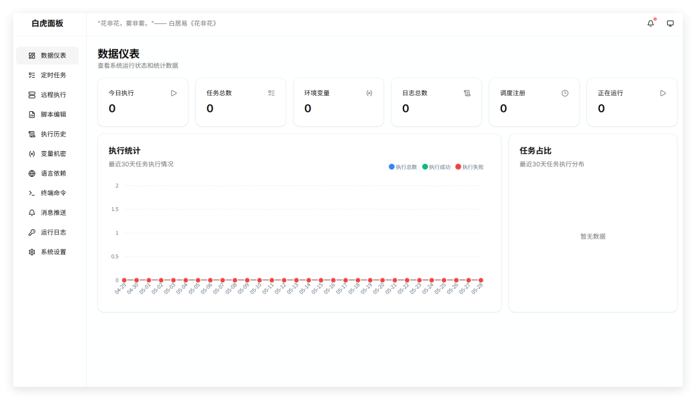

它的系统内部，集成了一个轻量化的在线编码编辑器，你可以认为是一个在线 IDE，改代码、测逻辑、调接口，所有的工作在浏览器里都可以搞定。支持文件树、压缩包上传解压。

在任何地方看到现成的工具脚本，直接复制进来，修修改改就可以上马。

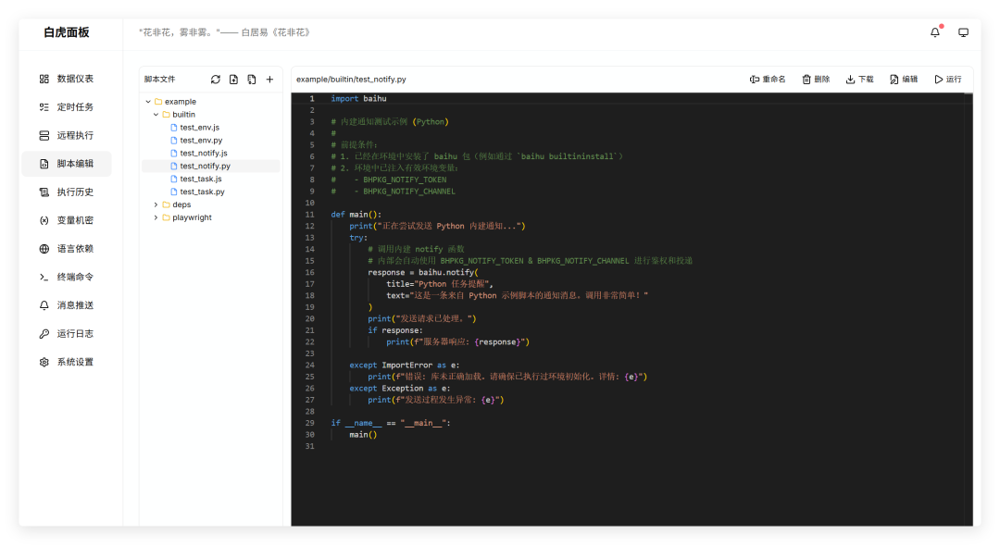

再说说语言支持，虽然 baihu-panel 很轻量，但是它的功能一点也不落后。内置 

```
python 3.13.12
```

，

```
node 23.11.1
```

。

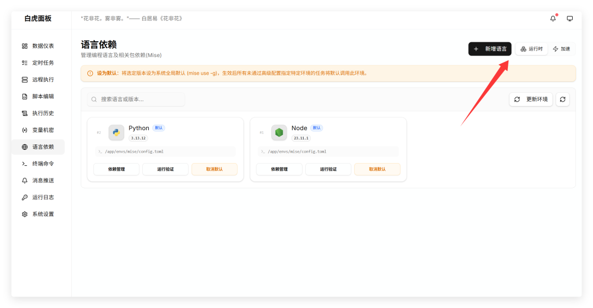

还可以自己安装 python、node、go、rust、ruby、java、php、deno、bun 在内的十多种运行环境，版本任选。

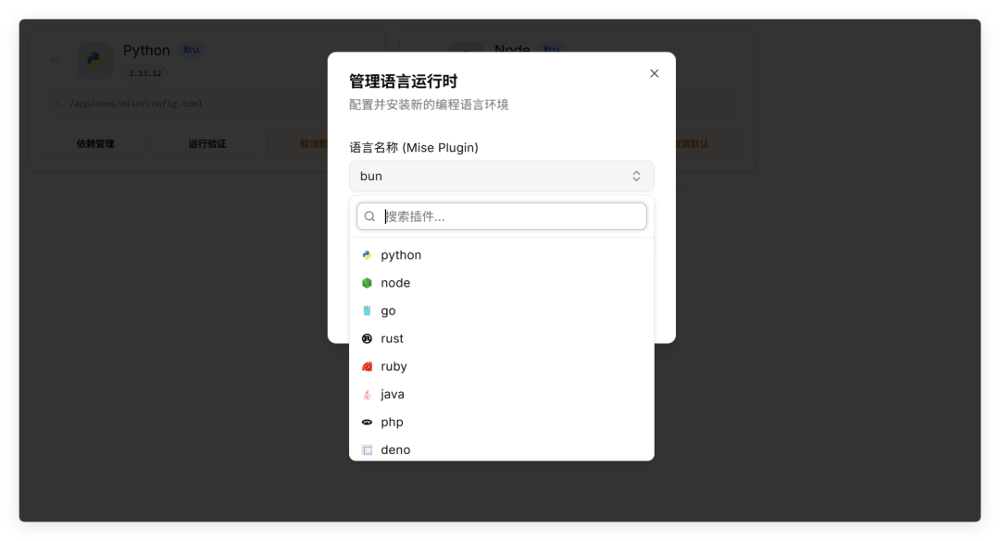

淘宝、清华、中科大的各类包源，也都集成在系统内，上手即用。

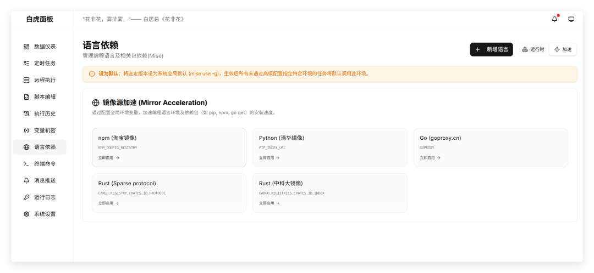

青龙的变量管理，白虎也有。这种类似 GitHub Secrets 的设计，可以让我们直接在面部里维护全局的环境变量，比如 

```
API_KEY
```

、

```
COOKIE
```

、

```
PASSWORD
```

。白虎面板使用的是 AES-GCM 加密存储，脚本里通过环境变量读取，日志里自动打码。

**这意味着，导出、分享你的代码，或者截图误传，密钥也不会跟着被泄露出去** 对于习惯从网上跑脚本、跑监控的人来说，这是救命的设计。

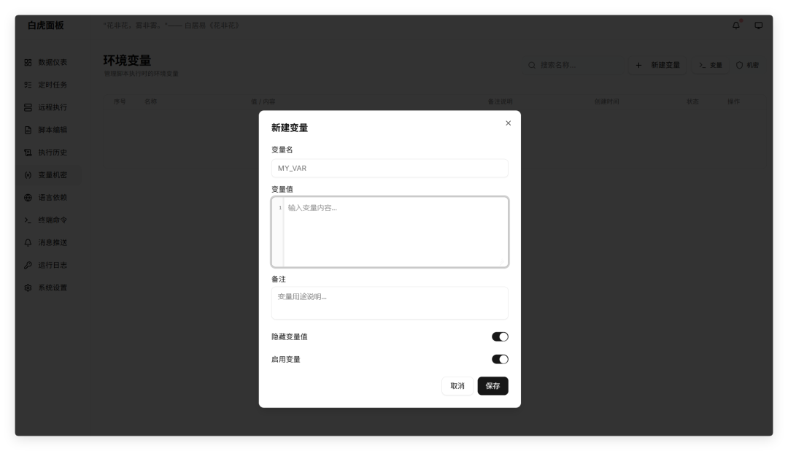

更牛的是白虎还提供一个远程 Agent 插件，可以把 Agent 下载下来并配置远程到服务器上，你直接使用 Agent 就可以跑服务器上的工具。

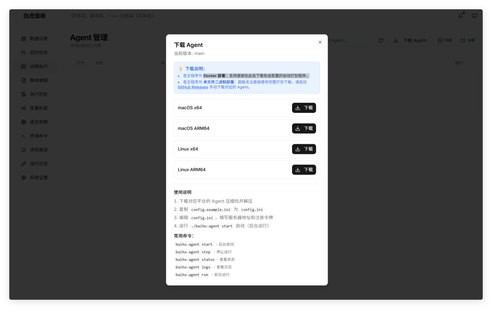

至于整个运作流程，白虎面板和青龙面板是没太大差异的。这个我想如果你点进来看了，或者你混迹在科技圈子里，都无需多言。总不会青龙你也没用过吧？

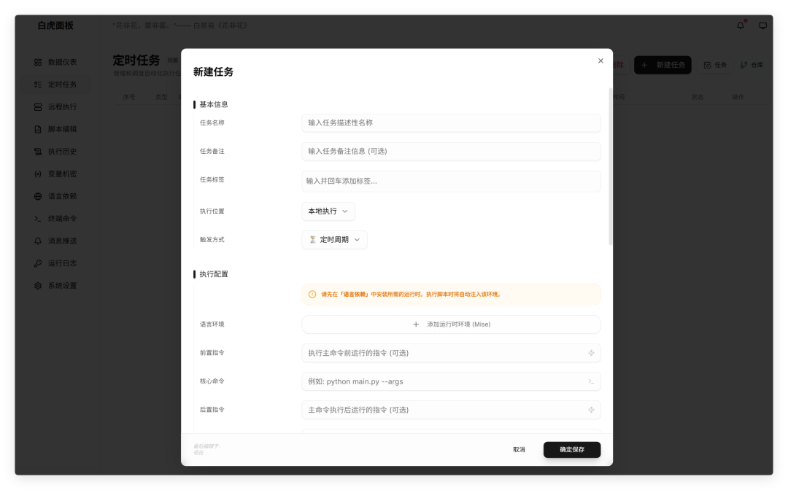

最后再来看看消息通知方面，T某、Bark、钉钉、企微、飞书、邮件等等传统经典消息通知工具，白虎面板也都支持。

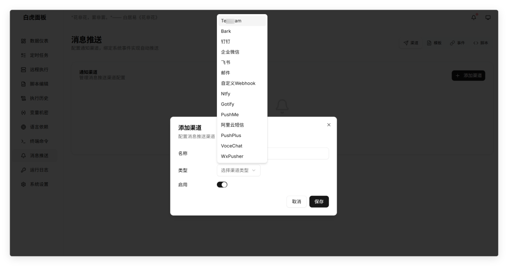

看完系统介绍。如果你对白虎面板十分感兴趣，那么下面跟着我的步骤，我们一步步来把它部署到 NAS 里。7\*24 运作的 NAS 私有云，是最适合跑定时任务和监测的工具之一。

这里以海康存储 R1 为例进行演示，其它型号参照。在海康智存客户端里上传 

```
baihu
```

 面板的容器镜像包。

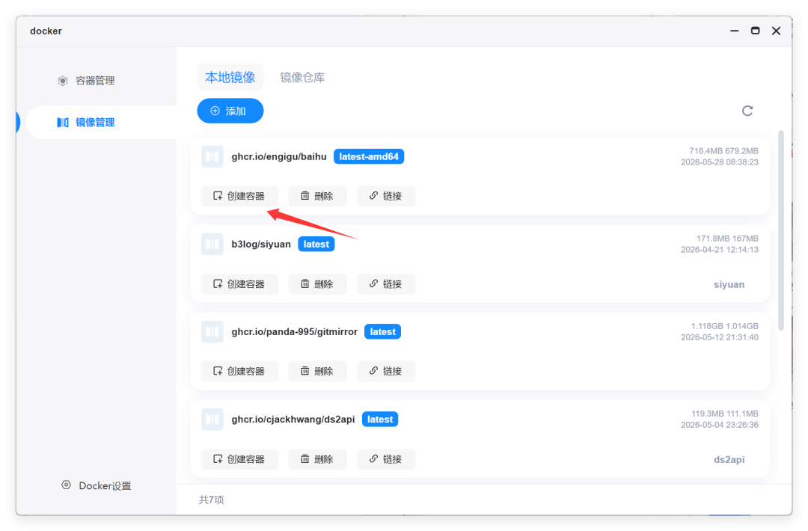

存储空间对应存储容器的数据、配置文件、环境变量。分别创建 

```
存储空间1/docker/baihu/configs
```

， 

```
存储空间1/docker/baihu/envs
```

， 

```
存储空间1/docker/baihu/data
```

 三个文件路径。

然后映射到 

```
/app/configs
```

， 

```
/app/envs
```

， 

```
/app/data
```

，具体的关系看下面的图片里。配置好了，记得把类型都改成读写权限，让容器可以直接操作文件。

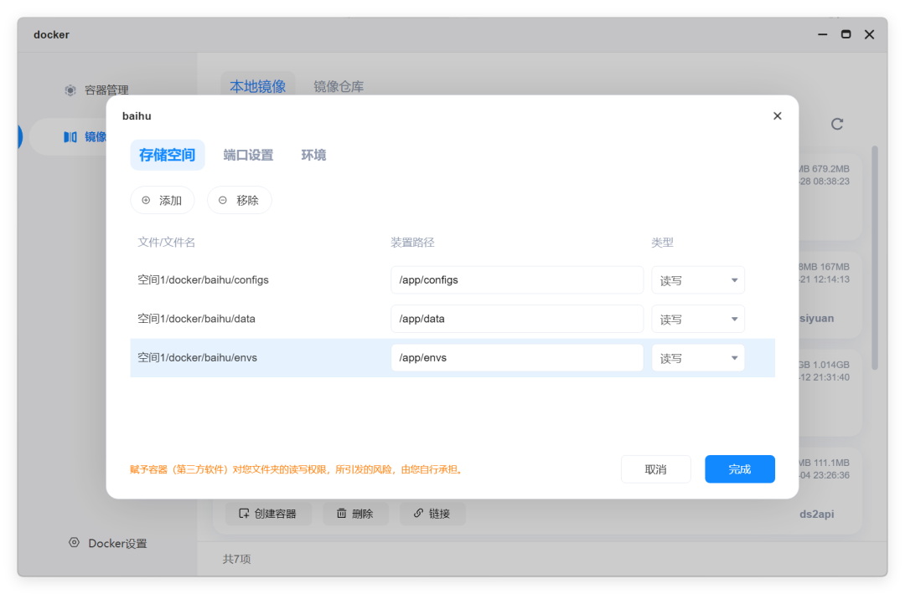

端口部分，直接分配 8052 的 TCP 端口。

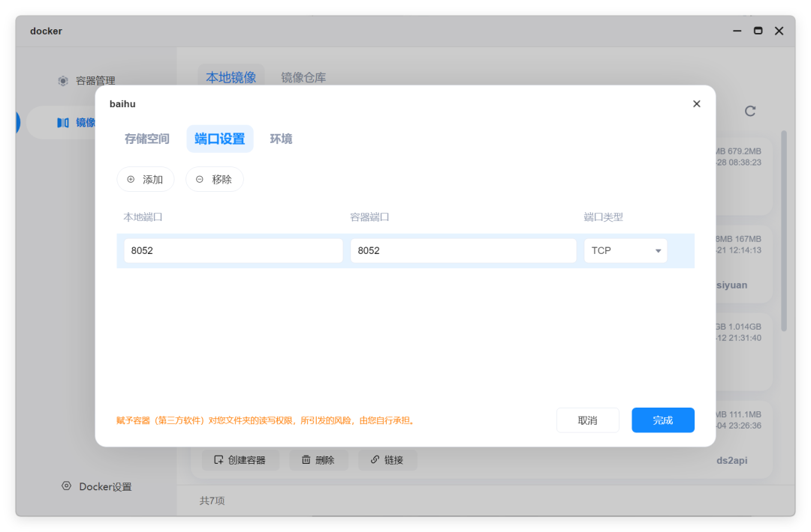

这里还有一个特别重要的环境变量，

```
TZ
```

。如果你不设置，很有可能系统在运行的时候不会按照实际时区运行，这就会导致大量的任务无效化。一定要记住，加上 

```
TZ=Asia/Shanghai
```

。

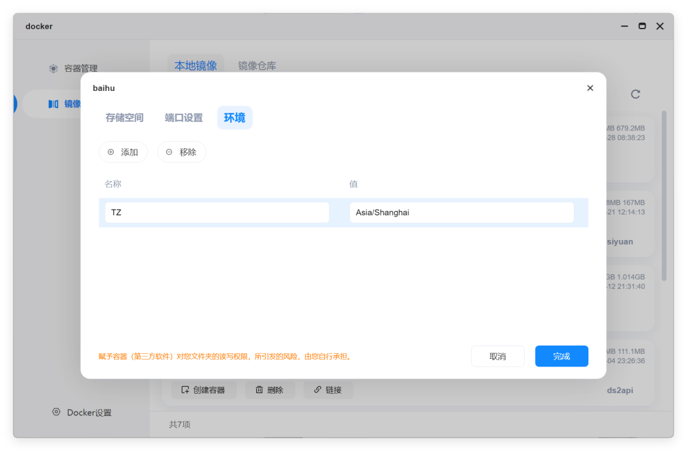

等容器项目跑起来，我们需要打开查看一下日志。系统会在日志里默认打印出一个用以登录的账号密码。

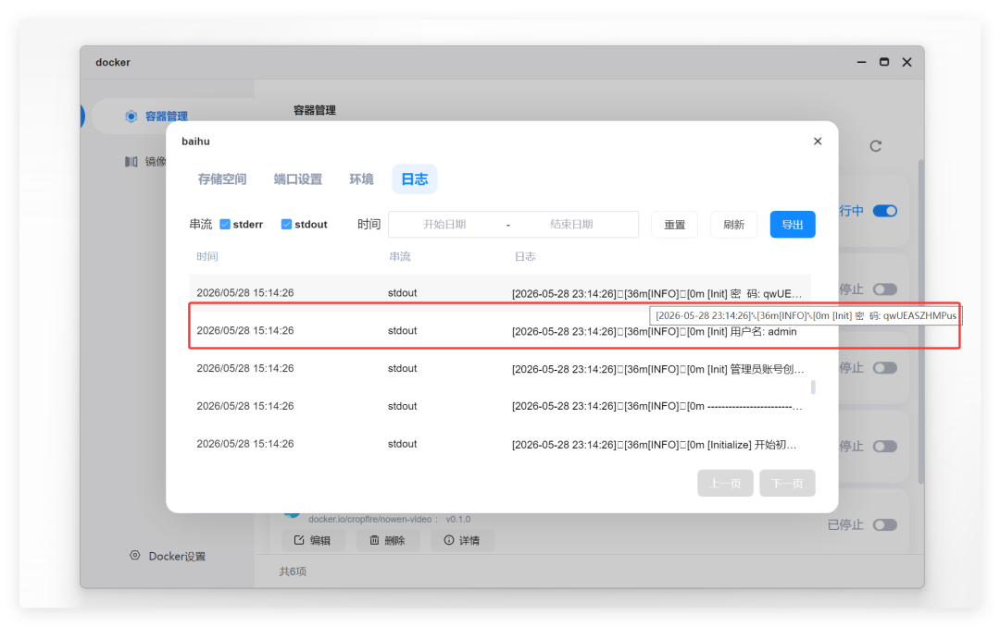

如果日志你觉得看不清楚的，可以导出。然后在海康我的空间的 

```
dockerlog
```

 下找到这个当天日志下载查看。

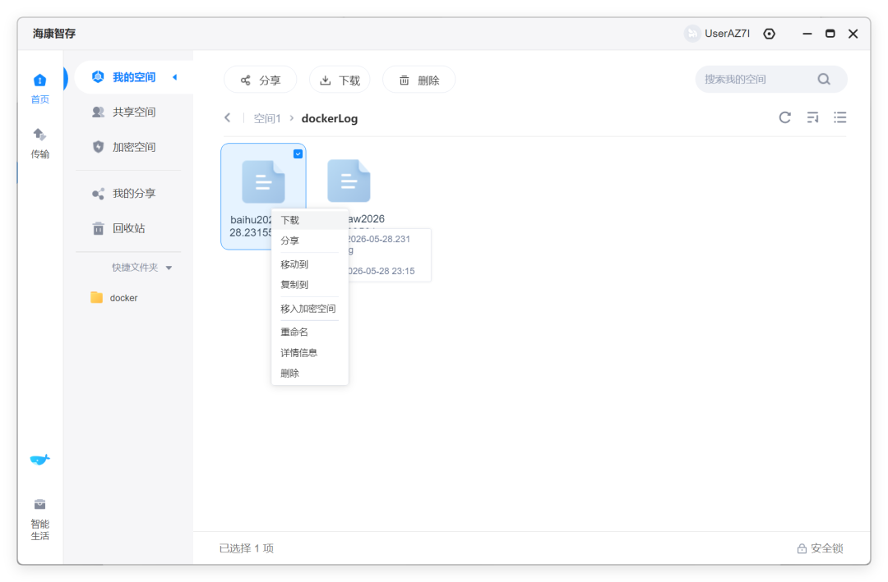

好了，一切安装完成。使用你的账号密码，体验白虎面板吧。

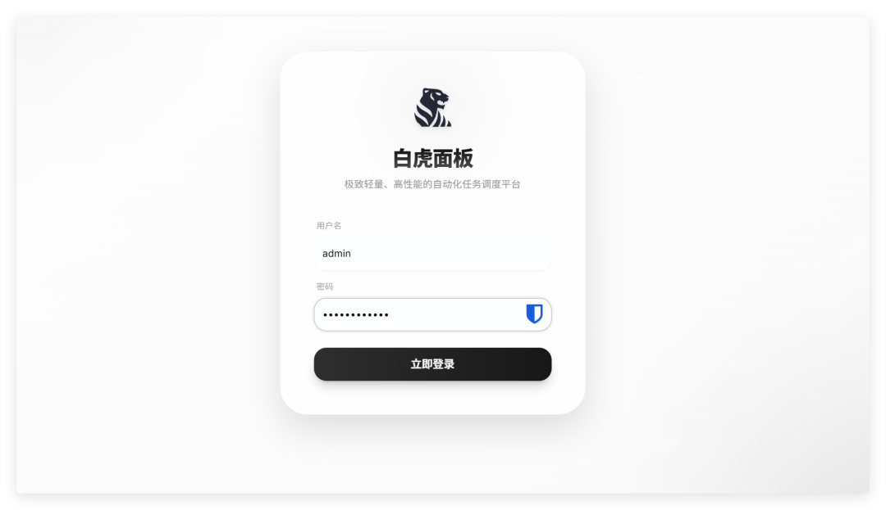

好了，以上就是我们这次的白虎面板部署教程和系统介绍。相比于青龙面板，白虎的性能占用的确更小。但是相对的，它的生态和成熟度可能不及青龙那么完善。

如果你在 NAS 上跑了很多的服务，而且希望进一步降低系统占用空间的，可以试一试这款与众不同的定时任务工具。

**我认为，在这个万物皆可 Docker 的时代，真正有效的产品，并不是堆砌项目，而是保持冷静，让每一个容器可以在稳定的状态下持续运行。**

---


> 往期推荐：

|  |
| --- |
| NAS 教程：  1️⃣[NAS 部署「思源笔记」，搭建你的个人知识库，海康存储部署教程](https://mp.weixin.qq.com/s?__biz=MzA4NzMyNzU5Mg==&mid=2453078853&idx=1&sn=d13386e4b4e94525420dce76ba3c3d03&scene=21#wechat_redirect)  2️⃣[自带12路免费视频监控，5盘位新 NAS，海康存储 Mage50X 开箱](https://mp.weixin.qq.com/s?__biz=MzA4NzMyNzU5Mg==&mid=2453078633&idx=1&sn=1b760f4238333c0bfd8c72733d5b5218&scene=21#wechat_redirect)  3️⃣[把你的人生，记录到 NAS 里，部署「lifeGLANCE」](https://mp.weixin.qq.com/s?__biz=MzA4NzMyNzU5Mg==&mid=2453078832&idx=1&sn=de7e07c7240d34637e8e2b93bb425faf&scene=21#wechat_redirect)  4️⃣[Ubuntu 25.10 原生桌面远程，终于跑通了....再也不用买 mac 了](https://mp.weixin.qq.com/s?__biz=MzA4NzMyNzU5Mg==&mid=2453078696&idx=1&sn=8220d012efa3717bf5da4ff43e230d46&scene=21#wechat_redirect)  5️⃣[这款 NAS 的 TV 客户端终于来了.... 支持影音、文件、相册](https://mp.weixin.qq.com/s?__biz=MzA4NzMyNzU5Mg==&mid=2453078363&idx=1&sn=44c6f93beb2566253619f70ddab92efa&scene=21#wechat_redirect) |

|  |
| --- |
| AI 玩法：  1️⃣[小龙虾做不到的事，我找到这个 Agent 全干了](https://mp.weixin.qq.com/s?__biz=MzA4NzMyNzU5Mg==&mid=2453078915&idx=1&sn=ec9720dd1aa4e22cfb17598849c25ef3&scene=21#wechat_redirect)  2️⃣[让 AI 住进你的电脑，每天多摸鱼2小时](https://mp.weixin.qq.com/s?__biz=MzA4NzMyNzU5Mg==&mid=2453078913&idx=1&sn=566df81898faf55ed5374eafc26b5750&scene=21#wechat_redirect)  3️⃣[“素人”抖音 3 个月赚100万，AI 带货杀疯了](https://mp.weixin.qq.com/s?__biz=MzA4NzMyNzU5Mg==&mid=2453078855&idx=1&sn=2a1927af3fe88815d3c7fb1b6ad51b4c&scene=21#wechat_redirect)  4️⃣[我花19刀请了个AI设计师，做了一款 NAS 监控小屏幕](https://mp.weixin.qq.com/s?__biz=MzA4NzMyNzU5Mg==&mid=2453078676&idx=1&sn=5c7bfc49aa198f9f74cb159e28621b40&scene=21#wechat_redirect)  5️⃣[你的 Hermes 一重启就变笨，啥也记不住？原因可能是这个](https://mp.weixin.qq.com/s?__biz=MzA4NzMyNzU5Mg==&mid=2453078656&idx=1&sn=0fb90e3a5d87527a9560c1657dc555a3&scene=21#wechat_redirect) |
