> 📎 来源: [纳思稻壳](https://mp.weixin.qq.com/s?__biz=MjM5MzY0NTk2MQ==&mid=2447977481&idx=1&sn=eb9a9fda57376979fa2e690a463f76d8&chksm=b37508f5996f16ac3ce41ec5046070c938b7d266a41177d13822859d40230b324df7e8ac83c9&mpshare=1&scene=1&srcid=0529njVVop1dHaMzv2iSlSXD&sharer_shareinfo=a57ffdbbfc54facfd779ab9c6b024b03&sharer_shareinfo_first=a57ffdbbfc54facfd779ab9c6b024b03) | 时间: 2026-05-29 12:40

---

> 付费功能提示：本项目大部分能力均可免费使用，但以下四项核心功能需购买高级版授权后方可解锁—— ① 视频订阅 ｜ ② 直播订阅 ｜ ③ 通用提取 ｜ ④ 直播回放 此外，部分进阶能力（如 Telegram Bot 转存、SNIFFER\_LICENSE\_KEY 高级嗅探）同样依赖高级授权，请在使用前知悉。

家里那台飞牛 NAS 平时除了存照片，大部分时间都在吃灰。最近翻到一个开源项目 easy-vdl，作者是 bigv，定位是"综合直播视频订阅解析下载器"，抖音、小红书、B 站、YouTube、TikTok、网易云、推特全都能订阅，还带弹幕录制和 AI 高光切片。我在飞牛上跑了几天，体验下来挺合适做家庭影音的补充工具，今天把部署过程和踩过的坑写下来。

> 项目地址：https://github.com/wlaosj/easy-vdl

> 镜像地址：hub.docker.com/r/qq918652593/easy-vdl

---

## **一、easy-vdl 能做什么**

先说结论：它解决了三件事——视频下载、博主订阅（需要开通 Pro 付费）、直播录制。

视频下载这块，把链接丢进首页就能解析，支持抖音、小红书、YouTube、B 站、TikTok、网易云、推特、Instagram 等主流平台。订阅是它的核心卖点，抖音可以订阅博主、合集、点赞列表；YouTube 支持频道、播放列表和 Shorts；B 站可以订阅 UP 主和合集；网易云能订阅歌单。系统会自动检测新内容并下载，也支持批量同步历史视频。

直播这块支持抖音、B 站、小红书、虎牙等平台的自动录制，开播即录。录完之后还能用大模型(比如 DeepSeek)做弹幕情感分析，自动切高光片段并生成标题和剧情摘要，最后打包成 ZIP 给你下载，适合做短视频二创素材。

对飞牛 NAS 用户来说，还有两个加分项：自动生成 Emby/Jellyfin 元数据(NFO 文件)，下载下来的视频可以直接被影音库识别；Intel/AMD 核显可以做硬件加速转码。

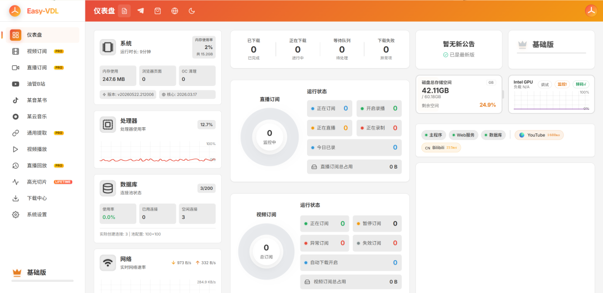

---

## **二、部署前的准备工作**

飞牛 NAS 自带 Docker 管理面板，部署 easy-vdl 没什么难度，但有几件事要先做好。

**第一步，确认 NAS 架构**。飞牛主流机型用的是 Intel x86 处理器，对应镜像标签 `qq918652593/easy-vdl:latest`。如果你用的是 ARM 版本，要用 `qq918652593/easy-vdl:arm64`，注意 ARM64 镜像目前不支持硬件加速。

**第二步，规划存储目录**。在飞牛的"文件管理"里建一个 docker 应用目录，比如 `/vol1/1000/docker/easy-vdl`，下面再分三个子目录：

- `downloads`：视频和直播录制文件，建议放在容量大的存储池
- `logs`：日志
- `database`：数据库，体积不大但很重要，建议放 SSD 缓存盘

**第三步，规划端口**。easy-vdl 默认对外用 888 端口，如果飞牛上已经被其他服务占用，换成 8888 或别的空闲端口即可。

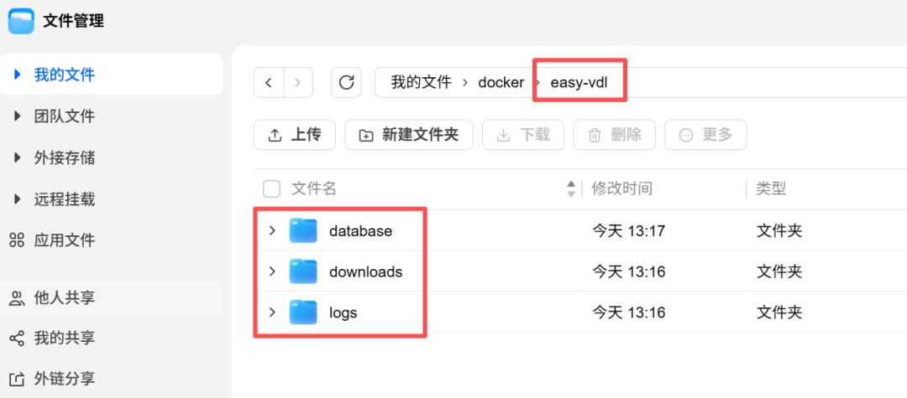

---

## **三、Docker Compose 部署**

飞牛 NAS 的 Docker 面板支持直接粘贴 compose 文件部署，比命令行友好很多。

打开飞牛桌面上的"Docker"应用，进入"项目"或"Compose"页面，点"新建"，项目名填 `easy-vdl`，把下面这段粘进去：

```
services:  easy-vdl:    image:qq918652593/easy-vdl:latest    container_name:easy-vdl    ports:      -"888:80"    mem_limit:4g    memswap_limit:4g    devices:      -/dev/dri:/dev/dri# Intel 核显硬件加速,没核显或不需要可删    volumes:      -./downloads:/app/downloads      -./logs:/app/logs      -./database:/app/database    environment:      -EASY_VDL_PORT=80      -PUID=1000      -PGID=1001      -EASY_VDL_ADMIN_USERNAME=admin      -EASY_VDL_ADMIN_PASSWORD=改成你自己的强密码      -TZ=Asia/Shanghai    restart:unless-stopped
```

几个要点说明:

`PUID=1000` 和 `PGID=1001` 对应飞牛默认的用户和组，如果你用的是其他账号，先在 SSH 里执行 `id 你的用户名` 查一下真实数值，否则容器启动后会报权限错误，PostgreSQL 数据库初始化也会失败。这是飞牛和群晖最常见的踩坑点。

`mem_limit: 4g` 是中重度使用推荐值，订阅数量在 50 个以上、经常批量同步的场景需要这么多。如果你只是偶尔解析下载几个视频，改成 `2g` 也够用。

`/dev/dri` 是 Intel 核显的设备路径，飞牛的 N100、N305 这类 CPU 都有核显，留着可以让转码播放更流畅。如果是 ARM 机型，把这两行删掉。

管理员密码强烈建议改掉，888 端口暴露在内网也好歹是个登录入口，默认密码不安全。

粘贴完点"部署"或"启动"，飞牛会自动拉镜像、创建容器。第一次拉镜像速度取决于你的网络，国内直连 Docker Hub 时灵时不灵，如果卡住可以在飞牛的 Docker 设置里加镜像加速器，比如阿里云、腾讯云、DaoCloud 提供的国内加速地址。

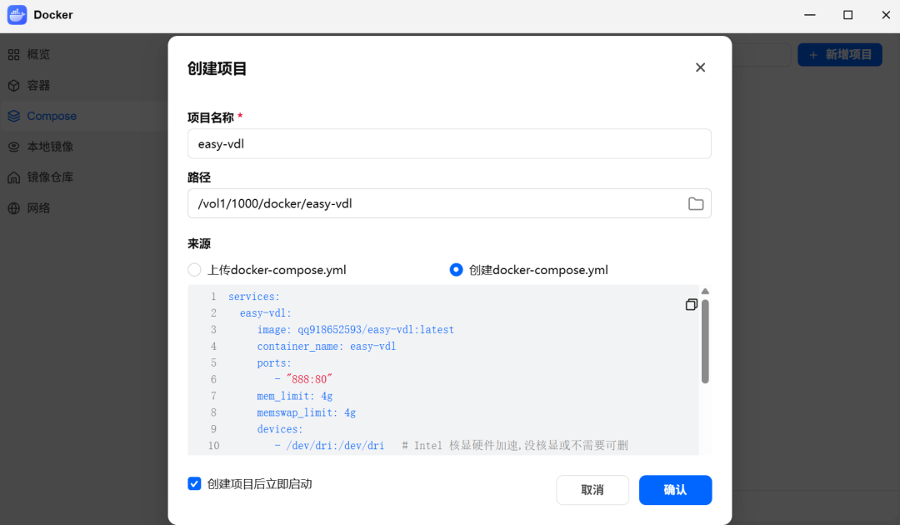

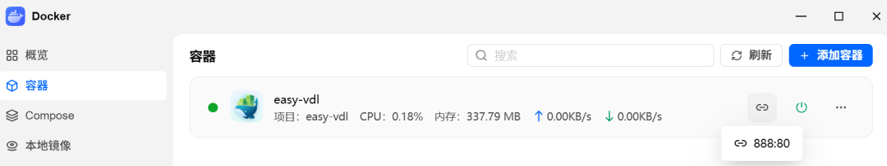

---

## **四、首次访问与初始化**

打开浏览器，访问 `http://飞牛IP:888`，比如 `http://192.168.1.100:888`。

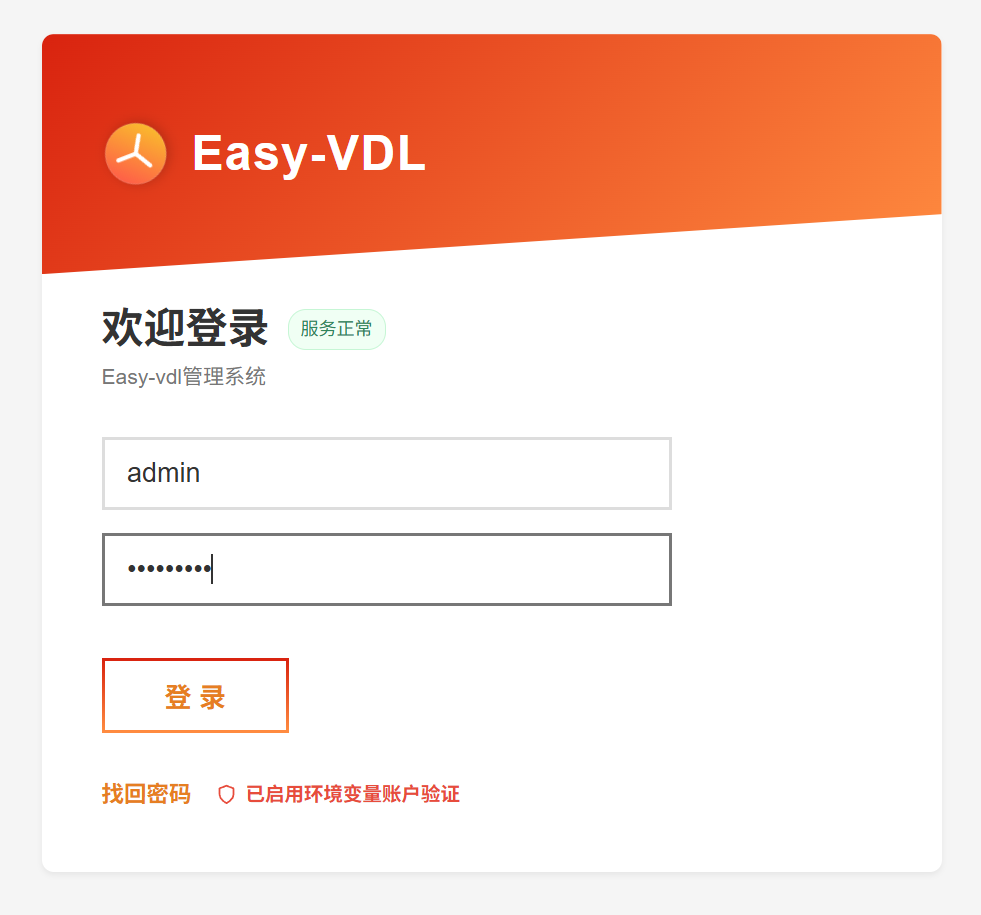

如果在 compose 里配了 `EASY_VDL_ADMIN_USERNAME` 和 `EASY_VDL_ADMIN_PASSWORD`，直接用这组账号密码登录。

首次登录会有一个 `免责声明` 往下拉，等待几秒钟点击同意按钮即可。

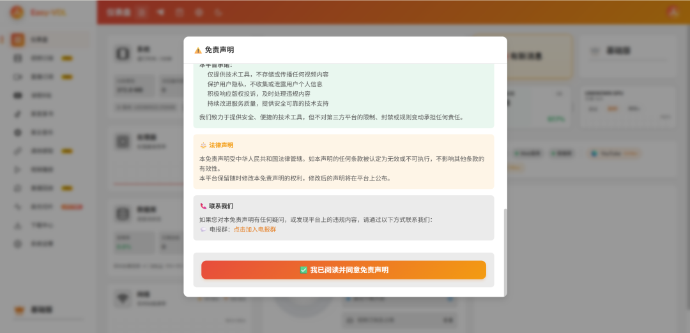

登录后第一件事是去"设置"里完善 Cookie 和 API Token。Cookie 管理是为了让 easy-vdl 能访问需要登录态的内容，比如抖音的点赞列表、B 站的私密合集；API Token 是后续接入浏览器插件、iOS 快捷指令的凭证。

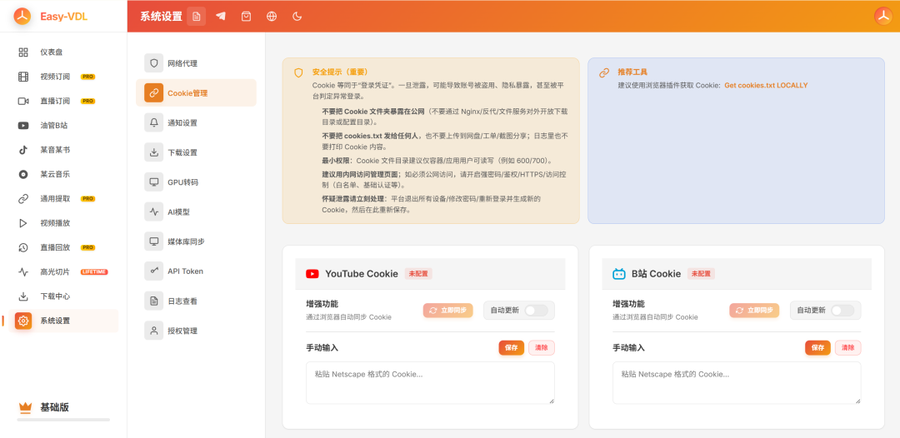

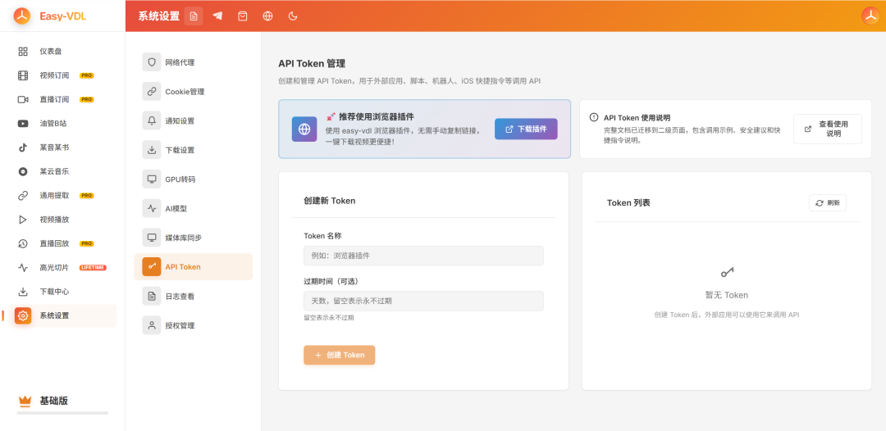

---

## **五、实战：下载和订阅**

### **场景一：临时下载一个视频**

最简单的玩法，复制视频链接(抖音的"复制链接"、B 站的视频 URL 都行)，粘贴到对应输入框，点解析。系统会列出可用的清晰度，选好之后点下载，文件就进 `/app/downloads` 目录了。

如果勾选了"生成 NFO"，会同时生成 Emby/Jellyfin 能识别的元数据文件。

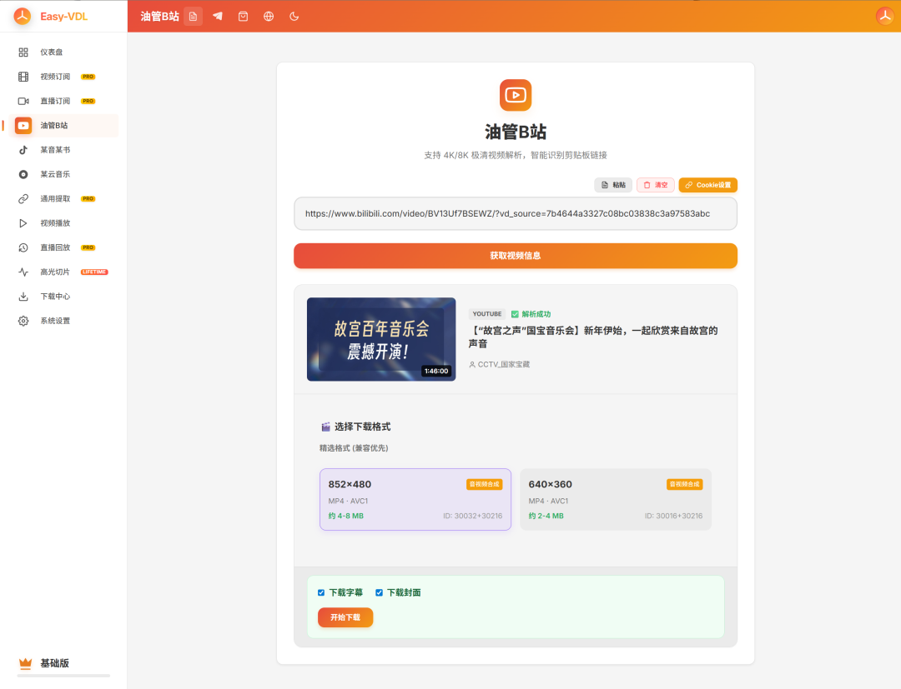

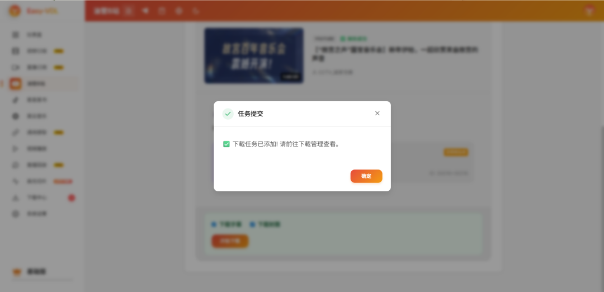

### **场景二：订阅一个 UP 主（付费功能）**

进"订阅"页面，点"新增订阅"，选平台(比如 B 站)，粘贴 UP 主主页链接，设置下载策略：是只下新视频还是把历史视频也批量同步、保留多少个版本、画质偏好等等。保存之后系统会按你设的间隔自动检测更新。

### **场景三：录制直播 + AI 高光（付费功能）**

进"直播回放"页面，添加直播间链接(抖音、B 站、虎牙等)。系统会一直监控这个直播间，主播开播时自动开始录制，弹幕也会同步抓下来。

直播结束后，如果你在设置里配了大模型 API Key(DeepSeek 比较便宜，推荐这个)，easy-vdl 会基于弹幕热度做情感分析，自动找出高光片段切片，生成标题和剧情摘要，打包成 ZIP。这个功能对做切片号的朋友特别友好。

### **场景四：浏览器插件一键下载**

去 https://github.com/wlaosj/easy-vdl/releases 下载浏览器插件，安装到 Chrome 或 Edge，配置好服务器地址和 API Token。之后在抖音、小红书、YouTube、B 站的视频页面，点一下插件图标就直接发到 NAS 下载，不用切回 NAS 后台。

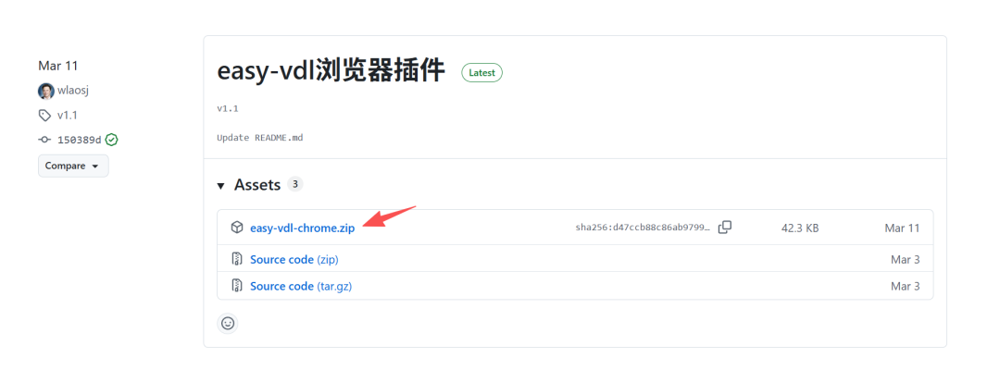


---

## **六、几个值得提醒的细节**

**外网访问**。如果你想在公司或路上也能用，可以通过飞牛自带的内网穿透，或者 Tailscale、Zerotier 这类组网工具接回家。直接把 888 端口暴露到公网不安全，至少要配反向代理 + HTTPS + 强密码。

**存储管理**。视频订阅一旦开起来，磁盘消耗很快。我订了 10 个左右的博主，一个月攒了 200G。建议在设置里配置保留策略，比如每个博主只留最近 30 天或最近 50 个视频。

**Cookie 失效**。各平台的 Cookie 有有效期，一段时间后订阅会拉不到内容。easy-vdl 支持自动刷新，但偶尔还是要手动更新一次，发现订阅不动了优先排查这里。

**升级方式**。在飞牛 Docker 面板里找到 easy-vdl 项目，点"重新部署"，会自动拉最新镜像。数据都在挂载卷里，不会丢。

---

## **写在最后**

easy-vdl 在国内同类工具里完成度算比较高的，订阅、直播、AI 切片这一套流程都通了，作者还在持续更新。配合飞牛 NAS 做家庭影音中心，下载站、订阅站、Emby 媒体库可以串起来，自动化程度很高。

如果这篇文章对你有帮助，欢迎转发给同样在折腾 NAS 的朋友。
